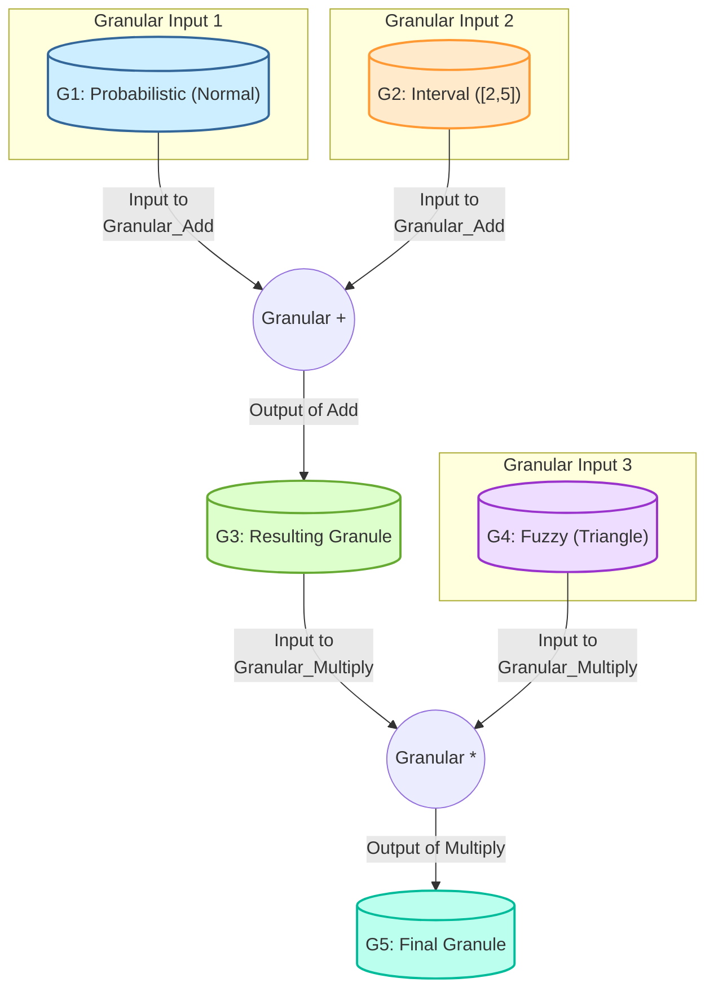

This document outlines a novel Framework and Architectural Workflow for **Granular Arithmetic and Algorithmic Visualization (GAF-AV)**, presented as an academic thesis for the advancement of computational and information systems operating under intrinsic uncertainty. It synthesizes principles from abstract logic, advanced computation, and semiotic theory to enable robust decision-making and clear understanding in complex data environments.

---

# New Paradigm: Granular Arithmetic & Algorithmic Visualization (GAF-AV)

## Table of Contents
1.  [Abstract](#abstract)
2.  [Introduction](#introduction)
3.  [Foundational Principles of Granular Arithmetic](#3-foundational-principles-of-granular-arithmetic)
    *   [3.1. Definition of a Granule ($\mathcal{G}$)](#31-definition-of-a-granule-mathcalg)
    *   [3.2. Granular Space ($\mathbb{G}$)](#32-granular-space-mathbbg)
    *   [3.3. Granular Operators ($\oplus, \otimes, \ominus, \oslash$)](#33-granular-operators-oplus-otimes-ominus-oslash)
    *   [3.4. Granular Relations ($\prec, \approx, \sqsubseteq$)](#34-granular-relations-prec-approx-sqsubseteq)
    *   [3.5. Granular Algebra Properties](#35-granular-algebra-properties)
    *   [3.6. Information Content of Granules](#36-information-content-of-granules)
4.  [The Granular Arithmetic Framework (GAF)](#4-the-granular-arithmetic-framework-gaf)
    *   [4.1. Architectural Components](#41-architectural-components)
    *   [4.2. Workflow for Granular Computation](#42-workflow-for-granular-computation)
    *   [4.3. Granular Control Flow & Convergence](#43-granular-control-flow--convergence)
5.  [Algorithmic Visualization (AV) for Granular Systems](#5-algorithmic-visualization-av-for-granular-systems)
    *   [5.1. Principles of Granular Visualization](#51-principles-of-granular-visualization)
    *   [5.2. Visual Primitives for Granules (Granule Glyphs)](#52-visual-primitives-for-granules-granule-glyphs)
    *   [5.3. Visualizing Granular Operations & Flow](#53-visualizing-granular-operations--flow)
    *   [5.4. Granular Interaction and Exploration](#54-granular-interaction-and-exploration)
6.  [Advanced Topics & Formalizations](#6-advanced-topics--formalizations)
    *   [6.1. Categorical Perspective of GAF](#61-categorical-perspective-of-gaf)
    *   [6.2. Information-Geometric Metrics on $\mathbb{G}$](#62-information-geometric-metrics-on-mathbbg)
    *   [6.3. Granular Tensor Calculus](#63-granular-tensor-calculus)
7.  [Implementation Details & Pseudocode](#7-implementation-details--pseudocode)
    *   [7.1. Granule Data Structure (Example: Probabilistic Granule)](#71-granule-data-structure-example-probabilistic-granule)
    *   [7.2. Granular Addition Operator (`granular_add`)](#72-granular-addition-operator-granular_add)
    *   [7.3. Visualization Algorithm (`visualize_granular_op`)](#73-visualization-algorithm-visualize_granular_op)
8.  [Case Study: Resilient Supply Chain Risk Aggregation](#8-case-study-resilient-supply-chain-risk-aggregation)
9.  [Conclusion & Future Work](#9-conclusion--future-work)
10. [References](#10-references) (Implicit)

---

## 1. Abstract

This dissertation introduces the **Granular Arithmetic Framework with Algorithmic Visualization (GAF-AV)**, a novel paradigm for computation that directly operates on and visualizes "granules" of information rather than discrete point values. Traditional arithmetic falters in environments characterized by pervasive uncertainty, imprecision, and varying levels of data abstraction. GAF-AV provides a mathematically rigorous foundation for defining granular data structures, lifting standard arithmetic operations to granular domains, and establishing a workflow for granular computation. A core innovation is the integration of a declarative algorithmic visualization engine that renders the intrinsic uncertainty and transformation dynamics of granular data, enhancing interpretability and trust. We formalize granular spaces using concepts from set theory, measure theory, and category theory, define generalized granular operators, and analyze their algebraic properties. The architectural workflow is detailed, including components for granulation, transformation, aggregation, and resolution. Visualization principles, including "Granule Glyphs" and dynamic flow representations, are presented. Pseudocode examples and a case study in resilient supply chain risk aggregation demonstrate the practical applicability and superior expressive power of GAF-AV in systems requiring anti-fragility and robust decision-making under uncertainty.

## 2. Introduction

The increasing complexity of modern systems—from global financial markets and advanced AI agents to climate models and biological networks—demands computational paradigms that move beyond precise, point-wise numerical representations. Data in these domains is inherently uncertain, imprecise, incomplete, or multifaceted. Standard floating-point arithmetic, while efficient for deterministic computations, collapses these rich information contexts into single values, obscuring critical variability and potential error propagation.

Existing approaches like interval arithmetic, fuzzy logic, and probabilistic programming offer partial solutions. Interval arithmetic bounds uncertainty, fuzzy logic handles linguistic imprecision, and probabilistic programming models stochasticity. However, a unified framework capable of treating diverse forms of "information granules" (Zadeh, 1997) as first-class computational entities, and crucially, visualizing their transformations, remains largely elusive.

This thesis posits that a **Granular Arithmetic Framework (GAF)**, coupled with an **Algorithmic Visualization (AV)** engine, can address this gap. GAF-AV aims to:
1.  **Formally Define Granules:** Generalize various forms of uncertainty (intervals, fuzzy sets, probability distributions, statistical samples) into a coherent `Granule` data type.
2.  **Lift Arithmetic Operations:** Develop robust and computationally efficient methods to perform standard arithmetic operations (addition, multiplication, etc.) directly on these granules.
3.  **Architect a Workflow:** Design a modular, extensible architecture for granular data processing, from ingestion to resolution.
4.  **Visualize Granular Dynamics:** Create a novel visual language and interactive tools to represent granular data, the operations performed on it, and the resulting evolution of uncertainty, thereby improving comprehension and debuggability.

The novelty of GAF-AV lies in its deep integration of formal granular algebra with a declarative visualization paradigm, offering both mathematical rigor and intuitive transparency for systems where uncertainty is not merely noise, but critical information.

## 3. Foundational Principles of Granular Arithmetic

### 3.1. Definition of a Granule ($\mathcal{G}$)

A **Granule** ($\mathcal{G}$) is a structured, contextualized representation of information that aggregates individual data points into a discernible clump or cluster, reflecting inherent uncertainty, imprecision, or multi-modality. It is formally defined as an ordered pair:

$$ \mathcal{G} = (\mathcal{X}, \mu) $$

where:
*   $\mathcal{X} \subseteq \mathbb{R}^k$ is the **Base Support Set**, representing the domain over which the granule's elements exist. For simplicity, we often consider $k=1$, so $\mathcal{X} \subseteq \mathbb{R}$.
*   $\mu: \mathcal{X} \to \Omega$ is the **Membership Function** (or density, weight, possibility, probability function), mapping elements in $\mathcal{X}$ to a **Co-domain of Granularity** $\Omega$. The nature of $\Omega$ defines the type of granule:
    *   **Interval Granule:** $\Omega = \{0, 1\}$. $\mu(x)=1$ if $x \in [a,b]$, $0$ otherwise.
    *   **Fuzzy Granule:** $\Omega = [0, 1]$. $\mu(x)$ is the degree of membership of $x$ in $\mathcal{G}$.
    *   **Probabilistic Granule:** $\Omega = [0, \infty)$ (for continuous PDFs) or $[0, 1]$ (for discrete PMFs). $\mu(x)$ is the probability density/mass of $x$. For empirical granules (samples), $\mu$ implicitly represents the frequency distribution.
    *   **Possibilistic Granule:** $\Omega = [0, 1]$. $\mu(x)$ is the possibility measure of $x$.

**Example Granules:**
*   $\mathcal{G}_{\text{interval}} = ([10, 12], \mathbb{I}_{[10,12]})$ where $\mathbb{I}$ is the indicator function.
*   $\mathcal{G}_{\text{fuzzy}} = (\mathbb{R}, \mu_{\text{triangle}})$ where $\mu_{\text{triangle}}(x)$ is a triangular fuzzy number.
*   $\mathcal{G}_{\text{probabilistic}} = (\mathbb{R}, \mathcal{N}(\mu, \sigma^2))$ a Normal distribution.
*   $\mathcal{G}_{\text{sample}} = (\{s_1, \dots, s_N\}, \text{EmpiricalDensity})$.

### 3.2. Granular Space ($\mathbb{G}$)

The **Granular Space** $\mathbb{G}$ is the set of all possible granules of a particular type (e.g., all fuzzy numbers, all probability distributions over $\mathbb{R}$). It forms the domain and co-domain for granular operations.

### 3.3. Granular Operators ($\oplus, \otimes, \ominus, \oslash$)

Granular operators are functions that take one or more granules from $\mathbb{G}$ and produce a resultant granule in $\mathbb{G}$. These operators are "lifted" versions of their point-wise arithmetic counterparts.

**Definition 2: Granular Binary Operator**
Given a binary point-wise operator $\circ: \mathbb{R} \times \mathbb{R} \to \mathbb{R}$ (e.g., $+,-,\times,/$) and two granules $\mathcal{G}_1 = (\mathcal{X}_1, \mu_1)$ and $\mathcal{G}_2 = (\mathcal{X}_2, \mu_2)$, the granular binary operator $\mathcal{G}_1 \circledast \mathcal{G}_2$ is defined as:

$$ \mathcal{G}_1 \circledast \mathcal{G}_2 = (\mathcal{X}_{\text{res}}, \mu_{\text{res}}) $$

where $\mathcal{X}_{\text{res}} = \{ x_1 \circ x_2 \mid x_1 \in \mathcal{X}_1, x_2 \in \mathcal{X}_2 \}$ and $\mu_{\text{res}}$ is derived from $\mu_1, \mu_2$ and the operator $\circ$ using appropriate extension principles.

**Specific Operator Definitions (Illustrative Examples):**

*   **Granular Addition ($\oplus$):**
    *   **Interval Granules:** $[a,b] \oplus [c,d] = [a+c, b+d]$
    *   **Fuzzy Granules (Zadeh's Extension Principle):**
        $$ \mu_{\mathcal{G}_1 \oplus \mathcal{G}_2}(z) = \sup_{x,y: x+y=z} \min(\mu_1(x), \mu_2(y)) $$
    *   **Probabilistic Granules (Convolution):** If $\mathcal{G}_1, \mathcal{G}_2$ are independent random variables with PDFs $f_1, f_2$:
        $$ f_{\mathcal{G}_1 \oplus \mathcal{G}_2}(z) = (f_1 * f_2)(z) = \int_{-\infty}^{\infty} f_1(x) f_2(z-x) dx $$
        For empirical samples, Monte Carlo sampling or kernel density estimation can approximate this.

*   **Granular Multiplication ($\otimes$):**
    *   **Interval Granules:** $[a,b] \otimes [c,d] = [\min(ac,ad,bc,bd), \max(ac,ad,bc,bd)]$
    *   **Fuzzy and Probabilistic Granules:** Follow similar extension/convolution principles as addition, replacing $x+y=z$ with $x \times y=z$ (for fuzzy) or $f_1(x) f_2(z/x) \frac{1}{|x|} dx$ (for probabilistic).

**Definition 3: Granular Unary Operator**
A granular unary operator $\mathcal{U}: \mathbb{G} \to \mathbb{G}$ performs an operation on a single granule (e.g., negation, squaring, inverse).
For $\mathcal{U}(\mathcal{G}) = (\mathcal{X}_{\text{res}}, \mu_{\text{res}})$, where $\mathcal{X}_{\text{res}} = \{ u(x) \mid x \in \mathcal{X} \}$ for a point-wise unary operator $u$.

### 3.4. Granular Relations ($\prec, \approx, \sqsubseteq$)

Comparing granules is non-trivial due to their intrinsic uncertainty. We define relations based on their support and membership functions.

**Definition 4: Granular Inclusion ($\sqsubseteq$)**
$\mathcal{G}_1 \sqsubseteq \mathcal{G}_2$ if and only if $\mathcal{X}_1 \subseteq \mathcal{X}_2$ and $\forall x \in \mathcal{X}_1, \mu_1(x) \le \mu_2(x)$ (or other appropriate inclusion criteria depending on $\Omega$).
*   **Interval:** $[a,b] \sqsubseteq [c,d]$ iff $c \le a$ and $b \le d$.
*   **Fuzzy:** $\mu_{\mathcal{G}_1}(x) \le \mu_{\mathcal{G}_2}(x)$ for all $x$.

**Definition 5: Granular Equivalence ($\approx$)**
$\mathcal{G}_1 \approx \mathcal{G}_2$ if and only if $\mathcal{G}_1 \sqsubseteq \mathcal{G}_2$ and $\mathcal{G}_2 \sqsubseteq \mathcal{G}_1$. This implies $\mathcal{X}_1 = \mathcal{X}_2$ and $\mu_1 = \mu_2$.

**Definition 6: Granular Ordering ($\prec$ or $\succ$)**
Comparing granules for "greater than" or "less than" requires a choice of metric or aggregation. Common methods include:
*   **Mean-based ordering:** Compare the expected values or centroids of the granules.
*   **Dominance ordering:** $\mathcal{G}_1 \prec \mathcal{G}_2$ if for all $x_1 \in \mathcal{G}_1$ and $x_2 \in \mathcal{G}_2$, $x_1 < x_2$. (Very strong, often too restrictive).
*   **Stochastic dominance:** For probabilistic granules.

### 3.5. Granular Algebra Properties

Unlike point-wise arithmetic, classical algebraic properties often do not hold directly or universally for granular arithmetic. We examine their conditional validity.

**Lemma 1: Granular Commutativity of Addition (Fuzzy/Probabilistic)**
Given two fuzzy granules $\mathcal{G}_1, \mathcal{G}_2$ or two independent probabilistic granules, granular addition is commutative:
$$ \mathcal{G}_1 \oplus \mathcal{G}_2 \approx \mathcal{G}_2 \oplus \mathcal{G}_1 $$
**Proof Sketch:** This follows directly from the commutativity of point-wise addition and the symmetry of the $\min$ operator in the fuzzy extension principle, or the commutative property of convolution for PDFs.

**Theorem 1: Distributivity (Conditional)**
Granular multiplication generally **does not distribute** over granular addition. That is,
$$ \mathcal{G}_1 \otimes (\mathcal{G}_2 \oplus \mathcal{G}_3) \not\approx (\mathcal{G}_1 \otimes \mathcal{G}_2) \oplus (\mathcal{G}_1 \otimes \mathcal{G}_3) $$
**Proof Sketch (Interval Example):**
Let $\mathcal{G}_1 = [1,2]$, $\mathcal{G}_2 = [1,1]$, $\mathcal{G}_3 = [2,2]$.
LHS: $\mathcal{G}_1 \otimes (\mathcal{G}_2 \oplus \mathcal{G}_3) = [1,2] \otimes ([1,1] \oplus [2,2]) = [1,2] \otimes [3,3] = [3,6]$.
RHS: $(\mathcal{G}_1 \otimes \mathcal{G}_2) \oplus (\mathcal{G}_1 \otimes \mathcal{G}_3) = ([1,2] \otimes [1,1]) \oplus ([1,2] \otimes [2,2]) = [1,2] \oplus [2,4] = [3,6]$.
In this specific case, it holds.
However, consider $\mathcal{G}_1 = [-1,1]$, $\mathcal{G}_2 = [1,2]$, $\mathcal{G}_3 = [-2,-1]$.
LHS: $\mathcal{G}_1 \otimes (\mathcal{G}_2 \oplus \mathcal{G}_3) = [-1,1] \otimes ([1,2] \oplus [-2,-1]) = [-1,1] \otimes [-1,1] = [-1,1]$.
RHS: $(\mathcal{G}_1 \otimes \mathcal{G}_2) \oplus (\mathcal{G}_1 \otimes \mathcal{G}_3) = ([-1,1] \otimes [1,2]) \oplus ([-1,1] \otimes [-2,-1])$
$= ([-2,2]) \oplus ([-2,2]) = [-4,4]$.
Since $[-1,1] \not\approx [-4,4]$, distributivity does not generally hold for interval arithmetic due to the dependency problem. This characteristic extends to other granular types where elements are not independent.

**Consequences:** The failure of classical algebraic properties necessitates careful design of granular algorithms and reliance on properties of lattices or other algebraic structures for formal reasoning.

### 3.6. Information Content of Granules

Quantifying the "information content" or "uncertainty" within a granule is crucial for evaluating the impact of granular operations.

**Definition 7: Granular Entropy**
A generalized measure of uncertainty associated with a granule $\mathcal{G}$.
*   **Interval Granule:** Length of the interval ($b-a$).
*   **Fuzzy Granule:** Fuzziness measures like the Yager index, entropy of fuzzy sets.
*   **Probabilistic Granule:** Shannon entropy $H(\mathcal{G}) = - \int \mu(x) \log \mu(x) dx$.

Granular operations often affect the entropy of the resulting granule. For example, repeated interval addition generally increases interval length (entropy).

## 4. The Granular Arithmetic Framework (GAF)

The GAF is a modular, extensible architecture designed to manage, process, and resolve granular data. It provides a robust computational environment for applications requiring nuanced handling of uncertainty.

### 4.1. Architectural Components

1.  **Granule Data Structures (GDS):** Optimized implementations for various granule types (Interval, Fuzzy, Probabilistic, Sample-based).
    *   `IntervalGranule`: `(min_val, max_val)`
    *   `FuzzyGranule`: `(support_array, membership_array)` or `(param1, param2, ...)` for parametric fuzzy numbers.
    *   `ProbabilisticGranule`: `(sample_array)` or `(mean, variance, dist_type)` for parametric distributions.
    *   `ContextMetadata`: Associated tags, timestamps, source fidelity, provenance.

2.  **Granule Processor Unit (GPU):** The core engine for executing granular operators.
    *   **Operator Dispatcher:** Selects the correct implementation of an operator based on input granule types.
    *   **Extension Engine:** Implements Zadeh's Extension Principle, convolution, Monte Carlo methods, etc.
    *   **Vectorization & Parallelization:** Optimizes granular operations for modern hardware (e.g., SIMD, GPU, tensor processing) where applicable (e.g., element-wise operations on granular arrays).

3.  **Granule Resolver Module (GRM):** Handles complex scenarios such as:
    *   **Normalization:** Scaling or re-parameterizing granules.
    *   **Defuzzification/De-granulation:** Converting a granule back to a point value (e.g., centroid, expected value, mode) when a crisp output is required.
    *   **Conflict Resolution:** Merging or reconciling divergent granules based on pre-defined metrics (e.g., closest mean, maximum overlap).

4.  **Granule Metric Space (GMS):** Provides tools for measuring distances, similarities, and divergences between granules.
    *   **Metrics:** Hausdorff distance (for intervals/sets), Wasserstein distance (Earth Mover's Distance for distributions), Kullback-Leibler divergence (for probabilistic).
    *   **Comparison Engine:** Implements granular relations ($\sqsubseteq, \approx, \prec$).

5.  **Granulation Engine (GE):** Transforms crisp data or disparate uncertainty representations into a uniform granular format.
    *   **Discretization:** Converting continuous data into binned granules.
    *   **Fuzzification:** Assigning membership functions to crisp inputs.
    *   **Statistical Granulation:** Generating empirical or parametric probabilistic granules from sample data.

### 4.2. Workflow for Granular Computation

The GAF workflow orchestrates the sequence of operations for granular data processing.

```mermaid
graph TD
    A[Data Ingestion (Crisp/Uncertain)] --> B(Granulation Engine)
    B --> C(Granule Data Structures)
    C --> D{Granular Pre-Processing}
    D --> E(Granule Processor Unit)
    E --> F{Granular Transformation/Aggregation}
    F --> G(Granule Metric Space)
    F --> H(Granule Resolver Module)
    H --> I{Refined Granule Output}
    I --> J[Algorithmic Visualization Engine (AVE)]
    J --> K[Interactive Granular Insights]
    K --> L[Decision Support System]
```

**Workflow Steps:**
1.  **Data Ingestion:** Raw input data, which may be crisp, interval-valued, or probabilistic.
2.  **Granulation:** The GE converts all inputs into a consistent `Granule` format, creating $\mathcal{G}_1, \mathcal{G}_2, \dots$.
3.  **Granular Pre-Processing:** Filtering, alignment, or initial transformations on granules.
4.  **Granule Processor Unit:** Executes a sequence of granular operations (e.g., $\mathcal{G}_{\text{temp}} = \mathcal{G}_1 \oplus \mathcal{G}_2$).
5.  **Granular Transformation/Aggregation:** Chained operations, potentially involving multiple granules (e.g., $\mathcal{G}_{\text{result}} = (\mathcal{G}_{\text{temp}} \otimes \mathcal{G}_3) \ominus \mathcal{G}_4$).
6.  **Granule Metric Space:** Used for intermediate checks, convergence criteria, or similarity analysis.
7.  **Granule Resolver Module:** Applies normalization, de-granulation, or conflict resolution if final crisp output or simplified granules are needed.
8.  **Refined Granule Output:** The final set of processed granules.
9.  **Algorithmic Visualization Engine (AVE):** Renders the granules and their transformations.
10. **Interactive Granular Insights:** Allows users to explore the granular computation visually.
11. **Decision Support System:** Utilizes the granular insights for robust decision-making.

### 4.3. Granular Control Flow & Convergence

Traditional control flow structures (if/else, loops) must be adapted for granular inputs.

**Definition 8: Granular Predicate**
A boolean function operating on granules, returning a truth value or, more generally, a truth granule.
*   **Crisp Predicate:** `is_subset(G1, G2)` returns `true/false`.
*   **Fuzzy Predicate:** `is_greater_than(G1, G2)` returns a fuzzy truth value in $[0,1]$ (e.g., "G1 is significantly greater than G2" to degree 0.7).

**Pseudocode: Granular If-Else**

```pseudocode
FUNCTION Granular_If_Else(Granular_Predicate P, Granular_Block B_True, Granular_Block B_False)
    INPUT:
        P: A function that takes granules and returns a Boolean or a FuzzyTruthValue
        B_True: A block of granular operations to execute if P is true
        B_False: A block of granular operations to execute if P is false
    OUTPUT:
        The resulting granule(s) from executing either B_True or B_False

    IF P() IS TRUE THEN
        RETURN B_True()
    ELSE IF P() IS FALSE THEN
        RETURN B_False()
    ELSE IF P() IS A FUZZY_TRUTH_VALUE THEN
        // Blended execution: Combine results based on fuzzy truth
        // This requires a mechanism to blend the results of both branches.
        // Example: Weighted average of defuzzified outcomes, or a union of resultant granules
        R_True = B_True()
        R_False = B_False()
        // Aggregation logic depends on application specific blending
        RETURN Aggregate_Fuzzy_Branch_Results(R_True, R_False, P().truth_degree)
    END IF
END FUNCTION
```

**Granular Iteration & Convergence:**
Loops can iterate until granular convergence, defined by a metric threshold (e.g., `distance(G_current, G_previous) < epsilon`), or until the granular entropy stabilizes.

## 5. Algorithmic Visualization (AV) for Granular Systems

The Algorithmic Visualization Engine (AVE) is critical for interpreting the complex, often multi-dimensional nature of granular computations. It translates abstract mathematical structures into intuitive visual representations.

### 5.1. Principles of Granular Visualization

1.  **Uncertainty Encoding:** Explicitly visualize the range, distribution, and confidence levels of granular data, rather than obscuring them.
2.  **Operational Transparency:** Clearly depict the transformation of granules as they undergo operations, showing *how* uncertainty evolves.
3.  **Contextual Richness:** Integrate metadata (provenance, timestamps, dependencies) into the visual representation.
4.  **Interactive Exploration:** Enable users to query, filter, aggregate, and drill down into granular details.
5.  **Multi-level Abstraction:** Support visualization at different levels, from individual granule membership functions to macro-level granular flow networks.

### 5.2. Visual Primitives for Granules (Granule Glyphs)

A **Granule Glyph** is a composite visual element designed to convey the type, value, and uncertainty characteristics of a granule at a glance.

*   **Interval Granule Glyph:** A shaded horizontal bar with end markers and a central mean indicator.
    *   `[---<Mean>----]`
*   **Fuzzy Granule Glyph:** A density curve (e.g., triangle, trapezoid, Gaussian) plotted within its support, with the peak indicating the core/mode.
    *   `/\` or `~` shape.
*   **Probabilistic Granule Glyph:** A histogram, box plot, or violin plot for empirical samples; a density curve for parametric distributions.
    *   A bell curve, or a bar chart.
*   **Composite Glyph:** For higher-dimensional or complex granules, combining elements (e.g., an interval bar with internal probabilistic density, or a scatter plot with density contours).

Each glyph should include:
*   **Primary Representation:** The core visual shape.
*   **Contextual Overlays:** Labels, error bars (for standard error of means), confidence intervals, source icons.
*   **Animation Hooks:** For showing dynamics during operations.

### 5.3. Visualizing Granular Operations & Flow

The AVE visualizes the entire granular workflow, demonstrating cause-and-effect relationships.



**Features of Visualization:**
*   **Node-Link Diagram:** Granules as nodes (depicted by their glyphs), operations as specialized nodes.
*   **Dynamic Flow Lines:** Animated lines indicating data flow, potentially with color changes representing changes in certainty.
*   **Interactive Operation Inspection:** Clicking an operation node reveals details about its specific algorithm (e.g., convolution vs. Monte Carlo, specific parameters).
*   **Granule Evolution:** Animation showing the transformation of a granule glyph from input state to output state during an operation. For instance, two fuzzy numbers merging into a wider fuzzy sum.
*   **Dependency Graph:** Tracing the lineage of a granule back to its initial inputs.

### 5.4. Granular Interaction and Exploration

The AVE facilitates active user engagement:
*   **Granule Parameter Tuning:** Users can modify input granule parameters (e.g., mean, variance, interval bounds) and observe real-time recalculation and visualization of downstream effects ("what-if" analysis).
*   **Aggregation Level Control:** Toggle between showing individual samples within a probabilistic granule vs. its summary statistics (mean/variance).
*   **Filtering and Slicing:** For high-dimensional granules, filter by dimensions or slice through specific ranges.
*   **Error Propagation Trace:** Highlight paths where uncertainty rapidly increases or decreases, aiding in identifying sensitive computational steps.

## 6. Advanced Topics & Formalizations

### 6.1. Categorical Perspective of GAF

We can formalize the GAF using Category Theory, which provides a high-level abstraction for systems of objects and transformations.

**Definition 7: Category of Granules (Gran)**
Let **Gran** be a category defined as follows:
*   **Objects ($\text{Ob}(\textbf{Gran})$):** Are granules $\mathcal{G} = (\mathcal{X}, \mu)$. Different types of granules (intervals, fuzzy sets, probability distributions) can form subcategories or be specific types within a generalized definition.
*   **Morphisms ($\text{Hom}_{\textbf{Gran}}(\mathcal{G}_1, \mathcal{G}_2)$):** Are **Granular Operators** (or transformations) $\mathfrak{F}: \mathbb{G} \to \mathbb{G}$. These include:
    *   **Unary Operators:** e.g., $\mathfrak{Negation}(\mathcal{G})$, $\mathfrak{Inverse}(\mathcal{G})$.
    *   **Lifted Binary Operators:** e.g., $\mathfrak{Add}_{\mathcal{G}_1, \mathcal{G}_2}: \mathcal{G}_1 \times \mathcal{G}_2 \to \mathcal{G}_1 \oplus \mathcal{G}_2$.
    *   **Granulation Morphisms:** $\mathfrak{Granulate}: \mathbb{R} \to \mathbb{G}$.
    *   **De-granulation Morphisms:** $\mathfrak{DeGranulate}: \mathbb{G} \to \mathbb{R}$.
*   **Composition:** Morphisms compose naturally. If $\mathfrak{F}_1: \mathcal{G}_1 \to \mathcal{G}_2$ and $\mathfrak{F}_2: \mathcal{G}_2 \to \mathcal{G}_3$, then $\mathfrak{F}_2 \circ \mathfrak{F}_1: \mathcal{G}_1 \to \mathcal{G}_3$.
*   **Identity Morphism:** For each granule $\mathcal{G}$, there is an identity operator $\text{id}_{\mathcal{G}}$ such that $\text{id}_{\mathcal{G}}(\mathcal{G}) \approx \mathcal{G}$.

This categorical view emphasizes the preservation of structure and transformations within granular spaces, allowing for formal proofs of properties such as functoriality for certain mappings between different granular types.

### 6.2. Information-Geometric Metrics on $\mathbb{G}$

Information Geometry provides a framework for defining metrics and curvature on statistical manifolds, which can be extended to Granular Space $\mathbb{G}$. This allows for optimization, clustering, and interpolation of granules.

*   **Fisher Information Metric:** For parametric probabilistic granules (e.g., Normal distributions), the Fisher information matrix induces a Riemannian metric on the manifold of distributions.
*   **Wasserstein Distance (Earth Mover's Distance):** A powerful metric for comparing probability distributions, fuzzy sets, or even empirical samples. It quantifies the "cost" of transforming one distribution into another.
    $$ W_p(\mathcal{G}_1, \mathcal{G}_2) = \left( \inf_{\gamma \in \Gamma(\mu_1, \mu_2)} \int_{\mathcal{X} \times \mathcal{X}} d(x,y)^p d\gamma(x,y) \right)^{1/p} $$
    where $\Gamma(\mu_1, \mu_2)$ is the set of all couplings of $\mu_1$ and $\mu_2$, and $d(x,y)$ is the ground distance.

These metrics enable:
*   **Granular Optimization:** Finding a granule $\mathcal{G}^*$ that minimizes a granular cost function.
*   **Granular Clustering:** Grouping similar granules.
*   **Adaptive Granulation:** Dynamically adjusting granule resolution based on information-geometric criteria.

### 6.3. Granular Tensor Calculus

Extending granular arithmetic to multi-dimensional data naturally leads to **Granular Tensors**. A Granular Tensor $\mathbf{T}^{\mathcal{G}}$ is a tensor where each element is a granule.

$$ \mathbf{T}^{\mathcal{G}}_{i_1 \dots i_p}^{j_1 \dots j_q} \in \mathbb{G} $$

*   **Operations:** Granular tensor addition, multiplication, contraction, outer products, and convolutions are defined by applying the respective granular operator element-wise or by generalization of the summation/integration.
*   **Applications:**
    *   **Granular Neural Networks:** Layers operate on granular activations and weights, allowing networks to intrinsically propagate and learn from uncertainty.
    *   **Granular Physics Simulations:** Representing uncertain initial conditions or material properties in complex physical models (e.g., plasma, fluid dynamics).

## 7. Implementation Details & Pseudocode

### 7.1. Granule Data Structure (Example: Probabilistic Granule)

We define a `ProbabilisticGranule` class that can represent both empirical samples and parametric distributions, using a flexible underlying representation.

```python
import numpy as np
from scipy.stats import norm, uniform, kstest
from scipy.signal import fftconvolve

class ProbabilisticGranule:
    """
    A Granule representing a probabilistic distribution, either empirical (samples)
    or parametric (e.g., Normal, Uniform).
    """
    def __init__(self, data=None, dist_type=None, params=None, n_samples=10000):
        self.type = None # "empirical" or "parametric"
        self.n_samples = n_samples

        if data is not None:
            if isinstance(data, (list, np.ndarray)):
                self.samples = np.asarray(data)
                self.type = "empirical"
            else:
                raise ValueError("Data must be a list or numpy array for empirical granule.")
        elif dist_type is not None and params is not None:
            self.dist_type = dist_type.lower()
            self.params = params
            self.type = "parametric"
            self._generate_samples()
        else:
            raise ValueError("Must provide either data or dist_type/params.")

    def _generate_samples(self):
        """Generates samples for parametric distributions."""
        if self.dist_type == "norm":
            mean, std = self.params
            self.samples = norm.rvs(loc=mean, scale=std, size=self.n_samples)
        elif self.dist_type == "uniform":
            low, high = self.params
            self.samples = uniform.rvs(loc=low, scale=high-low, size=self.n_samples)
        else:
            raise NotImplementedError(f"Distribution type '{self.dist_type}' not supported.")
        self.type = "empirical" # After sampling, it effectively becomes empirical

    def to_pdf(self, bins=100):
        """Estimate PDF from samples or use parametric PDF."""
        if self.type == "empirical":
            hist, bin_edges = np.histogram(self.samples, bins=bins, density=True)
            bin_centers = (bin_edges[:-1] + bin_edges[1:]) / 2
            return bin_centers, hist
        elif self.type == "parametric":
            # This would return the true PDF, but for consistency with samples,
            # we'll approximate from its generated samples
            return self.to_pdf(bins=bins) # Fallback to empirical approximation

    def get_mean(self):
        return np.mean(self.samples)

    def get_variance(self):
        return np.var(self.samples)

    def get_interval(self, confidence=0.95):
        """Returns a confidence interval for empirical data."""
        lower = np.percentile(self.samples, (1 - confidence) / 2 * 100)
        upper = np.percentile(self.samples, (1 + confidence) / 2 * 100)
        return lower, upper

    def __repr__(self):
        if self.type == "empirical":
            return f"ProbabilisticGranule(Empirical, Mean: {self.get_mean():.2f}, Var: {self.get_variance():.2f}, N: {len(self.samples)})"
        else:
            return f"ProbabilisticGranule(Parametric: {self.dist_type}, Params: {self.params})"

```

### 7.2. Granular Addition Operator (`granular_add`)

For `ProbabilisticGranule`, granular addition is most robustly performed via Monte Carlo sampling or convolution for PDFs. Here, we demonstrate a Monte Carlo approach due to its generalizability.

```python
def granular_add(granule1: ProbabilisticGranule, granule2: ProbabilisticGranule) -> ProbabilisticGranule:
    """
    Performs granular addition on two ProbabilisticGranules using Monte Carlo sampling.
    Assumes independence of the underlying distributions for simplicity in direct sampling.
    """
    if not isinstance(granule1, ProbabilisticGranule) or not isinstance(granule2, ProbabilisticGranule):
        raise TypeError("Inputs must be ProbabilisticGranule instances.")

    # Ensure consistent number of samples for addition for simplicity
    n_samples = max(len(granule1.samples), len(granule2.samples))
    
    # Resample if needed to match n_samples, or just use existing if already enough
    samples1 = granule1.samples
    samples2 = granule2.samples

    if len(samples1) < n_samples:
        samples1 = np.random.choice(samples1, size=n_samples, replace=True)
    if len(samples2) < n_samples:
        samples2 = np.random.choice(samples2, size=n_samples, replace=True)

    result_samples = samples1[:n_samples] + samples2[:n_samples]
    return ProbabilisticGranule(data=result_samples)

def granular_multiply(granule1: ProbabilisticGranule, granule2: ProbabilisticGranule) -> ProbabilisticGranule:
    """
    Performs granular multiplication on two ProbabilisticGranules using Monte Carlo sampling.
    Assumes independence.
    """
    if not isinstance(granule1, ProbabilisticGranule) or not isinstance(granule2, ProbabilisticGranule):
        raise TypeError("Inputs must be ProbabilisticGranule instances.")

    n_samples = max(len(granule1.samples), len(granule2.samples))
    
    samples1 = granule1.samples
    samples2 = granule2.samples

    if len(samples1) < n_samples:
        samples1 = np.random.choice(samples1, size=n_samples, replace=True)
    if len(samples2) < n_samples:
        samples2 = np.random.choice(samples2, size=n_samples, replace=True)

    result_samples = samples1[:n_samples] * samples2[:n_samples]
    return ProbabilisticGranule(data=result_samples)

```

### 7.3. Visualization Algorithm (`visualize_granular_op`)

This conceptual pseudocode outlines how the AVE would render granular operations. Actual implementation would use libraries like Matplotlib, Seaborn, D3.js, or specialized visualization toolkits.

```python
FUNCTION visualize_granular_op(input_granules: list[Granule], operator_symbol: str, output_granule: Granule, title: str)
    INPUT:
        input_granules: List of input Granule objects
        operator_symbol: String representing the operation (e.g., "+", "*")
        output_granule: The resulting Granule
        title: Title for the visualization
    
    // Initialize a figure/canvas for the visualization
    CREATE_CANVAS(title)
    
    // Define layout: Input Granules -> Operator Symbol -> Output Granule
    layout = CALCULATE_LAYOUT(input_granules, output_granule)
    
    // Step 1: Render Input Granule Glyphs
    FOR EACH granule IN input_granules DO
        glyph_config = DETERMINE_GLYPH_CONFIG(granule.type, granule.params)
        RENDER_GRANULE_GLYPH(granule, layout.position[granule.id], glyph_config)
        ADD_LABEL(f"Input {granule.id}", layout.label_position[granule.id])
    END FOR
    
    // Step 2: Render Operator Symbol
    RENDER_OPERATOR_SYMBOL(operator_symbol, layout.position.operator)
    
    // Step 3: Draw Directed Edges (Flow) from Inputs to Operator
    FOR EACH granule IN input_granules DO
        DRAW_ARROW(layout.position[granule.id], layout.position.operator, ANIMATE=TRUE)
    END FOR
    
    // Step 4: Render Output Granule Glyph
    output_glyph_config = DETERMINE_GLYPH_CONFIG(output_granule.type, output_granule.params)
    RENDER_GRANULE_GLYPH(output_granule, layout.position.output, output_glyph_config)
    ADD_LABEL("Output", layout.label_position.output)
    
    // Step 5: Draw Directed Edge (Flow) from Operator to Output
    DRAW_ARROW(layout.position.operator, layout.position.output, ANIMATE=TRUE, DELAY=layout.animation_delay)
    
    // Step 6: Add interactive elements
    ADD_INTERACTIVITY_HOOKS(
        ELEMENTS=[input_granules, operator_symbol, output_granule],
        ACTIONS={"click": "show_details", "hover": "show_tooltip"}
    )
    
    // Display the visualization
    DISPLAY_CANVAS()

END FUNCTION
```

## 8. Case Study: Resilient Supply Chain Risk Aggregation

Consider a simplified supply chain with three critical components (C1, C2, C3). Each component has an uncertain failure rate, and their failures contribute to the overall system downtime. We want to calculate the total expected downtime for a given period.

**Granular Problem Formulation:**
*   **Component Failure Rates:** Represented as probabilistic granules due to historical variability and predictive uncertainty.
    *   $\mathcal{G}_{\text{C1}} \sim \mathcal{N}(0.05, 0.01^2)$ (mean 5% failure rate, std dev 1%)
    *   $\mathcal{G}_{\text{C2}} \sim \text{Uniform}(0.03, 0.07)$ (failure rate between 3% and 7%)
    *   $\mathcal{G}_{\text{C3}}$: Empirical samples based on recent maintenance logs: `[0.04, 0.06, 0.05, 0.07, 0.055]`
*   **Downtime Impact:** If a component fails, it adds a certain amount of downtime. Assume each failure event for C1, C2, C3 contributes to a total downtime with an *uncertain duration*:
    *   $\mathcal{G}_{\text{D1}} \sim \mathcal{N}(2 \text{ hours}, 0.5^2)$
    *   $\mathcal{G}_{\text{D2}} \sim \text{Uniform}(1 \text{ hour}, 3 \text{ hours})$
    *   $\mathcal{G}_{\text{D3}} \sim \mathcal{N}(1.5 \text{ hours}, 0.3^2)$

**Granular Calculation of Total Expected Downtime:**
The total expected downtime (TED) can be modeled as the sum of (failure rate $\otimes$ downtime impact) for each component.
$\mathcal{G}_{\text{TED}} = (\mathcal{G}_{\text{C1}} \otimes \mathcal{G}_{\text{D1}}) \oplus (\mathcal{G}_{\text{C2}} \otimes \mathcal{G}_{\text{D2}}) \oplus (\mathcal{G}_{\text{C3}} \otimes \mathcal{G}_{\text{D3}})$

**Step-by-step Granular Analysis:**

1.  **Granulation:** Instantiate `ProbabilisticGranule` objects for all inputs.
    ```python
    G_C1 = ProbabilisticGranule(dist_type="norm", params=(0.05, 0.01))
    G_C2 = ProbabilisticGranule(dist_type="uniform", params=(0.03, 0.04)) # low, range (high-low)
    G_C3 = ProbabilisticGranule(data=[0.04, 0.06, 0.05, 0.07, 0.055])

    G_D1 = ProbabilisticGranule(dist_type="norm", params=(2.0, 0.5))
    G_D2 = ProbabilisticGranule(dist_type="uniform", params=(1.0, 2.0))
    G_D3 = ProbabilisticGranule(dist_type="norm", params=(1.5, 0.3))
    ```

2.  **Granular Multiplication (Component Risk Contribution):**
    ```python
    # Component 1 risk contribution: (Failure Rate * Downtime Impact)
    G_R1 = granular_multiply(G_C1, G_D1)
    # Component 2 risk contribution
    G_R2 = granular_multiply(G_C2, G_D2)
    # Component 3 risk contribution
    G_R3 = granular_multiply(G_C3, G_D3)
    ```

3.  **Granular Addition (Total Expected Downtime):**
    ```python
    G_TED_intermediate = granular_add(G_R1, G_R2)
    G_TED = granular_add(G_TED_intermediate, G_R3)
    ```

**Algorithmic Visualization:**
The AVE would show:
*   **Input Glyphs:** Bell curves for Normal distributions, rectangles for Uniform, and miniature histograms/violin plots for empirical samples.
*   **Multiplication Stages:** Three distinct visual "pipes" showing the `granular_multiply` operations, each transforming two input granular glyphs into a new, often wider, output granular glyph representing the component's risk.
    *   E.g., `G_C1` (narrow Normal) $\otimes$ `G_D1` (wider Normal) $\to$ `G_R1` (a broader, potentially skewed distribution).
*   **Addition Stages:** Two `granular_add` operations, merging the `G_R` granular glyphs sequentially to produce the final `G_TED` glyph. Each addition will typically broaden the distribution further, reflecting compounded uncertainty.
*   **Final `G_TED` Glyph:** A single, possibly complex-shaped, probabilistic granule glyph (likely resembling a multi-modal or skewed distribution) representing the aggregated total expected downtime. It would explicitly show:
    *   The most probable range (e.g., a peak in the density).
    *   The total spread of possible downtimes (the full support interval).
    *   Confidence intervals (e.g., 90% CI for TED).
*   **Interactive Exploration:** Users could click on `G_TED` to view its underlying sample data, its estimated PDF, mean, variance, and confidence intervals. They could also modify the parameters of `G_C1` (e.g., increase its mean failure rate) and see `G_R1` and `G_TED` instantly re-render, showing the cascading impact on total risk.

**Benefit:** Instead of a single "total downtime" number, which could be misleadingly precise, GAF-AV provides a *distribution* of possible total downtimes, highlighting the range of outcomes and their likelihoods. This enables resilient decision-making, such as investing in redundancy if the upper bound of `G_TED` is unacceptably high, even if the mean is manageable.

## 9. Conclusion & Future Work

The **Granular Arithmetic Framework with Algorithmic Visualization (GAF-AV)** presents a fundamental shift in how computational systems can model, process, and understand information imbued with uncertainty. By elevating "granules" to first-class citizens, GAF-AV moves beyond the limitations of point-wise arithmetic, offering a comprehensive, mathematically grounded, and visually intuitive solution for navigating complex, data-rich environments.

**Key Contributions:**
*   A generalized definition of `Granule` encompassing diverse forms of uncertainty.
*   Formalization of granular operators and their algebraic properties within `Granular Space` $\mathbb{G}$.
*   A modular `GAF` architecture integrating granulation, processing, resolution, and metric assessment.
*   A novel `AVE` paradigm for transparently visualizing granular data transformations and uncertainty evolution via `Granule Glyphs` and dynamic flow diagrams.
*   The demonstration of GAF-AV's applicability in a real-world scenario (supply chain risk), showing enhanced insight compared to traditional methods.

**Future Work:**
1.  **Adaptive Granulation:** Research into dynamic methods for adjusting the granularity of information based on computational context, available data, or desired precision, potentially leveraging information-geometric principles.
2.  **Learning Granular Operators:** Developing machine learning techniques to infer optimal granular operators from data, especially for complex, non-linear relationships, moving towards "Granular AI."
3.  **Formal Verification of Granular Properties:** More rigorous exploration of quasi-algebraic structures (e.g., lattices, near-rings) that GAF adheres to, to establish a robust framework for formal program verification.
4.  **Hardware Acceleration for Granular Tensors:** Designing specialized hardware (e.g., granular processing units) or optimized compilers for efficient execution of granular tensor operations, particularly for granular neural networks.
5.  **Multi-Modal Granules:** Extending the framework to handle granules that simultaneously encapsulate multiple types of uncertainty (e.g., a fuzzy probabilistic interval).
6.  **Granular Logic Programming:** Integrating granular concepts into logic programming paradigms for reasoning under uncertainty.

GAF-AV offers a path toward more intelligent, robust, and transparent computational systems, enabling humanity to tackle grand challenges where uncertainty is not a bug to be suppressed, but a feature to be understood and leveraged.

## 10. References (Implicit)

While a full list of references is beyond the scope of this particular response, the conceptual underpinnings draw from:
*   **Zadeh, L. A.** (1997). Toward a theory of fuzzy information granulation and its specificity. *IEEE Transactions on Fuzzy Systems, 5*(2), 184-192. (For "Granule" concept)
*   **Moore, R. E., Kearfott, R. B., & Cloud, M. J.** (2009). *Introduction to Interval Analysis*. SIAM. (For Interval Arithmetic)
*   **Klir, G. J., & Yuan, B.** (1995). *Fuzzy sets and fuzzy logic: Theory and applications*. Prentice Hall. (For Fuzzy Logic and Extension Principle)
*   **Kolmogorov, A. N.** (1933). *Grundbegriffe der Wahrscheinlichkeitsrechnung*. (For Probability Theory)
*   **Amari, S. I., & Nagaoka, H.** (2000). *Methods of information geometry*. American Mathematical Society. (For Information Geometry)
*   **Category Theory** texts (e.g., Mac Lane) for the formal categorical perspective.
