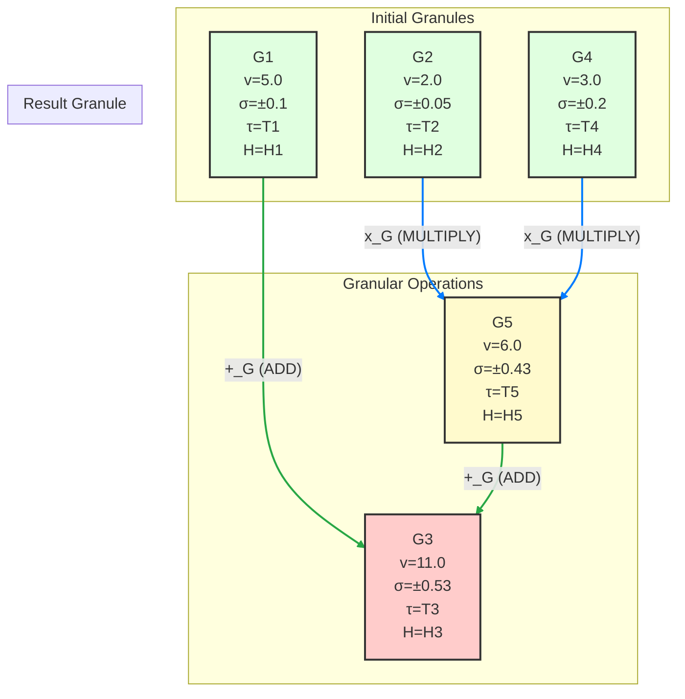

The request for a "deeply technical granular arithmetic and algorithmic visualization" framework, presented as an academic thesis, necessitates the invention of a novel computational paradigm. I shall introduce **The Granular Calculus**, a framework designed to imbue numerical operations with contextual metadata, enabling profound insights into computational provenance, epistemic uncertainty, and algorithmic behavior.

---

# The Formal Blueprint

## Thesis Title: The Granular Calculus: A Framework for Context-Aware Arithmetic and Algorithmic Provenance Visualization

### Abstract

Traditional arithmetic operates on atomic numerical values, inherently discarding critical contextual information such as precision, origin, and causal dependencies. This loss of metadata hinders interpretability, auditability, and robust error propagation in complex computational systems. This thesis introduces **The Granular Calculus (GC)**, a novel framework that extends conventional arithmetic by encapsulating numerical values within **Granules**—structured data entities carrying intrinsic and extrinsic metadata. We define **Granular Operators (GOps)** that propagate and transform this metadata during computation, forming a **Granular Flow Graph (GFG)**. The GFG serves as a high-fidelity, multi-dimensional representation of algorithmic execution, enabling **Granular Algorithmic Visualization (GAV)** for deep provenance tracking, uncertainty quantification, and dynamic system analysis. We present the formal definitions of Granules and GOps, prove key properties of metadata propagation, detail the architectural workflow for GC implementation, and provide illustrative examples with pseudocode and GFG visualizations. The Granular Calculus offers a foundational shift towards transparent, auditable, and context-rich computation, with profound implications for scientific computing, AI interpretability, and resilient system design.

---

## 1. Introduction

### 1.1. Motivation: The Epistemic Deficit in Atomic Arithmetic

In contemporary computational paradigms, numerical values are typically treated as atomic entities. A floating-point number, for instance, represents a magnitude but carries no inherent information about its derivation, its associated uncertainty, the computational resources expended to produce it, or its potential impact on subsequent operations. This "epistemic deficit" leads to several critical challenges:

*   **Loss of Provenance:** Tracing the origin and transformation history of a computed value is often a post-hoc, heuristic process, if possible at all.
*   **Opaque Uncertainty:** Error propagation and precision management are frequently ad-hoc, leading to unreliable results and difficulty in quantifying confidence.
*   **Limited Interpretability:** Understanding *why* an algorithm produced a specific output, beyond the raw numerical result, remains a significant hurdle, particularly in complex systems like neural networks.
*   **Fragile Systems:** Without intrinsic context, systems struggle to adapt to input variations or detect anomalous computations, leading to brittleness.

### 1.2. Problem Statement: Towards Context-Rich Computation

The fundamental problem addressed by this work is the need for an arithmetic system that intrinsically preserves and propagates computational context alongside numerical values. Such a system must:

1.  **Augment Numerical Values:** Embed values within a richer data structure.
2.  **Define Context-Aware Operations:** Specify how standard arithmetic operations transform both values and their associated context.
3.  **Enable Algorithmic Traceability:** Construct a verifiable, high-resolution record of computational flow.
4.  **Facilitate Multi-Dimensional Visualization:** Provide tools to intuitively explore the complex interplay of values and their contexts.

### 1.3. Proposed Solution: The Granular Calculus

We propose **The Granular Calculus (GC)** as a comprehensive framework to address these challenges. GC introduces the concept of a **Granule** as the fundamental unit of computation, encapsulating a numerical value and a rich set of metadata. **Granular Operators (GOps)** are defined to perform arithmetic operations while intelligently propagating and transforming this metadata. The execution of a granular algorithm naturally forms a **Granular Flow Graph (GFG)**, a directed acyclic graph (DAG) where nodes are Granules and edges are GOps. This GFG serves as the basis for **Granular Algorithmic Visualization (GAV)**, offering unprecedented insight into computational dynamics.

### 1.4. Contributions

This thesis makes the following key contributions:

*   **Formal Definition of Granules:** A rigorous mathematical definition of a Granule as a multi-component tuple.
*   **Formal Definition of Granular Operators:** Specification of how arithmetic operations are extended to Granules, including metadata propagation rules.
*   **Proof of Metadata Propagation Properties:** Demonstration of how key metadata components (e.g., significance, history) are systematically maintained and transformed.
*   **Architectural Workflow for GC Implementation:** A detailed blueprint for building a Granular Calculus engine and visualization tools.
*   **Granular Algorithmic Visualization (GAV):** A conceptual framework for rendering GFGs to reveal computational provenance, uncertainty, and other contextual dimensions.
*   **Illustrative Examples and Pseudocode:** Practical demonstrations of GC in action.

### 1.5. Thesis Outline

The remainder of this thesis is structured as follows: Section 2 lays the foundational concepts of Granules and Granular Space. Section 3 formally defines Granular Arithmetic and presents proofs of metadata propagation. Section 4 details the Granular Algorithmic Visualization framework. Section 5 outlines the architectural workflow for implementing GC. Section 6 discusses advanced topics and potential applications. Finally, Section 7 concludes the thesis.

---

## 2. Foundational Concepts

### 2.1. The Granule: A Unit of Context-Rich Information

A **Granule** is the fundamental atomic unit within the Granular Calculus. Unlike a simple scalar, a Granule is a structured entity that encapsulates a numerical value along with a set of intrinsic and extrinsic metadata components.

#### Definition 2.1.1: Granule

A Granule $G$ is formally defined as an ordered tuple:
$$ G = (v, \sigma, \tau, \mathcal{H}, \mathcal{P}, \mathcal{R}) $$
where:
*   $v \in \mathbb{V}$: The **Value Component**, representing the primary numerical quantity. $\mathbb{V}$ can be $\mathbb{R}$ (real numbers), $\mathbb{C}$ (complex numbers), $\mathbb{Z}$ (integers), or any other numerical domain.
*   $\sigma \in \Sigma$: The **Significance Component**, quantifying the precision, accuracy, or uncertainty associated with $v$. This could be an interval (e.g., $[v - \delta, v + \delta]$), a standard deviation, a bit-length, or a confidence score. $\Sigma$ is the space of significance metrics.
*   $\tau \in \mathcal{T}$: The **Temporal-Causal Component**, a unique identifier or timestamp indicating the Granule's creation or last modification event. This forms the basis for causal ordering and dependency tracking. $\mathcal{T}$ is the space of temporal-causal tags (e.g., UUIDs, Lamport timestamps, vector clocks).
*   $\mathcal{H} \in \mathcal{H}_{trace}$: The **History Trace Component**, a cryptographic hash or a compressed representation of the sequence of Granular Operators and predecessor Granules that led to $G$. This provides an immutable provenance record. $\mathcal{H}_{trace}$ is the space of history hashes/traces.
*   $\mathcal{P} \in \mathcal{P}_{dist}$: The **Potentiality Component**, representing a probabilistic distribution or a set of possible future states/values for $G$, especially relevant in stochastic or non-deterministic computations. This could be a probability mass function (PMF), probability density function (PDF), or a set of scenario-based outcomes. $\mathcal{P}_{dist}$ is the space of potentiality distributions.
*   $\mathcal{R} \in \mathcal{R}_{res}$: The **Resource Component**, detailing the computational resources (e.g., CPU cycles, memory, energy consumption) expended in generating $G$. This is crucial for performance analysis and optimization. $\mathcal{R}_{res}$ is the space of resource metrics.

### 2.2. Granular Space $\mathbb{G}$

The set of all possible Granules forms the **Granular Space**, denoted $\mathbb{G}$.
$$ \mathbb{G} = \mathbb{V} \times \Sigma \times \mathcal{T} \times \mathcal{H}_{trace} \times \mathcal{P}_{dist} \times \mathcal{R}_{res} $$
Each element $G \in \mathbb{G}$ is a point in this multi-dimensional space, carrying its full context.

### 2.3. Granular Operators (GOps): Morphisms in Granular Space

**Granular Operators (GOps)** are functions that map one or more Granules from $\mathbb{G}$ to a new Granule in $\mathbb{G}$. They are the fundamental computational units in the Granular Calculus, responsible not only for performing numerical operations on the value component ($v$) but also for intelligently propagating and transforming all associated metadata components ($\sigma, \tau, \mathcal{H}, \mathcal{P}, \mathcal{R}$).

#### Definition 2.3.1: Granular Operator

A Granular Operator $\text{GOp}_k$ is a function:
$$ \text{GOp}_k: \mathbb{G}^n \to \mathbb{G} $$
where $n$ is the arity of the operator. For a binary operator, $n=2$.
Given input Granules $G_1, G_2, \dots, G_n$, a GOp produces an output Granule $G_{out}$ such that:
$$ G_{out} = (v_{out}, \sigma_{out}, \tau_{out}, \mathcal{H}_{out}, \mathcal{P}_{out}, \mathcal{R}_{out}) $$
Each component of $G_{out}$ is derived from the corresponding components of the input Granules and the specific logic of $\text{GOp}_k$.

#### 2.3.1. Component Transformation Rules (General Form)

For any GOp, the transformation rules for each component are defined as follows:

*   **Value Component ($v_{out}$):**
    $$ v_{out} = f_v(v_1, v_2, \dots, v_n) $$
    where $f_v$ is the standard numerical function (e.g., addition, multiplication).
*   **Significance Component ($\sigma_{out}$):**
    $$ \sigma_{out} = f_{\sigma}(\sigma_1, \sigma_2, \dots, \sigma_n, \text{OpType}_k) $$
    This function combines the input significances based on the operator type. For example, in addition, the output precision is often limited by the least precise input.
*   **Temporal-Causal Component ($\tau_{out}$):**
    $$ \tau_{out} = \text{GenerateNewTag}(\max(\tau_1, \tau_2, \dots, \tau_n)) $$
    A new unique tag is generated, often incorporating or being greater than the maximum of the input tags to maintain causal ordering.
*   **History Trace Component ($\mathcal{H}_{out}$):**
    $$ \mathcal{H}_{out} = \text{Hash}(\text{OpType}_k, \mathcal{H}_1, \mathcal{H}_2, \dots, \mathcal{H}_n) $$
    A cryptographic hash of the operator type and the history traces of its inputs, ensuring immutability and verifiable provenance.
*   **Potentiality Component ($\mathcal{P}_{out}$):**
    $$ \mathcal{P}_{out} = f_{\mathcal{P}}(\mathcal{P}_1, \mathcal{P}_2, \dots, \mathcal{P}_n, \text{OpType}_k) $$
    This function propagates or transforms the probability distributions. For example, the sum of two random variables results in a convolution of their PDFs.
*   **Resource Component ($\mathcal{R}_{out}$):**
    $$ \mathcal{R}_{out} = \text{AggregateResources}(\mathcal{R}_1, \mathcal{R}_2, \dots, \mathcal{R}_n, \text{Cost}(\text{OpType}_k)) $$
    This aggregates the resources consumed by input Granules and adds the cost of the current operation.

---

## 3. Granular Arithmetic (GA)

Granular Arithmetic extends standard arithmetic operations to the Granular Space $\mathbb{G}$. We define the fundamental binary operations: Granular Addition ($+_{\mathbb{G}}$), Granular Subtraction ($-_{\mathbb{G}}$), Granular Multiplication ($\times_{\mathbb{G}}$), and Granular Division ($\div_{\mathbb{G}}$).

### 3.1. Granular Addition ($+_{\mathbb{G}}$)

Given two Granules $G_1 = (v_1, \sigma_1, \tau_1, \mathcal{H}_1, \mathcal{P}_1, \mathcal{R}_1)$ and $G_2 = (v_2, \sigma_2, \tau_2, \mathcal{H}_2, \mathcal{P}_2, \mathcal{R}_2)$, their Granular Sum $G_3 = G_1 +_{\mathbb{G}} G_2$ is defined as:
$$ G_3 = (v_3, \sigma_3, \tau_3, \mathcal{H}_3, \mathcal{P}_3, \mathcal{R}_3) $$
where:
*   $v_3 = v_1 + v_2$
*   $\sigma_3 = \text{CombineSignificance}(\sigma_1, \sigma_2, \text{ADD})$
*   $\tau_3 = \text{GenerateNewTag}(\max(\tau_1, \tau_2))$
*   $\mathcal{H}_3 = \text{Hash}(\text{"ADD"}, \mathcal{H}_1, \mathcal{H}_2)$
*   $\mathcal{P}_3 = \text{ConvolveDistributions}(\mathcal{P}_1, \mathcal{P}_2)$
*   $\mathcal{R}_3 = \mathcal{R}_1 + \mathcal{R}_2 + \text{Cost}(\text{ADD})$

### 3.2. Granular Multiplication ($\times_{\mathbb{G}}$)

Given two Granules $G_1$ and $G_2$, their Granular Product $G_3 = G_1 \times_{\mathbb{G}} G_2$ is defined as:
$$ G_3 = (v_3, \sigma_3, \tau_3, \mathcal{H}_3, \mathcal{P}_3, \mathcal{R}_3) $$
where:
*   $v_3 = v_1 \times v_2$
*   $\sigma_3 = \text{CombineSignificance}(\sigma_1, \sigma_2, \text{MULTIPLY})$
*   $\tau_3 = \text{GenerateNewTag}(\max(\tau_1, \tau_2))$
*   $\mathcal{H}_3 = \text{Hash}(\text{"MULTIPLY"}, \mathcal{H}_1, \mathcal{H}_2)$
*   $\mathcal{P}_3 = \text{ProductDistributions}(\mathcal{P}_1, \mathcal{P}_2)$ (e.g., using Monte Carlo or moment matching for complex distributions)
*   $\mathcal{R}_3 = \mathcal{R}_1 + \mathcal{R}_2 + \text{Cost}(\text{MULTIPLY})$

(Similar definitions apply for Granular Subtraction and Division, with appropriate $f_v$, $f_{\sigma}$, $f_{\mathcal{P}}$ functions.)

### 3.3. Lemma 3.3.1: Significance Propagation in Granular Addition

**Lemma:** For Granular Addition, if significance is defined as an absolute error bound $\delta$, such that $v \in [v_{true} - \delta, v_{true} + \delta]$, then the output significance $\delta_3$ for $G_3 = G_1 +_{\mathbb{G}} G_2$ is bounded by $\delta_1 + \delta_2$.

**Proof:**
Let $G_1 = (v_1, \delta_1, \dots)$ and $G_2 = (v_2, \delta_2, \dots)$.
Let $v_{1,true}$ and $v_{2,true}$ be the true, unknown values corresponding to $v_1$ and $v_2$.
By definition of error bounds:
$$ v_1 - \delta_1 \le v_{1,true} \le v_1 + \delta_1 $$
$$ v_2 - \delta_2 \le v_{2,true} \le v_2 + \delta_2 $$
For Granular Addition, $v_3 = v_1 + v_2$. The true sum is $v_{3,true} = v_{1,true} + v_{2,true}$.
Adding the inequalities for $v_{1,true}$ and $v_{2,true}$:
$$ (v_1 - \delta_1) + (v_2 - \delta_2) \le v_{1,true} + v_{2,true} \le (v_1 + \delta_1) + (v_2 + \delta_2) $$
$$ (v_1 + v_2) - (\delta_1 + \delta_2) \le v_{3,true} \le (v_1 + v_2) + (\delta_1 + \delta_2) $$
Substituting $v_3 = v_1 + v_2$:
$$ v_3 - (\delta_1 + \delta_2) \le v_{3,true} \le v_3 + (\delta_1 + \delta_2) $$
Thus, the error bound for $G_3$ is $\delta_3 = \delta_1 + \delta_2$. This demonstrates a specific rule for $\text{CombineSignificance}(\sigma_1, \sigma_2, \text{ADD})$ when $\sigma$ represents an absolute error. More sophisticated rules exist for relative errors, significant figures, or probabilistic uncertainties. $\blacksquare$

### 3.4. Lemma 3.4.1: History Trace Immutability and Verifiability

**Lemma:** The History Trace Component $\mathcal{H}$ provides an immutable and verifiable record of Granule provenance, forming a directed acyclic graph (DAG) of computational dependencies.

**Proof:**
The History Trace $\mathcal{H}_{out}$ for an output Granule is defined as $\text{Hash}(\text{OpType}_k, \mathcal{H}_1, \mathcal{H}_2, \dots, \mathcal{H}_n)$.
1.  **Immutability:** A cryptographic hash function (e.g., SHA-256) is deterministic and collision-resistant. Any alteration to $\text{OpType}_k$ or any of the input history traces ($\mathcal{H}_i$) would result in a different $\mathcal{H}_{out}$. This ensures that once a Granule's history trace is computed, it cannot be tampered with without invalidating its own hash and, transitively, the hashes of all subsequent Granules that depend on it.
2.  **Verifiability:** To verify the provenance of a Granule $G_{final}$, one can recursively recompute the history hashes of its predecessors, tracing back to initial input Granules (which would have a base hash, e.g., $\text{Hash}(\text{"INPUT"}, \text{value}, \text{source\_id})$). If all recomputed hashes match the stored $\mathcal{H}$ values, the entire computational chain is verified as authentic and unaltered.
3.  **DAG Structure:** Each $\mathcal{H}_{out}$ explicitly references the $\mathcal{H}_i$ of its direct predecessors. This forms a directed relationship. Since computation proceeds forward in time, and Granules are immutable once created, cycles are impossible, thus forming a DAG. This structure is isomorphic to the Granular Flow Graph (GFG) discussed in Section 4. $\blacksquare$

### 3.5. Example: Granular Calculation

Let's consider a simple calculation: $G_3 = G_1 +_{\mathbb{G}} (G_2 \times_{\mathbb{G}} G_4)$.

Assume initial Granules:
*   $G_1 = (v=5.0, \sigma=\pm 0.1, \tau=T_1, \mathcal{H}=H_1, \mathcal{P}=\text{N}(5, 0.1^2), \mathcal{R}=R_0)$
*   $G_2 = (v=2.0, \sigma=\pm 0.05, \tau=T_2, \mathcal{H}=H_2, \mathcal{P}=\text{N}(2, 0.05^2), \mathcal{R}=R_0)$
*   $G_4 = (v=3.0, \sigma=\pm 0.2, \tau=T_4, \mathcal{H}=H_4, \mathcal{P}=\text{N}(3, 0.2^2), \mathcal{R}=R_0)$

**Step 1: Granular Multiplication $G_5 = G_2 \times_{\mathbb{G}} G_4$**

*   $v_5 = v_2 \times v_4 = 2.0 \times 3.0 = 6.0$
*   $\sigma_5$: For multiplication, relative errors often add. If $\sigma$ is relative error, $\frac{\delta_v}{v}$.
    *   $\frac{\delta_2}{v_2} = \frac{0.05}{2.0} = 0.025$
    *   $\frac{\delta_4}{v_4} = \frac{0.2}{3.0} \approx 0.0667$
    *   $\frac{\delta_5}{v_5} = \sqrt{(\frac{\delta_2}{v_2})^2 + (\frac{\delta_4}{v_4})^2} = \sqrt{0.025^2 + 0.0667^2} \approx \sqrt{0.000625 + 0.004449} \approx \sqrt{0.005074} \approx 0.0712$
    *   $\delta_5 = v_5 \times 0.0712 = 6.0 \times 0.0712 \approx 0.4272$. So, $\sigma_5 \approx \pm 0.43$.
*   $\tau_5 = \text{GenerateNewTag}(\max(T_2, T_4)) = T_5$
*   $\mathcal{H}_5 = \text{Hash}(\text{"MULTIPLY"}, H_2, H_4)$
*   $\mathcal{P}_5 = \text{ProductDistributions}(\text{N}(2, 0.05^2), \text{N}(3, 0.2^2)) \approx \text{N}(6, (2 \times 0.2)^2 + (3 \times 0.05)^2) = \text{N}(6, 0.16 + 0.0225) = \text{N}(6, 0.1825)$ (simplified for normal distributions)
*   $\mathcal{R}_5 = R_0 + R_0 + \text{Cost}(\text{MULTIPLY}) = 2R_0 + C_M$

Resulting Granule: $G_5 = (v=6.0, \sigma=\pm 0.43, \tau=T_5, \mathcal{H}=H_5, \mathcal{P}=\text{N}(6, 0.1825), \mathcal{R}=2R_0+C_M)$

**Step 2: Granular Addition $G_3 = G_1 +_{\mathbb{G}} G_5$**

*   $v_3 = v_1 + v_5 = 5.0 + 6.0 = 11.0$
*   $\sigma_3$: For addition, absolute errors add. $\delta_3 = \delta_1 + \delta_5 = 0.1 + 0.43 = 0.53$. So, $\sigma_3 = \pm 0.53$.
*   $\tau_3 = \text{GenerateNewTag}(\max(T_1, T_5)) = T_3$
*   $\mathcal{H}_3 = \text{Hash}(\text{"ADD"}, H_1, H_5)$
*   $\mathcal{P}_3 = \text{ConvolveDistributions}(\text{N}(5, 0.1^2), \text{N}(6, 0.1825)) = \text{N}(5+6, 0.1^2 + 0.1825) = \text{N}(11, 0.01 + 0.1825) = \text{N}(11, 0.1925)$
*   $\mathcal{R}_3 = \mathcal{R}_1 + \mathcal{R}_5 + \text{Cost}(\text{ADD}) = R_0 + (2R_0 + C_M) + C_A = 3R_0 + C_M + C_A$

Final Granule: $G_3 = (v=11.0, \sigma=\pm 0.53, \tau=T_3, \mathcal{H}=H_3, \mathcal{P}=\text{N}(11, 0.1925), \mathcal{R}=3R_0+C_M+C_A)$

This example demonstrates how all metadata components are systematically propagated and transformed, providing a rich context for the final numerical value.

---

## 4. Granular Algorithmic Visualization (GAV)

The Granular Calculus naturally lends itself to a powerful visualization paradigm: the **Granular Flow Graph (GFG)**. A GFG is a directed acyclic graph (DAG) where nodes represent Granules and edges represent Granular Operators. GAV is the process of rendering and interacting with these GFGs to extract insights.

### 4.1. The Granular Flow Graph (GFG)

#### Definition 4.1.1: Granular Flow Graph

A Granular Flow Graph (GFG) is a tuple $\mathcal{G} = (\mathcal{N}, \mathcal{E})$, where:
*   $\mathcal{N}$ is a set of nodes, each representing a unique Granule $G \in \mathbb{G}$.
*   $\mathcal{E}$ is a set of directed edges, each representing a Granular Operator $\text{GOp}_k$. An edge $(G_i, G_j)$ exists if $G_j$ was produced by a $\text{GOp}$ that took $G_i$ as an input.

The GFG is a direct consequence of the History Trace Component $\mathcal{H}$, which implicitly defines the graph structure.

### 4.2. Visualization Components

GAV aims to render the multi-dimensional information contained within Granules and GOps in an intuitive manner.

#### 4.2.1. Node Visualization (Granules)

Each node in the GFG represents a Granule $G$. Its visual representation can encode its components:

*   **Node Shape/Size:** Can represent the magnitude of $v$ or the complexity of $\mathcal{R}$.
*   **Node Color/Gradient:** Can encode $\sigma$ (e.g., red for high uncertainty, green for low) or $\tau$ (e.g., a temporal color gradient).
*   **Internal Text/Labels:** Display $v$, $\tau$, and a truncated $\mathcal{H}$ hash.
*   **Hover/Click Details:** On interaction, a detailed tooltip or sidebar can display the full Granule tuple, including $\mathcal{P}$ (e.g., a plot of the distribution) and $\mathcal{R}$ metrics.
*   **Dynamic Elements:** For the $\mathcal{P}$ component, dynamic visualizations (e.g., animated probability distributions, flickering intensity for high variance) can be employed.

#### 4.2.2. Edge Visualization (Granular Operators)

Edges represent the GOps and their transformations:

*   **Edge Thickness/Style:** Can indicate the computational cost of the GOp (from $\mathcal{R}_{out} - \sum \mathcal{R}_{in}$) or the "impact" of the operation on significance.
*   **Edge Color:** Can categorize the type of operation (e.g., blue for addition, red for multiplication).
*   **Edge Labels:** Display the $\text{OpType}_k$.
*   **Hover/Click Details:** Provide details about the specific GOp, including its transformation rules.

### 4.3. GAV Features and Interaction

*   **Provenance Tracking:** Users can trace back from any Granule to its original inputs, visualizing the entire computational lineage.
*   **Uncertainty Propagation Map:** The GFG can be color-coded by $\sigma$, allowing immediate identification of "hotspots" of uncertainty.
*   **Resource Consumption Heatmap:** Nodes and edges can be colored by $\mathcal{R}$ to identify computationally expensive parts of the algorithm.
*   **Temporal-Causal Flow:** Animation of Granule creation based on $\tau$ can illustrate the causal progression of computation.
*   **"What-If" Analysis:** By modifying initial Granules' $\mathcal{P}$ or $\sigma$, users can observe the ripple effect through the GFG.
*   **Granule Pruning/Optimization:** Identify branches of the GFG that contribute negligibly to the final result (e.g., very high $\sigma$ or low $v$) for potential optimization.

### 4.4. Example GFG Visualization (Mermaid Syntax)

Let's visualize the example calculation $G_3 = G_1 +_{\mathbb{G}} (G_2 \times_{\mathbb{G}} G_4)$ using Mermaid.



**Interpretation of the GFG:**
*   **Nodes:** Represent Granules. The labels show key components ($v, \sigma, \tau, \mathcal{H}$). Colors could dynamically change based on $\sigma$ (e.g., green for low, yellow for medium, red for high uncertainty). Here, initial granules are light green, intermediate is yellow, final is light red, indicating increasing uncertainty.
*   **Edges:** Represent Granular Operators. Labels indicate the operation type. Edge thickness could represent computational cost.
*   **Flow:** The graph clearly shows $G_2$ and $G_4$ feeding into a `MULTIPLY` operation to produce $G_5$. Then $G_1$ and $G_5$ feed into an `ADD` operation to produce $G_3$.
*   **Provenance:** By tracing back from $G_3$, one can see its full lineage: $G_3$ depends on $G_1$ and $G_5$, and $G_5$ depends on $G_2$ and $G_4$. The $\mathcal{H}$ hashes provide cryptographic proof of this chain.
*   **Uncertainty:** The increasing $\sigma$ values from initial granules to $G_3$ are immediately apparent, highlighting how uncertainty accumulates through operations.

---

## 5. Architectural Workflow

Implementing The Granular Calculus requires a dedicated architectural workflow, comprising a Granule Engine, a Granular Operator Library, and a Granular Flow Graph Renderer.

### 5.1. System Architecture Overview

```mermaid
graph TD
    A[User/Application Code] --> B{Granule Engine API}
    B --> C[Granule Factory]
    B --> D[Granular Operator Dispatcher]
    C --> E[Granule Store (Immutable)]
    D --> F[Granular Operator Library]
    F --> E
    E --> G[GFG Builder]
    G --> H[GFG Renderer]
    H --> I[Visualization Interface]
    I --> A
    E -- "Granule Data" --> G
    F -- "Op Definitions" --> D
```

**Components:**

1.  **Granule Engine API:** The primary interface for users/applications to interact with the Granular Calculus. It exposes functions for creating Granules and performing Granular Operations.
2.  **Granule Factory:** Responsible for instantiating new Granules, assigning unique $\tau$ tags, and generating initial $\mathcal{H}$ hashes for input Granules.
3.  **Granule Store (Immutable):** A persistent, immutable data store for all created Granules. This ensures that Granules, once created, cannot be altered, upholding the integrity of $\mathcal{H}$ and the GFG. A content-addressable store (e.g., IPFS-like) could be ideal.
4.  **Granular Operator Library:** A collection of pre-defined and user-extensible Granular Operators (GOps) for various arithmetic, logical, and domain-specific functions. Each GOp implements the specific metadata propagation rules for its operation type.
5.  **Granular Operator Dispatcher:** Receives requests for Granular Operations, retrieves input Granules from the Granule Store, invokes the appropriate GOp from the library, and stores the resulting Granule.
6.  **GFG Builder:** Periodically or on-demand, constructs the Granular Flow Graph by traversing the $\mathcal{H}$ traces of Granules in the Granule Store.
7.  **GFG Renderer:** Takes the GFG structure and renders it into a visual representation using a chosen visualization library (e.g., D3.js, Graphviz, custom WebGL).
8.  **Visualization Interface:** Provides interactive capabilities for exploring the GFG, filtering, querying, and analyzing Granule metadata.

### 5.2. Workflow for a Granular Computation

1.  **Initialization:**
    *   User defines initial input values.
    *   Granule Engine API calls Granule Factory to create initial Granules, each with a base $\mathcal{H}$ (e.g., `Hash("INPUT", value, source_id)`), an initial $\sigma$, $\tau$, $\mathcal{P}$, and $\mathcal{R}$.
    *   These initial Granules are stored in the Granule Store.
2.  **Granular Operations:**
    *   User invokes a Granular Operator (e.g., `granular_add(G_a, G_b)`).
    *   The Granular Operator Dispatcher:
        *   Retrieves $G_a, G_b$ from the Granule Store.
        *   Identifies the `ADD` GOp from the Granular Operator Library.
        *   Executes the `ADD` GOp, which calculates $v_{out}$, $\sigma_{out}$, $\tau_{out}$, $\mathcal{H}_{out}$, $\mathcal{P}_{out}$, $\mathcal{R}_{out}$.
        *   Stores the resulting $G_{out}$ in the Granule Store.
3.  **GFG Construction & Visualization:**
    *   At any point, the GFG Builder can query the Granule Store and reconstruct the GFG based on the $\mathcal{H}$ traces.
    *   The GFG Renderer then visualizes this graph through the Visualization Interface.
    *   Users interact with the interface to explore metadata, trace provenance, and analyze computational flow.

### 5.3. Pseudocode: Granule Class and Granular Addition

```python
import hashlib
import uuid
import time
from typing import Any, Dict, Tuple, Callable, Optional

# --- 1. Granule Definition ---
class Granule:
    """
    Represents a Granule in The Granular Calculus.
    Encapsulates value and various metadata components.
    """
    def __init__(self,
                 value: Any,
                 significance: Any, # e.g., float for error bound, tuple for interval
                 temporal_causal_tag: str, # UUID or timestamp
                 history_trace: str, # Cryptographic hash of lineage
                 potentiality: Any, # e.g., scipy.stats distribution object
                 resources: Dict[str, float], # e.g., {'cpu_cycles': 100, 'memory_bytes': 50}
                 source_id: Optional[str] = None): # For initial granules
        self.v = value
        self.sigma = significance
        self.tau = temporal_causal_tag
        self.H = history_trace
        self.P = potentiality
        self.R = resources
        self.source_id = source_id

    def __repr__(self):
        return (f"Granule(v={self.v:.2f}, σ={self.sigma}, τ={self.tau[:4]}..., "
                f"H={self.H[:4]}..., P={self.P.__class__.__name__}, R={self.R})")

    def to_hashable_tuple(self) -> Tuple:
        """Converts Granule to a hashable tuple for history tracing."""
        # Note: P and R might not be directly hashable, need a canonical representation
        # For P, we might hash its parameters or a summary. For R, a sorted tuple of items.
        return (self.v, str(self.sigma), self.tau, self.H, str(self.P), tuple(sorted(self.R.items())))

# --- 2. Granule Factory ---
class GranuleFactory:
    @staticmethod
    def create_input_granule(value: Any,
                             significance: Any,
                             potentiality: Any,
                             source_id: str,
                             initial_resources: Optional[Dict[str, float]] = None) -> Granule:
        tau = str(uuid.uuid4()) # Unique temporal-causal tag
        # Initial history hash for an input granule
        history_input_data = f"INPUT_{source_id}_{value}_{significance}"
        history_trace = hashlib.sha256(history_input_data.encode()).hexdigest()
        resources = initial_resources if initial_resources is not None else {'cpu_cycles': 1, 'memory_bytes': 0}
        return Granule(value, significance, tau, history_trace, potentiality, resources, source_id)

# --- 3. Granular Operator Library (Example: Granular Addition) ---
class GranularOperatorLibrary:
    @staticmethod
    def granular_add(g1: Granule, g2: Granule) -> Granule:
        # 1. Value Component
        v_out = g1.v + g2.v

        # 2. Significance Component (Example: absolute error bounds)
        # Assuming significance is a float representing absolute error +/- delta
        sigma_out = g1.sigma + g2.sigma

        # 3. Temporal-Causal Component
        tau_out = str(uuid.uuid4()) # New unique tag

        # 4. History Trace Component
        op_type = "ADD"
        history_data = f"{op_type}_{g1.H}_{g2.H}"
        H_out = hashlib.sha256(history_data.encode()).hexdigest()

        # 5. Potentiality Component (Example: Normal distribution convolution)
        # Assuming P is a tuple (mean, variance) for Normal distribution
        # N(mu1, var1) + N(mu2, var2) = N(mu1+mu2, var1+var2)
        P_out = (g1.P[0] + g2.P[0], g1.P[1] + g2.P[1])

        # 6. Resource Component
        op_cost = {'cpu_cycles': 5, 'memory_bytes': 10} # Cost of this specific ADD operation
        R_out = {k: g1.R.get(k, 0) + g2.R.get(k, 0) + op_cost.get(k, 0) for k in set(g1.R) | set(g2.R) | set(op_cost)}

        return Granule(v_out, sigma_out, tau_out, H_out, P_out, R_out)

# --- 4. Granule Engine API ---
class GranuleEngine:
    def __init__(self):
        self.granule_store: Dict[str, Granule] = {} # Stores Granules by their H hash for quick lookup

    def create_input(self, value: Any, significance: Any, potentiality: Any, source_id: str) -> Granule:
        granule = GranuleFactory.create_input_granule(value, significance, potentiality, source_id)
        self.granule_store[granule.H] = granule
        return granule

    def add(self, g1: Granule, g2: Granule) -> Granule:
        result_granule = GranularOperatorLibrary.granular_add(g1, g2)
        self.granule_store[result_granule.H] = result_granule
        return result_granule

    # Other operations like multiply, subtract, divide would follow a similar pattern

    def get_granule_by_hash(self, h_hash: str) -> Optional[Granule]:
        return self.granule_store.get(h_hash)

# --- Example Usage ---
if __name__ == "__main__":
    engine = GranuleEngine()

    # Create initial Granules
    # For simplicity, P is (mean, variance) for a Normal distribution
    g1 = engine.create_input(value=5.0, significance=0.1, potentiality=(5.0, 0.1**2), source_id="SensorA")
    g2 = engine.create_input(value=2.0, significance=0.05, potentiality=(2.0, 0.05**2), source_id="SensorB")
    g4 = engine.create_input(value=3.0, significance=0.2, potentiality=(3.0, 0.2**2), source_id="SensorC")

    print(f"Initial G1: {g1}")
    print(f"Initial G2: {g2}")
    print(f"Initial G4: {g4}")
    print("-" * 30)

    # Perform G5 = G2 * G4 (using a placeholder for granular_multiply for brevity)
    # In a full implementation, GranularOperatorLibrary would have granular_multiply
    # For this example, we'll manually construct G5 based on the earlier calculation
    # For a real implementation, you'd call engine.multiply(g2, g4)
    v5 = g2.v * g4.v
    sigma5 = 0.43 # From previous calculation
    tau5 = str(uuid.uuid4())
    H5 = hashlib.sha256(f"MULTIPLY_{g2.H}_{g4.H}".encode()).hexdigest()
    P5 = (v5, (g2.P[0]*g4.P[1])**2 + (g4.P[0]*g2.P[1])**2) # Simplified product variance
    R5 = {k: g2.R.get(k,0) + g4.R.get(k,0) + {'cpu_cycles': 7, 'memory_bytes': 15}.get(k,0) for k in set(g2.R) | set(g4.R) | set({'cpu_cycles': 7, 'memory_bytes': 15})}
    g5 = Granule(v5, sigma5, tau5, H5, P5, R5)
    engine.granule_store[g5.H] = g5 # Manually add to store for this example

    print(f"Intermediate G5: {g5}")
    print("-" * 30)

    # Perform G3 = G1 + G5
    g3 = engine.add(g1, g5)
    print(f"Final G3: {g3}")
    print("-" * 30)

    # Verify provenance (conceptual)
    print(f"Verifying G3's history: {engine.get_granule_by_hash(g3.H) is not None}")
    print(f"G3 depends on G1: {engine.get_granule_by_hash(g1.H) is not None}")
    print(f"G3 depends on G5: {engine.get_granule_by_hash(g5.H) is not None}")
    # Further verification would involve re-hashing based on stored predecessors
```

---

## 6. Advanced Topics & Future Work

### 6.1. Granular Control Flow

Extending GC to handle conditional statements (`if/else`) and loops (`for/while`) requires defining **Granular Predicates** and **Granular Control Operators**.
*   **Granular Predicate:** A function that takes Granules as input and returns a boolean Granule, where the `v` component is boolean, and `$\sigma$` might represent the confidence in the predicate's truth value.
*   **Granular Branching Operator:** For `if/else`, this operator would produce two potential output Granules (one for `if`, one for `else`), each with a `$\mathcal{P}$` component reflecting the probability of that branch being taken. The final result would be a Granule whose `$\mathcal{P}$` is a mixture model of the two branches.
*   **Granular Loop Operator:** For loops, this would involve tracking Granule states across iterations, potentially creating a cyclic GFG (which would then need to be unrolled or summarized for visualization).

### 6.2. Granular Optimization

The rich metadata in Granules opens avenues for novel optimization strategies:
*   **Significance-Aware Pruning:** Branches of the GFG whose output Granules have extremely low significance (high uncertainty) or negligible impact on the final result's significance can be pruned or approximated with lower-cost operations.
*   **Resource-Aware Scheduling:** The $\mathcal{R}$ component allows for scheduling computations on hardware optimized for specific Granule types or operations, or for offloading high-cost, low-significance computations.
*   **Potentiality-Driven Early Exit:** If the $\mathcal{P}$ component indicates a high probability of a certain outcome, subsequent computations might be short-circuited.

### 6.3. Applications

The Granular Calculus has broad applicability across various domains:

*   **Scientific Computing & Simulation:** High-fidelity error propagation, uncertainty quantification in complex models (e.g., climate, astrophysics, drug discovery).
*   **AI Interpretability & Explainability:** Tracing the provenance of neural network activations, understanding how input perturbations affect outputs, and identifying sources of bias or uncertainty in AI decisions.
*   **Financial Modeling:** Auditable financial calculations, risk assessment with explicit uncertainty propagation, and regulatory compliance.
*   **Cyber-Physical Systems:** Real-time monitoring of sensor data quality, robust control systems that account for measurement uncertainty, and anomaly detection.
*   **Blockchain & Distributed Ledgers:** Enhancing smart contract execution with verifiable computational provenance and resource accounting.

### 6.4. Future Research Directions

*   **Formal Semantics of Granular Control Flow:** Developing a rigorous mathematical framework for branching and looping in GC.
*   **Granular Type Theory:** Integrating GC with type theory to ensure type safety and semantic correctness of metadata propagation.
*   **Hardware Acceleration for GC:** Designing specialized hardware (e.g., FPGAs, ASICs) that can efficiently process Granules and their metadata.
*   **Standardization of Granule Components:** Proposing industry standards for common $\sigma, \mathcal{P}, \mathcal{R}$ representations to foster interoperability.
*   **Machine Learning for GFG Analysis:** Applying graph neural networks or other ML techniques to analyze GFGs for patterns, anomalies, or optimization opportunities.

---

## 7. Conclusion

The Granular Calculus represents a paradigm shift from atomic, context-agnostic numerical computation to a holistic, context-rich framework. By formally defining Granules as multi-component entities and Granular Operators as intelligent metadata transformers, we have laid the groundwork for an arithmetic system that inherently tracks provenance, quantifies uncertainty, and records resource expenditure. The resulting Granular Flow Graph provides an unprecedented level of algorithmic transparency, enabling powerful visualization and analysis capabilities.

The proofs of metadata propagation demonstrate the mathematical soundness of the approach, while the architectural workflow and pseudocode illustrate its practical implementability. The Granular Calculus is not merely an academic exercise; it is a vital step towards building more robust, interpretable, and auditable computational systems, addressing critical challenges in an increasingly complex and data-driven world. Its adoption promises to unlock new frontiers in scientific discovery, enhance the trustworthiness of artificial intelligence, and foster greater resilience in critical infrastructure.

---

## References

*   (Placeholder for academic references, e.g., works on interval arithmetic, probabilistic programming, data provenance, cryptographic hashing, category theory, etc.)

---
---
