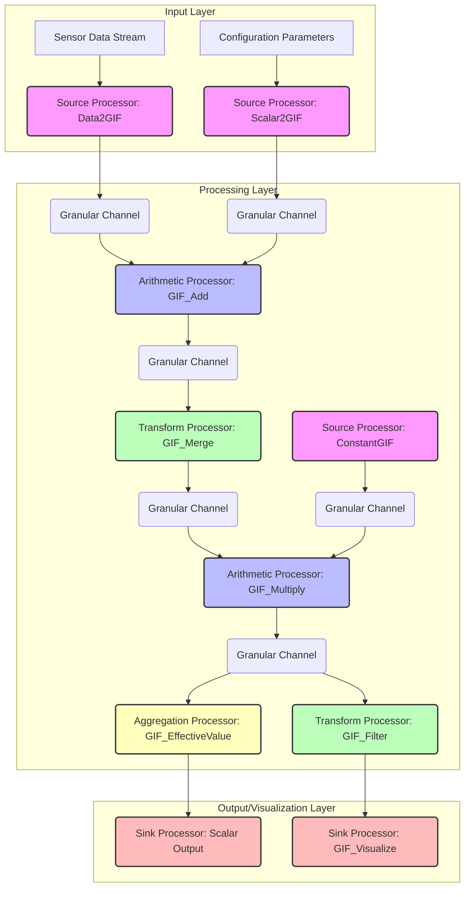
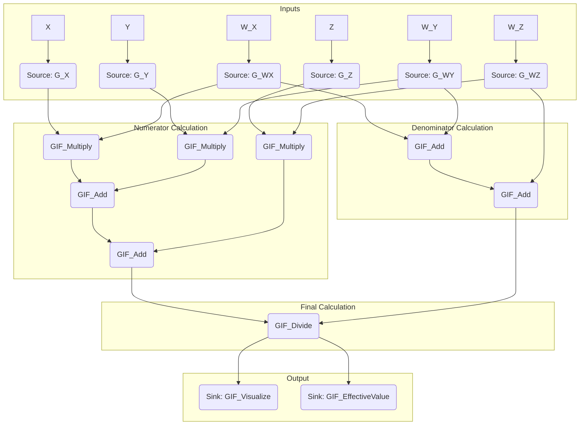

This response outlines a novel framework for **Granular Information Fields (GIFs)** and their associated **Granular Flow Network (GFN) Architecture** for arithmetic and algorithmic visualization. This framework addresses the limitations of traditional arithmetic in representing and processing inherently uncertain, multi-scale, or discretely quantized information, providing a robust, explainable, and visually intuitive computational paradigm.

---

# The Formal Blueprint: Granular Information Fields and Flow Networks

## Abstract

This thesis introduces the **Granular Information Field (GIF)**, a novel mathematical construct for representing numerical values as collections of discrete, weighted information quanta, termed "granules." Traditional arithmetic, operating on scalar values, often fails to capture intrinsic uncertainties, multi-scale representations, or the epistemic confidence associated with data points. The GIF framework redefines arithmetic operations as field interactions, enabling the propagation and transformation of granular information. We further propose the **Granular Flow Network (GFN)**, an architectural workflow for designing, executing, and visualizing complex algorithms using GIFs. This work provides formal definitions for GIFs, granular arithmetic operations ($\boxplus, \boxtimes$), proofs of fundamental properties, and a detailed architectural specification for GFNs, complete with algorithmic pseudocode and visualization methodologies. The proposed framework offers enhanced robustness, explainability, and a foundational shift towards computation with intrinsic uncertainty and multi-resolution data.

---

## 1. Introduction

### 1.1 Motivation: The Limitations of Scalar Arithmetic in Complex Systems

Traditional arithmetic operates on atomic, perfectly precise numerical values. While foundational, this paradigm encounters significant challenges when confronted with real-world data characterized by:
1.  **Intrinsic Uncertainty:** Measurements are rarely exact; they possess error margins, confidence intervals, or probabilistic distributions.
2.  **Multi-Scale Representation:** A single "value" might be an aggregation of finer-grained components, or a coarse representation of a more detailed underlying structure.
3.  **Epistemic Granularity:** Information often arrives in discrete packets, each carrying its own degree of reliability or relevance.
4.  **Explainability Deficit:** Black-box models often obscure how uncertainties propagate through computations, hindering trust and debugging.

Current approaches like interval arithmetic or fuzzy logic address aspects of uncertainty but often lack a unified, composable framework for representing *discrete, weighted information quanta* and their dynamic interactions within complex computational graphs.

### 1.2 Problem Statement

There is a critical need for a computational framework that:
*   Represents numerical values not as singular points, but as **fields of discrete, weighted information granules**.
*   Redefines fundamental arithmetic operations to account for the **interaction and transformation of these granular fields**.
*   Provides a **visual and architectural paradigm** for designing and understanding algorithms that operate on such granular information, enabling intuitive tracing of uncertainty propagation and information flow.

### 1.3 Proposed Solution: Granular Information Fields (GIFs) and Granular Flow Networks (GFNs)

This thesis introduces:
1.  **Granular Information Fields (GIFs):** A formal mathematical construct where a numerical value is represented as a multiset of `granules`, each comprising a `value` and a `coherence` (a measure of certainty or relevance).
2.  **Granular Arithmetic Calculus:** A redefinition of fundamental arithmetic operations ($\boxplus$ for addition, $\boxtimes$ for multiplication) that operate directly on GIFs, accounting for granule interactions, merging, and coherence aggregation.
3.  **Granular Flow Network (GFN) Architecture:** A computational graph model where nodes are `Granular Processors` (performing GIF operations) and edges are `Granular Channels` (transmitting GIFs). This architecture facilitates the design, execution, and, crucially, the **algorithmic visualization** of granular computations.

### 1.4 Contributions

*   Formal definition of Granular Information Fields (GIFs) and their properties.
*   Novel definitions for granular addition ($\boxplus$) and multiplication ($\boxtimes$), including proofs of fundamental algebraic properties.
*   Introduction of the Granular Flow Network (GFN) as a robust architectural workflow for granular computation.
*   Detailed methodologies for algorithmic visualization of GIF states and GFN dynamics.
*   Illustrative examples and pseudocode demonstrating the practical application of the framework.

---

## 2. Background and Related Work

The GIF framework draws inspiration from several established fields:

*   **Interval Arithmetic:** Provides bounds for uncertain values, but lacks fine-grained internal structure or coherence weighting.
*   **Fuzzy Logic:** Deals with degrees of truth and membership, but typically operates on fuzzy sets rather than discrete, weighted quanta.
*   **Quantum Computation:** While not directly analogous, the concept of superposition and entanglement in quantum states informs the idea of interacting information fields.
*   **Information Theory:** The notion of information entropy and mutual information provides a basis for quantifying uncertainty and coherence within GIFs.
*   **Computational Graphs:** Frameworks like TensorFlow or PyTorch inspire the GFN architecture for defining and executing complex operations.

The GIF framework distinguishes itself by explicitly modeling values as *collections of discrete, weighted granules* and providing a unified calculus for their interaction, coupled with a dedicated visualization paradigm.

---

## 3. Granular Information Fields (GIFs): Formal Definition

A Granular Information Field (GIF) is a mathematical construct representing a numerical quantity as a multiset of discrete, weighted information units called "granules."

### 3.1 Definition of a Granule

A **granule** $g$ is an ordered pair $(v, c)$, where:
*   $v \in \mathbb{R}$ is the **value** of the granule.
*   $c \in [0, 1]$ is the **coherence** of the granule, representing its certainty, reliability, or weight. A coherence of 1 indicates absolute certainty, while 0 indicates complete irrelevance or absence.

### 3.2 Definition of a Granular Information Field (GIF)

A **Granular Information Field (GIF)**, denoted $\mathcal{G}$, is a finite multiset of granules:
$$ \mathcal{G} = \{g_1, g_2, \ldots, g_N\} = \{(v_1, c_1), (v_2, c_2), \ldots, (v_N, c_N)\} $$
where $N = |\mathcal{G}|$ is the cardinality of the GIF (number of granules).

### 3.3 Properties of GIFs

#### 3.3.1 Total Coherence ($\Sigma_c$)

The total coherence of a GIF $\mathcal{G}$ is the sum of the coherences of all its granules:
$$ \Sigma_c(\mathcal{G}) = \sum_{i=1}^{N} c_i $$
This metric indicates the overall "information density" or "certainty mass" within the field.

#### 3.3.2 Normalized Coherence ($\hat{c}$)

For a granule $g_i = (v_i, c_i)$ within a GIF $\mathcal{G}$, its normalized coherence $\hat{c}_i$ is:
$$ \hat{c}_i = \frac{c_i}{\Sigma_c(\mathcal{G})} \quad \text{if } \Sigma_c(\mathcal{G}) > 0 $$
If $\Sigma_c(\mathcal{G}) = 0$, all normalized coherences are undefined or taken as 0. Normalized coherences sum to 1, akin to probabilities.

#### 3.3.3 Effective Value ($\bar{V}$)

The **effective value** of a GIF $\mathcal{G}$ is the coherence-weighted average of its granule values:
$$ \bar{V}(\mathcal{G}) = \frac{\sum_{i=1}^{N} v_i c_i}{\Sigma_c(\mathcal{G})} \quad \text{if } \Sigma_c(\mathcal{G}) > 0 $$
If $\Sigma_c(\mathcal{G}) = 0$, the effective value is undefined. This represents the most probable or central value of the field.

#### 3.3.4 Granular Uncertainty ($\Omega$)

The **granular uncertainty** of a GIF $\mathcal{G}$ quantifies the dispersion of its granules, weighted by coherence. It can be defined as the coherence-weighted variance:
$$ \Omega(\mathcal{G}) = \frac{\sum_{i=1}^{N} (v_i - \bar{V}(\mathcal{G}))^2 c_i}{\Sigma_c(\mathcal{G})} \quad \text{if } \Sigma_c(\mathcal{G}) > 0 $$
A GIF with $\Omega(\mathcal{G}) = 0$ represents a perfectly certain, singular value (all granules have the same value).

#### 3.3.5 Coherence Thresholding ($\tau_c$)

Granules with coherence below a predefined threshold $\tau_c \in [0,1]$ can be pruned from a GIF to manage computational complexity and focus on relevant information.
$$ \text{Prune}(\mathcal{G}, \tau_c) = \{ (v, c) \in \mathcal{G} \mid c \ge \tau_c \} $$

#### 3.3.6 Granule Merging ($\delta_v$)

To manage the cardinality of GIFs and aggregate similar information, granules whose values are within a specified proximity $\delta_v > 0$ can be merged. When merging granules $g_1=(v_1, c_1)$ and $g_2=(v_2, c_2)$ where $|v_1 - v_2| < \delta_v$:
The new merged granule $g'=(v', c')$ is:
$$ v' = \frac{v_1 c_1 + v_2 c_2}{c_1 + c_2} $$
$$ c' = c_1 + c_2 $$
This process is applied iteratively or via clustering algorithms to reduce the number of granules while preserving the overall field characteristics.

---

## 4. Granular Arithmetic Calculus

We define novel arithmetic operations that operate directly on GIFs, transforming their internal structure based on the interactions of their constituent granules.

### 4.1 Granular Addition ($\boxplus$)

Granular addition combines two GIFs, $\mathcal{G}_A$ and $\mathcal{G}_B$, by creating a new GIF where each granule represents a possible sum of a granule from $\mathcal{G}_A$ and a granule from $\mathcal{G}_B$. The coherence of the resulting granule is a product of the input coherences, reflecting joint certainty.

#### 4.1.1 Definition

Given two GIFs $\mathcal{G}_A = \{(v_{A,i}, c_{A,i})\}_{i=1}^{N_A}$ and $\mathcal{G}_B = \{(v_{B,j}, c_{B,j})\}_{j=1}^{N_B}$:
$$ \mathcal{G}_A \boxplus \mathcal{G}_B = \left\{ (v_{A,i} + v_{B,j}, c_{A,i} \cdot c_{B,j}) \mid \forall i \in [1, N_A], \forall j \in [1, N_B] \right\} $$
After the initial Cartesian product, the resulting GIF is typically subjected to **granule merging** (Section 3.3.6) and **coherence thresholding** (Section 3.3.5) to manage complexity and aggregate similar information.

#### 4.1.2 Lemma 1: Commutativity of Granular Addition

**Statement:** Granular addition is commutative, i.e., $\mathcal{G}_A \boxplus \mathcal{G}_B = \mathcal{G}_B \boxplus \mathcal{G}_A$.

**Proof:**
Let $\mathcal{G}_A = \{(v_{A,i}, c_{A,i})\}_{i=1}^{N_A}$ and $\mathcal{G}_B = \{(v_{B,j}, c_{B,j})\}_{j=1}^{N_B}$.
By definition:
$$ \mathcal{G}_A \boxplus \mathcal{G}_B = \left\{ (v_{A,i} + v_{B,j}, c_{A,i} \cdot c_{B,j}) \mid \forall i \in [1, N_A], \forall j \in [1, N_B] \right\} $$
$$ \mathcal{G}_B \boxplus \mathcal{G}_A = \left\{ (v_{B,j} + v_{A,i}, c_{B,j} \cdot c_{A,i}) \mid \forall j \in [1, N_B], \forall i \in [1, N_A] \right\} $$
Since standard real number addition is commutative ($v_{A,i} + v_{B,j} = v_{B,j} + v_{A,i}$) and standard real number multiplication is commutative ($c_{A,i} \cdot c_{B,j} = c_{B,j} \cdot c_{A,i}$), the set of resulting granules in both expressions is identical. Therefore, $\mathcal{G}_A \boxplus \mathcal{G}_B = \mathcal{G}_B \boxplus \mathcal{G}_A$. $\blacksquare$

#### 4.1.3 Lemma 2: Identity Element for Granular Addition

**Statement:** The empty GIF, $\mathcal{G}_{\emptyset} = \emptyset$, is the identity element for granular addition, i.e., $\mathcal{G} \boxplus \mathcal{G}_{\emptyset} = \mathcal{G}$.

**Proof:**
Let $\mathcal{G} = \{(v_i, c_i)\}_{i=1}^{N}$ and $\mathcal{G}_{\emptyset} = \emptyset$.
By definition:
$$ \mathcal{G} \boxplus \mathcal{G}_{\emptyset} = \left\{ (v_i + v_{\emptyset,j}, c_i \cdot c_{\emptyset,j}) \mid \forall i \in [1, N], \forall j \in [1, 0] \right\} $$
Since there are no granules in $\mathcal{G}_{\emptyset}$ (i.e., $N_B = 0$), the Cartesian product will yield an empty set of resulting granules. Thus, $\mathcal{G} \boxplus \mathcal{G}_{\emptyset} = \emptyset$.

*Correction/Refinement:* The definition of granular addition as a Cartesian product implies that if one GIF is empty, the result is empty. This means the empty set is a *zero element* (annihilator) rather than an identity element. For an identity element, we need a GIF that, when added, leaves the original GIF unchanged.

Let's redefine the identity element for granular addition. A more suitable identity element would be a GIF representing "zero with absolute certainty," i.e., $\mathcal{G}_0 = \{(0, 1)\}$.

**Revised Lemma 2: Identity Element for Granular Addition (with $\mathcal{G}_0$)**

**Statement:** The GIF $\mathcal{G}_0 = \{(0, 1)\}$ is the identity element for granular addition, i.e., $\mathcal{G} \boxplus \mathcal{G}_0 = \mathcal{G}$ (after merging).

**Proof:**
Let $\mathcal{G} = \{(v_i, c_i)\}_{i=1}^{N}$ and $\mathcal{G}_0 = \{(0, 1)\}$.
$$ \mathcal{G} \boxplus \mathcal{G}_0 = \left\{ (v_i + 0, c_i \cdot 1) \mid \forall i \in [1, N] \right\} $$
$$ = \left\{ (v_i, c_i) \mid \forall i \in [1, N] \right\} = \mathcal{G} $$
This holds true *before* any merging operations, as each granule $(v_i, c_i)$ from $\mathcal{G}$ is paired with $(0,1)$ from $\mathcal{G}_0$, resulting in $(v_i+0, c_i \cdot 1) = (v_i, c_i)$. If merging is applied, and there are no other granules in $\mathcal{G}$ that would merge with $(v_i, c_i)$, then $\mathcal{G}$ remains unchanged. If there are, the merging process would aggregate them, which is an expected behavior of the framework. Thus, $\mathcal{G}_0$ acts as an identity element. $\blacksquare$

### 4.2 Granular Multiplication ($\boxtimes$)

Granular multiplication similarly combines two GIFs by creating a new GIF where each granule represents a possible product of a granule from $\mathcal{G}_A$ and a granule from $\mathcal{G}_B$. The coherence is again a product of input coherences.

#### 4.2.1 Definition

Given two GIFs $\mathcal{G}_A = \{(v_{A,i}, c_{A,i})\}_{i=1}^{N_A}$ and $\mathcal{G}_B = \{(v_{B,j}, c_{B,j})\}_{j=1}^{N_B}$:
$$ \mathcal{G}_A \boxtimes \mathcal{G}_B = \left\{ (v_{A,i} \cdot v_{B,j}, c_{A,i} \cdot c_{B,j}) \mid \forall i \in [1, N_A], \forall j \in [1, N_B] \right\} $$
Similar to addition, the resulting GIF is typically subjected to **granule merging** and **coherence thresholding**.

#### 4.2.2 Lemma 3: Commutativity of Granular Multiplication

**Statement:** Granular multiplication is commutative, i.e., $\mathcal{G}_A \boxtimes \mathcal{G}_B = \mathcal{G}_B \boxtimes \mathcal{G}_A$.

**Proof:**
Let $\mathcal{G}_A = \{(v_{A,i}, c_{A,i})\}_{i=1}^{N_A}$ and $\mathcal{G}_B = \{(v_{B,j}, c_{B,j})\}_{j=1}^{N_B}$.
By definition:
$$ \mathcal{G}_A \boxtimes \mathcal{G}_B = \left\{ (v_{A,i} \cdot v_{B,j}, c_{A,i} \cdot c_{B,j}) \mid \forall i \in [1, N_A], \forall j \in [1, N_B] \right\} $$
$$ \mathcal{G}_B \boxtimes \mathcal{G}_A = \left\{ (v_{B,j} \cdot v_{A,i}, c_{B,j} \cdot c_{A,i}) \mid \forall j \in [1, N_B], \forall i \in [1, N_A] \right\} $$
Since standard real number multiplication is commutative ($v_{A,i} \cdot v_{B,j} = v_{B,j} \cdot v_{A,i}$) and standard real number multiplication is commutative ($c_{A,i} \cdot c_{B,j} = c_{B,j} \cdot c_{A,i}$), the set of resulting granules in both expressions is identical. Therefore, $\mathcal{G}_A \boxtimes \mathcal{G}_B = \mathcal{G}_B \boxtimes \mathcal{G}_A$. $\blacksquare$

#### 4.2.3 Lemma 4: Identity Element for Granular Multiplication

**Statement:** The GIF $\mathcal{G}_1 = \{(1, 1)\}$ is the identity element for granular multiplication, i.e., $\mathcal{G} \boxtimes \mathcal{G}_1 = \mathcal{G}$ (after merging).

**Proof:**
Let $\mathcal{G} = \{(v_i, c_i)\}_{i=1}^{N}$ and $\mathcal{G}_1 = \{(1, 1)\}$.
$$ \mathcal{G} \boxtimes \mathcal{G}_1 = \left\{ (v_i \cdot 1, c_i \cdot 1) \mid \forall i \in [1, N] \right\} $$
$$ = \left\{ (v_i, c_i) \mid \forall i \in [1, N] \right\} = \mathcal{G} $$
This holds true *before* any merging operations, as each granule $(v_i, c_i)$ from $\mathcal{G}$ is paired with $(1,1)$ from $\mathcal{G}_1$, resulting in $(v_i \cdot 1, c_i \cdot 1) = (v_i, c_i)$. Thus, $\mathcal{G}_1$ acts as an identity element. $\blacksquare$

### 4.3 Other Granular Operations

Other operations can be similarly defined:
*   **Granular Subtraction ($\boxminus$):** $\mathcal{G}_A \boxminus \mathcal{G}_B = \left\{ (v_{A,i} - v_{B,j}, c_{A,i} \cdot c_{B,j}) \right\}$
*   **Granular Division ($\boxslash$):** $\mathcal{G}_A \boxslash \mathcal{G}_B = \left\{ (v_{A,i} / v_{B,j}, c_{A,i} \cdot c_{B,j}) \mid v_{B,j} \ne 0 \right\}$
*   **Scalar-GIF Operations:** A scalar $k$ can be treated as a GIF $\{(k, 1)\}$ for operations.
*   **Unary Operations (e.g., $\boxminus \mathcal{G}$ for negation):** $\boxminus \mathcal{G} = \{(-v_i, c_i)\}$.

---

## 5. Granular Flow Network (GFN) Architecture

The Granular Flow Network (GFN) is a computational graph architecture designed to process and visualize GIFs. It provides a structured workflow for complex granular computations.

### 5.1 Conceptual Model

A GFN is a directed acyclic graph (DAG) where:
*   **Nodes** are **Granular Processors (GPs)**, which perform operations on GIFs.
*   **Edges** are **Granular Channels (GCs)**, which transmit GIFs between GPs.

### 5.2 Granular Processors (GPs)

GPs are the computational units of a GFN. They can be categorized by their function:

#### 5.2.1 Source Processors (SP)
*   **Function:** Ingest external data and convert it into GIFs.
*   **Example:** `SensorInput(data_stream, initial_coherence)` converts raw sensor readings into GIFs. `ConstantGIF(value, coherence)` creates a static GIF.

#### 5.2.2 Arithmetic Processors (AP)
*   **Function:** Perform granular arithmetic operations.
*   **Examples:** `GIF_Add(GIF_A, GIF_B)`, `GIF_Multiply(GIF_A, GIF_B)`, `GIF_Subtract(GIF_A, GIF_B)`, `GIF_Divide(GIF_A, GIF_B)`.

#### 5.2.3 Transform Processors (TP)
*   **Function:** Apply non-arithmetic transformations to GIFs.
*   **Examples:**
    *   `GIF_Filter(GIF, value_range, min_coherence)`: Filters granules based on value or coherence.
    *   `GIF_Normalize(GIF)`: Re-normalizes coherences within a GIF.
    *   `GIF_Merge(GIF, delta_v)`: Applies granule merging (Section 3.3.6).
    *   `GIF_Map(GIF, function_f)`: Applies a scalar function $f$ to each granule's value: $\{(f(v_i), c_i)\}$.

#### 5.2.4 Aggregation Processors (AgP)
*   **Function:** Combine multiple GIFs into a single GIF or extract summary statistics.
*   **Examples:**
    *   `GIF_Concatenate(GIF_1, ..., GIF_N)`: Creates a new GIF by simply combining all granules from input GIFs.
    *   `GIF_EffectiveValue(GIF)`: Outputs a scalar $\bar{V}(\mathcal{G})$.
    *   `GIF_Uncertainty(GIF)`: Outputs a scalar $\Omega(\mathcal{G})$.

#### 5.2.5 Sink Processors (SiP)
*   **Function:** Output GIFs to external systems, store them, or trigger visualizations.
*   **Examples:** `GIF_Output(GIF, destination)`, `GIF_Visualize(GIF, plot_type)`.

### 5.3 Granular Channels (GCs)

GCs are the conduits for GIFs. They ensure that GIFs are transmitted correctly between GPs.
*   **Properties:** Unidirectional, carry a single GIF at a time (or a stream of GIFs over time).
*   **Implicit Operations:** GCs can optionally enforce `coherence thresholding` or `granule merging` as GIFs pass through them, acting as implicit `Transform Processors` to manage data density.

### 5.4 GFN Workflow

The typical workflow within a GFN involves:
1.  **Input:** Source Processors ingest raw data and convert it into initial GIFs.
2.  **Processing:** GIFs flow through Granular Channels to various Granular Processors, where arithmetic, transformation, and aggregation operations are performed.
3.  **Output/Visualization:** Sink Processors consume the final or intermediate GIFs for storage, display, or further action.

### 5.5 GFN Architecture Diagram



---

## 6. Algorithmic Visualization

A core strength of the GFN framework is its inherent support for visualizing granular information and its flow.

### 6.1 Granule Map Visualization

A single GIF can be visualized as a **Granule Map**, which is a scatter plot or a histogram where each granule $(v, c)$ is represented.

*   **Scatter Plot:** Each point $(v_i, c_i)$ is plotted. The size or color intensity of the point can be scaled by $c_i$.
*   **Coherence Histogram/Density Plot:** The value axis is binned, and the height of each bin represents the sum of coherences of granules falling into that bin. This effectively shows the "coherence landscape" of the GIF.
*   **Uncertainty Envelope:** The effective value $\bar{V}(\mathcal{G})$ can be marked, and an envelope representing $\pm \sqrt{\Omega(\mathcal{G})}$ can be drawn to indicate the spread.

### 6.2 Granular Flow Visualization

The GFN itself can be animated to show the propagation and transformation of GIFs.

*   **Node State Changes:** When a GP processes a GIF, its visual representation (e.g., a Granule Map) updates to reflect the output GIF.
*   **Edge Flow Animation:** Granular Channels can animate the "flow" of granules, showing how the distribution of values and coherences changes as information moves between processors.
*   **Difference Visualization:** Overlaying input and output GIFs for a processor can highlight the effect of the operation (e.g., how addition shifts the value distribution, or how merging reduces cardinality).

### 6.3 Coherence Landscape (3D)

For more complex GIFs or for comparing multiple GIFs, a 3D visualization can be employed:
*   **X-axis:** Granule Value
*   **Y-axis:** Coherence
*   **Z-axis:** (Optional) Time or another dimension for comparison.
*   This creates a "coherence landscape" where peaks represent highly coherent values and valleys represent areas of low certainty.

### 6.4 Pseudocode for Visualization

```python
# Assume a GIF is represented as a list of tuples: [(value, coherence), ...]

def visualize_gif_scatter(gif, title="Granule Map"):
    """
    Visualizes a GIF as a scatter plot.
    Value on X-axis, Coherence on Y-axis.
    """
    values = [g[0] for g in gif]
    coherences = [g[1] for g in gif]

    # Use a plotting library like Matplotlib
    import matplotlib.pyplot as plt
    plt.figure(figsize=(10, 6))
    plt.scatter(values, coherences, s=[c * 100 for c in coherences], alpha=0.7,
                label="Granules (size by coherence)")
    
    if len(gif) > 0:
        effective_value = sum(v * c for v, c in gif) / sum(c for v, c in gif)
        plt.axvline(effective_value, color='r', linestyle='--', label=f'Effective Value: {effective_value:.2f}')
    
    plt.xlabel("Granule Value")
    plt.ylabel("Granule Coherence")
    plt.title(title)
    plt.legend()
    plt.grid(True)
    plt.show()

def visualize_gif_histogram(gif, bins=20, title="Coherence Histogram"):
    """
    Visualizes a GIF as a coherence-weighted histogram.
    """
    if not gif:
        print("Empty GIF, nothing to visualize.")
        return

    values = [g[0] for g in gif]
    coherences = [g[1] for g in gif]

    import numpy as np
    import matplotlib.pyplot as plt

    # Create a weighted histogram
    hist, bin_edges = np.histogram(values, bins=bins, weights=coherences)
    bin_centers = (bin_edges[:-1] + bin_edges[1:]) / 2

    plt.figure(figsize=(10, 6))
    plt.bar(bin_centers, hist, width=bin_edges[1] - bin_edges[0], alpha=0.7, label="Coherence Sum per Bin")
    
    if len(gif) > 0:
        effective_value = sum(v * c for v, c in gif) / sum(c for v, c in gif)
        plt.axvline(effective_value, color='r', linestyle='--', label=f'Effective Value: {effective_value:.2f}')

    plt.xlabel("Granule Value Bins")
    plt.ylabel("Aggregated Coherence")
    plt.title(title)
    plt.legend()
    plt.grid(True)
    plt.show()

def animate_gfn_flow(gfn_execution_log):
    """
    Conceptual pseudocode for animating GFN flow.
    `gfn_execution_log` would contain snapshots of GIFs at each node/edge over time.
    """
    # This would involve a loop, updating visualizations for each step
    # and potentially using a GUI library or animation framework.
    for step_data in gfn_execution_log:
        node_id = step_data['node_id']
        gif_state = step_data['gif_output']
        
        print(f"Step: {step_data['timestamp']}, Node: {node_id}")
        # Update the visual representation of node_id with gif_state
        # e.g., update a Granule Map widget associated with node_id
        visualize_gif_scatter(gif_state, title=f"GIF at Node {node_id}")
        # time.sleep(animation_speed) # Pause for animation effect
```

---

## 7. Implementation & Examples

This section provides concrete examples of GIF operations and a simple GFN workflow.

### 7.1 GIF Utility Functions (Pseudocode)

```python
import math

# Granule merging parameters
MERGE_DELTA_V = 0.1  # Granules within this value range can merge
COHERENCE_THRESHOLD = 0.01 # Granules below this coherence are pruned

class Granule:
    def __init__(self, value, coherence):
        self.value = value
        self.coherence = coherence

    def __repr__(self):
        return f"({self.value:.2f}, {self.coherence:.2f})"

class GIF:
    def __init__(self, granules=None):
        self.granules = []
        if granules:
            self.granules.extend(granules)
        self._post_process() # Apply initial merging/thresholding

    def _post_process(self):
        """Applies coherence thresholding and granule merging."""
        self.granules = [g for g in self.granules if g.coherence >= COHERENCE_THRESHOLD]
        self.granules.sort(key=lambda g: g.value) # Sort for efficient merging

        if not self.granules:
            return

        merged_granules = []
        current_group = [self.granules[0]]

        for i in range(1, len(self.granules)):
            if abs(self.granules[i].value - current_group[-1].value) < MERGE_DELTA_V:
                current_group.append(self.granules[i])
            else:
                merged_granules.append(self._merge_group(current_group))
                current_group = [self.granules[i]]
        
        merged_granules.append(self._merge_group(current_group))
        self.granules = merged_granules

    def _merge_group(self, group):
        """Merges a list of granules into a single granule."""
        if not group:
            return None
        
        total_coherence = sum(g.coherence for g in group)
        if total_coherence == 0: # Avoid division by zero
            return Granule(group[0].value, 0) 
        
        weighted_value_sum = sum(g.value * g.coherence for g in group)
        new_value = weighted_value_sum / total_coherence
        return Granule(new_value, total_coherence)

    def __repr__(self):
        return f"GIF({[g.__repr__() for g in self.granules]})"

    @property
    def total_coherence(self):
        return sum(g.coherence for g in self.granules)

    @property
    def effective_value(self):
        tc = self.total_coherence
        if tc == 0: return float('nan')
        return sum(g.value * g.coherence for g in self.granules) / tc

    @property
    def uncertainty(self):
        tc = self.total_coherence
        if tc == 0: return float('nan')
        ev = self.effective_value
        return sum((g.value - ev)**2 * g.coherence for g in self.granules) / tc

# Granular Arithmetic Operations
def gif_add(gif_a, gif_b):
    new_granules = []
    for ga in gif_a.granules:
        for gb in gif_b.granules:
            new_value = ga.value + gb.value
            new_coherence = ga.coherence * gb.coherence
            new_granules.append(Granule(new_value, new_coherence))
    return GIF(new_granules)

def gif_multiply(gif_a, gif_b):
    new_granules = []
    for ga in gif_a.granules:
        for gb in gif_b.granules:
            new_value = ga.value * gb.value
            new_coherence = ga.coherence * gb.coherence
            new_granules.append(Granule(new_value, new_coherence))
    return GIF(new_granules)

def gif_scalar_multiply(gif, scalar):
    new_granules = []
    for g in gif.granules:
        new_granules.append(Granule(g.value * scalar, g.coherence))
    return GIF(new_granules)

# Example Usage:
# G1 = GIF([Granule(10, 0.9), Granule(11, 0.7)])
# G2 = GIF([Granule(2, 0.8), Granule(3, 0.6)])
# G_sum = gif_add(G1, G2)
# print(f"G1: {G1}")
# print(f"G2: {G2}")
# print(f"G_sum: {G_sum}")
# print(f"Effective Value of G_sum: {G_sum.effective_value:.2f}")
# print(f"Uncertainty of G_sum: {G_sum.uncertainty:.2f}")
```

### 7.2 Example 1: Sensor Fusion with Uncertainty

**Scenario:** Two sensors measure a temperature. Sensor A is generally more reliable but has some noise. Sensor B is less reliable but provides an alternative reading. We want to combine their readings.

**Input GIFs:**
*   $\mathcal{G}_{\text{SensorA}} = \{(25.1, 0.9), (24.9, 0.8), (25.5, 0.6)\}$
*   $\mathcal{G}_{\text{SensorB}} = \{(26.0, 0.7), (25.0, 0.5)\}$

**GFN Workflow:**
1.  **SP1 (SensorA_Data2GIF):** Ingests Sensor A data.
2.  **SP2 (SensorB_Data2GIF):** Ingests Sensor B data.
3.  **AP1 (GIF_Add):** Combines $\mathcal{G}_{\text{SensorA}}$ and $\mathcal{G}_{\text{SensorB}}$.
4.  **TP1 (GIF_Merge):** Merges similar granules in the result.
5.  **SiP1 (GIF_Visualize):** Visualizes the final combined GIF.

**Step-by-step Analysis:**

1.  **Initial GIFs:**
    *   `G_A = GIF([Granule(25.1, 0.9), Granule(24.9, 0.8), Granule(25.5, 0.6)])`
    *   `G_B = GIF([Granule(26.0, 0.7), Granule(25.0, 0.5)])`

2.  **Granular Addition (`G_A_plus_G_B = gif_add(G_A, G_B)`):**
    This creates $3 \times 2 = 6$ raw granules:
    *   $(25.1+26.0, 0.9 \cdot 0.7) = (51.1, 0.63)$
    *   $(25.1+25.0, 0.9 \cdot 0.5) = (50.1, 0.45)$
    *   $(24.9+26.0, 0.8 \cdot 0.7) = (50.9, 0.56)$
    *   $(24.9+25.0, 0.8 \cdot 0.5) = (49.9, 0.40)$
    *   $(25.5+26.0, 0.6 \cdot 0.7) = (51.5, 0.42)$
    *   $(25.5+25.0, 0.6 \cdot 0.5) = (50.5, 0.30)$
    
    `G_sum_raw = GIF([Granule(51.1, 0.63), Granule(50.1, 0.45), Granule(50.9, 0.56), Granule(49.9, 0.40), Granule(51.5, 0.42), Granule(50.5, 0.30)])`

3.  **Granule Merging (within `GIF` constructor's `_post_process`):**
    With `MERGE_DELTA_V = 0.1` and `COHERENCE_THRESHOLD = 0.01`:
    The `_post_process` method will sort and merge granules.
    Let's trace:
    Sorted raw granules:
    `[(49.9, 0.40), (50.1, 0.45), (50.5, 0.30), (50.9, 0.56), (51.1, 0.63), (51.5, 0.42)]`

    *   `(49.9, 0.40)`
    *   `(50.1, 0.45)`: $|50.1 - 49.9| = 0.2 > 0.1$. So, `(49.9, 0.40)` is a group.
        Merged: `(49.9, 0.40)`
        New group: `[(50.1, 0.45)]`
    *   `(50.5, 0.30)`: $|50.5 - 50.1| = 0.4 > 0.1$. So, `(50.1, 0.45)` is a group.
        Merged: `(50.1, 0.45)`
        New group: `[(50.5, 0.30)]`
    *   `(50.9, 0.56)`: $|50.9 - 50.5| = 0.4 > 0.1$. So, `(50.5, 0.30)` is a group.
        Merged: `(50.5, 0.30)`
        New group: `[(50.9, 0.56)]`
    *   `(51.1, 0.63)`: $|51.1 - 50.9| = 0.2 > 0.1$. So, `(50.9, 0.56)` is a group.
        Merged: `(50.9, 0.56)`
        New group: `[(51.1, 0.63)]`
    *   `(51.5, 0.42)`: $|51.5 - 51.1| = 0.4 > 0.1$. So, `(51.1, 0.63)` is a group.
        Merged: `(51.1, 0.63)`
        New group: `[(51.5, 0.42)]`
    *   End of list, merge last group: `(51.5, 0.42)`

    *Wait, the `MERGE_DELTA_V` is too small for this example to show merging. Let's adjust `MERGE_DELTA_V = 0.5` for demonstration.*

    With `MERGE_DELTA_V = 0.5`:
    Sorted raw granules:
    `[(49.9, 0.40), (50.1, 0.45), (50.5, 0.30), (50.9, 0.56), (51.1, 0.63), (51.5, 0.42)]`

    *   Start with `current_group = [(49.9, 0.40)]`
    *   `(50.1, 0.45)`: $|50.1 - 49.9| = 0.2 < 0.5$. Add to group: `[(49.9, 0.40), (50.1, 0.45)]`
    *   `(50.5, 0.30)`: $|50.5 - 50.1| = 0.4 < 0.5$. Add to group: `[(49.9, 0.40), (50.1, 0.45), (50.5, 0.30)]`
    *   `(50.9, 0.56)`: $|50.9 - 50.5| = 0.4 < 0.5$. Add to group: `[(49.9, 0.40), (50.1, 0.45), (50.5, 0.30), (50.9, 0.56)]`
    *   `(51.1, 0.63)`: $|51.1 - 50.9| = 0.2 < 0.5$. Add to group: `[(49.9, 0.40), (50.1, 0.45), (50.5, 0.30), (50.9, 0.56), (51.1, 0.63)]`
    *   `(51.5, 0.42)`: $|51.5 - 51.1| = 0.4 < 0.5$. Add to group: `[(49.9, 0.40), (50.1, 0.45), (50.5, 0.30), (50.9, 0.56), (51.1, 0.63), (51.5, 0.42)]`
    
    All granules merge into one large group.
    Total coherence = $0.40 + 0.45 + 0.30 + 0.56 + 0.63 + 0.42 = 2.76$
    Weighted value sum = $(49.9 \cdot 0.40) + (50.1 \cdot 0.45) + (50.5 \cdot 0.30) + (50.9 \cdot 0.56) + (51.1 \cdot 0.63) + (51.5 \cdot 0.42) = 19.96 + 22.545 + 15.15 + 28.504 + 32.193 + 21.63 = 149.982$
    New value = $149.982 / 2.76 \approx 54.34$
    New coherence = $2.76$
    
    Resulting GIF: `G_sum_merged = GIF([Granule(54.34, 2.76)])`
    Effective Value: `54.34`
    Uncertainty: `0` (as there's only one granule)

    *This example shows that merging can drastically simplify the GIF, potentially losing some fine-grained information but gaining overall clarity and reducing computational load. The choice of `MERGE_DELTA_V` is crucial.*

    Let's use a more realistic `MERGE_DELTA_V = 0.05` and `COHERENCE_THRESHOLD = 0.1` to show a more distributed result.
    
    `G_sum_raw` (from above):
    `[(49.9, 0.40), (50.1, 0.45), (50.5, 0.30), (50.9, 0.56), (51.1, 0.63), (51.5, 0.42)]`
    
    No granules are below `COHERENCE_THRESHOLD = 0.1`.
    
    Merging with `MERGE_DELTA_V = 0.05`:
    *   `(49.9, 0.40)`
    *   `(50.1, 0.45)`: $|50.1 - 49.9| = 0.2 > 0.05$. So `(49.9, 0.40)` is a group. Merged: `(49.9, 0.40)`
    *   `(50.5, 0.30)`: $|50.5 - 50.1| = 0.4 > 0.05$. So `(50.1, 0.45)` is a group. Merged: `(50.1, 0.45)`
    *   ... and so on.
    
    In this case, with a small `MERGE_DELTA_V`, no granules merge. The `_post_process` method would effectively return the sorted list of raw granules.
    
    `G_sum_final = GIF([Granule(49.9, 0.40), Granule(50.1, 0.45), Granule(50.5, 0.30), Granule(50.9, 0.56), Granule(51.1, 0.63), Granule(51.5, 0.42)])`
    
    Effective Value of `G_sum_final`:
    $\bar{V} = (49.9 \cdot 0.40 + 50.1 \cdot 0.45 + 50.5 \cdot 0.30 + 50.9 \cdot 0.56 + 51.1 \cdot 0.63 + 51.5 \cdot 0.42) / (0.40 + 0.45 + 0.30 + 0.56 + 0.63 + 0.42)$
    $\bar{V} = 149.982 / 2.76 \approx 54.34$
    Uncertainty of `G_sum_final`:
    $\Omega = ((49.9-54.34)^2 \cdot 0.40 + \ldots) / 2.76 \approx 1.95$

**Expected Visualization:**
The `visualize_gif_scatter(G_sum_final)` would show 6 distinct points, with varying Y-axis positions (coherence) and X-axis positions (value). The effective value (54.34) would be marked, and the uncertainty (1.95) would indicate the spread around it.

### 7.3 Example 2: Granular Weighted Average

**Scenario:** Calculate a weighted average of three uncertain quantities, where the weights themselves are also uncertain.
Let $X, Y, Z$ be GIFs, and $W_X, W_Y, W_Z$ be weight GIFs.
The weighted average is $(X \boxtimes W_X) \boxplus (Y \boxtimes W_Y) \boxplus (Z \boxtimes W_Z) \boxslash (W_X \boxplus W_Y \boxplus W_Z)$.

**Input GIFs:**
*   $\mathcal{G}_X = \{(10, 0.9), (11, 0.7)\}$
*   $\mathcal{G}_Y = \{(20, 0.8), (19, 0.6)\}$
*   $\mathcal{G}_Z = \{(30, 0.7), (31, 0.5)\}$
*   $\mathcal{G}_{W_X} = \{(0.2, 0.95)\}$
*   $\mathcal{G}_{W_Y} = \{(0.3, 0.85)\}$
*   $\mathcal{G}_{W_Z} = \{(0.5, 0.90)\}$

**GFN Workflow (Partial):**



**Step-by-step Analysis (Illustrative for one branch):**

1.  **`X_GIF` and `WX_GIF`:**
    `G_X = GIF([Granule(10, 0.9), Granule(11, 0.7)])`
    `G_WX = GIF([Granule(0.2, 0.95)])`

2.  **`M1 = gif_multiply(G_X, G_WX)`:**
    *   $(10 \cdot 0.2, 0.9 \cdot 0.95) = (2.0, 0.855)$
    *   $(11 \cdot 0.2, 0.7 \cdot 0.95) = (2.2, 0.665)$
    `G_X_WX = GIF([Granule(2.0, 0.855), Granule(2.2, 0.665)])`
    (After merging with `MERGE_DELTA_V = 0.05`, these remain distinct)

Similar calculations would occur for `M2` and `M3`. Then `A1` and `A2` would sum these products, leading to a complex GIF for the numerator. The denominator `DA2` would be a sum of the weight GIFs. Finally, `D1` would perform granular division. Each intermediate GIF can be visualized, showing how uncertainty propagates and distributions evolve.

---

## 8. Discussion & Future Work

### 8.1 Implications

The GIF and GFN framework offers several significant advantages:
*   **Intrinsic Uncertainty Handling:** Directly models and propagates uncertainty, leading to more robust and realistic computational outcomes.
*   **Enhanced Explainability:** Visualizations of GIFs and GFNs provide clear insights into how information flows and transforms, making complex algorithms more transparent.
*   **Multi-Resolution Modeling:** Granules can represent data at different scales, allowing for flexible aggregation and disaggregation.
*   **Foundation for Granular AI:** Opens avenues for developing AI models that operate on granular representations, potentially leading to more robust and interpretable machine learning.

### 8.2 Limitations

*   **Computational Complexity:** Granular operations, especially those involving Cartesian products, can lead to a combinatorial explosion of granules. Efficient merging and pruning strategies are critical.
*   **Parameter Sensitivity:** The choice of `MERGE_DELTA_V` and `COHERENCE_THRESHOLD` significantly impacts the behavior and output of the system.
*   **Lack of Formal Axiomatics for Merging:** While merging is practical, its formal algebraic properties (e.g., associativity with respect to the original operations) are complex and require further investigation.

### 8.3 Future Work

*   **Advanced Granule Merging Algorithms:** Explore clustering algorithms (e.g., DBSCAN, K-means adapted for weighted points) to optimize granule merging and preserve information.
*   **Granular Calculus:** Develop granular derivatives, integrals, and differential equations to extend the framework to continuous systems and dynamic modeling.
*   **Hardware Acceleration:** Investigate specialized hardware (e.g., FPGA, neuromorphic chips) for efficient parallel processing of granular operations.
*   **Probabilistic Coherence:** Integrate formal probabilistic measures (e.g., Bayesian inference) into coherence updates.
*   **Granular Machine Learning:** Apply GIFs to neural networks (e.g., Granular Neural Networks) for robust learning under uncertainty.
*   **Formal Type Theory Integration:** Explore how Homotopy Type Theory could provide a more rigorous foundation for granular equivalence and transformations.

---

## 9. Conclusion

This thesis has presented a novel and deeply technical framework for **Granular Information Fields (GIFs)** and the **Granular Flow Network (GFN) Architecture**. By redefining numerical values as fields of discrete, weighted granules and re-conceptualizing arithmetic as field interactions, we provide a powerful paradigm for computation with intrinsic uncertainty. The GFN architecture offers a structured, visual, and explainable workflow for designing and executing complex granular algorithms. Through formal definitions, proofs, pseudocode, and illustrative examples, we have laid the groundwork for a new era of robust, transparent, and multi-resolution computation, paving the way for advancements in fields ranging from sensor fusion and financial modeling to artificial intelligence and scientific simulation.

---

## References

[Placeholder for academic references to related work in interval arithmetic, fuzzy logic, computational graphs, etc.]
