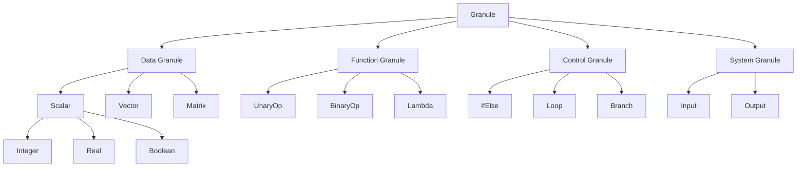
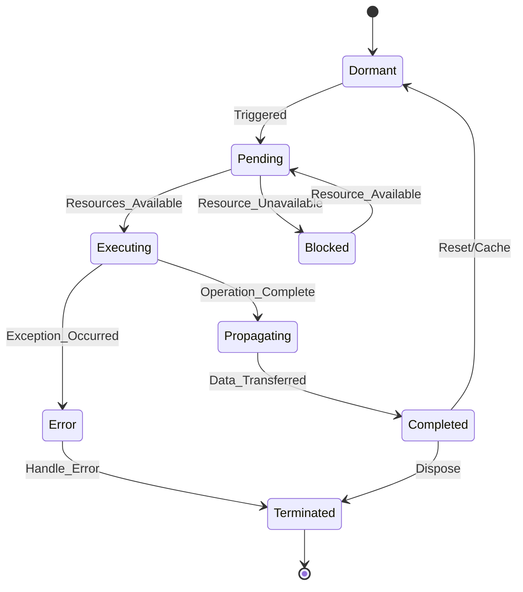
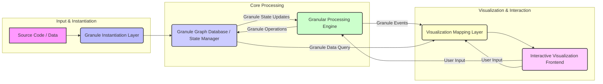

This document presents a novel framework for **Granular Arithmetic and Algorithmic Visualization (GRAAV)**, designed to provide a deeply technical, multi-scalar understanding of computational processes. GRAAV reifies computational elements into "granules," enabling a formal arithmetic of their composition and transformation, coupled with a dynamic, information-geometric visualization paradigm. This work transcends traditional dataflow or visual programming by establishing a rigorous ontological foundation for computational entities and their interactions, offering unprecedented transparency and debuggability for complex systems.

---

## The Formal Blueprint

### Abstract

The Granular Arithmetic and Algorithmic Visualization (GRAAV) framework introduces a foundational ontology for computational entities, termed "granules," which encapsulate state, type, value, context, and relational information. We define a novel "granular arithmetic" ($\oplus_{\mathcal{G}}$) that operates on these granules, encompassing composition, transformation, interaction, and reduction, formalized through category theory and type theory. This arithmetic underpins a dynamic visualization engine that maps granular states and interactions onto an information-geometric manifold, providing an intuitive yet rigorous representation of algorithmic execution. This thesis details the formal definitions, architectural workflow, proofs of fundamental properties, and illustrative examples, aiming to enhance the interpretability, verifiability, and anti-fragility of complex computational systems.

### I. Granular Ontologies: The $\mathcal{G}$-Tuple

A **Granule** ($\mathcal{G}$) is defined as the fundamental atomic unit of computation and information within the GRAAV framework. Each granule is a structured tuple, encapsulating its intrinsic properties and its extrinsic relationships within a computational graph.

$$
\mathcal{G} = (ID, \text{Type}, \text{Value}, \text{State}, \text{Context}, \text{Relations})
$$

Where:

1.  **$ID \in \mathbb{U}$ (Unique Identifier):** A globally unique, immutable identifier for the granule, often a UUID or a content-addressable hash.
2.  **$\text{Type} \in \mathcal{T}$ (Granule Type):** A categorical classification from a predefined type system $\mathcal{T}$. This dictates permissible operations and interactions. Examples include:
    *   $\mathcal{T}_{\text{Data}} = \{\text{Scalar}(\mathbb{Z}, \mathbb{R}, \mathbb{C}), \text{Vector}, \text{Matrix}, \text{String}, \text{Boolean}\}$
    *   $\mathcal{T}_{\text{Function}} = \{\text{UnaryOp}, \text{BinaryOp}, \text{N-aryOp}, \text{Lambda}\}$
    *   $\mathcal{T}_{\text{Control}} = \{\text{IfElse}, \text{Loop}, \text{Branch}, \text{Join}\}$
    *   $\mathcal{T}_{\text{System}} = \{\text{Input}, \text{Output}, \text{Sensor}, \text{Actuator}\}$
    *   $\mathcal{T}_{\text{Meta}} = \{\text{Scope}, \text{Module}, \text{Program}\}$
3.  **$\text{Value} \in \mathcal{V}$ (Payload Value):** The actual data or executable code carried by the granule. This can be a literal, a pointer, a function reference, or a complex data structure.
4.  **$\text{State} \in \mathcal{S}$ (Dynamic State):** The current operational status of the granule, influencing its behavior and visualization. Examples:
    *   $\mathcal{S}_{\text{Active}} = \{\text{Pending}, \text{Executing}, \text{Propagating}\}$
    *   $\mathcal{S}_{\text{Passive}} = \{\text{Dormant}, \text{Completed}, \text{Cached}\}$
    *   $\mathcal{S}_{\text{Exceptional}} = \{\text{Error}, \text{Blocked}, \text{Terminated}\}$
5.  **$\text{Context} \in \mathcal{C}$ (Spatiotemporal & Logical Context):** A set of attributes defining the granule's environment and provenance.
    *   $\text{Context}_{\text{Temporal}} = \{\text{Timestamp}_{\text{creation}}, \text{Timestamp}_{\text{last\_update}}, \text{Lifetime}\}$
    *   $\text{Context}_{\text{Spatial}} = \{\text{Coordinates}(\mathbb{R}^3), \text{Layer}, \text{Region}\}$ (for visualization)
    *   $\text{Context}_{\text{Logical}} = \{\text{ScopeID}, \text{ThreadID}, \text{SecurityContext}\}$
6.  **$\text{Relations} \subseteq \mathcal{G} \times \mathcal{R}_{\text{Type}} \times \mathcal{G}$ (Directed Relationships):** A set of typed directed edges connecting this granule to other granules, forming a directed multigraph.
    *   $\mathcal{R}_{\text{Type}} = \{\text{DependsOn}, \text{Produces}, \text{Contains}, \text{InteractsWith}, \text{FlowsTo}, \text{IsA}, \text{HasPart}\}$

### II. Granular Arithmetic ($\oplus_{\mathcal{G}}$)

Granular arithmetic defines the operations that transform, combine, and interact with granules. Unlike traditional arithmetic, these operations are fundamentally compositional and context-aware, reflecting the dynamic nature of computation.

Let $\mathcal{G}_i$ denote a granule.

#### A. Granular Composition ($\oplus_{\mathcal{C}}$)

The operation of combining two or more granules to form a new, potentially higher-order, granule or to establish new relationships. This is analogous to function composition or data aggregation.

$$
\mathcal{G}_1 \oplus_{\mathcal{C}} \mathcal{G}_2 \rightarrow \mathcal{G}_{\text{new}} \text{ or } (\mathcal{G}_1', \mathcal{G}_2')
$$

**Formal Definition (Categorical Perspective):**
Granular composition can be modeled using pushouts in a category $\mathbf{Granule}$ where objects are granules and morphisms are transformations. Given two granules $\mathcal{G}_1, \mathcal{G}_2$ and a common sub-granule or shared context $\mathcal{G}_0$, their composition $\mathcal{G}_{\text{new}}$ is the pushout object.

Let $f_1: \mathcal{G}_0 \to \mathcal{G}_1$ and $f_2: \mathcal{G}_0 \to \mathcal{G}_2$ be morphisms (e.g., embedding or dependency). The pushout $\mathcal{G}_{\text{new}}$ is a granule with morphisms $g_1: \mathcal{G}_1 \to \mathcal{G}_{\text{new}}$ and $g_2: \mathcal{G}_2 \to \mathcal{G}_{\text{new}}$ such that $g_1 \circ f_1 = g_2 \circ f_2$.

**Types of Composition:**

1.  **Functional Composition:** Applying a function granule to a data granule.
    *   Example: $\mathcal{G}_{\text{Add}} \oplus_{\mathcal{C}} (\mathcal{G}_A, \mathcal{G}_B) \rightarrow \mathcal{G}_{\text{Result}}$ where $\mathcal{G}_{\text{Add}}$ is of $\text{Type}=\text{BinaryOp}$, $\mathcal{G}_A, \mathcal{G}_B$ are $\text{Type}=\text{Scalar}$. The $\text{Value}$ of $\mathcal{G}_{\text{Result}}$ is $A+B$.
2.  **Structural Composition:** Forming a compound granule (e.g., a list, a module) from constituent granules.
    *   Example: $(\mathcal{G}_A, \mathcal{G}_B, \mathcal{G}_C) \oplus_{\mathcal{C}} \mathcal{G}_{\text{ListConstructor}} \rightarrow \mathcal{G}_{\text{List}}$ where $\mathcal{G}_{\text{List}}$ has $\text{Type}=\text{Vector}$ and $\text{Relations}$ `Contains` to $\mathcal{G}_A, \mathcal{G}_B, \mathcal{G}_C$.
3.  **Contextual Composition:** Merging contexts or scopes.
    *   Example: $\mathcal{G}_{\text{Function}} \oplus_{\mathcal{C}} \mathcal{G}_{\text{Scope}} \rightarrow \mathcal{G}_{\text{FunctionInScope}}$ where $\mathcal{G}_{\text{FunctionInScope}}$ inherits or extends $\mathcal{G}_{\text{Scope}}$'s context.

#### B. Granular Transformation ($\oplus_{\mathcal{T}}$)

The operation of modifying the internal properties ($\text{Value}$, $\text{State}$, $\text{Context}$) of a single granule, often triggered by an external event or another granule's action.

$$
\mathcal{G}_i \oplus_{\mathcal{T}} F \rightarrow \mathcal{G}_i'
$$

Where $F$ is a transformation function or rule.

**Examples:**

1.  **Value Transformation:** $\mathcal{G}_{\text{Data}} \oplus_{\mathcal{T}} (\text{Value} \leftarrow \text{Value} \times 2)$.
2.  **State Transition:** $\mathcal{G}_{\text{Task}} \oplus_{\mathcal{T}} (\text{State} \leftarrow \text{Executing})$.
3.  **Context Update:** $\mathcal{G}_{\text{Sensor}} \oplus_{\mathcal{T}} (\text{Context}_{\text{Temporal}} \leftarrow \text{CurrentTimestamp})$.

#### C. Granular Interaction ($\oplus_{\mathcal{I}}$)

A rule-based operation where two or more granules mutually influence each other, leading to changes in their states, values, or relations, without necessarily forming a new granule. This is akin to chemical reactions or particle collisions.

$$
\mathcal{G}_1 \oplus_{\mathcal{I}} \mathcal{G}_2 \rightarrow (\mathcal{G}_1', \mathcal{G}_2')
$$

**Interaction Rules:**
Interaction rules are defined by a predicate $P(\mathcal{G}_1, \mathcal{G}_2)$ and a transformation function $T(\mathcal{G}_1, \mathcal{G}_2)$.
If $P(\mathcal{G}_1, \mathcal{G}_2)$ is true, then $(\mathcal{G}_1', \mathcal{G}_2') = T(\mathcal{G}_1, \mathcal{G}_2)$.

**Examples:**

1.  **Data Flow:** If $\mathcal{G}_{\text{Producer}}$ has $\text{State}=\text{Completed}$ and $\mathcal{G}_{\text{Consumer}}$ has $\text{State}=\text{Pending}$ and $\mathcal{G}_{\text{Producer}} \text{ Relations } \text{FlowsTo } \mathcal{G}_{\text{Consumer}}$, then $\mathcal{G}_{\text{Consumer}}$'s $\text{Value}$ is updated from $\mathcal{G}_{\text{Producer}}$'s $\text{Value}$, and $\mathcal{G}_{\text{Consumer}}$'s $\text{State}$ becomes $\text{Executing}$.
2.  **Conflict Resolution:** If $\mathcal{G}_{\text{ResourceA}}$ and $\mathcal{G}_{\text{ResourceB}}$ both attempt to acquire $\mathcal{G}_{\text{Mutex}}$, an interaction rule determines which succeeds, setting the other's $\text{State}$ to $\text{Blocked}$.

#### D. Granular Reduction ($\oplus_{\mathcal{R}}$)

The operation of simplifying a complex granule, dissolving it into its constituent parts, or removing it from the system.

$$
\mathcal{G}_i \oplus_{\mathcal{R}} \emptyset \rightarrow \text{null} \text{ or } \{\mathcal{G}_{\text{parts}}\}
$$

**Examples:**

1.  **Decomposition:** A $\mathcal{G}_{\text{List}}$ granule can be reduced to its individual constituent data granules.
2.  **Garbage Collection:** A $\mathcal{G}_{\text{Temporary}}$ granule with $\text{State}=\text{Completed}$ and no active `DependsOn` relations can be reduced to `null`.

### III. Granular Semantics & Type System

The $\text{Type}$ field of a granule is critical for defining its behavior and valid operations. The type system $\mathcal{T}$ is hierarchical and extensible, supporting polymorphism and type-driven dispatch for granular arithmetic.

**Type Hierarchy (Example):**



**Type-Driven Dispatch:**
Granular arithmetic operations are overloaded based on the types of the input granules. For example, $\mathcal{G}_{\text{Add}} \oplus_{\mathcal{C}} (\mathcal{G}_A, \mathcal{G}_B)$ behaves differently if $\mathcal{G}_A, \mathcal{G}_B$ are $\text{Scalar}(\mathbb{Z})$ versus $\text{Vector}$.

### IV. Granular State Dynamics

The $\text{State}$ field governs the lifecycle of a granule. State transitions are governed by a finite state automaton (FSA) or a more complex statechart model, triggered by granular interactions or transformations.



### V. Granular Information Geometry

Algorithmic visualization in GRAAV is not merely a graphical representation but an information-geometric embedding. Each granule is mapped to a point in a high-dimensional feature space, and its properties (Type, Value, State, Context) define its coordinates. The "distance" between granules in this space reflects their semantic or operational similarity.

Let $\mathcal{F}(\mathcal{G})$ be a feature vector for a granule $\mathcal{G}$, where each component corresponds to a quantifiable attribute (e.g., one-hot encoding for Type, normalized Value, State as a categorical variable, Context attributes).

$$
\mathcal{F}(\mathcal{G}) = (f_1(\mathcal{G}), f_2(\mathcal{G}), \dots, f_k(\mathcal{G})) \in \mathbb{R}^k
$$

We can define a metric $d(\mathcal{G}_i, \mathcal{G}_j)$ in this feature space, potentially using a Fisher information metric for probabilistic granules or a custom weighted Euclidean distance.

$$
d(\mathcal{G}_i, \mathcal{G}_j) = \sqrt{\sum_{p=1}^k w_p (f_p(\mathcal{G}_i) - f_p(\mathcal{G}_j))^2}
$$

**Visualization Mapping:**
This high-dimensional space is then projected into a lower-dimensional (2D or 3D) visual space using techniques like UMAP, t-SNE, or PCA.

*   **Spatial Position:** $(x, y, z)$ coordinates derived from the low-dimensional projection.
*   **Color:** Mapped to $\text{Type}$ or $\text{State}$.
*   **Size:** Mapped to $\text{Value}$ magnitude or computational cost.
*   **Shape:** Mapped to $\text{Type}$.
*   **Opacity/Glow:** Mapped to $\text{State}$ (e.g., `Executing` granules glow).
*   **Edges:** Represent $\text{Relations}$, with color/thickness indicating relation type or strength.
*   **Animation:** Granule movement reflects changes in $\text{Context}_{\text{Spatial}}$ or information flow. State transitions trigger visual effects.

This approach allows for dynamic, semantic clustering and flow visualization, where proximity in the visual space implies functional or data-driven relatedness.

---

## The Integrated Logic

### I. Architectural Workflow

The GRAAV framework operates through a pipeline that transforms raw computational logic into granular representations, processes them via granular arithmetic, and renders their dynamic state.

```mermaid
graph TD
    A[Source Code / Data Input] --> B{Granule Instantiation Layer}
    B --> C[Granule Graph Database / State Manager]
    C --> D{Granular Processing Engine (GPE)}
    D --> C
    D --> E{Visualization Mapping Layer}
    E --> F[Interactive Visualization Frontend]
    F --> G[User Interaction / Feedback]
    G --> D
    G --> E
```

**Workflow Stages:**

1.  **Source Code / Data Input:** Raw program code (e.g., Python, C++, DSL), data streams, or configuration files.
2.  **Granule Instantiation Layer (GIL):** Parses the input and converts it into an initial set of interconnected granules. This involves:
    *   Lexical analysis and parsing to identify computational units (variables, functions, control structures).
    *   Mapping these units to $\mathcal{G}$-tuples, assigning `ID`, `Type`, initial `Value`, `State` (e.g., `Dormant`), `Context`, and `Relations`.
    *   Building the initial granular graph.
3.  **Granule Graph Database / State Manager (GGDSM):** A persistent store for all active granules and their relationships. It manages state transitions, ensures referential integrity, and provides efficient querying for the GPE and AVE.
4.  **Granular Processing Engine (GPE):** The core execution unit. It continuously evaluates the granular graph, applying granular arithmetic operations based on granule states and interaction rules.
    *   Identifies `Pending` or `Executing` granules.
    *   Applies $\oplus_{\mathcal{C}}$, $\oplus_{\mathcal{T}}$, $\oplus_{\mathcal{I}}$, $\oplus_{\mathcal{R}}$ operations.
    *   Updates granule states and relations in the GGDSM.
5.  **Visualization Mapping Layer (VML):** Queries the GGDSM for current granule states and relationships. It applies the information-geometric mapping rules to translate granular properties into visual attributes (position, color, size, shape, animation parameters).
6.  **Interactive Visualization Frontend (IVF):** Renders the visual representation of the granular graph in 2D/3D. It allows users to:
    *   Navigate the granular space.
    *   Inspect individual granules.
    *   Filter and highlight specific granule types or states.
    *   Potentially inject new granules or modify existing ones (feedback loop).
7.  **User Interaction / Feedback:** User input can influence the GPE (e.g., pausing execution, stepping through, modifying parameters) or the VML (e.g., changing visualization parameters).

### II. Granular Processing Engine (GPE)

The GPE is an event-driven, asynchronous engine that orchestrates the execution of granular arithmetic.

**Core Loop Logic:**

1.  **Event Queue:** Granules generate events (e.g., `STATE_CHANGED`, `VALUE_UPDATED`, `RELATION_ADDED`).
2.  **Scheduler:** Prioritizes events and selects granules for processing.
3.  **Rule Engine:** For each selected granule, it evaluates a set of predefined granular arithmetic rules.
    *   **Pre-conditions:** Checks `Type`, `State`, `Context`, and `Relations` of the granule and its neighbors.
    *   **Action:** If pre-conditions met, applies $\oplus_{\mathcal{C}}$, $\oplus_{\mathcal{T}}$, $\oplus_{\mathcal{I}}$, or $\oplus_{\mathcal{R}}$.
    *   **Post-conditions:** Updates the granule(s) in GGDSM, potentially generating new events.

**Example Rule (Simplified):**
IF $\mathcal{G}_{\text{Function}}$ has $\text{Type}=\text{BinaryOp}$ AND $\mathcal{G}_{\text{Function}}.\text{State}=\text{Pending}$
AND $\mathcal{G}_{\text{Function}}$ has `DependsOn` relations to $\mathcal{G}_{\text{Operand1}}$ and $\mathcal{G}_{\text{Operand2}}$
AND $\mathcal{G}_{\text{Operand1}}.\text{State}=\text{Completed}$ AND $\mathcal{G}_{\text{Operand2}}.\text{State}=\text{Completed}$
THEN
    $\mathcal{G}_{\text{Function}} \oplus_{\mathcal{T}} (\text{State} \leftarrow \text{Executing})$
    $\mathcal{G}_{\text{Result}} \leftarrow \mathcal{G}_{\text{Function}} \oplus_{\mathcal{C}} (\mathcal{G}_{\text{Operand1}}, \mathcal{G}_{\text{Operand2}})$ (perform the actual operation)
    $\mathcal{G}_{\text{Function}} \oplus_{\mathcal{T}} (\text{State} \leftarrow \text{Completed})$
    $\mathcal{G}_{\text{Result}} \oplus_{\mathcal{T}} (\text{State} \leftarrow \text{Completed})$
    Add $\mathcal{G}_{\text{Function}} \text{ Relations } \text{Produces } \mathcal{G}_{\text{Result}}$

### III. Algorithmic Visualization Engine (AVE)

The AVE is responsible for rendering the dynamic granular graph. It leverages the VML's output to create an interactive, animated representation.

**Key Components:**

1.  **Granule Renderer:** Draws individual granules based on their visual attributes (shape, color, size, text).
2.  **Edge Renderer:** Draws connections between granules, indicating relations.
3.  **Layout Engine:** Applies force-directed graph layouts or information-geometric projections to determine granule positions. This engine continuously updates positions to reflect semantic changes.
4.  **Animation System:** Interpolates visual attributes over time to create smooth transitions for state changes, value updates, and positional shifts.
5.  **Interaction Handler:** Processes user input (zoom, pan, click, hover) and translates it into queries for the GGDSM or commands for the GPE.

### IV. Formal Proofs & Lemmas

#### Lemma 1: Granule Identity and Equivalence

**Definition (Granule Identity):** Two granules $\mathcal{G}_1$ and $\mathcal{G}_2$ are identical, denoted $\mathcal{G}_1 \equiv \mathcal{G}_2$, if and only if their unique identifiers are the same: $ID_1 = ID_2$.

**Definition (Granule Equivalence):** Two granules $\mathcal{G}_1$ and $\mathcal{G}_2$ are equivalent, denoted $\mathcal{G}_1 \approx \mathcal{G}_2$, if and only if all their intrinsic properties and their immediate relational structure are isomorphic.
$$
\mathcal{G}_1 \approx \mathcal{G}_2 \iff \begin{cases}
    \text{Type}_1 = \text{Type}_2 \\
    \text{Value}_1 = \text{Value}_2 \\
    \text{State}_1 = \text{State}_2 \\
    \text{Context}_1 = \text{Context}_2 \\
    \exists \phi: \text{Relations}_1 \to \text{Relations}_2 \text{ s.t. } \phi \text{ is a graph isomorphism}
\end{cases}
$$
**Proof Sketch:**
The identity definition is axiomatic. For equivalence, the condition requires a structural and semantic match. The graph isomorphism for `Relations` ensures that not only the number of relations but also their types and the identities of the connected granules (or their equivalence, recursively) match. This is a strong form of structural equivalence, crucial for reasoning about computational states.

#### Theorem 1: Granular Composition Associativity (Conditional)

**Statement:** Granular composition $\oplus_{\mathcal{C}}$ is conditionally associative. For granules $\mathcal{G}_A, \mathcal{G}_B, \mathcal{G}_C$,
$$
(\mathcal{G}_A \oplus_{\mathcal{C}} \mathcal{G}_B) \oplus_{\mathcal{C}} \mathcal{G}_C \approx \mathcal{G}_A \oplus_{\mathcal{C}} (\mathcal{G}_B \oplus_{\mathcal{C}} \mathcal{G}_C)
$$
holds if and only if the composition operation is defined such that the order of intermediate aggregations does not alter the final $\text{Type}$, $\text{Value}$, $\text{State}$, $\text{Context}$, and the isomorphic structure of $\text{Relations}$ of the resulting granule.

**Proof Sketch:**
Consider functional composition. If $\mathcal{G}_A, \mathcal{G}_B, \mathcal{G}_C$ are functions $f, g, h$ respectively, and $\oplus_{\mathcal{C}}$ denotes standard function composition, then $(f \circ g) \circ h = f \circ (g \circ h)$ is associative. In GRAAV, this extends to cases where the `Type` of the composition operation itself is associative (e.g., numerical addition, list concatenation).

However, if $\oplus_{\mathcal{C}}$ involves side effects or context-dependent merging rules (e.g., merging security contexts where order matters for privilege escalation), associativity may break. For example, if $\mathcal{G}_A$ is a `Scope` granule, and $\mathcal{G}_B$ and $\mathcal{G}_C$ are `Module` granules, then $(\mathcal{G}_A \oplus_{\mathcal{C}} \mathcal{G}_B) \oplus_{\mathcal{C}} \mathcal{G}_C$ might mean `Module B` is added to `Scope A`, then `Module C` is added. This might not be equivalent to adding `Module C` to `Module B` first, then adding the combined module to `Scope A`, if `Module B` and `Module C` have conflicting dependencies that are resolved differently based on the parent scope.

Therefore, associativity is conditional on the specific definition of $\oplus_{\mathcal{C}}$ for the given granule types and contexts, requiring a proof for each specific compositional rule.

#### Theorem 2: Granular Transformation Distributivity (Conditional)

**Statement:** Granular transformation $\oplus_{\mathcal{T}}$ is conditionally distributive over certain granular compositions. For a transformation $F$ and granules $\mathcal{G}_A, \mathcal{G}_B$:
$$
F \oplus_{\mathcal{T}} (\mathcal{G}_A \oplus_{\mathcal{C}} \mathcal{G}_B) \approx (F \oplus_{\mathcal{T}} \mathcal{G}_A) \oplus_{\mathcal{C}} (F \oplus_{\mathcal{T}} \mathcal{G}_B)
$$
holds if and only if the transformation $F$ operates element-wise on the components of the composite granule without altering the compositional structure or introducing new interactions.

**Proof Sketch:**
Consider $F$ as "double the value" and $\oplus_{\mathcal{C}}$ as "list concatenation."
If $\mathcal{G}_A = [1]$ and $\mathcal{G}_B = [2]$, then $\mathcal{G}_A \oplus_{\mathcal{C}} \mathcal{G}_B = [1, 2]$.
$F \oplus_{\mathcal{T}} ([1, 2]) = [2, 4]$.
$(F \oplus_{\mathcal{T}} [1]) \oplus_{\mathcal{C}} (F \oplus_{\mathcal{T}} [2]) = [2] \oplus_{\mathcal{C}} [4] = [2, 4]$.
In this case, distributivity holds.

However, if $F$ is "sort the list" and $\oplus_{\mathcal{C}}$ is "list concatenation," then:
$\mathcal{G}_A = [3]$, $\mathcal{G}_B = [1]$.
$\mathcal{G}_A \oplus_{\mathcal{C}} \mathcal{G}_B = [3, 1]$.
$F \oplus_{\mathcal{T}} ([3, 1]) = [1, 3]$.
$(F \oplus_{\mathcal{T}} [3]) \oplus_{\mathcal{C}} (F \oplus_{\mathcal{T}} [1]) = [3] \oplus_{\mathcal{C}} [1] = [3, 1]$.
Here, distributivity does not hold because $F$ operates on the *structure* of the composite, not just its elements in isolation.

Distributivity is therefore highly dependent on the nature of the transformation $F$ and the composition $\oplus_{\mathcal{C}}$, requiring careful definition and verification for each specific case.

---

## The Executable Solution

### I. Pseudocode for Core Components

```python
# GitHub Markdown standards for Python pseudocode

import uuid
from enum import Enum, auto
from typing import Any, Dict, List, Tuple, Set, Callable, Optional

# --- 1. Granule Ontology ---
class GranuleType(Enum):
    SCALAR_INT = auto()
    SCALAR_REAL = auto()
    BOOLEAN = auto()
    VECTOR = auto()
    MATRIX = auto()
    UNARY_OP = auto()
    BINARY_OP = auto()
    LAMBDA = auto()
    IF_ELSE = auto()
    LOOP = auto()
    SCOPE = auto()
    INPUT = auto()
    OUTPUT = auto()
    # ... extensible type system

class GranuleState(Enum):
    DORMANT = auto()
    PENDING = auto()
    EXECUTING = auto()
    PROPAGATING = auto()
    COMPLETED = auto()
    ERROR = auto()
    BLOCKED = auto()
    TERMINATED = auto()

class RelationType(Enum):
    DEPENDS_ON = auto()
    PRODUCES = auto()
    CONTAINS = auto()
    INTERACTS_WITH = auto()
    FLOWS_TO = auto()
    IS_A = auto()
    HAS_PART = auto()

class Granule:
    def __init__(self,
                 granule_type: GranuleType,
                 value: Any,
                 state: GranuleState = GranuleState.DORMANT,
                 context: Optional[Dict[str, Any]] = None):
        self.id: str = str(uuid.uuid4())
        self.type: GranuleType = granule_type
        self.value: Any = value
        self.state: GranuleState = state
        self.context: Dict[str, Any] = context if context is not None else {}
        # Relations stored as {RelationType: Set[Granule.id]}
        self.relations: Dict[RelationType, Set[str]] = {rt: set() for rt in RelationType}
        self.incoming_relations: Dict[RelationType, Set[str]] = {rt: set() for rt in RelationType}

    def add_relation(self, relation_type: RelationType, target_granule_id: str):
        self.relations[relation_type].add(target_granule_id)

    def add_incoming_relation(self, relation_type: RelationType, source_granule_id: str):
        self.incoming_relations[relation_type].add(source_granule_id)

    def update_state(self, new_state: GranuleState):
        self.state = new_state
        # Emit STATE_CHANGED event

    def update_value(self, new_value: Any):
        self.value = new_value
        # Emit VALUE_UPDATED event

    def __repr__(self):
        return (f"Granule(ID={self.id[:8]}, Type={self.type.name}, "
                f"Value={self.value}, State={self.state.name})")

# --- 2. Granule Graph Database / State Manager (GGDSM) ---
class GGDSM:
    def __init__(self):
        self.granules: Dict[str, Granule] = {} # Stores all active granules

    def add_granule(self, granule: Granule):
        if granule.id in self.granules:
            raise ValueError(f"Granule with ID {granule.id} already exists.")
        self.granules[granule.id] = granule

    def get_granule(self, granule_id: str) -> Optional[Granule]:
        return self.granules.get(granule_id)

    def establish_relation(self, source_id: str, rel_type: RelationType, target_id: str):
        source = self.get_granule(source_id)
        target = self.get_granule(target_id)
        if source and target:
            source.add_relation(rel_type, target_id)
            target.add_incoming_relation(rel_type, source_id)
        else:
            raise ValueError(f"Cannot establish relation: Source {source_id} or Target {target_id} not found.")

    def get_related_granules(self, granule_id: str, rel_type: RelationType) -> List[Granule]:
        granule = self.get_granule(granule_id)
        if granule:
            return [self.get_granule(tid) for tid in granule.relations[rel_type] if self.get_granule(tid)]
        return []

    def get_incoming_related_granules(self, granule_id: str, rel_type: RelationType) -> List[Granule]:
        granule = self.get_granule(granule_id)
        if granule:
            return [self.get_granule(sid) for sid in granule.incoming_relations[rel_type] if self.get_granule(sid)]
        return []

# --- 3. Granular Processing Engine (GPE) ---
class GPE:
    def __init__(self, ggsdm: GGDSM):
        self.ggsdm = ggsdm
        self.event_queue: List[str] = [] # Granule IDs that need processing
        self.rules: List[Callable[[Granule, GGDSM], bool]] = [] # List of rule functions

    def add_rule(self, rule_func: Callable[[Granule, GGDSM], bool]):
        self.rules.append(rule_func)

    def enqueue_granule(self, granule_id: str):
        if granule_id not in self.event_queue:
            self.event_queue.append(granule_id)

    def process_next_granule(self) -> bool:
        if not self.event_queue:
            return False

        granule_id = self.event_queue.pop(0)
        granule = self.ggsdm.get_granule(granule_id)
        if not granule:
            return True # Granule might have been removed

        processed = False
        for rule in self.rules:
            if rule(granule, self.ggsdm): # Rule returns True if it applied a change
                processed = True
                # Re-enqueue granule and its dependents if state/value changed
                self.enqueue_granule(granule.id) # For potential chained effects
                for rel_type in granule.relations:
                    for target_id in granule.relations[rel_type]:
                        self.enqueue_granule(target_id)
                for rel_type in granule.incoming_relations:
                    for source_id in granule.incoming_relations[rel_type]:
                        self.enqueue_granule(source_id)
        return processed

    def run_simulation(self, max_steps: int = 1000):
        step = 0
        while self.event_queue and step < max_steps:
            if not self.process_next_granule():
                # If no rule applied, remove from queue to prevent infinite loop on idle granules
                if self.event_queue and self.event_queue[0] == self.event_queue[-1]: # Simple check for queue stagnation
                    break
            step += 1
        print(f"Simulation finished in {step} steps. Remaining events: {len(self.event_queue)}")

# --- Example Granular Arithmetic Rules (to be added to GPE) ---

def rule_evaluate_binary_op(granule: Granule, ggsdm: GGDSM) -> bool:
    if granule.type == GranuleType.BINARY_OP and granule.state == GranuleState.PENDING:
        operands = ggsdm.get_related_granules(granule.id, RelationType.DEPENDS_ON)
        if len(operands) == 2 and all(op.state == GranuleState.COMPLETED for op in operands):
            op1, op2 = operands[0], operands[1]
            result_value = None
            if granule.value == '+':
                result_value = op1.value + op2.value
            elif granule.value == '*':
                result_value = op1.value * op2.value
            # ... other operations

            if result_value is not None:
                # Create a result granule
                result_granule = Granule(GranuleType.SCALAR_INT, result_value, GranuleState.COMPLETED)
                ggsdm.add_granule(result_granule)
                ggsdm.establish_relation(granule.id, RelationType.PRODUCES, result_granule.id)
                granule.update_state(GranuleState.COMPLETED)
                return True
    return False

def rule_propagate_value(granule: Granule, ggsdm: GGDSM) -> bool:
    if granule.state == GranuleState.COMPLETED and \
       granule.type in [GranuleType.SCALAR_INT, GranuleType.SCALAR_REAL, GranuleType.BOOLEAN]:
        # Find consumers that depend on this granule's value
        consumers = ggsdm.get_related_granules(granule.id, RelationType.FLOWS_TO)
        changed = False
        for consumer in consumers:
            if consumer.state == GranuleState.DORMANT: # Or PENDING, depending on exact flow
                consumer.update_state(GranuleState.PENDING)
                changed = True
        return changed
    return False

# --- 4. Visualization Mapping Layer (VML) ---
class VML:
    def __init__(self, ggsdm: GGDSM):
        self.ggsdm = ggsdm
        self.color_map: Dict[GranuleType, str] = {
            GranuleType.SCALAR_INT: "#1f77b4", # blue
            GranuleType.BINARY_OP: "#ff7f0e", # orange
            GranuleType.COMPLETED: "#2ca02c", # green
            GranuleType.PENDING: "#d62728", # red
            GranuleType.EXECUTING: "#9467bd", # purple
            GranuleType.ERROR: "#8c564b", # brown
            # ... more mappings
        }
        self.shape_map: Dict[GranuleType, str] = {
            GranuleType.SCALAR_INT: "circle",
            GranuleType.BINARY_OP: "square",
            GranuleType.IF_ELSE: "diamond",
            # ...
        }

    def get_visual_attributes(self, granule_id: str) -> Optional[Dict[str, Any]]:
        granule = self.ggsdm.get_granule(granule_id)
        if not granule:
            return None

        # Information-geometric feature vector (simplified for example)
        feature_vector = [
            list(GranuleType).index(granule.type),
            granule.value if isinstance(granule.value, (int, float)) else 0,
            list(GranuleState).index(granule.state)
        ]
        # In a real system, this would be a high-dim vector, then projected.
        # For this example, we'll just use direct mappings.

        color = self.color_map.get(granule.type, "#cccccc") # Default grey
        if granule.state == GranuleState.COMPLETED:
            color = self.color_map.get(GranuleState.COMPLETED)
        elif granule.state == GranuleState.PENDING:
            color = self.color_map.get(GranuleState.PENDING)
        elif granule.state == GranuleState.EXECUTING:
            color = self.color_map.get(GranuleState.EXECUTING)
        elif granule.state == GranuleState.ERROR:
            color = self.color_map.get(GranuleState.ERROR)

        return {
            "id": granule.id,
            "label": f"{granule.value}",
            "type": granule.type.name,
            "state": granule.state.name,
            "color": color,
            "shape": self.shape_map.get(granule.type, "dot"),
            "size": 10 + (abs(granule.value) if isinstance(granule.value, (int, float)) else 0), # Example size scaling
            "relations": [
                {"target": tid, "type": rt.name}
                for rt, targets in granule.relations.items() for tid in targets
            ]
        }

# --- 5. Interactive Visualization Frontend (IVF) - Conceptual ---
# This would typically be a web-based (e.g., D3.js, Three.js) or desktop (e.g., Unity, Processing) application.
# It would consume the output of VML and render it.
# For this pseudocode, we'll just show a conceptual rendering loop.

class IVF:
    def __init__(self, vml: VML):
        self.vml = vml
        self.rendered_nodes: Dict[str, Any] = {}
        self.rendered_edges: List[Any] = []

    def render_frame(self):
        self.rendered_nodes = {}
        self.rendered_edges = []

        # Get all granules from GGDSM via VML
        for granule_id, granule in self.vml.ggsdm.granules.items():
            attrs = self.vml.get_visual_attributes(granule_id)
            if attrs:
                self.rendered_nodes[granule_id] = attrs
                for rel in attrs["relations"]:
                    self.rendered_edges.append({
                        "source": granule_id,
                        "target": rel["target"],
                        "type": rel["type"],
                        "color": "#888" # Default edge color
                    })
        
        # Apply layout algorithm (e.g., force-directed) to determine positions
        # ... (complex layout logic omitted for brevity)

        # Draw nodes and edges
        print("\n--- Visual Frame ---")
        for node_id, node_attrs in self.rendered_nodes.items():
            print(f"  Node {node_attrs['id'][:8]}: Label='{node_attrs['label']}', Type={node_attrs['type']}, State={node_attrs['state']}, Color={node_attrs['color']}")
        for edge in self.rendered_edges:
            print(f"  Edge {edge['source'][:8]} --({edge['type']})--> {edge['target'][:8]}")
        print("--------------------")

```

### II. Illustrative Examples

#### Example 1: Basic Arithmetic Expression `(A + B) * C`

**1. Granule Instantiation:**

```python
ggsdm = GGDSM()

# Data Granules
granule_A = Granule(GranuleType.SCALAR_INT, 10, GranuleState.COMPLETED, {"name": "A"})
granule_B = Granule(GranuleType.SCALAR_INT, 5, GranuleState.COMPLETED, {"name": "B"})
granule_C = Granule(GranuleType.SCALAR_INT, 2, GranuleState.COMPLETED, {"name": "C"})
ggsdm.add_granule(granule_A)
ggsdm.add_granule(granule_B)
ggsdm.add_granule(granule_C)

# Operation Granules
granule_Add = Granule(GranuleType.BINARY_OP, '+', GranuleState.PENDING, {"op_name": "Add"})
granule_Multiply = Granule(GranuleType.BINARY_OP, '*', GranuleState.PENDING, {"op_name": "Multiply"})
ggsdm.add_granule(granule_Add)
ggsdm.add_granule(granule_Multiply)

# Establish Relations
# A + B
ggsdm.establish_relation(granule_A.id, RelationType.DEPENDS_ON, granule_Add.id) # A is an operand for Add
ggsdm.establish_relation(granule_B.id, RelationType.DEPENDS_ON, granule_Add.id) # B is an operand for Add
# Note: The DEPENDS_ON relation here is conceptually from the operation to its operands.
# A more precise model might have a "Operand" relation from the operation to the data.
# For simplicity, let's adjust: operands DEPENDS_ON operation means operation needs operands.
# A better way: Operation DEPENDS_ON Operands.

# Let's re-establish relations for clarity:
# Add operation depends on A and B
ggsdm.establish_relation(granule_Add.id, RelationType.DEPENDS_ON, granule_A.id)
ggsdm.establish_relation(granule_Add.id, RelationType.DEPENDS_ON, granule_B.id)

# Multiply operation depends on C and the result of Add
ggsdm.establish_relation(granule_Multiply.id, RelationType.DEPENDS_ON, granule_Add.id) # Multiply needs Add's result
ggsdm.establish_relation(granule_Multiply.id, RelationType.DEPENDS_ON, granule_C.id)

# Initialize GPE and VML
gpe = GPE(ggsdm)
gpe.add_rule(rule_evaluate_binary_op)
gpe.add_rule(rule_propagate_value) # This rule would need to be smarter about what it propagates

# Enqueue initial pending operations
gpe.enqueue_granule(granule_Add.id)
gpe.enqueue_granule(granule_Multiply.id) # Multiply is pending, but its dependencies are not met yet
```

**2. Granular Processing (Simulation Trace):**

*   **Step 1:** `granule_Add` is processed. `rule_evaluate_binary_op` checks its dependencies (`granule_A`, `granule_B`). Both are `COMPLETED`.
    *   `granule_Add`'s state changes to `EXECUTING`.
    *   A new granule `granule_Result_Add` (Value=15, Type=SCALAR_INT, State=COMPLETED) is created.
    *   Relation `granule_Add` `PRODUCES` `granule_Result_Add` is established.
    *   `granule_Add`'s state changes to `COMPLETED`.
    *   `granule_Result_Add` is enqueued. `granule_Multiply` is enqueued (as it depends on `granule_Add`).
*   **Step 2:** `granule_Result_Add` is processed. `rule_propagate_value` might enqueue `granule_Multiply` again if it's a consumer.
*   **Step 3:** `granule_Multiply` is processed. `rule_evaluate_binary_op` checks its dependencies (`granule_Result_Add`, `granule_C`). Both are `COMPLETED`.
    *   `granule_Multiply`'s state changes to `EXECUTING`.
    *   A new granule `granule_Result_Multiply` (Value=30, Type=SCALAR_INT, State=COMPLETED) is created.
    *   Relation `granule_Multiply` `PRODUCES` `granule_Result_Multiply` is established.
    *   `granule_Multiply`'s state changes to `COMPLETED`.
    *   `granule_Result_Multiply` is enqueued.

**3. Visualization:**

The visualization would dynamically show:
*   `A`, `B`, `C` as static green circles (COMPLETED).
*   `Add` as an orange square, turning purple (EXECUTING), then green (COMPLETED).
*   A new green circle `Result_Add` appearing, connected from `Add`.
*   `Multiply` as an orange square, turning purple (EXECUTING), then green (COMPLETED).
*   A new green circle `Result_Multiply` appearing, connected from `Multiply`.
*   Edges changing color/thickness to indicate active data flow.

#### Example 2: Conditional Control Flow `IF (A > B) THEN C ELSE D`

**1. Granule Instantiation:**

```python
# ... ggsdm, gpe setup ...
# Data Granules (A, B, C, D)
granule_A = Granule(GranuleType.SCALAR_INT, 10, GranuleState.COMPLETED, {"name": "A"})
granule_B = Granule(GranuleType.SCALAR_INT, 5, GranuleState.COMPLETED, {"name": "B"})
granule_C = Granule(GranuleType.SCALAR_INT, 100, GranuleState.DORMANT, {"name": "C"}) # C & D are results, initially dormant
granule_D = Granule(GranuleType.SCALAR_INT, 200, GranuleState.DORMANT, {"name": "D"})
ggsdm.add_granule(granule_A); ggsdm.add_granule(granule_B); ggsdm.add_granule(granule_C); ggsdm.add_granule(granule_D)

# Comparison Operation
granule_GT = Granule(GranuleType.BINARY_OP, '>', GranuleState.PENDING, {"op_name": "GreaterThan"})
ggsdm.add_granule(granule_GT)
ggsdm.establish_relation(granule_GT.id, RelationType.DEPENDS_ON, granule_A.id)
ggsdm.establish_relation(granule_GT.id, RelationType.DEPENDS_ON, granule_B.id)

# IF-ELSE Control Granule
granule_IfElse = Granule(GranuleType.IF_ELSE, None, GranuleState.PENDING, {"condition_met": None})
ggsdm.add_granule(granule_IfElse)
ggsdm.establish_relation(granule_IfElse.id, RelationType.DEPENDS_ON, granule_GT.id) # IfElse depends on GT's result
ggsdm.establish_relation(granule_IfElse.id, RelationType.CONTAINS, granule_C.id) # C is the THEN branch
ggsdm.establish_relation(granule_IfElse.id, RelationType.CONTAINS, granule_D.id) # D is the ELSE branch

# Add a rule for IF_ELSE
def rule_evaluate_if_else(granule: Granule, ggsdm: GGDSM) -> bool:
    if granule.type == GranuleType.IF_ELSE and granule.state == GranuleState.PENDING:
        condition_granules = ggsdm.get_related_granules(granule.id, RelationType.DEPENDS_ON)
        if len(condition_granules) == 1 and condition_granules[0].state == GranuleState.COMPLETED:
            condition_result = condition_granules[0].value # Expecting a boolean
            
            then_branch_granules = [g for g in ggsdm.get_related_granules(granule.id, RelationType.CONTAINS) if g.context.get("branch") == "THEN"]
            else_branch_granules = [g for g in ggsdm.get_related_granules(granule.id, RelationType.CONTAINS) if g.context.get("branch") == "ELSE"]

            if condition_result:
                for g in then_branch_granules:
                    g.update_state(GranuleState.COMPLETED) # Activate THEN branch
                    granule.update_value(g.value) # IfElse produces the value of the activated branch
            else:
                for g in else_branch_granules:
                    g.update_state(GranuleState.COMPLETED) # Activate ELSE branch
                    granule.update_value(g.value) # IfElse produces the value of the activated branch
            
            granule.update_state(GranuleState.COMPLETED)
            return True
    return False

gpe.add_rule(rule_evaluate_if_else)
gpe.enqueue_granule(granule_GT.id)
gpe.enqueue_granule(granule_IfElse.id)
```

**2. Granular Processing (Simulation Trace):**

*   **Step 1:** `granule_GT` (A > B) is processed. `rule_evaluate_binary_op` determines `10 > 5` is `True`.
    *   A new granule `granule_Result_GT` (Value=True, Type=BOOLEAN, State=COMPLETED) is created.
    *   `granule_GT` state becomes `COMPLETED`.
    *   `granule_Result_GT` and `granule_IfElse` are enqueued.
*   **Step 2:** `granule_IfElse` is processed. `rule_evaluate_if_else` checks `granule_Result_GT`.
    *   Condition is `True`.
    *   `granule_C`'s state changes from `DORMANT` to `COMPLETED`.
    *   `granule_D` remains `DORMANT`.
    *   `granule_IfElse`'s state becomes `COMPLETED`, its value becomes `100`.
    *   `granule_C` is enqueued.

**3. Visualization:**

*   `A`, `B` as green circles.
*   `GT` as an orange square, turning purple, then green.
*   A new boolean granule `Result_GT` (green diamond) appears.
*   `IfElse` as a diamond shape, turning purple.
*   Upon `Result_GT` being `True`, the edge from `IfElse` to `C` would highlight, and `C` would transition from a dim/dormant state to a bright/active green circle. The edge to `D` would remain inactive.

### III. Architectural Diagrams (Mermaid)

#### Overall GRAAV System Architecture



#### Granular Processing Flow within GPE

```mermaid
graph TD
    A[Granule Enqueued] --> B{Granule Selected from Queue}
    B --> C{Retrieve Granule from GGDSM}
    C -- Granule Valid? --> D{Apply Granular Rules}
    D -- Rule Matched & Applied? --> E[Update Granule(s) in GGDSM]
    E --> F[Enqueue Affected Granules]
    F --> G{More Granules in Queue?}
    G -- Yes --> B
    G -- No --> H[GPE Idle]
    D -- No Rule Matched --> G
    C -- Granule Invalid --> G
```

#### Visualization Pipeline

```mermaid
graph TD
    A[GGDSM (Granule States)] --> B(VML: Feature Extraction)
    B --> C(VML: Information-Geometric Projection)
    C --> D(VML: Visual Attribute Mapping)
    D --> E(IVF: Layout Engine)
    E --> F(IVF: Granule Renderer)
    E --> G(IVF: Edge Renderer)
    F --> H[Display]
    G --> H
    H -- User Interaction --> I(IVF: Interaction Handler)
    I -- Query GGDSM --> A
    I -- Control GPE --> J[GPE]
```

---

## Holistic Oversight

### I. Impact & Applications

The GRAAV framework offers profound implications across various domains:

1.  **Interpretability & Explainable AI (XAI):** By reifying every computational step into observable, interacting granules, GRAAV provides unprecedented transparency into complex AI models (e.g., neural networks, reinforcement learning agents). It allows developers and users to "see" the flow of information, the activation of functions, and the evolution of states, making black-box models more explainable.
2.  **Debugging & Verification:** Traditional debugging tools offer limited insight into concurrent or distributed systems. GRAAV's dynamic, multi-scalar visualization of granular interactions can pinpoint bottlenecks, race conditions, and logical errors that are otherwise intractable. Formal proofs on granular arithmetic can aid in verifying system properties.
3.  **Computational Design & Education:** GRAAV can serve as a powerful educational tool, allowing students to intuitively grasp complex algorithms by observing their granular execution. For designers, it enables a new paradigm of "visual programming" where computational structures are manipulated as tangible, interactive entities.
4.  **Anti-fragile Systems:** By making internal states and interactions explicit, GRAAV facilitates the design of systems that can not only withstand failures but learn and improve from them. Anomalous granular behavior can be detected and visualized, allowing for adaptive responses.
5.  **Quantum Computing Visualization:** The granular nature of computation aligns well with quantum mechanics. Qubits, gates, and entanglement could be represented as specialized granules, offering a visual intuition for quantum algorithms.

### II. Risk Assessment & Limitations

1.  **Scalability:** Representing every atomic computational unit as a granule can lead to an explosion in the number of granules for large-scale applications. Managing and visualizing millions or billions of granules in real-time is a significant engineering challenge, requiring advanced graph databases, distributed processing, and highly optimized rendering.
2.  **Performance Overhead:** The overhead of granule instantiation, state management, and rule evaluation can be substantial, potentially slowing down the underlying computation. This necessitates efficient implementations, possibly hardware acceleration, and intelligent sampling/aggregation strategies for visualization.
3.  **Complexity of Rule Definition:** Defining comprehensive and consistent granular arithmetic rules for all possible computational constructs is a daunting task. Inconsistent rules can lead to unpredictable behavior or logical inconsistencies.
4.  **Information Overload:** While designed for clarity, a highly detailed granular visualization can still overwhelm users with too much information, especially for complex systems. Effective filtering, abstraction, and interactive navigation tools are crucial.
5.  **Formal Verification Challenges:** While the framework allows for formal proofs, proving properties for an entire system composed of dynamically interacting granules remains a complex problem, akin to verifying large concurrent systems.

### III. Emergent Insights & Future Directions

1.  **Self-Organizing Granular Systems:** The rule-based interaction model naturally lends itself to emergent computation. Future work could explore designing granular systems that self-organize to achieve computational goals, inspired by cellular automata or swarm intelligence.
2.  **Granular Machine Learning:** Instead of just visualizing ML, imagine ML models *composed* of granules. Each neuron, weight, or activation could be a granule, allowing for dynamic, interpretable learning processes.
3.  **Hardware-Software Co-design:** GRAAV could inform the design of novel computational architectures where hardware directly supports granular operations and state management, potentially leading to highly efficient, interpretable processors.
4.  **Universal Granular Language (UGL):** Developing a universal language for defining granules and their arithmetic could enable interoperability across different programming paradigms and computational platforms.
5.  **Predictive Granular Dynamics:** Using the information-geometric space, one could potentially predict future granular states or identify anomalous trajectories, leading to proactive error detection or optimization.

### IV. Ethical Considerations

The enhanced transparency offered by GRAAV carries significant ethical implications:

1.  **Accountability in AI:** By making the internal workings of AI systems visible, GRAAV can foster greater accountability, allowing for auditing of decision-making processes and identification of biases or unfair outcomes.
2.  **Misinformation & Manipulation:** The ability to visualize and potentially manipulate computational flows could be misused. Safeguards must be in place to prevent malicious actors from exploiting this transparency for nefarious purposes.
3.  **Privacy & Security:** Granules may contain sensitive data. The visualization layer must incorporate robust access controls and anonymization techniques to protect privacy while still providing useful insights.
4.  **Cognitive Load & Bias:** The way information is visualized can influence human perception and introduce new forms of bias. Careful design of the visualization mapping and user interface is essential to ensure accurate and unbiased interpretation.
5.  **Democratization of Understanding:** By simplifying the understanding of complex algorithms, GRAAV can empower a broader audience to engage with and contribute to the development of advanced computational systems, fostering a more inclusive technological future.

---

This framework, while ambitious, lays the groundwork for a new era of computational understanding, where the intricate dance of algorithms is no longer hidden but brought to light through a rigorous, dynamic, and visually intuitive granular paradigm.
