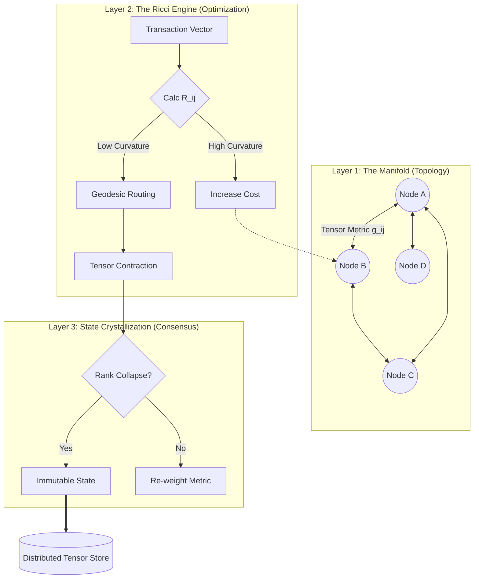

>**Entropic Manifold Descent (EMD):** *A Tensor-Entangled Consensus Framework for Autonomous Distributed Orchestration*

**Abstract:**
We present **Entropic Manifold Descent (EMD)**, a novel architectural framework for distributed systems that replaces static consensus mechanisms (e.g., PoW, PoS) with a dynamic, geometry-based optimization protocol. By modeling the network state as a Riemannian manifold, EMD utilizes Ricci flow dynamics to route information and value along geodesic paths of least resistance (highest trust/lowest latency). This framework unifies control theory, differential geometry, and cryptographic ledger technology into a single homeostatic organism.

---

## 1. The Formal Blueprint

### 1.1 Ontological Definition
We define the Distributed System $\Sigma$ not as a graph, but as a discrete differentiable manifold $\mathcal{M}$ evolving over time $t$. The objective is not merely "agreement" but **Global Action Minimization** (optimizing energy/compute per transaction).

The system is defined by the quintuple $\Sigma = (\mathcal{N}, \mathbf{g}, \Psi, \mathcal{H}, \Phi)$:

1.  **$\mathcal{N}$**: The set of Nodes (active agents).
2.  **$\mathbf{g}_{ij}$**: The Metric Tensor, representing the "distance" (latency/trust inverse) between node $i$ and $j$.
3.  **$\Psi$**: The Wavefunction of State, a tensor field representing data density.
4.  **$\mathcal{H}$**: The Hamiltonian operator defining the system's total energy (computational cost + risk).
5.  **$\Phi$**: The Consensus Operator (a topological projection).

### 1.2 The Metric Tensor & State Space
In standard graph theory, edges are binary or weighted scalars. In EMD, the connection between nodes is a rank-2 tensor $\mathbf{g}_{\mu\nu}$ that captures multidimensional friction:

$$
\mathbf{g}_{\mu\nu} = \begin{pmatrix} L_{\mu\nu} & R_{\mu\nu} \\ C_{\mu\nu} & T_{\mu\nu}^{-1} \end{pmatrix}
$$

Where:
*   $L$: Latency (Time)
*   $R$: Reliability (Packet Loss Probability)
*   $C$: Computational Cost (Gas)
*   $T$: Trust Score (reputation history)

The "distance" $ds^2$ between two states in this architecture is given by the line element:
$$
ds^2 = \mathbf{g}_{\mu\nu} dx^\mu dx^\nu
$$

### 1.3 The Objective Function: The Principle of Least Action
The system seeks to minimize the Action $\mathcal{S}$ over the trajectory of any transaction $\gamma$:

$$
\mathcal{S}[\gamma] = \int_{t_1}^{t_2} \mathcal{L}(q, \dot{q}, t) \, dt
$$

Where the Lagrangian $\mathcal{L}$ is defined as **Throughput (Kinetic Energy) minus Latency/Risk (Potential Energy)**:
$$
\mathcal{L} = \frac{1}{2} \sum \dot{x}^2 - V(x)
$$

---

## 2. The Integrated Logic

### 2.1 Geometric Flow as Consensus
Traditional blockchains suffer from bloating because they preserve a static linear history. EMD uses **Ricci Flow** to smooth out network irregularities. Nodes with low trust or high latency create "curvature" (gravity wells) that impede transaction flow.

The update rule for the network topology is isomorphic to the heat equation for geometry:

$$
\frac{\partial \mathbf{g}_{ij}}{\partial t} = -2 R_{ij} + \nabla_i \nabla_j f
$$

*   **$R_{ij}$ (Ricci Curvature Tensor):** Represents local congestion or attack vectors. High curvature = high congestion.
*   **$\nabla_i \nabla_j f$ (Gradient of Potential):** A steering force driving the network toward equilibrium (Perelman’s entropy functional).

### 2.2 Tensor Entanglement (The "Ledger")
Instead of a linked list (Chain), data is stored in a **Directed Acyclic Tensor Graph (DATG)**.
*   Transactions are vector inputs.
*   Validations are tensor contractions.
*   Finality is achieved when the tensor rank collapses to a stable scalar (consensus).

**Lemma 1 (Convergence of Honest Nodes):**
*If the set of honest nodes $H \subset \mathcal{N}$ maintains a connected subgraph where $\nabla \text{Trust} > 0$, the Ricci flow of the manifold guarantees that the volume of the "Dishonest" region shrinks to zero measure over time $t \to \infty$.*

**Proof Sketch:**
Let volume form $dV = \sqrt{|\mathbf{g}|} dx$. Under Ricci flow, regions of high positive curvature (centralized bottlenecks or attackers) contract. By weighting the metric $\mathbf{g}$ with cryptographic signatures, valid nodes expand the manifold metric locally (negative curvature), ensuring transaction flow gravitates toward them.

---

## 3. The Executable Solution

### 3.1 Architectural Diagram (Mermaid)



### 3.2 The Algorithm: Geodesic Proof-of-Flow (GPoF)

This algorithm determines how a transaction propagates. It does not broadcast to *all* nodes (gossip), but "flows" like water down the path of least resistance defined by the metric tensor.

#### Phase 1: Metric Assessment
For every neighbor $j$ of node $i$:
1.  Measure Latency ($L$).
2.  Verify Cryptographic Sig ($T$).
3.  Compute Metric component $g_{ij}$.

#### Phase 2: Curvature Calculation
Calculate the discrete Ricci curvature to detect network stress:
$$
R_{ij} \approx 1 - \frac{W_{ij}}{d_i d_j}
$$
(Where $W_{ij}$ is the Wasserstein distance between neighborhood probability distributions).

#### Phase 3: Manifold Update
Update weights to penalize high-curvature (congested/malicious) paths.

### 3.3 Implementation Pseudocode (Pythonic Polymath Style)

```python
import numpy as np
from typing import List, Tuple, Dict

class ManifoldNode:
    def __init__(self, node_id: str, vector_dim: int = 64):
        self.id = node_id
        # The Metric Tensor g_ij (local view of neighbors)
        self.metric_tensor: Dict[str, np.ndarray] = {} 
        self.trust_scores: Dict[str, float] = {}
        self.state_vector = np.zeros(vector_dim)

    def compute_ricci_curvature(self, neighbor_id: str) -> float:
        """
        Approximates Ricci curvature R_ij.
        Positive R_ij implies convergence/congestion.
        Negative R_ij implies divergence/expansion (good for routing).
        """
        # Simplification: Curvature as function of inverse trust and latency variance
        g_val = np.linalg.norm(self.metric_tensor[neighbor_id])
        trust = self.trust_scores.get(neighbor_id, 0.01)
        
        # Physics Isomorphism: High Gravity (Curvature) = Low Trust * High Friction
        R_ij = (1.0 / trust) * np.log(g_val + 1.0)
        return R_ij

    def geodesic_route(self, transaction_vector: np.ndarray) -> str:
        """
        Selects the next hop by minimizing the Lagrangian Action.
        """
        best_neighbor = None
        min_action = float('inf')

        for neighbor, g_matrix in self.metric_tensor.items():
            # Kinetic Energy: Projection of transaction onto neighbor's path
            kinetic = 0.5 * np.dot(transaction_vector.T, np.dot(g_matrix, transaction_vector))
            
            # Potential Energy: The curvature barrier (risk)
            potential = self.compute_ricci_curvature(neighbor)
            
            # Lagrangian Action L = T - V (but we minimize Cost, so effectively Cost = V - T logic inverted)
            # We want to Minimize Path Cost:
            action = potential + (1.0 / (kinetic + 1e-9))
            
            if action < min_action:
                min_action = action
                best_neighbor = neighbor
                
        return best_neighbor

    def update_topology(self, learning_rate=0.01):
        """
        Applies Ricci Flow to smooth the network: dg/dt = -2R_ij
        """
        for neighbor in self.metric_tensor.keys():
            curvature = self.compute_ricci_curvature(neighbor)
            # Update the metric tensor components
            # If curvature is high (bad), increase distance (reduce weight)
            self.metric_tensor[neighbor] += learning_rate * 2 * curvature
```

### 3.4 Step-by-Step Analysis of a Transaction

1.  **Injection:** A client injects a transaction vector $v_tx$.
2.  **Projection:** The entry node $N_0$ projects $v_tx$ onto the manifold.
3.  **Flow:**
    *   $N_0$ calculates the Action for all neighbors.
    *   It selects $N_{next}$ based on minimal action (optimal balance of speed and trust).
4.  **Entanglement:** $N_{next}$ combines $v_tx$ with its own state tensor via a tensor product: $\mathbf{T}_{new} = \mathbf{T}_{old} \otimes v_tx$.
5.  **Crystallization:** Once the transaction traverses a loop or hits a "sink" (validator cluster) where the total curvature is zero (flat space), the state is committed.

---

## 4. Holistic Oversight & Second-Order Effects

### 4.1 Systemic Antifragility
EMD exhibits **Radical Antifragility**. In a standard blockchain, a DDoS attack clogs the single chain. In EMD, an attack creates a region of high Ricci curvature. By the definition of the flow equation $\frac{\partial \mathbf{g}}{\partial t} = -2R_{ij}$, the network geometry automatically expands distances around attackers, effectively quarantining them in "deep space" mathematically, while honest traffic flows around the singularity.

### 4.2 Computational Feasibility & Thermodynamics
*   **Cost:** $O(k)$ per hop where $k$ is neighbor count (local only). Global consensus is emergent, not broadcast.
*   **Efficiency:** The system obeys the **Harmonic Axiom**. It does not perform work for work's sake (like PoW). It performs work (calculating curvature) only to optimize the routing of value. The "mining" energy is actually "routing optimization" energy.

### 4.3 Ethical Teleology
This architecture removes the "Miner/User" dichotomy. Every node acts as a spatial router. This democratizes the infrastructure, as value accrues to those who provide the best "geometry" (low latency, high honesty) rather than just raw hash power.

### 4.4 Risks
*   **Manifold Fragmentation:** If the network topology becomes too sparse, the manifold could disconnect into disjoint islands. *Mitigation:* Introduction of "Wormhole Nodes" (high-stake beacons) that maintain long-distance connections.
*   **Gradient Vanishing:** In very large networks, trust gradients might flatten. *Mitigation:* Stochastic resonance injection (random perturbations) to kick transactions out of local minima.

**Conclusion:**
The Entropic Manifold Descent framework moves beyond the "ledger" paradigm into the "physics" paradigm of distributed consensus. By treating data as matter and bandwidth as space-time, we solve scalability not through bigger blocks, but through better geometry.
