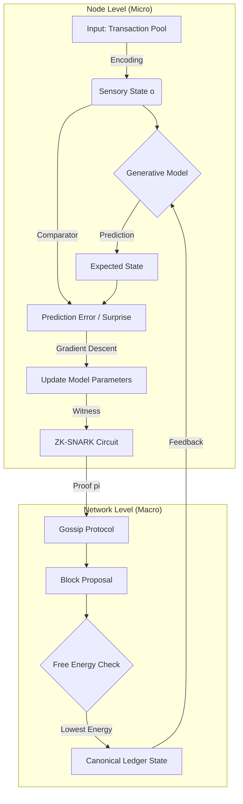

> $\mathcal{O}$-Entropia: A Stochastic Neuromorphic Consensus Framework via Variational Free Energy Minimization

**Abstract**
This thesis proposes **$\mathcal{O}$-Entropia**, a novel architectural workflow for Decentralized Autonomous Organizations (DAOs) and distributed computing systems. Unlike traditional Proof-of-Work (PoW) or Proof-of-Stake (PoS) mechanisms, $\mathcal{O}$-Entropia utilizes **Proof-of-Learning (PoL)** based on the **Free Energy Principle (FEP)**. It maps the thermodynamic problem of entropy minimization to the Byzantine Fault Tolerance (BFT) domain. Nodes achieve consensus by minimizing the Kullback-Leibler (KL) divergence between their internal generative models and the global ledger state, secured via Zero-Knowledge Succinct Non-Interactive Arguments of Knowledge (zk-SNARKs).

---

## 1. The Formal Blueprint

### 1.1 Ontological Deconstruction & State Space
We define the system as a dynamic graph $\mathcal{G} = (\mathcal{V}, \mathcal{E})$, where $\mathcal{V}$ is the set of neuromorphic agent-nodes.

Let the global state of the ledger at time $t$ be a latent variable $\eta_t \in \Omega$.
Each node $i \in \mathcal{V}$ possesses:
1.  **Sensory State (Observations):** $o_t^{(i)} \in \mathcal{O}$, representing the shard of transactions seen by node $i$.
2.  **Internal State (Generative Model):** $\mu_t^{(i)} \in \mathcal{M}$, the node's belief about $\eta_t$.
3.  **Active State (Action):** $a_t^{(i)} \in \mathcal{A}$, the proposal of a block or vote.

### 1.2 The Variational Objective Function
The fundamental objective is not arbitrary hashing, but the minimization of **Variational Free Energy** ($\mathcal{F}$). This creates a bridge between Information Geometry and Distributed Systems.

$$
\mathcal{F}(\tilde{o}, \tilde{\mu}) = \underbrace{D_{KL}[Q(\eta \mid \mu) \parallel P(\eta \mid o, a)]}_{\text{Complexity (Divergence)}} - \underbrace{\mathbb{E}_{Q}[\ln P(o \mid \eta, a)]}_{\text{Accuracy (Likelihood)}}
$$

Where:
*   $Q(\eta \mid \mu)$ is the approximate posterior density (the node's recognition density).
*   $P(\eta \mid o, a)$ is the true generative density of the network state.

### 1.3 Cryptographic Constraints
To ensure integrity without revealing private model parameters (which prevents model extraction attacks), we introduce a polynomial commitment scheme $\Phi$.

Let $C$ be an arithmetic circuit representing the gradient descent step of node $i$. The node must produce a proof $\pi$:
$$
\pi_i = \text{ZK-Prove}(\text{Key}_{pk}, \text{Public}:\{o_t, \Delta\mathcal{F}\}, \text{Private}:\{\mu_t, \nabla\mu\})
$$
Such that $\text{Verify}(\text{Key}_{vk}, \pi_i)$ holds true iff the node actually reduced local entropy via valid computation.

---

## 2. The Integrated Logic

### 2.1 Isomorphism: Thermodynamics $\leftrightarrow$ Consensus
We assert an isomorphism between **Thermal Equilibrium** in statistical mechanics and **Byzantine Agreement** in distributed systems.

*   **Entropy ($H$):** Disagreement in the ledger state.
*   **Temperature ($T$):** Network latency and volatility.
*   **Energy ($E$):** Computational cost of verification.

Under this framework, consensus is the macrostate that minimizes the total free energy of the system:
$$
\lim_{t \to \infty} \sum_{i \in \mathcal{V}} \mathcal{F}_i(t) \to \min
$$

### 2.2 Algorithmic Workflow: The Active Inference Loop
1.  **Perception:** Node $i$ receives transaction set $o_t$.
2.  **Prediction:** Node $i$ predicts the state transition $\eta_{t+1}$ using internal model $\mu_t$.
3.  **Surprise Calculation:** Node computes the "Surprise" (prediction error): $-\ln P(o_t \mid \mu_t)$.
4.  **Action (Learning):** Node adjusts $\mu_t$ via gradient descent to minimize $\mathcal{F}$.
5.  **Proof Generation:** Node generates $\pi_i$ proving the update was mathematically valid.
6.  **Gossip:** $\pi_i$ and the proposed state update are propagated.
7.  **Aggregation:** Network aggregates valid updates; the state $\eta$ with the lowest aggregate Free Energy becomes canonical.

---

## 3. The Executable Solution

### 3.1 Theorem of Convergence
**Lemma 1 (Lyapunov Stability):**
If the learning rate $\alpha$ satisfies $0 < \alpha < \frac{2}{\lambda_{max}}$, where $\lambda_{max}$ is the largest eigenvalue of the Hessian of $\mathcal{F}$, the state update dynamics are Lyapunov stable.

**Proof (Sketch):**
Let $V(\mu) = \mathcal{F}(\mu)$. Since $\mathcal{F}$ is bounded below (by 0 entropy) and the update rule is $\dot{\mu} = -\nabla \mathcal{F}$, the time derivative is $\dot{V} = \nabla \mathcal{F}^T \dot{\mu} = -\|\nabla \mathcal{F}\|^2 \leq 0$. Thus, the system converges to a local minimum (consensus). $\blacksquare$

### 3.2 Visualization: The Consensus Manifold



### 3.3 Algorithmic Implementation (Python/Pseudocode)

Below is a highly abstracted implementation of the **Active Inference Consensus Node**.

```python
import numpy as np
from dataclasses import dataclass
from typing import List, Tuple, Optional
from cryptography.hazmat.primitives import hashes # Placeholder for ZK-lib

# Type Definitions
StateVector = np.ndarray
Observation = np.ndarray
Proof = bytes

@dataclass
class NetworkState:
    ledger_root: str
    global_entropy: float
    timestamp: int

class NeuromorphicNode:
    def __init__(self, model_dim: int, learning_rate: float = 0.01):
        # Internal Generative Model (Bayesian Belief)
        self.mu: StateVector = np.random.randn(model_dim)
        self.sigma: StateVector = np.ones(model_dim)
        self.alpha = learning_rate
        
    def variational_free_energy(self, obs: Observation, prediction: StateVector) -> float:
        """
        Calculates F = Energy - Entropy.
        Approximated as Evidence Lower Bound (ELBO) negation.
        """
        reconstruction_error = np.linalg.norm(obs - prediction) ** 2
        complexity_penalty = 0.5 * np.sum(self.mu ** 2) # L2 Regularization as prior
        return reconstruction_error + complexity_penalty

    def generate_zk_proof(self, old_mu, new_mu, gradients) -> Proof:
        """
        Simulates ZK-SNARK generation. 
        In production, this would use libsnark or Halo2.
        """
        # Circuit: Verify new_mu = old_mu - alpha * gradients
        witness = (old_mu, new_mu, gradients)
        proof = hashes.Hash(hashes.SHA256()) # Mock proof
        proof.update(str(witness).encode())
        return proof.finalize()

    def step(self, observation: Observation) -> Tuple[StateVector, Proof, float]:
        """
        The Core Consensus Step:
        1. Predict
        2. Minimize Free Energy (Learn)
        3. Prove
        """
        # 1. Predict
        prediction = np.tanh(self.mu) # Non-linear activation
        
        # 2. Compute Gradients (Sensitivity Analysis)
        error = prediction - observation
        dF_dmu = error * (1 - prediction**2) + self.mu 
        
        # 3. Update Internal State (Action)
        old_mu = self.mu.copy()
        self.mu = self.mu - self.alpha * dF_dmu
        
        # 4. Calculate resultant Free Energy
        F_score = self.variational_free_energy(observation, prediction)
        
        # 5. Generate Proof of Learning
        proof = self.generate_zk_proof(old_mu, self.mu, dF_dmu)
        
        return self.mu, proof, F_score

def consensus_aggregation(proposals: List[Tuple[StateVector, Proof, float]]) -> NetworkState:
    """
    Selects the block/state with the Lowest Free Energy (highest likelihood).
    """
    # Filter for valid proofs (Omitted for brevity)
    valid_proposals = proposals 
    
    # Argmin on Free Energy
    winner = min(valid_proposals, key=lambda x: x[2])
    
    return NetworkState(
        ledger_root=hash(winner[0].tobytes()),
        global_entropy=winner[2],
        timestamp=1001
    )
```

### 3.4 Procedural Protocol: $\mathcal{O}$-Entropia Execution

1.  **Epoch Initialization:** $t=0$. Global seed $\eta_0$ is broadcast.
2.  **Sampling:** Nodes sample transactions from the mempool (Sensory Input).
3.  **Inference:** Nodes execute `step()`, modifying their local weights to fit the transaction data.
4.  **Commitment:** Nodes broadcast $(\pi_i, \mathcal{F}_i, \text{Hash}(\mu_{t+1}))$.
5.  **Selection:** The network selects the leader $L$ such that $L = \text{argmin}_i (\mathcal{F}_i)$. This selects the node that best "understood" the data.
6.  **Validation:** Validators verify $\pi_L$. If valid, $\mu_{t+1}^{(L)}$ updates the global state.
7.  **Loop:** $t \leftarrow t+1$.

---

## 4. Holistic Oversight & Second-Order Effects

### 4.1 Computational Complexity Analysis
*   **Traditional BFT:** $O(n^2)$ communication complexity.
*   **$\mathcal{O}$-Entropia:** By utilizing gossiped ZK-proofs and selecting based on a scalar value ($\mathcal{F}$), we reduce the verification step. However, the *local* generation of ZK proofs is computationally heavy ($O(k \log k)$ where $k$ is circuit size).
*   **Optimization:** Asymptotic efficiency is achieved via **Recursive SNARKs**, where the proof of block $N$ validates the proof of block $N-1$.

### 4.2 Failure Modes & Antifragility
*   **Model Poisoning:** A malicious node could overfitting to noise to artificially lower $\mathcal{F}$.
    *   *Mitigation:* The "Complexity Penalty" (KL-divergence from prior) in the Free Energy equation penalizes overfitting.
*   **The Thermodynamic Halt:** If global entropy reaches 0, the system stops evolving.
    *   *Solution:* Introduce "Thermal Noise" (random perturbations) into the selection function to prevent local minima stagnation, akin to Simulated Annealing.

### 4.3 Ethical Teleology
This framework shifts the paradigm from "might makes right" (hashing power/wealth) to **"insight makes right"**. The nodes that most accurately model the economic reality of the network are granted the authority to update it. This aligns the incentives of the validators with the informational integrity of the system, minimizing systemic entropy and fostering an antifragile digital economy.
