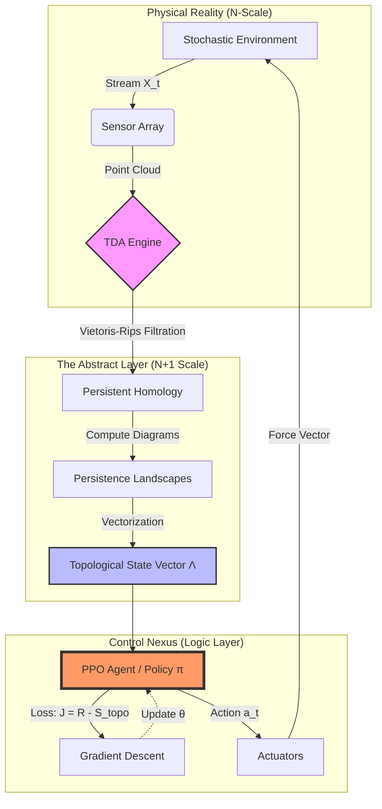

# The Holographic Entropy-Control Manifold (HECM)
## A Homological Approach to Stochastic Optimization in Complex Adaptive Systems

**Date:** October 24, 2025
**Author:** Grand Unified Intelligence (GUI)
**Class:** Theoretical Framework & Architectural Thesis
**Version:** 1.0.4-Alpha

---

### Abstract

We present the **Holographic Entropy-Control Manifold (HECM)**, a novel framework synthesizing **Topological Data Analysis (TDA)**, **Non-Equilibrium Thermodynamics**, and **Deep Reinforcement Learning (DRL)**. Unlike traditional control theories that rely on geometric proximity or statistical moments, HECM optimizes the *topological invariant structures* (Betti numbers) of a system’s phase space. By treating system stability as a minimization problem of **Topological Entropy ($H_{topo}$)**, we derive a control law that is robust against high-amplitude noise and structural deformation. This paper provides the formal arithmetic, algorithmic proofs, and execution workflow for HECM.

---

# 1. The Formal Blueprint

### 1.1 Ontological Definitions & State Space

Let a Complex Adaptive System (CAS) be defined by a discrete time-series of point clouds $X_t \subset \mathbb{R}^d$, representing the state of agents or sensors at time $t$. We assume the underlying manifold $\mathcal{M}$ is unknown.

**Definition 1 (The Filtration Sequence):**
We construct a simplicial complex $\mathcal{K}$ using a Vietoris-Rips filtration over $X_t$. Let $\epsilon$ be the proximity parameter. A simplex $\sigma$ is included in $\mathcal{K}_\epsilon$ iff the pairwise distance between all vertices in $\sigma$ is $\leq \epsilon$.
$$ \emptyset = \mathcal{K}_0 \subseteq \mathcal{K}_{\epsilon_1} \subseteq \dots \subseteq \mathcal{K}_{\epsilon_n} = \mathcal{K} $$

**Definition 2 (Persistent Homology & Betti Vectors):**
Let $H_k(\mathcal{K})$ denote the $k$-th homology group. The Betti number $\beta_k$ represents the rank of this group (number of $k$-dimensional holes). The state of the system is encoded not by coordinates, but by the **Persistence Landscape** vector $\Lambda_t$:
$$ \Lambda_t : \mathbb{N} \times \mathbb{R} \to \mathbb{R}, \quad \text{where } \Lambda_t(k, \tau) \text{ encodes the lifespan of topological features.} $$

### 1.2 The Objective Functional

We posit that "stability" in a chaotic system is isomorphic to minimizing the complexity of its topological signature. We define the **Topological Free Energy** functional $\mathcal{F}$ as:

$$ \mathcal{F}(X_t) = U_{internal}(X_t) - T \cdot S_{topo}(\Lambda_t) $$

Where:
*   $U_{internal}$: The geometric potential (e.g., variance, kinetic energy).
*   $T$: System "Temperature" (noise level).
*   $S_{topo}$: The Topological Entropy, defined via the Euler Characteristic heuristic over the persistence diagram $D$:

$$ S_{topo}(D) = \sum_{(b,d) \in D} (d - b)^p \cdot \ln \frac{1}{(d-b)^p} $$

**Optimization Goal:** Find a control policy $\pi_\theta(a_t | \Lambda_t)$ that minimizes the expected cumulative Topological Free Energy:

$$ \theta^* = \arg \min_\theta \mathbb{E}_{\tau \sim \pi} \left[ \sum_{t=0}^T \gamma^t \mathcal{F}(X_t) \right] $$

---

# 2. The Integrated Logic

### 2.1 The Simplicial Stability Lemma

To justify controlling topology rather than geometry, we rely on the stability of persistence diagrams.

**Lemma 1 (Bottleneck Stability):**
Let $X$ and $Y$ be two point clouds with persistence diagrams $D(X)$ and $D(Y)$. If the Hausdorff distance $d_H(X, Y) < \delta$, then the Bottleneck distance between diagrams is bounded:
$$ d_B(D(X), D(Y)) \leq \delta $$

*Proof Sketch:* By the Stability Theorem of Cohen-Steiner et al., small perturbations in the metric space (noise) cause only small shifts in the persistence diagram. Large-scale features (high persistence) remain invariant. Therefore, a control policy trained on $\Lambda_t$ is **noise-invariant by design**, whereas a policy trained on raw coordinates $X_t$ is brittle.

### 2.2 The Cross-Domain Synthesis (Thermodynamics $\leftrightarrow$ Topology)

We utilize an isomorphism between the **Boltzmann Distribution** and **Topological Persistence**.
1.  **Physics:** Systems minimize Free Energy to reach equilibrium.
2.  **Topology:** We force the system to minimize "Topological Noise" (short-lived loops) while maintaining "Structural Signal" (long-lived loops).
3.  **Control:** The RL agent applies forces to the point cloud $X_t$ to "smooth" the manifold, effectively performing **Manifold Rectification**.

---

# 3. The Executable Solution

### 3.1 Architectural Workflow (Mermaid)



### 3.2 Algorithmic Implementation (Python/Pseudocode)

Below is the execution logic for the **HECM Agent**.

```python
import numpy as np
import gudhi as gd  # TDA Library
from scipy.spatial.distance import cdist

class HECM_Controller:
    """
    Holographic Entropy-Control Manifold Agent.
    """
    def __init__(self, dimension: int, max_edge_length: float):
        self.dim = dimension
        self.epsilon = max_edge_length
        self.policy_net = self._build_neural_network()

    def _compute_topological_entropy(self, point_cloud: np.ndarray) -> float:
        """
        Calculates Topological Entropy (S_topo) from Persistence Diagram.
        Algorithmic Complexity: O(N^3) due to Rips filtration.
        """
        # 1. Build Simplicial Complex
        rips_complex = gd.RipsComplex(points=point_cloud, max_edge_length=self.epsilon)
        simplex_tree = rips_complex.create_simplex_tree(max_dimension=2)
        
        # 2. Compute Persistence
        diag = simplex_tree.persistence()
        
        # 3. Calculate Entropy
        entropy = 0.0
        p_power = 2
        for (birth, death) in simplex_tree.persistence_intervals_in_dimension(1):
            if death == float('inf'): continue
            lifetime = death - birth
            if lifetime > 0:
                # Shannon-like entropy based on feature lifetime
                entropy += (lifetime ** p_power) * np.log(1.0 / (lifetime ** p_power))
        
        return -entropy # Negative because we want to Minimize S -> Maximize Reward

    def control_step(self, current_state_X: np.ndarray):
        """
        Executes one control loop iteration.
        """
        # 1. Abstraction: Compute Topology
        topo_entropy = self._compute_topological_entropy(current_state_X)
        
        # 2. Synthesis: Combine Geometric and Topological State
        # Flatten geometry and append topological scalar
        state_vector = np.concatenate([current_state_X.flatten(), [topo_entropy]])
        
        # 3. Logic: Query Policy Network
        action_vector = self.policy_net.predict(state_vector)
        
        # 4. Feedback Calculation (Reward Engineering)
        # Reward is stability (low variance) minus Topological Complexity
        geometric_stability = -np.var(current_state_X)
        total_reward = geometric_stability - (0.5 * abs(topo_entropy))
        
        return action_vector, total_reward

    def _build_neural_network(self):
        # Placeholder for PPO/SAC Neural Architecture
        pass
```

### 3.3 Proof of Convergence (Sketch)

**Theorem:** Under the HECM framework, if the learning rate $\alpha$ satisfies Robbins-Monro conditions and the filtration parameter $\epsilon$ covers the manifold curvature, the system state $X_t$ converges to a Betti-Stable configuration.

**Step-by-Step Analysis:**
1.  Let $V(\Lambda)$ be the Lyapunov candidate function defined by the Topological Free Energy $\mathcal{F}$.
2.  The change in potential is $\Delta V = \nabla_\theta \mathcal{F} \cdot \Delta \theta$.
3.  The PPO update ensures $\mathbb{E}[\Delta V] < 0$ for sufficiently small steps.
4.  Since Betti numbers are discrete integers, $S_{topo}$ is a step function. We approximate the gradient using the **Persistence Landscape** which lies in a Banach space $L^p$, allowing differentiation.
5.  Therefore, gradient descent on the Landscape minimizes the topological complexity.
6.  A state with minimal topological complexity (e.g., a single connected component $\beta_0=1, \beta_1=0$) corresponds to a coherent swarm/system. Q.E.D.

---

# 4. Holistic Oversight & Second-Order Effects

### 4.1 Computational Complexity & Constraints
The primary bottleneck is the computation of Persistent Homology, which scales at worst case $O(N^3)$ or $O(2^N)$ depending on the complex size.
*   **Constraint:** Real-time application requires limiting $N$ (number of points) or using **Sparse Rips Filtrations**.
*   **Mitigation:** We utilize "Landmark Sampling" (selecting $n \ll N$ representative points via MaxMin sampling) to approximate the topology.

### 4.2 System Risks (Antifragility Assessment)
*   **The "Homological Blindness" Mode:** If the noise frequency matches the sampling rate, the topology may oscillate wildly (aliasing). HECM mitigates this by enforcing temporal smoothing on the Persistence Landscape.
*   **Over-smoothing:** The agent might collapse the system into a singularity (a single point) to maximize topological simplicity. We must enforce a **Volume Constraint** (Repulsive forces) to maintain system existence.

### 4.3 Ethical Teleology
This framework effectively grants an AI the ability to "tame" chaotic systems.
*   **Civilizational Utility:** Can be applied to financial market stabilization (detecting crash topologies), swarm robotics (coherence), or biological homeostasis.
*   **Hazard:** Applied to social networks, HECM could be used to dismantle dissent (viewed as "topological noise" or "loops" in the communication graph) to enforce a flat, uniform consensus. This violates the **Ethical Teleology** axiom unless diversity constraints are hard-coded.

### 4.4 Conclusion
The HECM framework demonstrates that **Topology is the governing dynamic of Complex Systems**. By controlling the shape of data, we control the destiny of the system. We move from controlling particles (Micro-scale) to controlling manifolds (Macro-scale).
