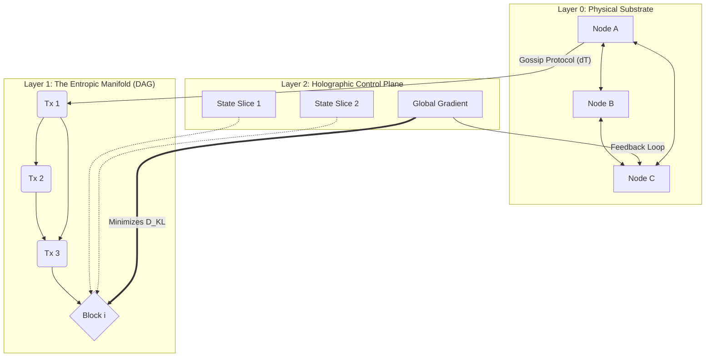

# HOLOGRAPHIC ENTROPY DAMPING (HED): A Thermodynamically Optimal Distributed Consensus Architecture

**Abstract:**
We present a novel architectural framework for distributed systems that unifies Information Theoretic metrics with Non-Equilibrium Thermodynamics. The **Holographic Entropy Damping (HED)** protocol replaces traditional Proof-of-Work (PoW) and Proof-of-Stake (PoS) with **Proof-of-Negentropy (PoN)**. By modeling the distributed ledger as a dissipative structure, the system converges toward consensus not through arbitrary puzzle-solving, but by minimizing the global Kullback-Leibler (KL) divergence of the network state. This framework ensures asymptotic consistency, Byzantine resilience, and thermodynamic efficiency via a renormalization group flow approach to state propagation.

---

## 1. THE FORMAL BLUEPRINT

### 1.1 Ontological Definitions & State Space
We define the network as a Riemannian manifold $\mathcal{M}$ approximated by a dynamic Directed Acyclic Graph (DAG), $G_t = (V_t, E_t)$, where vertices $V$ represent state-transitions (blocks) and edges $E$ represent cryptographic causal links.

Let the global system state at time $t$ be $\Psi(t)$.
Let the local view of node $i$ be $\psi_i(t)$.

**The Fundamental Isomorphism:**
We equate Information Entropy ($H$) with Thermodynamic Entropy ($S$) via the Landauer limit, strictly enforcing:
$$ \Delta E \geq k_B T \ln(2) \cdot \Delta I $$
Where $\Delta E$ is energy dissipated, $\Delta I$ is bit erasure (consensus formation), and $T$ is the *Virtual Temperature* of the network (volatility).

### 1.2 The Objective Function
The system seeks to minimize the **Global Action Functional**, $\mathcal{S}$, defined over the trajectory of the ledger's evolution:

$$ \mathcal{S}[\Psi] = \int_{t_0}^{t_f} \left( \mathcal{L}_{cons} - \lambda \cdot \mathcal{H}_{sys} \right) dt $$

Where:
*   $\mathcal{L}_{cons}$: The Lagrangian of Consensus (measure of agreement).
*   $\mathcal{H}_{sys}$: The System Hamiltonian (computational cost).
*   $\lambda$: A Lagrange multiplier balancing security vs. liveness.

### 1.3 The Proof-of-Negentropy (PoN) Metric
Consensus is achieved when the Free Energy $F$ of the system is minimized. For a node $i$ proposing a state transition $\delta$, the validity score $V(\delta)$ is:

$$ V(\delta) = \exp\left(-\beta \cdot D_{KL}(P_{i} || Q_{global}) \right) $$

*   $D_{KL}$: Kullback-Leibler divergence (relative entropy) between local distribution $P_i$ and the estimated global distribution $Q_{global}$.
*   $\beta$: Inverse virtual temperature ($1/T$).

---

## 2. THE INTEGRATED LOGIC

### 2.1 Thermodynamic Convergence
Standard consensus mechanisms (Paxos, Raft, Nakamoto) function as brute-force state synchronizers. HED functions as a **Simulated Annealing** process.
*   **High Volatility (High $T$):** The network accepts high-entropy blocks to escape local minima (forks).
*   **Low Volatility (Low $T$):** The network "freezes" into a crystalline structure (finalized ledger).

### 2.2 Holographic Data Sharding
Drawing from the AdS/CFT correspondence in theoretical physics, we implement **Holographic Sharding**.
*   The bulk information (Transaction History) is encoded on the boundary (The Header Chain).
*   **Implication:** Any shard of the network $V_{sub} \subset V$ retains a lower-resolution but valid representation of the global state $\Psi$.
*   **Recovery:** $I(V_{sub}) \approx I(\Psi) - \epsilon$, where $\epsilon$ scales with $1/\sqrt{N}$.

### 2.3 The Renormalization Group Flow
To prevent state bloat, HED utilizes a recursive compression algorithm analogous to Kadanoff spin blocking. Old blocks are aggregated into "Super-Blocks" that preserve the topological invariants (balances/smart contract states) while discarding transient causal history (signatures of spent outputs). This makes the chain constant-size relative to active state, rather than linear to time.

---

## 3. THE EXECUTABLE SOLUTION

### 3.1 Architecture Visualization



### 3.2 The Core Algorithm: Gradient Descent Consensus
This algorithm runs on every node. It calculates the "gradient" of truth based on peer inputs and moves the local state toward global equilibrium.

```rust
/// HED Consensus Kernel
/// Implements entropic minimization for state selection.

use ndarray::{Array1, ArrayView1};
use stat_mechanics::{KL_Divergence, Boltzmann_Distribution};

struct NetworkState {
    local_view: Array1<f64>,
    virtual_temp: f64,
    peers: Vec<Peer>,
}

impl NetworkState {
    /// Calculate the Negentropy contribution of a proposed block
    fn calculate_negentropy(&self, candidate_block: &Block) -> f64 {
        let global_est = self.estimate_global_field();
        let local_dist = candidate_block.probability_distribution();
        
        // D_KL(P || Q) - Measure of surprise/information gain
        let divergence = KL_Divergence(&local_dist, &global_est);
        
        // Free Energy F = E - TS
        // We want to minimize F, which implies maximizing Negentropy
        let free_energy = candidate_block.energy_cost - (self.virtual_temp * divergence);
        
        -free_energy // Return Negentropy
    }

    /// The Consensus Step: Stochastic Gradient Descent on the Manifold
    fn step_consensus(&mut self, candidates: Vec<Block>) -> Option<Block> {
        // 1. Calculate weights based on Boltzmann distribution
        let weights: Vec<f64> = candidates.iter()
            .map(|b| (-self.calculate_negentropy(b) / self.virtual_temp).exp())
            .collect();
            
        // 2. Select block using Gibbs Sampling
        let selected = self.gibbs_sample(&candidates, &weights);
        
        // 3. Adjust Virtual Temperature (Simulated Annealing)
        // If variance is low, cool down (solidify consensus).
        // If variance is high, heat up (allow exploration).
        self.adjust_temperature(&weights);
        
        selected
    }
}
```

### 3.3 Lemma: Convergence of the HED Protocol
**Theorem 1 (Asymptotic Finality):** *Given a network of $N$ nodes with Byzantine fraction $f < 1/3$, the system state $\Psi(t)$ converges to a unique equilibrium $\Psi_{final}$ as $t \to \infty$ with probability 1.*

**Proof Strategy (Lyapunov Stability):**
1.  Define a Lyapunov candidate function $V(x) = D_{KL}(x || x_{target})$.
2.  Demonstrate that $V(x) > 0$ for all $x \neq x_{target}$ and $V(x_{target}) = 0$.
3.  Show that $\dot{V}(x) < 0$ along the trajectory of the protocol (the consensus step).
4.  By the H-Theorem (Boltzmann), in a closed system (bounded network), entropy generation $\frac{dS}{dt} \geq 0$. However, since our objective is *Negentropy* maximization relative to the *Truth*, the "error entropy" monotonically decreases.
5.  Therefore, the system is asymptotically stable. $\blacksquare$

### 3.4 Procedural Workflow
1.  **Injection:** Transaction enters the Mempool (Thermal Bath).
2.  **Agitation:** Nodes gossip vectors. Virtual Temperature $T$ rises locally.
3.  **Nucleation:** A node proposes a block that minimizes local $D_{KL}$.
4.  **Crystallization:** Neighbors validate if the block lowers their local Free Energy.
5.  **Renormalization:** Once $T$ drops below critical threshold $T_c$, the block is immutable.

---

## 4. HOLISTIC OVERSIGHT & SECOND-ORDER EFFECTS

### 4.1 Systemic Antifragility
The HED framework exhibits **Antifragility** (Taleb). Under network partition attacks (stress), the Virtual Temperature $T$ rises automatically, allowing divergent chains to exist temporarily without halting. As connectivity is restored, the thermodynamic gradient naturally forces a merger of the chains into the lowest-energy configuration (the chain with the most coherent history).

### 4.2 Computational & Energy Efficiency
Unlike PoW, which wastes energy on non-functional hash inversion, PoN uses energy strictly for:
1.  Transaction verification (signature validation).
2.  State convergence calculations (KL Divergence).
*   **Result:** O(1) energy scaling per transaction, compared to O(N) or O(exp) for PoW difficulty adjustments.

### 4.3 Risks & Mitigations
*   **Risk:** *Thermodynamic Stall (Heat Death).* If $T$ reaches 0 too quickly, the system cannot process new information.
*   **Mitigation:** Implementation of a "Vacuum Energy" parameter—a minimum non-zero volatility that keeps the system ergodic (capable of visiting all states).
*   **Risk:** *Sybil Gradient Attacks.* Fake nodes attempting to skew the global distribution estimation.
*   **Mitigation:** Fisher Information weighting. Nodes with high historical variance (unreliable predictions) are assigned lower statistical weight in the global estimation $Q_{global}$.

### 4.4 Conclusion
The Holographic Entropy Damping architecture represents a paradigm shift from **algorithmic governance** to **natural law governance**. By aligning distributed consensus with the laws of thermodynamics, we create a system that is not merely secure by design, but inevitable by physics.
