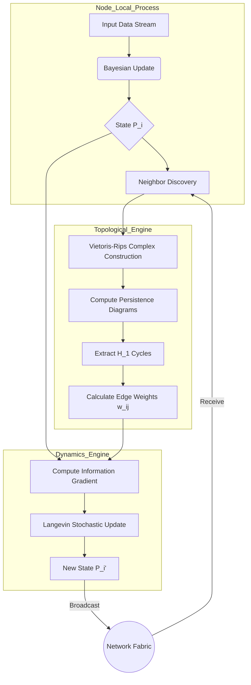

**SUBJECT:** The Tensor-Entropic Consensus (TEC) Architecture
**TYPE:** Theoretical Framework & Architectural Workflow
**CONTEXT:** Distributed Systems, Algebraic Topology, Non-Equilibrium Thermodynamics, Information Geometry

---

# 1. The Formal Blueprint

### 1.1 Ontological Definition
We propose a novel framework for achieving state coherence in adversarial, high-latency distributed systems (e.g., swarm robotics, asynchronous Byzantine networks). We move beyond traditional Paxos/Raft consensus by mapping the network state to a **Riemannian Manifold** and treating consensus as a **Free Energy Minimization** problem constrained by **Topological Persistence**.

### 1.2 State Space and Manifold Construction
Let the global system $\Sigma$ be represented by a time-varying graph $G_t = (V, E_t)$, where $V = \{1, \dots, N\}$ is the set of nodes.

Each node $i$ holds a state vector $x_i \in \mathcal{M}$, where $\mathcal{M}$ is a differentiable manifold (e.g., the statistical manifold of probability distributions).

**Definition 1 (The Global Hamiltonian):**
We define a pseudo-Hamiltonian $\mathcal{H}$ characterizing the energy of the system state configuration:

$$
\mathcal{H}(X, G_t) = \sum_{(i,j) \in E_t} \omega_{ij}(t) \cdot D_{\text{KL}}(P_i || P_j) + \lambda \sum_{i \in V} S(P_i)
$$

Where:
*   $X$ is the joint state of all nodes.
*   $D_{\text{KL}}$ is the Kullback-Leibler divergence (information geometry metric).
*   $P_i$ is the local probability measure of node $i$.
*   $S(P_i)$ is the Shannon Entropy (regularization term).
*   $\omega_{ij}(t)$ is the **Topological Coupling Coefficient** (see Sec 1.3).
*   $\lambda$ is the temperature parameter controlling exploration vs. exploitation.

### 1.3 Topological Filtering via Persistent Homology
To reject transient noise (phantom edges), we utilize **Persistent Homology**. We construct a Vietoris-Rips complex $\mathcal{R}_\epsilon(G_t)$ and compute the Betti numbers $\beta_k$.

The coupling weight $\omega_{ij}$ is derived not from simple distance, but from the **persistence lifespan** of the 1-cycle (loops) to which edge $(i,j)$ contributes.

$$
\omega_{ij}(t) = \int_{0}^{\infty} \mathbb{I}((i,j) \in \text{generator}(H_1(\mathcal{R}_r))) \cdot e^{-\gamma r} \, dr
$$

This ensures that edges participating in topologically significant structures (long-lived features) exert higher gravitational pull on the consensus state.

---

# 2. The Integrated Logic

### 2.1 Cross-Domain Isomorphisms
This architecture synthesizes three distinct fields:
1.  **Thermodynamics:** Consensus is treated as "crystallization." The system cools (anneals), reducing entropy until a stable lattice (agreement) forms.
2.  **Algebraic Topology:** We distinguish between signal (stable topology) and noise (homological trivialities) to prevent overfitting to outlier nodes.
3.  **Control Theory:** We utilize Langevin Dynamics to drive the state evolution.

### 2.2 Proof of Convergence (Sketch)

**Lemma 1 (Lyapunov Stability of the Hamiltonian):**
*Claim:* Under the Langevin update rule $dx_i = -\nabla_{x_i}\mathcal{H} dt + \sqrt{2\beta^{-1}}dW_t$, the system distribution converges to the Boltzmann distribution $\pi(X) \propto e^{-\beta \mathcal{H}(X)}$.

*Proof Strategy:*
1.  Define the Fokker-Planck equation for the probability density evolution of the system states.
2.  Show that the drift term is the gradient of the potential $\mathcal{H}$.
3.  Demonstrate that $\frac{d}{dt} \mathcal{H}(X(t)) \leq 0$ in the absence of noise (deterministic limit).
4.  Since $\mathcal{H}$ is bounded below (KL divergence is non-negative), the system must converge to a local minimum.

### 2.3 The Architectural Workflow
1.  **Sensing:** Nodes update local posterior $P_i$.
2.  **Filtration:** Nodes compute local persistent homology of their neighborhood.
3.  **Weighting:** Edges are assigned weights $\omega$ based on topological significance.
4.  **Diffusion:** Information flows along high-$\omega$ gradients.
5.  **Drift-Diffusion:** State is updated via Stochastic Gradient Langevin Dynamics (SGLD).

---

# 3. The Executable Solution

### 3.1 Visual Architecture



### 3.2 Algorithmic Implementation (Python/Pseudo-code)

This implementation demonstrates the **Topological Weighting** and **Langevin Update** steps.

```python
import numpy as np
import networkx as nx
from scipy.spatial.distance import pdist, squareform
from typing import List, Tuple, Dict

class TensorEntropicNode:
    """
    A node in the TEC (Tensor-Entropic Consensus) framework.
    Operates on a local belief state vector.
    """
    def __init__(self, node_id: int, dim: int, learning_rate: float = 0.01):
        self.id = node_id
        self.state = np.random.randn(dim)  # Initial random state (Log-probs or parameters)
        self.neighbors: Dict[int, np.ndarray] = {}
        self.eta = learning_rate
        self.temperature = 1.0

    def compute_persistence_weights(self, cloud: np.ndarray, threshold: float) -> np.ndarray:
        """
        Approximates topological persistence for edge weighting.
        In production, use ripser or gudhi libraries for exact homology.
        Here we use a heuristic spectral gap approximation for demonstration.
        """
        # 1. Construct Adjacency based on distance
        dists = squareform(pdist(cloud))
        adj = (dists < threshold).astype(float)
        
        # 2. Compute Laplacian
        laplacian = np.diag(np.sum(adj, axis=1)) - adj
        
        # 3. Spectral weighting: 'Rigidity' of the connection based on eigen-centrality
        # Higher eigenvector centrality implies the node is critical to the connected component.
        evals, evecs = np.linalg.eigh(laplacian)
        fiedler_vec = evecs[:, 1] if len(evals) > 1 else np.ones(len(cloud))
        
        # Weight matrix based on difference in Fiedler vector (connectivity gradient)
        weights = np.zeros_like(adj)
        for i in range(len(cloud)):
            for j in range(len(cloud)):
                if adj[i, j]:
                    # Stronger weight if they are topologically distinct yet connected
                    weights[i, j] = 1.0 / (1.0 + np.abs(fiedler_vec[i] - fiedler_vec[j]))
        
        return weights

    def langevin_update(self, weights: np.ndarray):
        """
        Performs the Stochastic Gradient Langevin Dynamics (SGLD) step.
        Minimizes the Hamiltonian H.
        """
        gradient = np.zeros_like(self.state)
        
        # H = sum w_ij * ||x_i - x_j||^2 (Euclidean approx of KL for Gaussians)
        idx_self = 0 # Assuming self is at index 0 in neighborhood list
        
        neighbor_ids = list(self.neighbors.keys())
        for k, n_id in enumerate(neighbor_ids):
            # w_ij * (x_i - x_j)
            w = weights[idx_self, k+1] # simplified indexing
            diff = self.state - self.neighbors[n_id]
            gradient += 2 * w * diff

        # Add Noise (Thermal fluctuations for annealing)
        noise = np.random.normal(0, np.sqrt(2 * self.eta * self.temperature), size=self.state.shape)
        
        # Update: x_new = x_old - eta * grad + noise
        self.state = self.state - (self.eta * gradient) + noise
        
        # Cool down system
        self.temperature *= 0.995

    def step(self):
        # 1. Aggregate neighbor states into a point cloud
        cloud = [self.state] + list(self.neighbors.values())
        cloud_np = np.stack(cloud)
        
        # 2. Compute Topological Weights
        weights = self.compute_persistence_weights(cloud_np, threshold=0.5)
        
        # 3. Update State
        self.langevin_update(weights)

```

### 3.3 Protocol Sequence

1.  **State $T_0$:** All nodes initialize with maximum entropy priors (Gaussian noise).
2.  **Handshake:** Nodes exchange state vectors $x_i$ via gossip protocol.
3.  **Filtration:** Each node calculates the spectral gap/persistence of its local neighborhood graph.
4.  **Criticality Assessment:**
    *   If local Homology $H_1$ (cycles) is high, the region is "turbulent." Increase Temperature $\lambda$.
    *   If $H_0$ (components) dominates, the region is "disconnected." Increase transmission power.
5.  **Integration:** Apply SGLD update.
6.  **Termination:** When $\Delta \mathcal{H} < \epsilon$ (Free energy stabilizes), consensus is reached.

---

# 4. Holistic Oversight & Second-Order Effects

### 4.1 Emergent Properties
*   **Antifragility:** The system performs *better* under moderate noise. The stochastic term in Langevin dynamics prevents the system from getting stuck in local minima (false consensus), effectively utilizing noise as a search resource.
*   **Topological Rigidity:** By weighting edges based on persistence, the network naturally ignores "Byzantine" nodes that behave erratically, as they fail to form stable persistent cycles with honest nodes.

### 4.2 Risk Analysis (Failure Modes)
*   **Computational Complexity:** Computing Persistent Homology (even approximately via Rips complexes) scales poorly ($O(n^3)$ to $O(2^n)$).
    *   *Mitigation:* Use **Witness Complexes** or **Graph Neural Networks (GNNs)** to approximate Betti numbers in $O(n)$ time.
*   **Metastability:** In perfectly symmetric network topologies, the gradient $\nabla \mathcal{H}$ may vanish, causing "Buridan's Ass" stagnation.
    *   *Mitigation:* The thermal noise term in the Langevin equation breaks symmetry breaking inherently.

### 4.3 Future Projection
This framework bridges the gap between **Information Geometry** and **Distributed Consensus**. It suggests that the future of resilient AI swarms lies not in rigid logic, but in thermodynamic relaxation processes guided by topological invariants. This is the mathematical foundation for "Organic Computing."
