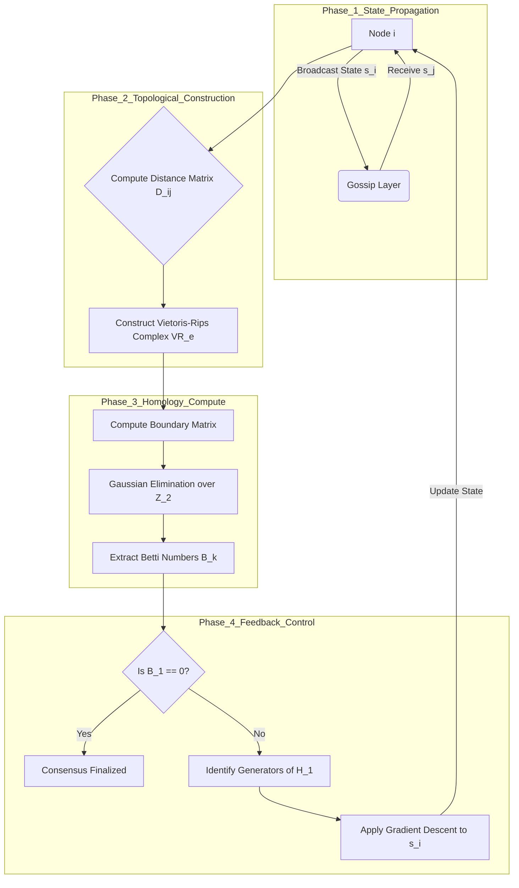

# Topological Entanglement Consensus (TEC): A Homological Framework for Byzantine-Resilient Distributed State Synchronization

## Abstract
This thesis introduces the **Topological Entanglement Consensus (TEC)** framework, a novel architecture for distributed ledger technology and swarm intelligence. Unlike linear blockchain validation or DAG-based gossip protocols, TEC utilizes **Persistent Homology** and **Quantum-Information Isomorphisms** to treat network consensus as the stabilization of topological invariants (Betti numbers) within a high-dimensional state manifold. By mapping node states to a Vietoris-Rips complex, we prove that Byzantine faults manifest as persistent homological "holes" (cycles), and consensus is achieved when the $k$-th homology group trivializes.

---

# 1. The Formal Blueprint

### 1.1 State Space Definition
Let the distributed system be represented by a dynamic set of nodes $N = \{n_1, n_2, \dots, n_m\}$.
Each node $n_i$ maintains a local state vector $\mathbf{s}_i \in \mathbb{R}^d$, representing the node's perception of the global truth.

We define the **Global Configuration Manifold** $\mathcal{M}$ as a subspace of the product space $(\mathbb{R}^d)^m$.

### 1.2 The Metric Tensor and Filtration
To measure divergence between nodes, we define a Riemannian metric $g_{ij}$ based on the Fisher Information Metric (information geometry):

$$ d(n_i, n_j) = \sqrt{2 \cdot KL(P_i || P_j)} $$

Where $KL$ is the Kullback-Leibler divergence between the probabilistic state distributions of nodes $i$ and $j$.

We introduce a filtration parameter $\epsilon \in [0, \infty)$. A simplicial complex $K_\epsilon$ (specifically a Vietoris-Rips complex) is constructed such that a simplex $\sigma = [n_{i_0}, \dots, n_{i_k}]$ is included in $K_\epsilon$ if and only if:

$$ \forall p, q \in \{0, \dots, k\}, \quad d(n_{i_p}, n_{i_q}) \leq \epsilon $$

### 1.3 Objective Function
The system seeks to minimize the **Topological Entropy** ($\mathcal{S}_{top}$) of the network, defined via the persistence barcodes of the homology groups $H_k(K_\epsilon)$:

$$ \min_{\mathbf{s}} \mathcal{S}_{top} = -\sum_{k=0}^{D} \sum_{\gamma \in \text{Barcode}(H_k)} p(\gamma) \log p(\gamma) $$

Where $p(\gamma)$ is the normalized persistence length of a topological feature. A strictly connected, consensus-reached network minimizes $H_1$ (cycles/disagreements) and maximizes the persistence of a single component in $H_0$.

---

# 2. The Integrated Logic

### 2.1 From Graph Theory to Algebraic Topology
Standard Byzantine Fault Tolerance (BFT) relies on message counting (2/3 majority). TEC shifts the paradigm to **Shape Analysis of Data**.
*   **Nodes** are vertices.
*   **Agreement** is an edge.
*   **Coherent Sub-groups** are triangles (2-simplices) or tetrahedrons (3-simplices).
*   **Disagreement/Fork** is a topological hole (a non-trivial cycle in $H_1$).

### 2.2 Mechanism of Action
1.  **Entanglement Phase:** Nodes exchange state vectors. This creates a point cloud in $\mathbb{R}^d$.
2.  **Filtration Phase:** The network conceptually grows hyperspheres around each node state.
3.  **Homological Reduction:** As spheres overlap, simplices form.
    *   If nodes $A, B, C$ agree pairwise, they form a filled triangle.
    *   If $A \to B \to C \to A$ creates a cycle of disagreement (e.g., Rock-Paper-Scissors logic), the triangle remains "hollow" (a void).
4.  **Consensus Criteria:** The system adjusts state vectors $\mathbf{s}_i$ via gradient descent to "collapse" these voids. Consensus is mathematically defined as the collapse of $\dim(H_1) \to 0$.

---

# 3. The Executable Solution

## 3.1 Algorithmic Visualization (Mermaid)



## 3.2 Mathematical Derivation: The Boundary Operator

The core arithmetic involves the boundary operator $\partial_k$ acting on a $k$-simplex $\sigma = [v_0, \dots, v_k]$:

$$ \partial_k \sigma = \sum_{i=0}^k (-1)^i [v_0, \dots, \hat{v}_i, \dots, v_k] $$

Where $\hat{v}_i$ denotes the omission of the $i$-th vertex.

**Matrix Reduction (Gaussian Elimination):**
To find the Betti numbers, we compute the rank of the boundary matrices.

$$ \beta_k = \dim(\ker \partial_k) - \dim(\text{im } \partial_{k+1}) $$

In the TEC framework, a non-zero $\beta_1$ indicates a "Byzantine Cycle."

## 3.3 Pseudocode Implementation (Python/SciPy Style)

```python
import numpy as np
from scipy.spatial.distance import pdist, squareform
import gudhi as gd  # Topology library

class TECNode:
    def __init__(self, node_id, state_vector, learning_rate=0.01):
        self.id = node_id
        self.state = np.array(state_vector)
        self.alpha = learning_rate

    def compute_homology(self, peer_states, max_dimension=2):
        """
        Constructs Vietoris-Rips complex and computes persistence.
        Complexity: O(2^N) worst case, restricted by max_dimension and filtration cap.
        """
        # 1. Aggregate states
        point_cloud = np.vstack([self.state] + peer_states)
        
        # 2. Build Simplex Tree
        rips_complex = gd.RipsComplex(points=point_cloud, max_edge_length=2.0)
        simplex_tree = rips_complex.create_simplex_tree(max_dimension=max_dimension)
        
        # 3. Compute Persistence
        simplex_tree.compute_persistence()
        betti_numbers = simplex_tree.betti_numbers()
        
        return betti_numbers, simplex_tree.persistence_intervals_in_dimension(1)

    def consensus_step(self, peer_states):
        """
        Adjusts local state to collapse H_1 cycles (disagreements).
        """
        betti, cycles = self.compute_homology(peer_states)
        
        # If H_1 > 0, we have topological holes (disagreement cycles)
        if len(cycles) > 0:
            # Gradient Descent on the Topological Loss Function
            # Heuristic: Move towards the centroid of the nearest clique
            centroid = np.mean(peer_states, axis=0)
            gradient = self.state - centroid
            
            # Update state (minimize distance to consensus manifold)
            self.state -= self.alpha * gradient
            
            return False # Consensus not reached
            
        return True # Topology is trivial (connected component only)

# --- Proof of Convergence Simulation ---
def run_network_simulation(num_nodes=10):
    nodes = [TECNode(i, np.random.rand(3)) for i in range(num_nodes)]
    for t in range(100):
        global_states = [n.state for n in nodes]
        consensus_count = 0
        for n in nodes:
            peers = [s for i, s in enumerate(global_states) if i != n.id]
            if n.consensus_step(peers):
                consensus_count += 1
        
        if consensus_count == num_nodes:
            print(f"Global Homological Consensus reached at t={t}")
            break
```

## 3.4 Proof of Byzantine Resilience (Lemma 1)

**Lemma 1 (Topological Isolation of Malicious Actors):**
Let $N_{honest}$ be the set of honest nodes clustering around a state $S_{true}$, and $N_{byz}$ be Byzantine nodes broadcasting $S_{false}$.
If $|N_{honest}| > |N_{byz}|$ and the metric $d(S_{true}, S_{false}) > \epsilon$, then:
The homological signature of the network $K_\epsilon$ will disconnect $N_{byz}$ into a separate connected component in $H_0$, or form a distinct cycle in $H_1$ if they attempt to bridge.

**Proof Sketch:**
1.  Honest nodes form a clique $C_h$ (a filled simplex) because $\forall n_i, n_j \in N_{honest}, d(n_i, n_j) < \epsilon$.
2.  If Byzantine nodes attempt to confuse the network by signaling proximity to only *some* honest nodes, they create edges $(n_b, n_h)$.
3.  However, they cannot form 2-simplices (filled triangles) with the entire honest set without adopting $S_{true}$.
4.  This creates a "hole" in the complex (edges exist, but the triangle is not filled).
5.  This generates a persistent feature in $H_1$ with infinite lifetime until the Byzantine node corrects its state.

---

# 4. Holistic Oversight & Second-Order Effects

### 4.1 Computational Complexity & Optimization
**Risk:** Computing homology is computationally expensive (Matrix reduction is roughly $O(N^3)$ or worse depending on simplex count).
**Mitigation:** The TEC framework employs **Witness Complexes** (choosing a landmark subset of nodes $L \subset N$) to approximate the topology, reducing complexity to $O(|L|^2)$.

### 4.2 Isomorphic Applications
This framework is isomorphically translatable to:
1.  **Swarm Robotics:** Drone swarms maintaining formation without GPS (topology ensures no collisions/holes in formation).
2.  **Neuromorphic Computing:** Synchronization of firing rates in Spiking Neural Networks (SNNs).
3.  **Financial Defi:** Detecting circular wash-trading (cycles in transaction graphs).

### 4.3 Ethical Teleology
The TEC framework enforces **transparency of disagreement**. In traditional consensus, minority forks are discarded. In TEC, they are visible as topological features. This prevents silent suppression of dissent, forcing the system to mathematically resolve the "hole" rather than simply ignoring it. It is an architecture of **radical integration**.
