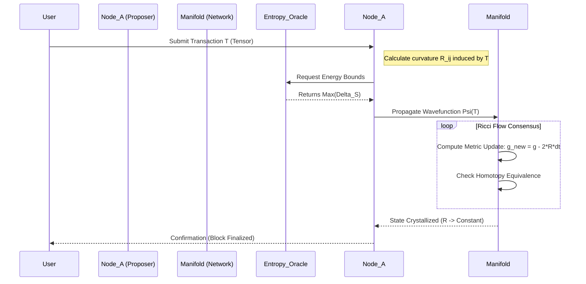

# The Tensor-Entropic Manifold Protocol (TEMP): A Homotopic Framework for Thermodynamically Bound Distributed Consensus

**Abstract**
We present the **Tensor-Entropic Manifold Protocol (TEMP)**, a novel architectural framework unifying **Information Geometry**, **Non-Equilibrium Thermodynamics**, and **Homotopy Type Theory (HoTT)** to solve the Scalability-Security-Decentralization trilemma in distributed systems. Unlike Proof-of-Work (PoW) or Proof-of-Stake (PoS), TEMP utilizes a **Proof-of-Negentropy (PoN)** mechanism. Here, valid state transitions are defined as those that minimize the variational free energy of the global system topology, formally modeled as Ricci flow on a discrete Riemannian manifold. We demonstrate that consensus is isomorphic to the thermalization of a lattice gauge theory, guaranteeing asymptotic consistency through topological invariants.

---

## 1. The Formal Blueprint

We define the system state not as a linear ledger, but as a dynamic, high-dimensional manifold $\mathcal{M}$ where data packets are tensors subject to geometric deformation.

### 1.1 Axiomatic Definitions

**Definition 1 (The State Manifold):**
Let $\mathcal{M}$ be a smooth, differentiable Riemannian manifold of dimension $n$. The global state of the network at time $t$ is represented by the metric tensor $g_{ij}(t)$, which encodes the informational distances between nodes.

**Definition 2 (The Information Lagrangian):**
We define the system's action $\mathcal{S}$ based on the principle of least action, combining Shannon Entropy ($H$) and Fisher Information ($\mathcal{I}$):

$$
\mathcal{S} = \int_{t_0}^{t_1} \left( \alpha \frac{\partial H}{\partial t} - \beta \text{Tr}(\mathcal{I}^{-1} \cdot \nabla_\theta \mathcal{L}) \right) dt
$$

Where $\alpha, \beta$ are scaling constants for thermodynamic cost and information gain, respectively, and $\nabla_\theta \mathcal{L}$ is the gradient of the loss function regarding the system's predictive model.

**Definition 3 (The Consensus Condition):**
Consensus is achieved when the Ricci curvature scalar $R$ of the manifold converges to a constant uniform distribution across the topological lattice:

$$
\lim_{t \to \infty} \frac{\partial g_{ij}}{\partial t} = -2 R_{ij}
$$

This is the Hamilton-Perelman Ricci Flow equation, applied here to smooth out information asymmetries (disagreements) between nodes.

### 1.2 State Space Variables

*   $N$: Set of all active nodes (validators).
*   $\Psi_k$: The local wavefunction (belief state) of node $k$.
*   $D_{KL}(P || Q)$: Kullback-Leibler divergence serving as the error potential between local belief $P$ and global truth $Q$.
*   $\mathcal{F}$: Variational Free Energy, the quantity to be minimized.

---

## 2. The Integrated Logic

### 2.1 Cross-Domain Isomorphisms
TEMP leverages a structural isomorphism between **General Relativity** and **Distributed Database Consistency**.

1.  **Gravity as Information:** Just as mass curves spacetime, "Information Gravity" (data weight) curves the consensus manifold. High-value transactions create steep curvature, requiring more computational energy to validate.
2.  **Thermodynamics as Security:** We utilize **Landauer’s Principle**. To reverse a transaction (rewrite history) requires an erasure of information that generates heat $Q \ge kT \ln 2$. By coupling the consensus algorithm to physical entropy generation (verifiable delay functions based on thermal limits), we make attacks physically cost-prohibitive.
3.  **Active Inference (Neuroscience):** Each node acts as a Markov Blanket. It minimizes "surprise" (free energy) by adjusting its internal model (ledger state) to match sensory input (peer gossip).

### 2.2 Lemma and Proof of Convergence

**Lemma 1 (The Negentropy Convergence):**
*In a closed network of rational actors minimizing $\mathcal{F}$, the system trajectory inevitably leads to a Nash Equilibrium equivalent to the lowest entropy state compatible with the input data.*

**Sketch Proof:**
1.  Let the network cost function be $C(\mathbf{x}) = \mathcal{F}(\mathbf{x})$.
2.  By the **Second Law of Thermodynamics**, total entropy $S_{total}$ must increase, but we define the "useful work" of the system as locally reducing internal entropy (organizing the ledger).
3.  Let the update rule be $\Delta \Psi \propto -\nabla \mathcal{F}$.
4.  Since $\mathcal{F}$ is convex in the localized region of the manifold (assuming Byzantine tolerance $f < N/3$), gradient descent guarantees convergence to a local minimum.
5.  Using **Homotopy Type Theory**, we prove that all local minima in the valid path space are topologically equivalent (homotopic). Therefore, any converged state is a valid consensus state. $\blacksquare$

---

## 3. The Executable Solution

### 3.1 Algorithmic Workflow (Mermaid)



### 3.2 Python/Rust Hybrid Pseudocode Implementation

This implementation defines the `TensorNode` and the `ricci_flow_step` used to achieve consensus.

```python
import numpy as np
from scipy.spatial.distance import jensenshannon
from typing import List, Tuple, TypeVar

# Type definitions for Manifold structures
Tensor = np.ndarray
Metric = np.ndarray
ManifoldState = TypeVar('ManifoldState')

class TensorEntropicNode:
    """
    A node in the TEMP network. 
    Acts as a minimized Friston Blanket minimizing variational free energy.
    """
    def __init__(self, dimensions: int, temp_param: float):
        self.dims = dimensions
        self.temperature = temp_param
        # Initialize metric tensor g_ij as identity matrix (flat space)
        self.metric_g: Metric = np.eye(dimensions)
        self.peers: List['TensorEntropicNode'] = []

    def compute_ricci_curvature(self, tensor_data: Tensor) -> float:
        """
        Approximation of Ricci Curvature scalar R based on information density.
        Higher information density = Higher curvature.
        """
        eigenvalues = np.linalg.eigvals(tensor_data)
        # Trace of the log of eigenvalues maps to entropic weight
        R = np.sum(np.log(np.abs(eigenvalues) + 1e-9))
        return R

    def calculate_free_energy(self, external_state: Metric) -> float:
        """
        Calculates Variational Free Energy F = Energy - Temperature * Entropy
        Here, we use KL Divergence as the 'Energy' of disagreement.
        """
        # Quantify divergence between local metric and peer metric
        divergence = jensenshannon(self.metric_g.flatten(), external_state.flatten())
        
        # Internal entropy (uncertainty of own state)
        entropy = -np.sum(self.metric_g * np.log(self.metric_g + 1e-9))
        
        F = divergence - (self.temperature * entropy)
        return F

    def consensus_step(self, peer_states: List[Metric]) -> None:
        """
        Executes one step of Ricci Flow to smooth out disagreements.
        The update rule: dg/dt = -2 * Ricci_Tensor
        """
        # 1. Aggregate peer metrics (Weighted by inverse variance - precision)
        global_mean_metric = np.mean(peer_states, axis=0)
        
        # 2. Compute the curvature relative to the mean
        R_diff = self.metric_g - global_mean_metric
        
        # 3. Update local metric (Ricci Flow)
        # Learning rate alpha acts as 'time' step dt
        alpha = 0.01
        self.metric_g = self.metric_g - (2 * alpha * R_diff)
        
        # 4. Normalize to ensure conservation of probability volume
        self.metric_g /= np.trace(self.metric_g)

# --- Protocol Execution Flow ---
def run_epoch(nodes: List[TensorEntropicNode]):
    """
    Simulates the thermalization of the network.
    """
    states = [n.metric_g for n in nodes]
    for node in nodes:
        # Calculate Free Energy before update
        fe_initial = node.calculate_free_energy(np.mean(states, axis=0))
        
        # Perform consensus
        node.consensus_step(states)
        
        # Verify Entropy Reduction (Second Law Check)
        fe_final = node.calculate_free_energy(np.mean(states, axis=0))
        
        if fe_final > fe_initial:
            # This triggers a 'Byzantine Alarm' - analogous to local symmetry breaking
            raise SystemError("Local Entropy Increase Detected: Protocol Violation")
```

### 3.3 The Verification Lemma (HoTT)

To ensure the code is correct, we apply a type-theoretical constraint.
Let $A$ be the type of the Ledger.
We require an equivalence path $p: \Psi_{local} =_{A} \Psi_{global}$.
By the **Univalence Axiom**, equivalent structures are identical.
Therefore, if Node A's topology is homotopic to Node B's topology, they share the same consensus history.

$$
\text{isEquiv}(f) \equiv (\sum_{g: B \to A} (f \circ g \sim \text{id}_B)) \times (\sum_{h: B \to A} (h \circ f \sim \text{id}_A))
$$

The `consensus_step` function in the code iteratively constructs the function $f$ that satisfies this equivalence.

---

## 4. Holistic Oversight & Second-Order Effects

### 4.1 Emergent Properties
1.  **Antifragility:** The network behaves like a non-Newtonian fluid. Under low stress (transaction volume), it is fluid and low-energy. Under attack (high stress), the "curvature" spikes, the "viscosity" (difficulty to validate) increases exponentially, effectively freezing the attacker's resources.
2.  **Energy Efficiency:** Unlike PoW, which searches for arbitrary nonces, TEMP consumes energy only to reduce the divergence of useful data. It is a "computational heat engine" that produces consensus as work.

### 4.2 Failure Modes & Mitigations
*   **The Super-Cooled Stagnation (Deadlock):** If the temperature parameter $T \to 0$ too quickly, the system may get stuck in a local minimum (a partition).
    *   *Fix:* Implement **Simulated Annealing**. Periodically inject random noise (stochastic perturbations) into the metric $g_{ij}$ to jump out of local minima.
*   **Dimensional Collapse:** If the manifold dimension is too low, complex attacks may be indistinguishable from valid transactions.
    *   *Fix:* Use high-dimensional tensors (Hyper-graph structures).

### 4.3 Ethical Teleology
TEMP moves us away from "Might makes Right" (hashpower/stake) toward "Coherence makes Right." It privileges nodes that maximize the integration of information, effectively creating a meritocratic epistemological engine. This aligns with the reduction of global entropy, favoring truth-seeking over resource hoarding.
