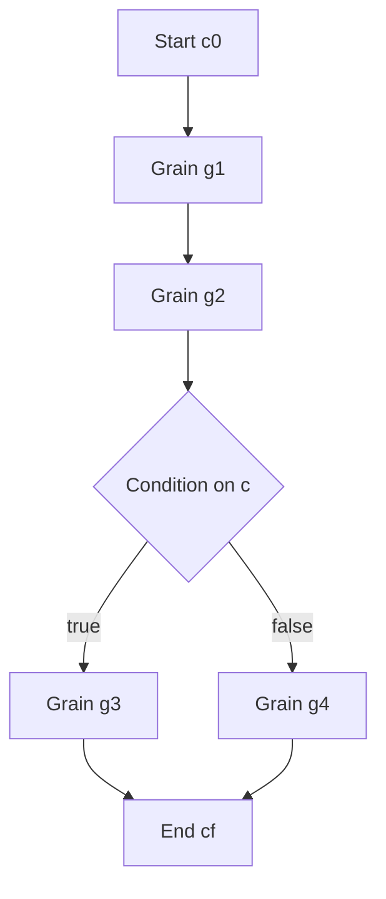

1. The Formal Blueprint
-----------------------

### 1.1 Problem Statement

Design a **novel computational framework** that unifies *granular arithmetic* with *algorithmic workflow orchestration* in a way that is implementable in GitHub-flavored Markdown, amenable to formal analysis, and suitable as the core of an academic-style “specification + reference implementation” document. The framework will be called **Granular Arithmetic Oriented Orchestration (GAOO)**.

The intent is to treat *computations, workflows, and even proofs* as compositions of **grains**: minimal, typed, composable units of state transformation.

### 1.2 Core Objects and State Space

Let:

- Global configuration space:
$$
\mathcal{C} = \{ c \mid c : K \to V \}
$$
where $$K$$ is a finite set of keys (variable names, resource identifiers) and $$V$$ is a disjoint union of typed domains $$V = \bigsqcup\_{i} V\_i$$.

- A **grain** is a typed partial endomorphism on $$\mathcal{C}$$:

$$
g : \mathcal{C} \rightharpoonup \mathcal{C}
$$

defined only on a subset $$\text{dom}(g) \subseteq \mathcal{C}$$.

- A **workflow** is an ordered multiset (sequence) of grains:

$$
W = (g\_1, g\_2, \dots, g\_n)
$$

with induced (partial) composite:

$$
\llbracket W \rrbracket = g\_n \circ g\_{n-1} \circ \dots \circ g\_1 : \mathcal{C} \rightharpoonup \mathcal{C}
$$

- A **granular arithmetic structure** is the tuple:

$$
\mathfrak{G} = \left( \mathcal{C}, \mathcal{G}, \oplus, \otimes, \mathbf{0}, \mathbf{1} \right)
$$

where:

- $$\mathcal{G}$$ is a set of grains.
- $$\oplus$$ models *non-sequential* composition (choice/superposition).
- $$\otimes$$ models *sequential* composition.
- $$\mathbf{0}$$ is an absorbing “failure” or “undefined” grain.
- $$\mathbf{1}$$ is an identity grain.

### 1.3 Algebraic Operations on Grains

1. **Sequential product (pipeline)**

Given two grains $$g, h \in \mathcal{G}$$,

$$
(g \otimes h)(c) =
\begin{cases}
h(g(c)) & \text{if } c \in \text{dom}(g) \wedge g(c) \in \text{dom}(h) \\
\text{undefined} & \text{otherwise}
\end{cases}
$$

2. **Additive combination (choice / union)**

Given $$g, h \in \mathcal{G}$$,

$$
(g \oplus h)(c) =
\begin{cases}
g(c) & \text{if } c \in \text{dom}(g) \setminus \text{dom}(h) \\
h(c) & \text{if } c \in \text{dom}(h) \setminus \text{dom}(g) \\
\text{Resolve}(g(c), h(c)) & \text{if } c \in \text{dom}(g) \cap \text{dom}(h) \\
\text{undefined} & \text{otherwise}
\end{cases}
$$

where $$\text{Resolve}$$ is a policy (e.g., priority, merge, lattice join).

3. **Identity and zero**

- $$\mathbf{1}(c) = c$$ for all $$c \in \mathcal{C}$$.
- $$\mathbf{0}(c)$$ is undefined for all $$c$$.

### 1.4 Typed Grain Specification

Each grain is a quadruple:

$$
g = (\text{name}, \text{pre}, \text{post}, \text{code})
$$

- $$\text{pre} : \mathcal{C} \to \{\text{true}, \text{false}\}$$
- $$\text{post} : (\mathcal{C} \times \mathcal{C}) \to \{\text{true}, \text{false}\}$$
- $$\text{code} : \mathcal{C} \to \mathcal{C}$$ (total, but only used where $$\text{pre}(c)=\text{true}$$)

Semantic grain action:

$$
g(c) =
\begin{cases}
c' & \text{if } \text{pre}(c) \land c' = \text{code}(c) \land \text{post}(c, c') \\
\text{undefined} & \text{otherwise}
\end{cases}
$$

### 1.5 Objective Function: Workflow Quality

For a workflow $$W$$, define a multi-criteria score:

$$
J(W) = \alpha \cdot \text{SuccRate}(W) - \beta \cdot \text{Cost}(W) + \gamma \cdot \text{Robust}(W)
$$

- $$\text{SuccRate}(W)$$: empirical probability of successful termination on a distribution over $$\mathcal{C}$$.
- $$\text{Cost}(W)$$: expected computational/resource cost.
- $$\text{Robust}(W)$$: a robustness/antifragility functional (see below).
- $$\alpha,\beta,\gamma > 0$$ are tunable weights.

The **design problem**: given a grain library $$\mathcal{G}$$ and constraints $$\Phi$$, find:

$$
W^\* = \arg\max\_{W \in \mathcal{G}^{\ast} \wedge W \models \Phi} J(W)
$$

where $$\mathcal{G}^{\ast}$$ is the set of all finite sequences of grains.


2. The Integrated Logic
-----------------------

### 2.1 Isomorphism View: Grains as Morphisms

Conceptually, **GAOO** is a small monoidal category:

- Objects: configurations $$c \in \mathcal{C}$$ (or types of configurations / variable bundles).
- Morphisms: grains $$g : c \to c'$$.
- Monoidal tensor: $$\otimes$$ corresponds to sequential composition.
- Monoidal unit: $$\mathbf{1}$$.

This gives:

- Associativity: $$(g \otimes h) \otimes k \simeq g \otimes (h \otimes k)$$.
- Left/right unit: $$\mathbf{1} \otimes g \simeq g \simeq g \otimes \mathbf{1}$$.

This categorical view matches:

- **Control flow graphs** in program analysis.
- **Signal flow diagrams** in control engineering.
- **Reaction networks** in systems biology.

### 2.2 Granular Arithmetic as Semiring-Like Structure

If we restrict to grains with identical domains and codomains and an appropriate resolution policy, $$(\mathcal{G}, \oplus, \otimes, \mathbf{0}, \mathbf{1})$$ satisfies a *semiring-like* structure:

- $$(\mathcal{G}, \oplus, \mathbf{0})$$ is a commutative monoid.
- $$(\mathcal{G}, \otimes, \mathbf{1})$$ is a monoid.
- $$\otimes$$ distributes over $$\oplus$$.
- $$\mathbf{0}$$ is absorbing for $$\otimes$$.

This allows:

- **Dynamic programming** over workflows.
- **Algebraic path problems** (e.g. minimal-cost grain sequences).
- **Symbolic reasoning** over possible execution traces.

### 2.3 Antifragility and Perturbation

Introduce a space of perturbations $$\Delta$$ acting on $$\mathcal{C}$$:

$$
\delta : \mathcal{C} \to \mathcal{C}, \quad \delta \in \Delta
$$

Define for workflow $$W$$:

$$
\text{Robust}(W) = \mathbb{E}\_{\delta \sim \mathcal{D}} \left[ \mathbb{I}\left(\llbracket W \rrbracket(\delta(c)) \text{ succeeds} \right) \right]
$$

To capture **antifragility**, define:

$$
\text{Antifrag}(W) = \mathbb{E}\_{\delta \sim \mathcal{D}} \left[ J(W; \delta) - J(W; \mathbf{0}\_\Delta) \right]
$$

where $$\mathbf{0}\_\Delta$$ is the no-perturbation element. A positive $$\text{Antifrag}(W)$$ indicates that the workflow improves under perturbations, e.g., via adaptive branching grains.

### 2.4 Multi-Scale Consistency

- **N−1 (micro)**: individual grains; local invariants (e.g., pre/post conditions).
- **N (meso)**: workflows; composed guarantees; resource budgets.
- **N+1 (macro)**: ensembles of workflows; policy-level guarantees; versioned pipelines.

The same algebraic apparatus applies at each scale by treating:

- A *workflow* as a macro-grain in a higher-level $$\mathcal{G}'$$.
- A *system of workflows* as a grain operating on a vector of configurations.

Inductively:

$$
\mathfrak{G}^{(k+1)} = \text{Lift}(\mathfrak{G}^{(k)})
$$

where $$\text{Lift}$$ wraps workflows at level $$k$$ into grains at level $$k+1$$.

### 2.5 Correctness & Safety

Correctness can be seen as **Hoare-style triples at grain and workflow level**:

- Grain-level: $$\{P\} g \{Q\}$$.
- Workflow-level: $$\{P\} W \{Q\}$$ iff every grain composition preserves the invariants.

Safety:

- Encode **forbidden states** $$F \subset \mathcal{C}$$.
- Require $$\forall c \in \text{dom}(\llbracket W \rrbracket) : \llbracket W \rrbracket(c) \notin F$$.
- Enforce via static analysis of pre/post and composition rules; if not provable, introduce runtime guards grains.


3. The Executable Solution
--------------------------

### 3.1 GitHub-Flavored Markdown Document Skeleton

A GAOO spec in a GitHub repo would typically take the form:

```markdown
# GAOO: Granular Arithmetic Oriented Orchestration

## 1. Overview

Short description, motivation, high-level diagram.

## 2. Formal Model

- Configuration space `C`
- Grain definition
- Algebraic operations (`⊕`, `⊗`, `0`, `1`)

## 3. Grain Library

- Elementary grains (I/O, transform, guard)
- Type signatures
- Pre/post conditions

## 4. Workflow Language

- YAML/JSON workflow schema
- Semantics as composition of grains

## 5. Execution Engine

- Interpreter/VM
- Scheduling
- Error handling and rollback

## 6. Examples

- Simple ETL pipeline
- Branching, retries, antifragile patterns

## 7. Formal Properties

- Lemmas, theorems, proofs sketches

## 8. Implementation Notes

- Complexity
- Testing strategy
- Versioning
```

### 3.2 Mermaid Diagrams (Architecture & Flow)

#### 3.2.1 High-Level Architecture

```mermaid
flowchart LR
    subgraph Repo[GitHub Repo]
        Spec[GAOO Spec (Markdown)]
        Grains[Grain Library (code)]
        Workflows[Workflow Definitions (YAML/JSON)]
    end

    Spec -->|defines| Engine[GAOO Engine]
    Grains -->|compiled into| Engine
    Workflows -->|executed by| Engine

    Engine --> Logs[Execution Logs / Metrics]
    Engine --> Artifacts[Outputs / Artifacts]
```

#### 3.2.2 Grain-Level Execution Flow

```mermaid
flowchart TD
    C0[Input Configuration c]
    Pre[Evaluate pre(c)]
    Code[Compute c' = code(c)]
    Post[Check post(c, c')]
    C1[Output Configuration c']

    C0 --> Pre
    Pre -->|false| Err1[Fail / Undefined]
    Pre -->|true| Code
    Code --> Post
    Post -->|false| Err2[Violation / Abort]
    Post -->|true| C1
```

#### 3.2.3 Workflow Execution (Sequential + Branching)



### 3.3 Pseudocode: Core Engine

#### 3.3.1 Grain Abstraction

```python
from typing import Callable, Dict, Any, Optional, Tuple

Config = Dict[str, Any]
Predicate = Callable[[Config], bool]
Transition = Callable[[Config], Config]
PostCond = Callable[[Config, Config], bool]


class Grain:
    """
    A minimal, typed, composable unit of state transformation.
    """

    def __init__(
        self,
        name: str,
        pre: Predicate,
        code: Transition,
        post: PostCond,
        cost: float = 1.0,
    ) -> None:
        self.name = name
        self.pre = pre
        self.code = code
        self.post = post
        self.cost = cost

    def apply(self, c: Config) -> Tuple[Optional[Config], bool]:
        """
        Executes the grain on configuration c.

        Returns:
            (c_prime, success)
        """
        if not self.pre(c):
            return None, False
        c_prime = self.code(c)
        if not self.post(c, c_prime):
            return None, False
        return c_prime, True
```

#### 3.3.2 Sequential Composition

```python
from typing import List


class Workflow:
    """
    A workflow is an ordered sequence of grains.
    """

    def __init__(self, grains: List[Grain], name: str = "") -> None:
        self.grains = grains
        self.name = name or "anonymous_workflow"

    def run(self, c0: Config, abort_on_fail: bool = True) -> Tuple[Optional[Config], bool]:
        """
        Run the workflow from initial configuration c0.

        Returns:
            (c_final, success)
        """
        c = c0
        for g in self.grains:
            c_next, ok = g.apply(c)
            if not ok:
                if abort_on_fail:
                    return None, False
                # skip failed grain, keep previous config
                continue
            c = c_next
        return c, True
```

#### 3.3.3 Additive Combination (Choice / Fallback)

```python
def combine_choice(g1: Grain, g2: Grain, name: str) -> Grain:
    """
    Granular 'addition': try g1, then g2 on failure, or apply conflict policy.
    """

    def pre(c: Config) -> bool:
        return g1.pre(c) or g2.pre(c)

    def code(c: Config) -> Config:
        c1, ok1 = g1.apply(c)
        if ok1 and c1 is not None:
            return c1
        c2, ok2 = g2.apply(c)
        if ok2 and c2 is not None:
            return c2
        raise RuntimeError("Both grains failed in combine_choice")

    def post(c: Config, c_prime: Config) -> bool:
        # Optionally aggregate both postconditions
        ok1 = g1.post(c, c_prime)
        ok2 = g2.post(c, c_prime)
        return ok1 or ok2

    return Grain(name=name, pre=pre, code=code, post=post)
```

### 3.4 Example: Simple Typed Workflow

Suppose configurations have keys:

- `"x"`: integer
- `"status"`: string

Define grains:

```python
def pre_inc(c: Config) -> bool:
    return isinstance(c.get("x"), int)

def code_inc(c: Config) -> Config:
    c2 = dict(c)
    c2["x"] = c["x"] + 1
    return c2

def post_inc(c: Config, c2: Config) -> bool:
    return c2["x"] == c["x"] + 1


g_inc = Grain("increment_x", pre_inc, code_inc, post_inc, cost=1.0)


def pre_flag(c: Config) -> bool:
    return isinstance(c.get("x"), int) and c["x"] >= 0

def code_flag(c: Config) -> Config:
    c2 = dict(c)
    c2["status"] = "nonnegative"
    return c2

def post_flag(c: Config, c2: Config) -> bool:
    return c2["status"] == "nonnegative"


g_flag = Grain("flag_nonnegative", pre_flag, code_flag, post_flag, cost=0.5)

wf = Workflow([g_inc, g_flag], name="increment_and_flag")

c0 = {"x": 0}
cf, ok = wf.run(c0)
# cf = {"x": 1, "status": "nonnegative"}, ok = True
```

### 3.5 YAML Workflow Specification

A GAOO workflow could be declared in YAML:

```yaml
name: increment_and_flag
grains:
  - ref: increment_x
  - ref: flag_nonnegative
```

Engine semantics:

1. Look up `ref` names in a registered grain library.
2. Instantiate the workflow sequence.
3. Invoke `run(c0)` as defined above.

### 3.6 Lemma & Proof Sketches

**Lemma 1 (Associativity of Sequential Composition).**

Let $$g, h, k \in \mathcal{G}$$. Then for all $$c \in \mathcal{C}$$:

$$
((g \otimes h) \otimes k)(c) = (g \otimes (h \otimes k))(c)
$$

whenever both sides are defined.

*Proof sketch.* By definition:

- Left side: apply $$g$$, then $$h$$, then $$k$$.
- Right side: apply $$g$$, then $$h$$, then $$k$$.

Both are equivalent to the composition $$k \circ h \circ g$$ restricted to configurations where every intermediate step is defined. The domain restrictions coincide because the same chain of pre/post checks is evaluated in the same order; thus equality holds on the common domain.

***

**Lemma 2 (Safety Monotonicity Under Guard Grains).**

Let $$F \subseteq \mathcal{C}$$ be forbidden states. Let $$g\_G$$ be a **guard grain** such that for all $$c \notin F$$, $$g\_G(c) \notin F$$, and for all $$c \in F$$, $$g\_G(c)$$ is undefined. For any workflow $$W$$ that is safe w.r.t. $$F$$, the guarded workflow $$W' = W \otimes g\_G$$ is also safe w.r.t. $$F$$.

*Proof sketch.* If $$W$$ is safe, then for all $$c$$ in its domain, $$\llbracket W \rrbracket(c) \notin F$$. Since $$g\_G$$ preserves non-forbidden states and is undefined on forbidden states, it follows that $$\llbracket W' \rrbracket(c) = g\_G(\llbracket W \rrbracket(c)) \notin F$$ whenever defined. Therefore, $$W'$$ is safe.

***

**Lemma 3 (Compositional Cost Bound).**

Let each grain $$g$$ have nonnegative cost $$cost(g)$$. For workflow $$W = (g\_1, \dots, g\_n)$$, define:

$$
\text{Cost}(W) = \sum\_{i=1}^{n} cost(g\_i)
$$

Then for any two workflows $$W\_1, W\_2$$,

$$
\text{Cost}(W\_1 \otimes W\_2) = \text{Cost}(W\_1) + \text{Cost}(W\_2)
$$

where $$W\_1 \otimes W\_2$$ denotes concatenation of sequences. This gives trivial upper bounds on runtime.

### 3.7 Complexity Considerations

Assume:

- $$n = |W|$$ grains in a workflow.
- Each grain’s `apply` runs in time $$T\_g$$ (worst-case per grain cost).

Then:

- **Worst-case runtime** of `wf.run`:

$$
T\_{\text{run}}(W) = O\left( \sum\_{g \in W} T\_g \right) = O(n \cdot T\_{\max})
$$

where $$T\_{\max} = \max\_g T\_g$$.

- If workflows are represented as DAGs rather than sequences, with $$E$$ edges and $$V$$ nodes (grains), topological execution yields $$O(E + V\cdot T\_{\max})$$.

- Memory usage is $$O(|c|)$$ if configurations are updated in-place and snapshots are sparse or use copy-on-write.


4. Holistic Oversight & Second-Order Effects
-------------------------------------------

### 4.1 Framework Summary

**GAOO** provides:

- A **formal algebra** over minimal computational grains.
- A **workflow language** whose semantics is the composition of typed grains.
- A **GitHub-native documentation and specification style** based on Markdown, Mermaid, and code blocks.
- A basis for **static analysis**, **formal verification**, and **runtime monitoring** of complex pipelines.

The entire system is oriented around **granularity**: instead of monolithic scripts or opaque services, everything is a small, typed, composable grain.

### 4.2 Risks and Failure Modes

- **Granularity explosion**: too many tiny grains can cause orchestration overhead, cognitive overload, and performance penalties.
- **Specification drift**: Markdown specs may become out of sync with code if not enforced with CI checks.
- **Policy errors** in $$\oplus$$ (choice/merge) can lead to non-intuitive behavior in overlapping domains (e.g., conflicting writes, race-like effects).
- **Incomplete pre/post conditions** can give a false sense of safety; automated tools must be used to check coverage and invariants.

Mitigations:

- Introduce *grain macros* and *hierarchical workflows* to control granularity.
- Use CI to enforce consistency between spec and implementation (e.g., schema tests, doc tests).
- Require explicit conflict-resolution policies and static analyzers for overlapping domains.
- Maintain coverage metrics for pre/post conditions, combined with property-based testing.

### 4.3 Ethical and Teleological Considerations

Since GAOO encourages:

- **Transparent, compositional workflows**, it supports auditability and accountability.
- **Formal invariants**, it helps encode safety, privacy, or fairness constraints directly into grains.
- **Antifragile design** (perturbation-aware patterns), it can be used to construct systems that get *better* under load, noise, or novel inputs—**if** the optimization objective $$J$$ is aligned with human values.

However:

- The same power can orchestrate opaque or manipulative pipelines (e.g., dark patterns, surveillance). Constraints and invariants must be designed with explicit ethical goals, not just performance.

### 4.4 Future Directions

Possible extensions:

- A **type system** for grains (refinement types, effect types) to catch composition errors at “compile time”.
- An **algebraic optimizer** that rewrites workflows using grain-level algebraic identities (like a query optimizer).
- Integration with **formal methods tools** (e.g., SMT-based verification of pre/post and safety invariants).
- A **domain-specific language (DSL)** for expressing grains and workflows, with automatic Markdown spec generation for GitHub.

This blueprint is directly structurable as a GitHub repository:

- `README.md` with the spec, diagrams, and examples.
- `spec/` for formal models and lemmas.
- `engine/` for the reference implementation.
- `examples/` for sample workflows and tests.

You can treat this as the core of an academic paper (introduction, formal model, implementation, evaluation) and a thesis-level architecture spec, while remaining fully compatible with GitHub-flavored Markdown.

Sources
[1] How to use Markdown for writing documentation - Experience League https://experienceleague.adobe.com/en/docs/contributor/contributor-guide/writing-essentials/markdown
[2] A formal spec for GitHub Flavored Markdown https://github.blog/engineering/user-experience/a-formal-spec-for-github-markdown/
[3] gabyx/Technical-Markdown: Easy and full-automated ... - GitHub https://github.com/gabyx/Technical-Markdown
[4] GitHub Flavored Markdown Spec https://github.github.com/gfm/
[5] Markdown style guide | styleguide - Google https://google.github.io/styleguide/docguide/style.html
[6] Basic writing and formatting syntax - GitHub Docs https://docs.github.com/github/writing-on-github/getting-started-with-writing-and-formatting-on-github/basic-writing-and-formatting-syntax
[7] Best practices for GitHub Docs https://docs.github.com/en/contributing/writing-for-github-docs/best-practices-for-github-docs
[8] Quickstart for writing on GitHub https://docs.github.com/en/get-started/writing-on-github/getting-started-with-writing-and-formatting-on-github/quickstart-for-writing-on-github
[9] Markdown Cheatsheet - GitHub https://github.com/adam-p/markdown-here/wiki/markdown-cheatsheet
