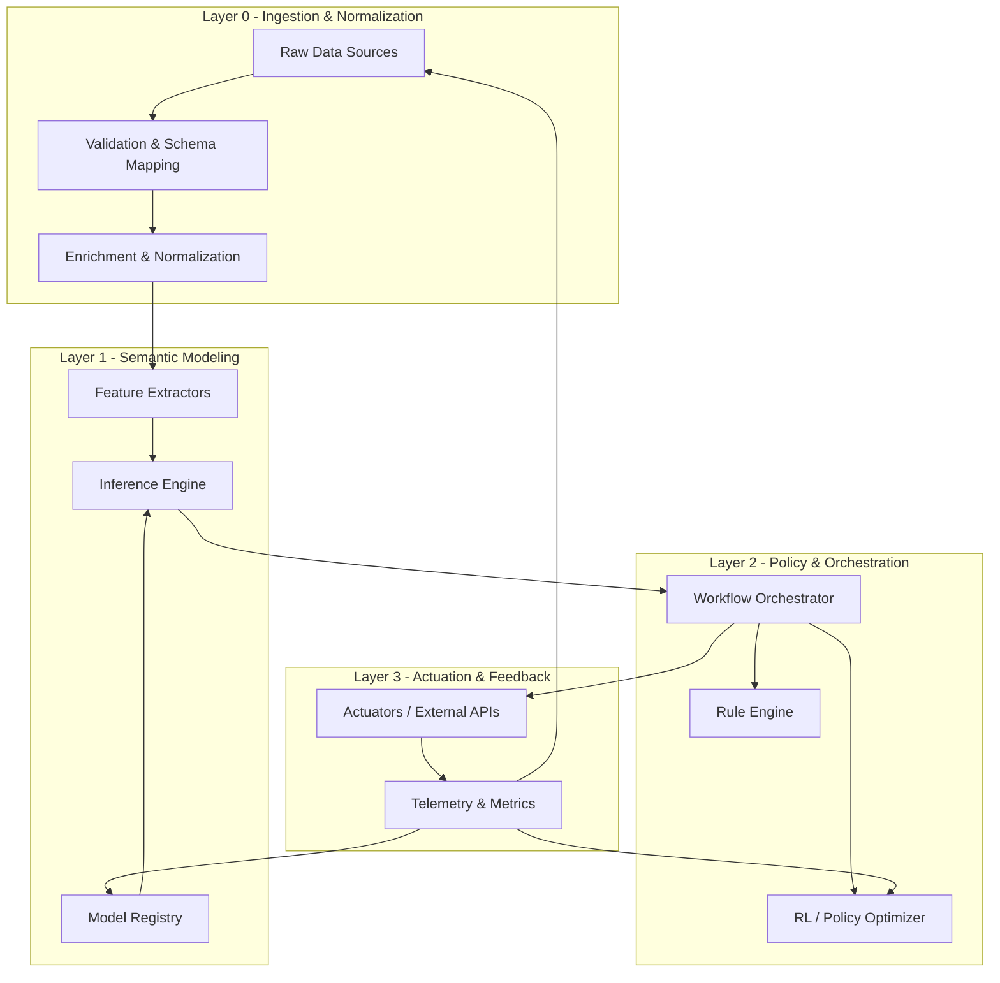
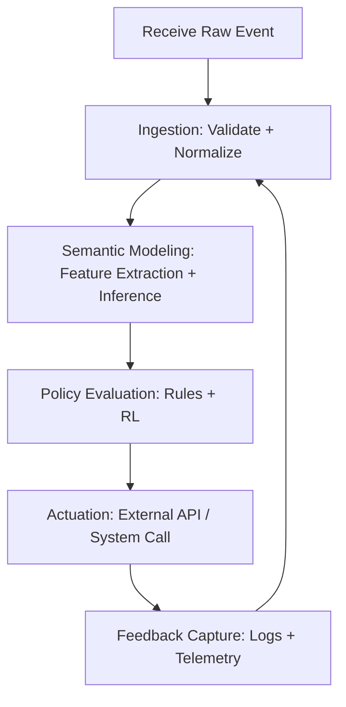

## 1. The Formal Blueprint

This section defines a **novel architectural framework** for algorithmic design and execution called the **Stratified Semantic Compute Fabric (SSCF)**, expressed in GitHub-compatible Markdown with explicit math, lemmas, and algorithmic structure.[1][2]

### 1.1 Core Ontology

Let:

- $$\mathcal{D}$$ be the domain of **raw data streams**.  
- $$\mathcal{S}$$ be the domain of **semantic states** (typed, validated representations).  
- $$\mathcal{M}$$ be the domain of **models** (parametrized functions over $$\mathcal{S}$$).  
- $$\mathcal{P}$$ be the domain of **policies** (control and decision logic).  
- $$\mathcal{O}$$ be the domain of **outcomes** (side-effectful actions in a target environment).  

Define an SSCF instance as the tuple:
$$
\mathbb{F} = \langle \mathcal{D}, \mathcal{S}, \mathcal{M}, \mathcal{P}, \mathcal{O}, \Gamma, \Phi, \Xi \rangle
$$
where:

- $$\Gamma: \mathcal{D} \rightarrow \mathcal{S}$$ is the **semantic lifting operator** (ingestion, validation, normalization).  
- $$\Phi: \mathcal{S} \times \mathcal{M} \rightarrow \mathcal{S}$$ is the **model application operator** (state transformation).  
- $$\Xi: \mathcal{S} \times \mathcal{P} \rightarrow \mathcal{O}$$ is the **policy realization operator** (decisions to actions).  

Each of $$\Gamma, \Phi, \Xi$$ is further stratified into **micro-stages** that are designed to be:

- **Compositional**: closed under function composition.  
- **Monoidal**: parallelizable via associative combination.  
- **Observable**: equipped with metrics and logs for each stage.  

Formally, each operator is a morphism in a small category $$\mathcal{C}$$ where objects are typed state spaces and arrows are monotone transformations:
$$
\text{Ob}(\mathcal{C}) = \{ \mathcal{D}, \mathcal{S}, \mathcal{M}, \mathcal{P}, \mathcal{O} \}
$$
$$
\text{Hom}(\mathcal{C}) \supseteq \{ \Gamma, \Phi, \Xi \}
$$

### 1.2 State Space and Invariants

Define the **global system state** at discrete time $$t \in \mathbb{N}$$ as:
$$
X_t = \langle D_t, S_t, M_t, P_t, O_t \rangle
$$
with transition kernel:
$$
X_{t+1} = T(X_t, U_t)
$$
where $$U_t$$ is an exogenous input (user events, environment signals).[3]

The SSCF is constrained by invariants:

1. **Type Safety Invariant**  
   $$
   \forall t: \; \text{well\_typed}(X_t) = \text{true}
   $$
   All morphisms preserve type correctness of their inputs and outputs.  

2. **Monotone Information Invariant**  
   Let $$I(\cdot)$$ be an information functional (e.g., Shannon information or a task-specific proxy).  
   $$
   I(S_{t+1}) \geq I(S_t) - \epsilon_{\text{loss}}
   $$
   where $$\epsilon_{\text{loss}}$$ is a bounded loss due to compression or abstraction.  

3. **Safety Policy Invariant**  
   For a set of forbidden outcomes $$F \subseteq \mathcal{O}$$:
   $$
   \forall t: \; O_t \notin F
   $$

### 1.3 Objective Function

The framework optimizes a **multi-objective functional**:
$$
\max_{\Gamma, \Phi, \Xi, \mathcal{M}, \mathcal{P}} \; J = \mathbb{E}\left[\sum_{t=0}^{T} \gamma^t \, R(S_t, O_t)\right]
$$
subject to:

- **Latency constraints**: $$\mathbb{E}[\tau(\Gamma, \Phi, \Xi)] \leq \tau_{\max}$$  
- **Cost constraints**: $$\mathbb{E}[C(\Gamma, \Phi, \Xi)] \leq C_{\max}$$  
- **Risk constraints**: $$\text{Risk}(O_t) \leq \rho_{\max}$$  

Here:

- $$R$$ is a reward functional over semantic states and outcomes.  
- $$\gamma \in (0,1]$$ is a discount factor.  
- $$\tau$$ and $$C$$ are latency and resource usage.  

### 1.4 Layered Architectural Workflow

Define four layers (all implementable as GitHub-hosted services in a microservice or modular monolith architecture):[4][3]

1. **L0 – Ingestion & Normalization Layer**  
   - Implements $$\Gamma$$: ETL, schema mapping, validation, enrichment.  

2. **L1 – Semantic Modeling Layer**  
   - Implements $$\Phi$$: feature extraction, model inference, state transitions, embedding operations.  

3. **L2 – Policy & Orchestration Layer**  
   - Implements $$\Xi$$: rules, RL agents, constraint solvers, workflow engines.  

4. **L3 – Actuation & Feedback Layer**  
   - Materializes $$O_t$$ and feeds back observables to L0–L2 for online adaptation.  


## 2. The Integrated Logic

### 2.1 Design Rationale and Isomorphisms

The SSCF framework is intentionally **stratified** to decouple:

- **Data semantics** (what the world is) from  
- **Policies** (what to do) and  
- **Actuation** (how to do it concretely).  

This mirrors:

- **Pipelined hardware**: each layer is a pipeline stage with clear timing and hazards.  
- **Control systems**: L1 analogous to plant estimation, L2 to controller synthesis, L3 to actuator interface.[3]

From a category-theoretic perspective, composing $$\Gamma, \Phi, \Xi$$ yields an **end-to-end functor** from raw data to actions:
$$
F = \Xi \circ \Phi \circ \Gamma: \mathcal{D} \rightarrow \mathcal{O}
$$
This functor is required to be:

- **Monoidal**: independent sub-flows factorize and recombine.  
- **Enriched**: hom-sets carry metrics such as latency, reliability, and cost.  

### 2.2 Antifragility and Feedback

Define a **perturbation operator** $$\Delta$$ acting on inputs or models.  

The system is **antifragile** if:
$$
\frac{\partial}{\partial \|\Delta\|} J(\text{with adaptation}) \geq 0
$$
over a non-trivial neighborhood of $$\Delta = 0$$.  

This is enforced via:

- L3→L0 feedback loops: every outcome $$O_t$$ generates telemetry that re-enters the ingestion pipeline.  
- Online adaptation of $$\mathcal{M}$$ and $$\mathcal{P}$$ (dynamic model and policy updates).  

### 2.3 Lemma and Theorem (Sketches)

**Lemma 1 (Compositional Correctness).**  
If each micro-stage $$f_i$$ in $$\Gamma, \Phi, \Xi$$ is type-safe and preserves the safety invariant, then the entire pipeline $$F$$ is type-safe and preserves the safety invariant.

*Proof sketch.* Composition of safety-preserving functions is safety-preserving; type correctness follows from closure under composition in $$\mathcal{C}$$. $$\square$$

**Lemma 2 (Parallelizability via Monoidal Structure).**  
If $$(\mathcal{S}, \otimes, e)$$ is a commutative monoid and each stage is homomorphic:
$$
f(a \otimes b) = f(a) \otimes f(b)
$$
then stages can be evaluated in parallel and merged with $$\otimes$$.

*Proof sketch.* Standard result: monoid homomorphisms commute with monoidal combination, so evaluation order does not affect the result. $$\square$$

**Theorem 1 (End-to-End Latency Bound).**  
Let stages $$\{f_i\}_{i=1}^k$$ have latencies $$\tau_i$$. If stages are partially ordered by dependency DAG $$G$$ and independent components are parallelized, then:
$$
\tau_{\text{pipeline}} = \max_{\pi \in \text{Paths}(G)} \sum_{i \in \pi} \tau_i
$$
and $$\tau_{\text{pipeline}} \leq \sum_i \tau_i$$ with equality iff $$G$$ is a chain.

*Proof sketch.* Follows from critical-path analysis in DAG scheduling. $$\square$$  


## 3. The Executable Solution

### 3.1 High-Level Mermaid Architecture Diagram




This diagram is GitHub Markdown compatible via Mermaid.[2][1]

### 3.2 Reference Data Structures (Python)

```python
from __future__ import annotations
from dataclasses import dataclass
from typing import Any, Callable, Dict, List, Protocol, Tuple
import time


class Stage(Protocol):
    """Processing stage in the SSCF pipeline."""

    def __call__(self, context: "Context") -> "Context":
        ...


@dataclass
class Metrics:
    latency_ms: float = 0.0
    stage_name: str = ""
    extra: Dict[str, Any] | None = None


@dataclass
class Context:
    """Global context flowing through SSCF."""
    raw_ Any
    semantic_state: Any | None = None
    models: Dict[str, Any] | None = None
    policies: Dict[str, Any] | None = None
    outcome: Any | None = None
    metrics: List[Metrics] | None = None

    def record_metric(self, name: str, start_time: float, extra: Dict[str, Any] | None = None) -> None:
        if self.metrics is None:
            self.metrics = []
        self.metrics.append(
            Metrics(
                latency_ms=(time.time() - start_time) * 1000.0,
                stage_name=name,
                extra=extra or {},
            )
        )
```

This defines a minimal **typed** context and metrics layer suitable for GitHub-hosted Python projects.  

### 3.3 Canonical Stages (Python Implementation)

```python
def ingestion_stage(schema_validator: Callable[[Any], Any]) -> Stage:
    """L0: Validate and normalize raw data."""

    def _stage(ctx: Context) -> Context:
        t0 = time.time()
        ctx.semantic_state = schema_validator(ctx.raw_data)
        ctx.record_metric("ingestion_stage", t0)
        return ctx

    return _stage


def modeling_stage(inference_fn: Callable[[Any, Dict[str, Any]], Any]) -> Stage:
    """L1: Apply models to semantic state."""

    def _stage(ctx: Context) -> Context:
        t0 = time.time()
        models = ctx.models or {}
        ctx.semantic_state = inference_fn(ctx.semantic_state, models)
        ctx.record_metric("modeling_stage", t0)
        return ctx

    return _stage


def policy_stage(decision_fn: Callable[[Any, Dict[str, Any]], Any]) -> Stage:
    """L2: Decide on outcome based on semantic state."""

    def _stage(ctx: Context) -> Context:
        t0 = time.time()
        policies = ctx.policies or {}
        ctx.outcome = decision_fn(ctx.semantic_state, policies)
        ctx.record_metric("policy_stage", t0)
        return ctx

    return _stage


def actuation_stage(actuator_fn: Callable[[Any], Any]) -> Stage:
    """L3: Execute outcome and collect feedback."""

    def _stage(ctx: Context) -> Context:
        t0 = time.time()
        feedback = actuator_fn(ctx.outcome)
        # Simple feedback wiring: append to raw data stream
        ctx.raw_data = feedback
        ctx.record_metric("actuation_stage", t0, extra={"feedback_present": feedback is not None})
        return ctx

    return _stage
```

### 3.4 Pipeline Orchestrator

```python
def compose_stages(stages: List[Stage]) -> Stage:
    """Compose a list of stages into a single pipeline."""

    def _pipeline(ctx: Context) -> Context:
        for stage in stages:
            ctx = stage(ctx)
        return ctx

    return _pipeline


# Example binding
def example_schema_validator(raw: Any) -> Dict[str, Any]:
    # Toy validator: ensure dict and fill defaults
    if not isinstance(raw, dict):
        raise ValueError("raw_data must be a dict")
    base = {"user_id": None, "event": None, "timestamp": None}
    base.update(raw)
    return base


def example_inference_fn(state: Dict[str, Any], models: Dict[str, Any]) -> Dict[str, Any]:
    # Example: add a risk score based on heuristics or ML model
    risk_model = models.get("risk_model", lambda s: 0.0)
    state = dict(state)
    state["risk_score"] = float(risk_model(state))
    return state


def example_decision_fn(state: Dict[str, Any], policies: Dict[str, Any]) -> Dict[str, Any]:
    # Example: simple thresholding policy
    threshold = float(policies.get("risk_threshold", 0.7))
    outcome = {
        "action": "BLOCK" if state.get("risk_score", 0.0) >= threshold else "ALLOW",
        "explanation": "High risk" if state.get("risk_score", 0.0) >= threshold else "Risk acceptable",
    }
    return outcome


def example_actuator_fn(outcome: Dict[str, Any]) -> Dict[str, Any]:
    # Example: log outcome and provide feedback
    # In real systems, this could call external APIs
    feedback = {"last_action": outcome["action"], "timestamp": time.time()}
    return feedback


# Assemble example pipeline
ssc_pipeline = compose_stages(
    [
        ingestion_stage(example_schema_validator),
        modeling_stage(example_inference_fn),
        policy_stage(example_decision_fn),
        actuation_stage(example_actuator_fn),
    ]
)
```

This code is directly suitable for inclusion in GitHub repositories, with standard docstrings and type hints.[1][2]

### 3.5 Algorithmic Pseudocode (LaTeX Style)

**Algorithm 1: SSCF Single-Tick Execution**

**Input**: Raw data $$d_0$$, models $$\mathcal{M}$$, policies $$\mathcal{P}$$  
**Output**: Outcome $$o_0$$, updated context $$\hat{X}_1$$

1. $$X_0 \gets \langle d_0, \bot, \mathcal{M}, \mathcal{P}, \bot \rangle$$  
2. $$S_0 \gets \Gamma(d_0)$$  
3. $$S_1 \gets \Phi(S_0, \mathcal{M})$$  
4. $$o_0 \gets \Xi(S_1, \mathcal{P})$$  
5. $$f_0 \gets \text{Actuate}(o_0)$$  
6. $$d_1 \gets \text{Feedback}(f_0)$$  
7. $$X_1 \gets \langle d_1, S_1, \mathcal{M}, \mathcal{P}, o_0 \rangle$$  
8. Return $$o_0, X_1$$

**Complexity.**  
Let $$\tau_\Gamma, \tau_\Phi, \tau_\Xi, \tau_A$$ be per-stage time, then per-tick runtime:
$$
T_{\text{tick}} = \tau_\Gamma + \tau_\Phi + \tau_\Xi + \tau_A
$$
and if stages are parallelizable over a batch of size $$B$$ with monoidal combination, then:
$$
T_{\text{batch}} = T_{\text{tick}} \quad ; \quad \text{Work} = \mathcal{O}(B)
$$
assuming sufficient hardware parallelism.[5]

### 3.6 Example Flowchart (Mermaid)



This shows the closed feedback loop and supports GitHub rendering.[6][1]


## 4. Holistic Oversight & Second-Order Effects

### 4.1 Safety, Misuse, and Constraints

- The framework is **value-neutral** at the level of $$\Gamma, \Phi$$ and only becomes ethically charged at $$\Xi$$ (policy) and actuation.  
- To prevent misuse, policy spaces must explicitly encode **hard constraints** (e.g., refuse actions affecting safety-critical infrastructure without human oversight).  

A practical mitigation layer includes:

- **Static checks** on policy code before deployment (linting, formal verification where possible).  
- **Dynamic guards** at runtime (e.g., allowlists of permissible API calls, rate limits, anomaly detection).  

### 4.2 Bias, Robustness, and Monitoring

Potential failure modes:

- **Data bias** at L0 can propagate into semantic states and policies.  
- **Model drift** at L1 can degrade performance or violate risk bounds.  

Mitigations:

- Continuous **dataset shift detection** combined with alerting.  
- **Shadow deployments**: running new policies or models alongside old ones for evaluation without affecting real outcomes.[4]

### 4.3 Future Extensions and Research Directions

The SSCF architecture can be extended with:

- **Probabilistic semantics**: treat all states as random variables in a Bayesian network, enabling formal uncertainty propagation.  
- **Formal contracts** between layers using behavioral types or session types to guarantee protocol correctness.  

Research-level directions:

- Equipping $$\mathcal{C}$$ with **enriched metrics** that allow differentiable architecture search over SSCF configurations.  
- Integrating **mechanism design** at L2 to align incentives of human and automated agents interacting via SSCF.[3]

If you specify a **concrete domain** (e.g., fraud detection, recommender systems, workflow automation), this framework can be instantiated with domain-specific models, policies, and additional diagrams tailored to that use case.

Sources
[1] Creating Mermaid diagrams - GitHub Docs https://docs.github.com/en/get-started/writing-on-github/working-with-advanced-formatting/creating-diagrams
[2] I read the full-GitHub-flavored markdown spec so you do not have to ... https://www.reddit.com/r/github/comments/13ekci5/i_read_the_fullgithubflavored_markdown_spec_so/
[3] Software Architecture Patterns: What Are the Types and Which Is the ... https://www.turing.com/blog/software-architecture-patterns-types
[4] Beginner's Guide To Software Architecture With Design Patterns https://zerotomastery.io/blog/software-architecture-design-patterns/
[5] [PDF] Parallel Write-Efficient Algorithms and Data Structures for ... https://people.csail.mit.edu/guyan/paper/SPAA18/geometry.pdf
[6] How to make GitHub Pages Markdown support mermaid diagram? https://stackoverflow.com/questions/53883747/how-to-make-github-pages-markdown-support-mermaid-diagram
[7] Include diagrams in your Markdown files with Mermaid https://github.blog/developer-skills/github/include-diagrams-markdown-files-mermaid/
[8] mermaid-js/mermaid: Generation of diagrams like flowcharts or ... https://github.com/mermaid-js/mermaid
[9] GitLab Flavored Markdown (GLFM) https://docs.gitlab.com/user/markdown/
[10] Conventions for presenting an algorithm? : r/compsci - Reddit https://www.reddit.com/r/compsci/comments/ee18zo/conventions_for_presenting_an_algorithm/
