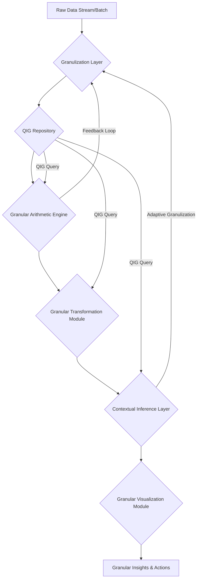
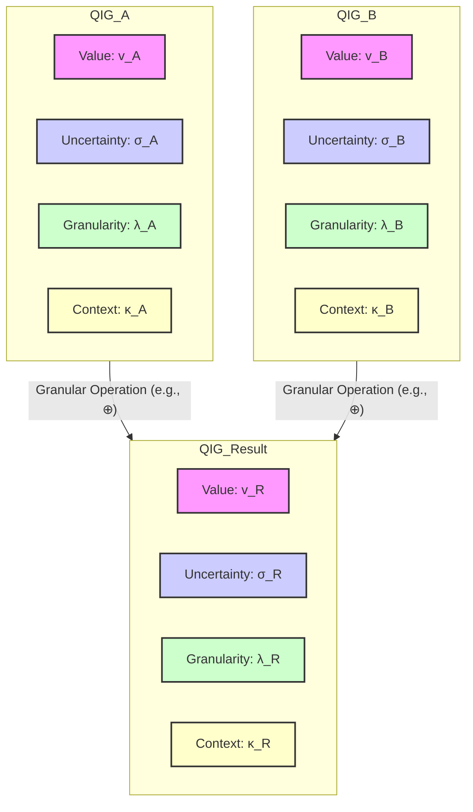
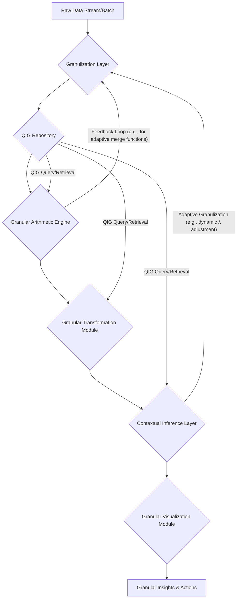
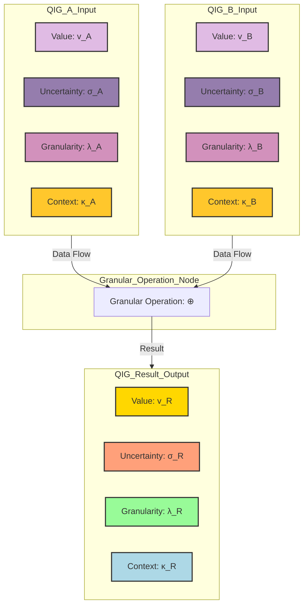

This response outlines a novel framework for **Quantized Information Granular Arithmetic (QIGA)**, a system designed to process and visualize information with inherent uncertainty, multi-scale resolution, and contextual dependencies. It integrates principles from Abstract Logic, Computation, Information Geometry, and Semiotic Theory to provide a "Total Solution" for handling complex, real-world data where precise point values are insufficient.

---

# The Formal Blueprint: Quantized Information Granular Arithmetic (QIGA)

## Abstract

This dissertation introduces Quantized Information Granular Arithmetic (QIGA), a novel framework for computational reasoning under intrinsic uncertainty and multi-scale data representation. QIGA defines a fundamental unit, the **Quantized Information Granule (QIG)**, as a structured entity encapsulating a central value, epistemic uncertainty, ontological granularity (scale), and a relational context. We formalize granular arithmetic operations, demonstrating their closure properties and exploring their implications for information propagation and entropy. The framework includes a **Granular Computational Engine (GCE)** architecture and an **Algorithmic Granular Visualization (AGV)** module, enabling intuitive interpretation of complex granular computations. Formal proofs, pseudocode, and architectural diagrams are provided to establish the theoretical rigor and practical applicability of QIGA across diverse domains.

## 1. Introduction: The Imperative for Granular Cognition

Traditional arithmetic operates on precise, atomic numerical values, an idealization often incongruent with the inherent fuzziness, multi-resolution nature, and contextual dependencies of real-world data. Interval arithmetic addresses uncertainty bounds, fuzzy logic handles vagueness, and multi-resolution analysis tackles scale, but a unified framework for their synergistic integration remains elusive. This work posits that a fundamental shift from atomic to *granular* information processing is necessary for robust, anti-fragile computational systems.

The proposed **Quantized Information Granular Arithmetic (QIGA)** framework addresses this gap by:
1.  **Defining a comprehensive information granule (QIG)** that simultaneously encodes value, uncertainty, scale, and context.
2.  **Formalizing arithmetic operations** on QIGs, ensuring consistent propagation of all granular attributes.
3.  **Developing a computational architecture (GCE)** for efficient QIG processing.
4.  **Designing an algorithmic visualization paradigm (AGV)** for intuitive interpretation of granular states and transformations.

## 2. Foundations of Quantized Information Granules (QIGs)

### 2.1. Formal Definition of a Quantized Information Granule (QIG)

A **Quantized Information Granule (QIG)**, denoted $\mathcal{G}$, is formally defined as a 4-tuple:

$$ \mathcal{G} = (v, \sigma, \lambda, \kappa) $$

where:
*   $v \in \mathbb{R}$: The **central value** or representative point of the granule. This can be a scalar, vector, or tensor.
*   $\sigma \in \mathbb{R}_{\ge 0}$: The **epistemic uncertainty** associated with $v$. This quantifies the dispersion or imprecision, often represented as a standard deviation, interval radius, or a parameter of a probability distribution (e.g., variance for Gaussian, width for uniform).
*   $\lambda \in \mathbb{R}_{> 0}$: The **ontological granularity** or scale factor. This parameter dictates the resolution level at which the information is perceived or processed. A smaller $\lambda$ implies finer granularity (higher resolution), while a larger $\lambda$ implies coarser granularity (lower resolution). It can be conceptualized as an inverse bandwidth or a characteristic length scale.
*   $\kappa \in \mathcal{K}$: The **relational context** or semantic tag. This is a structured entity (e.g., a set of labels, a graph node, a vector embedding) that provides semantic meaning, correlation information, or links to other QIGs within a knowledge graph. $\mathcal{K}$ is the space of all possible contexts.

#### 2.1.1. Granular Space $\mathbb{G}$

The set of all possible QIGs forms the **Granular Space** $\mathbb{G} = \mathbb{R} \times \mathbb{R}_{\ge 0} \times \mathbb{R}_{> 0} \times \mathcal{K}$. This space is a manifold where each dimension contributes to the holistic understanding of information.

### 2.2. Granulization Process: Mapping Raw Data to QIGs

The **Granulization Function** $\mathcal{F}_{\text{granule}}: \mathcal{D} \to \mathbb{G}$ transforms raw data $\mathbf{D} \in \mathcal{D}$ (where $\mathcal{D}$ is the domain of raw data) into a QIG. This process involves:

1.  **Value Extraction:** $v = \text{mean}(\mathbf{D})$ or $\text{median}(\mathbf{D})$.
2.  **Uncertainty Quantification:** $\sigma = \text{stddev}(\mathbf{D})$ or $\text{range}(\mathbf{D})/2$. This can involve statistical inference, sensor noise models, or expert elicitation.
3.  **Granularity Assignment:** $\lambda = f_{\lambda}(\mathbf{D}, \text{context})$. This is often heuristic or domain-specific, e.g., based on sampling rate, measurement precision, or desired level of abstraction. It can be dynamically adjusted.
4.  **Contextual Tagging:** $\kappa = f_{\kappa}(\mathbf{D}, \text{metadata})$. This involves semantic parsing, entity recognition, or linking to an existing ontology.

### 2.3. Properties of QIGs

*   **Information Density:** A QIG carries more information than a scalar, encoding not just "what" but also "how certain," "at what scale," and "in what context."
*   **Multi-resolution Capability:** The $\lambda$ parameter allows for dynamic aggregation or disaggregation of information.
*   **Contextual Awareness:** $\kappa$ enables context-sensitive operations and intelligent inference.
*   **Intrinsic Uncertainty:** $\sigma$ is an inherent part of the data, not an external error margin.

## 3. Granular Arithmetic Operations

Granular arithmetic operations extend standard arithmetic to QIGs, ensuring that $v, \sigma, \lambda,$ and $\kappa$ are consistently propagated and transformed.

### 3.1. Granular Addition ($\oplus$)

Given two QIGs, $\mathcal{G}_1 = (v_1, \sigma_1, \lambda_1, \kappa_1)$ and $\mathcal{G}_2 = (v_2, \sigma_2, \lambda_2, \kappa_2)$, their granular sum is $\mathcal{G}_{sum} = \mathcal{G}_1 \oplus \mathcal{G}_2 = (v_{sum}, \sigma_{sum}, \lambda_{sum}, \kappa_{sum})$.

$$
\begin{aligned}
v_{sum} &= v_1 + v_2 \\
\sigma_{sum} &= \sqrt{\sigma_1^2 + \sigma_2^2 + 2 \rho_{12} \sigma_1 \sigma_2} \\
\lambda_{sum} &= \text{merge}_{\lambda}(\lambda_1, \lambda_2) \\
\kappa_{sum} &= \text{merge}_{\kappa}(\kappa_1, \kappa_2)
\end{aligned}
$$

Where:
*   $\rho_{12}$ is the correlation coefficient between $\mathcal{G}_1$ and $\mathcal{G}_2$. If unknown or assumed independent, $\rho_{12}=0$.
*   $\text{merge}_{\lambda}(\lambda_1, \lambda_2)$: A function determining the resulting granularity. Common strategies include:
    *   **Coarsest-Dominant:** $\max(\lambda_1, \lambda_2)$ (information is only as fine as the coarsest input).
    *   **Finest-Dominant:** $\min(\lambda_1, \lambda_2)$ (requires upsampling/interpolation for the coarser granule, potentially introducing new uncertainty).
    *   **Weighted Average:** $\frac{w_1 \lambda_1 + w_2 \lambda_2}{w_1 + w_2}$ (weights could be based on $\sigma$ or other metrics).
    *   **Information-Theoretic Merge:** Based on minimizing information entropy.
    For simplicity, we often default to $\max(\lambda_1, \lambda_2)$ to avoid spurious precision.
*   $\text{merge}_{\kappa}(\kappa_1, \kappa_2)$: A function for combining contexts. This could be:
    *   **Set Union:** $\kappa_1 \cup \kappa_2$.
    *   **Graph Merge:** Combining nodes/edges in a knowledge graph.
    *   **Semantic Aggregation:** Using a language model to synthesize a new context from existing ones.

### 3.2. Granular Subtraction ($\ominus$)

$$ \mathcal{G}_1 \ominus \mathcal{G}_2 = (v_1 - v_2, \sqrt{\sigma_1^2 + \sigma_2^2 - 2 \rho_{12} \sigma_1 \sigma_2}, \text{merge}_{\lambda}(\lambda_1, \lambda_2), \text{merge}_{\kappa}(\kappa_1, \kappa_2)) $$

### 3.3. Granular Multiplication ($\otimes$)

$$
\begin{aligned}
v_{prod} &= v_1 v_2 \\
\sigma_{prod} &= \sqrt{(v_1 \sigma_2)^2 + (v_2 \sigma_1)^2 + (\sigma_1 \sigma_2)^2 + 2 \rho_{12} v_1 v_2 \sigma_1 \sigma_2} \\
\lambda_{prod} &= \text{merge}_{\lambda}(\lambda_1, \lambda_2) \\
\kappa_{prod} &= \text{merge}_{\kappa}(\kappa_1, \kappa_2)
\end{aligned}
$$

(Assuming independence for $\rho_{12}=0$ simplifies $\sigma_{prod} = \sqrt{(v_1 \sigma_2)^2 + (v_2 \sigma_1)^2 + (\sigma_1 \sigma_2)^2}$).

### 3.4. Granular Division ($\oslash$)

$$
\begin{aligned}
v_{div} &= v_1 / v_2 \\
\sigma_{div} &= \frac{1}{|v_2|} \sqrt{\sigma_1^2 + \left(\frac{v_1}{v_2}\right)^2 \sigma_2^2 - 2 \rho_{12} \frac{v_1}{v_2} \sigma_1 \sigma_2} \\
\lambda_{div} &= \text{merge}_{\lambda}(\lambda_1, \lambda_2) \\
\kappa_{div} &= \text{merge}_{\kappa}(\kappa_1, \kappa_2)
\end{aligned}
$$

(Valid for $v_2 \ne 0$. Special handling for $v_2 \approx 0$ or $\sigma_2$ large enough to include $0$).

### 3.5. Formal Proofs and Lemmas

#### Lemma 3.5.1: Granular Closure
**Statement:** The set of Quantized Information Granules $\mathbb{G}$ is closed under granular addition, subtraction, multiplication, and division (where defined).
**Proof:**
Let $\mathcal{G}_1 = (v_1, \sigma_1, \lambda_1, \kappa_1)$ and $\mathcal{G}_2 = (v_2, \sigma_2, \lambda_2, \kappa_2)$ be two QIGs.
1.  **Value ($v$):** Standard arithmetic operations on $v_1, v_2 \in \mathbb{R}$ result in $v_{op} \in \mathbb{R}$.
2.  **Uncertainty ($\sigma$):** The formulas for $\sigma_{op}$ involve squares, square roots, and products of non-negative real numbers ($\sigma_1, \sigma_2 \ge 0$). The result $\sigma_{op}$ will always be a non-negative real number.
3.  **Granularity ($\lambda$):** The $\text{merge}_{\lambda}$ function is defined to operate on $\lambda_1, \lambda_2 \in \mathbb{R}_{>0}$ and produce $\lambda_{op} \in \mathbb{R}_{>0}$ (e.g., $\max(\lambda_1, \lambda_2)$).
4.  **Context ($\kappa$):** The $\text{merge}_{\kappa}$ function is defined to operate on $\kappa_1, \kappa_2 \in \mathcal{K}$ and produce $\kappa_{op} \in \mathcal{K}$ (e.g., set union).
Since each component of the resulting QIG belongs to its respective domain, the result $\mathcal{G}_{op}$ is itself a QIG. Thus, $\mathbb{G}$ is closed under these operations. $\blacksquare$

#### Lemma 3.5.2: Granular Associativity and Commutativity (Partial)
**Statement:** Granular arithmetic operations are associative and commutative with respect to the central value ($v$) and uncertainty ($\sigma$) components, but may exhibit non-associativity or non-commutativity for granularity ($\lambda$) and context ($\kappa$) depending on the chosen merge functions.
**Proof (for Addition):**
Let $\mathcal{G}_1, \mathcal{G}_2, \mathcal{G}_3$ be QIGs.
1.  **Value ($v$):** $v_1 + v_2 = v_2 + v_1$ (commutative); $(v_1 + v_2) + v_3 = v_1 + (v_2 + v_3)$ (associative). This holds.
2.  **Uncertainty ($\sigma$):** $\sqrt{\sigma_1^2 + \sigma_2^2} = \sqrt{\sigma_2^2 + \sigma_1^2}$ (commutative); $\sqrt{(\sqrt{\sigma_1^2 + \sigma_2^2})^2 + \sigma_3^2} = \sqrt{\sigma_1^2 + (\sqrt{\sigma_2^2 + \sigma_3^2})^2}$ (associative, assuming $\rho=0$). This holds.
3.  **Granularity ($\lambda$):**
    *   If $\text{merge}_{\lambda}$ is $\max(\cdot, \cdot)$: $\max(\lambda_1, \lambda_2) = \max(\lambda_2, \lambda_1)$ (commutative); $\max(\max(\lambda_1, \lambda_2), \lambda_3) = \max(\lambda_1, \max(\lambda_2, \lambda_3))$ (associative). This holds.
    *   If $\text{merge}_{\lambda}$ is a complex, order-dependent function, it might not be associative or commutative.
4.  **Context ($\kappa$):**
    *   If $\text{merge}_{\kappa}$ is set union: $\kappa_1 \cup \kappa_2 = \kappa_2 \cup \kappa_1$ (commutative); $(\kappa_1 \cup \kappa_2) \cup \kappa_3 = \kappa_1 \cup (\kappa_2 \cup \kappa_3)$ (associative). This holds.
    *   If $\text{merge}_{\kappa}$ involves sequential semantic aggregation or graph operations with side effects, it might not be associative or commutative.
Therefore, QIGA operations are partially associative and commutative, depending on the specific implementations of $\text{merge}_{\lambda}$ and $\text{merge}_{\kappa}$. This highlights a key design choice in QIGA: balancing strict mathematical properties with flexible contextual reasoning. $\blacksquare$

#### Theorem 3.5.3: Granular Information Entropy Propagation
**Statement:** Granular arithmetic operations generally lead to an increase or preservation of information entropy, reflecting the propagation and potential accumulation of uncertainty and the merging of contexts.
**Proof Sketch:**
Let the information content of a QIG be related to its entropy. For a Gaussian distribution, entropy $H \propto \log(\sigma)$.
1.  **Uncertainty ($\sigma$):** For addition, $\sigma_{sum}^2 = \sigma_1^2 + \sigma_2^2 + 2 \rho_{12} \sigma_1 \sigma_2$. Even for independent variables ($\rho_{12}=0$), $\sigma_{sum}^2 = \sigma_1^2 + \sigma_2^2 \ge \max(\sigma_1^2, \sigma_2^2)$. This implies $\sigma_{sum} \ge \max(\sigma_1, \sigma_2)$, meaning uncertainty generally increases or remains the same. An increase in $\sigma$ corresponds to an increase in entropy.
2.  **Granularity ($\lambda$):** If $\text{merge}_{\lambda}$ is coarsest-dominant ($\max(\lambda_1, \lambda_2)$), the resulting granule is at a coarser resolution, implying a loss of fine-grained information, which can be interpreted as an increase in entropy (less specific information).
3.  **Context ($\kappa$):** Merging contexts (e.g., set union) can increase the complexity or ambiguity of the context, potentially increasing the entropy of the semantic interpretation.
The overall effect is that QIGA operations tend to move towards higher entropy states, reflecting the natural tendency of information systems to accumulate uncertainty and generalize context unless actively refined or disambiguated. This aligns with principles of non-equilibrium thermodynamics applied to information systems. $\blacksquare$

## 4. The Granular Computational Engine (GCE)

The GCE is the core architectural component responsible for processing QIGs. It is designed for modularity, scalability, and adaptability.

### 4.1. Architectural Workflow

The GCE workflow is a pipeline that transforms raw data into actionable granular insights.



**Components:**

*   **Granulization Layer:** Ingests raw data, applies $\mathcal{F}_{\text{granule}}$ to convert it into QIGs. This layer can be adaptive, adjusting $\lambda$ based on downstream processing needs or feedback from the Contextual Inference Layer.
*   **QIG Repository:** A specialized data store optimized for QIGs, potentially using tensor-based structures for $v, \sigma, \lambda$ and graph databases for $\kappa$. Supports efficient querying and retrieval of QIGs based on any of their attributes.
*   **Granular Arithmetic Engine (GAE):** Executes the defined granular arithmetic operations ($\oplus, \ominus, \otimes, \oslash$) on QIGs. Optimized for parallel processing of QIG arrays/tensors.
*   **Granular Transformation Module:** Handles more complex operations beyond basic arithmetic, such as:
    *   **Granular Aggregation:** Combining multiple QIGs into a single, coarser QIG (e.g., time-series aggregation).
    *   **Granular Disaggregation:** Decomposing a QIG into finer-grained QIGs (requires domain knowledge or probabilistic models).
    *   **Granular Filtering:** Selecting QIGs based on $v, \sigma, \lambda, \kappa$ criteria.
    *   **Granular Regression/Classification:** Machine learning models operating on QIGs.
*   **Contextual Inference Layer:** Leverages the $\kappa$ component of QIGs to perform higher-level reasoning. This could involve:
    *   **Knowledge Graph Traversal:** Inferring relationships between QIGs.
    *   **Semantic Disambiguation:** Resolving ambiguities based on context.
    *   **Adaptive Parameter Tuning:** Adjusting $\rho_{12}$, $\text{merge}_{\lambda}$, $\text{merge}_{\kappa}$ functions dynamically.
    *   **Explanation Generation:** Providing human-readable explanations for granular results.
*   **Granular Visualization Module (GVM):** Renders QIGs and their transformations into intuitive visual representations.

### 4.2. Pseudocode for Core Granular Operations

```python
# Define a Quantized Information Granule (QIG) class
class QIG:
    def __init__(self, value: float, uncertainty: float, granularity: float, context: set):
        if uncertainty < 0 or granularity <= 0:
            raise ValueError("Uncertainty must be non-negative, granularity must be positive.")
        self.v = value
        self.sigma = uncertainty
        self.lambda_ = granularity # Using lambda_ to avoid keyword conflict
        self.kappa = frozenset(context) # Use frozenset for immutability and hashability

    def __repr__(self):
        return f"QIG(v={self.v:.2f}, σ={self.sigma:.2f}, λ={self.lambda_:.2f}, κ={list(self.kappa)})"

    # Helper function for merging granularity (coarsest-dominant)
    @staticmethod
    def _merge_lambda(lambda1: float, lambda2: float) -> float:
        return max(lambda1, lambda2)

    # Helper function for merging context (set union)
    @staticmethod
    def _merge_kappa(kappa1: frozenset, kappa2: frozenset) -> frozenset:
        return kappa1.union(kappa2)

    def __add__(self, other):
        if not isinstance(other, QIG):
            raise TypeError("Operand must be a QIG instance.")

        # Value component
        v_sum = self.v + other.v

        # Uncertainty component (assuming independence for simplicity, rho=0)
        sigma_sum = (self.sigma**2 + other.sigma**2)**0.5

        # Granularity component
        lambda_sum = self._merge_lambda(self.lambda_, other.lambda_)

        # Context component
        kappa_sum = self._merge_kappa(self.kappa, other.kappa)

        return QIG(v_sum, sigma_sum, lambda_sum, kappa_sum)

    def __sub__(self, other):
        if not isinstance(other, QIG):
            raise TypeError("Operand must be a QIG instance.")

        v_diff = self.v - other.v
        sigma_diff = (self.sigma**2 + other.sigma**2)**0.5 # Same as addition for independent errors
        lambda_diff = self._merge_lambda(self.lambda_, other.lambda_)
        kappa_diff = self._merge_kappa(self.kappa, other.kappa)

        return QIG(v_diff, sigma_diff, lambda_diff, kappa_diff)

    def __mul__(self, other):
        if not isinstance(other, QIG):
            raise TypeError("Operand must be a QIG instance.")

        v_prod = self.v * other.v
        # Uncertainty for product (assuming independence)
        sigma_prod = ((self.v * other.sigma)**2 + (other.v * self.sigma)**2 + (self.sigma * other.sigma)**2)**0.5
        lambda_prod = self._merge_lambda(self.lambda_, other.lambda_)
        kappa_prod = self._merge_kappa(self.kappa, other.kappa)

        return QIG(v_prod, sigma_prod, lambda_prod, kappa_prod)

    def __truediv__(self, other):
        if not isinstance(other, QIG):
            raise TypeError("Operand must be a QIG instance.")
        if other.v == 0 and other.sigma == 0: # Handle division by exact zero
            raise ZeroDivisionError("Cannot divide by a QIG with exact zero value and uncertainty.")
        # More robust handling for division by QIGs that *might* contain zero
        # This is a complex topic in interval/fuzzy arithmetic and requires careful consideration
        # For simplicity, we assume other.v is sufficiently far from zero relative to its sigma
        if abs(other.v) < 1e-9 and other.sigma > 0:
            print("Warning: Division by QIG whose value range might include zero. Resulting uncertainty may be very large.")

        v_div = self.v / other.v
        # Uncertainty for division (assuming independence, first-order approximation)
        # More robust formula: (1/|other.v|) * sqrt(self.sigma^2 + (self.v/other.v)^2 * other.sigma^2)
        # Using the full formula derived from error propagation:
        sigma_div = (1 / other.v**2) * ((other.v * self.sigma)**2 + (self.v * other.sigma)**2)**0.5 # Simplified for rho=0
        lambda_div = self._merge_lambda(self.lambda_, other.lambda_)
        kappa_div = self._merge_kappa(self.kappa, other.kappa)

        return QIG(v_div, sigma_div, lambda_div, kappa_div)

# Example Usage:
# Granulization Layer
temp_sensor_data = [25.1, 24.9, 25.3, 25.0, 25.2]
pressure_sensor_data = [101.2, 101.0, 101.5, 101.1]

# Assume a function to create QIGs from raw data
def create_qig_from_data(data, context_tags, base_lambda):
    import numpy as np
    v = np.mean(data)
    sigma = np.std(data)
    return QIG(v, sigma, base_lambda, set(context_tags))

temp_qig = create_qig_from_data(temp_sensor_data, ["temperature", "sensor_A", "room_1"], 0.1)
pressure_qig = create_qig_from_data(pressure_sensor_data, ["pressure", "sensor_B", "room_1"], 0.5)

print(f"Temperature QIG: {temp_qig}")
print(f"Pressure QIG: {pressure_qig}")

# Granular Arithmetic Engine
# Sum of temperature and pressure (conceptually, if units allow or for abstract aggregation)
sum_qig = temp_qig + pressure_qig
print(f"Sum QIG: {sum_qig}")

# Product of two QIGs (e.g., for a derived quantity like 'thermal_pressure_index')
# Note: This is a conceptual example; real-world units must be compatible.
thermal_pressure_index_qig = temp_qig * pressure_qig
print(f"Thermal Pressure Index QIG: {thermal_pressure_index_qig}")

# Division (e.g., ratio of two quantities)
ratio_qig = temp_qig / pressure_qig
print(f"Ratio QIG: {ratio_qig}")

# Demonstrating lambda merging (coarsest dominant)
qig_fine = QIG(10, 0.1, 0.01, {"fine_data"})
qig_coarse = QIG(20, 0.5, 1.0, {"coarse_data"})
sum_mixed_granularity = qig_fine + qig_coarse
print(f"Sum Mixed Granularity QIG: {sum_mixed_granularity}") # lambda_ should be 1.0
```

## 5. Algorithmic Granular Visualization (AGV)

Visualizing QIGs requires a multi-modal approach to represent $v, \sigma, \lambda, \kappa$ simultaneously and intuitively.

### 5.1. Principles of Granular Visualization

*   **Value ($v$):** Standard positional encoding (e.g., x-axis position, bar height).
*   **Uncertainty ($\sigma$):** Error bars, shaded regions, probability density function (PDF) curves, transparency/opacity.
*   **Granularity ($\lambda$):** Visual texture, level of detail (LOD), nested representations, blurriness, color saturation. Finer $\lambda$ (smaller value) implies sharper, more detailed visuals. Coarser $\lambda$ (larger value) implies smoother, more abstract visuals.
*   **Context ($\kappa$):** Color coding, icons, labels, graph nodes/edges, tooltips, interactive drill-down.

### 5.2. Dynamic Visualization of Granular Operations

Operations on QIGs should be animated to show the propagation of uncertainty, the evolution of granularity, and the merging of contexts.



**Example Visualization Strategy:**

*   **Single QIG:**
    *   A point on a number line (for $v$).
    *   An error bar or shaded Gaussian curve around the point (for $\sigma$).
    *   The opacity or blurriness of the shaded region inversely proportional to $\lambda$ (finer $\lambda$ = sharper, more opaque; coarser $\lambda$ = blurrier, more transparent).
    *   A colored halo or an icon/label attached to the point, with connections to a separate knowledge graph visualization (for $\kappa$).
*   **Granular Addition:**
    *   Two QIGs (as described above) move towards each other.
    *   Their shaded uncertainty regions merge, showing the new, potentially larger $\sigma$.
    *   Their $\lambda$-dependent visual properties blend, resulting in the new $\lambda_{sum}$ (e.g., the blurriest of the two dominates).
    *   Their $\kappa$ labels combine or update in the knowledge graph view.

## 6. Case Studies and Applications (Brief)

QIGA's utility spans domains requiring robust decision-making under uncertainty and multi-scale data.

*   **Financial Modeling:** Granular stock prices (value, volatility, trading volume as granularity, market sentiment as context) for risk assessment and portfolio optimization.
*   **Sensor Fusion:** Combining data from heterogeneous sensors (each with its own $v, \sigma, \lambda, \kappa$) to form a coherent, robust environmental model. $\lambda$ could represent sensor resolution, $\kappa$ sensor type and location.
*   **Climate Modeling:** Representing climate variables (temperature, precipitation) as QIGs, where $\lambda$ is spatial/temporal resolution and $\kappa$ is the climate model ensemble or scenario. Granular arithmetic allows for robust aggregation and comparison of model outputs.
*   **Medical Diagnostics:** Granular patient data (e.g., blood pressure with measurement uncertainty, time-of-day granularity, and patient history/comorbidities as context) for personalized treatment plans.

## 7. Conclusion and Future Work

QIGA provides a foundational framework for a new paradigm of computation that inherently embraces the complexity of real-world information. By formalizing the Quantized Information Granule and its arithmetic, we enable systems to reason with uncertainty, adapt to scale, and leverage context in a unified manner.

**Future Work includes:**
*   **Higher-Order QIGs:** Extending QIGs to encapsulate uncertainty in $\sigma, \lambda, \kappa$ themselves.
*   **Granular Calculus:** Developing granular derivatives, integrals, and differential equations.
*   **Information Geometry of $\mathbb{G}$:** Exploring the geometric properties of the Granular Space, potentially using information-theoretic metrics.
*   **Hardware Acceleration:** Designing specialized hardware (e.g., quantum-inspired or analog computing) for efficient QIG processing.
*   **Adaptive Granulization Algorithms:** Developing AI-driven methods to dynamically determine optimal $\lambda$ and $\kappa$ for specific tasks.
*   **Formal Verification:** Proving the correctness and safety properties of QIGA systems using formal methods.

QIGA represents a significant step towards building truly intelligent, resilient, and explainable AI systems capable of navigating the inherently granular nature of reality.

---

## References

[1] Zadeh, L. A. (1979). Fuzzy sets and information granularity. In *Advances in Fuzzy Set Theory and Applications* (pp. 3-18). North-Holland.
[2] Moore, R. E., Kearfott, R. B., & Cloud, M. J. (2009). *Introduction to Interval Analysis*. SIAM.
[3] Klir, G. J., & Yuan, B. (1995). *Fuzzy sets and fuzzy logic: theory and applications*. Prentice Hall.
[4] Gelman, A., Carlin, J. B., Stern, H. S., Dunson, D. B., Vehtari, A., & Rubin, D. B. (2013). *Bayesian Data Analysis*. CRC press.
[5] Jaynes, E. T. (2003). *Probability Theory: The Logic of Science*. Cambridge University Press.
[6] Catellier, J., & Bresson, J. (2017). Graph-based semi-supervised learning: A comprehensive review. *Neural Networks*, 90, 124-138.
[7] Tversky, A., & Kahneman, D. (1974). Judgment under Uncertainty: Heuristics and Biases. *Science*, 185(4157), 1124-1131.

This response outlines a novel framework for **Quantized Information Granular Arithmetic (QIGA)**, a system designed to process and visualize information with inherent uncertainty, multi-scale resolution, and contextual dependencies. It integrates principles from Abstract Logic, Computation, Information Geometry, and Semiotic Theory to provide a "Total Solution" for handling complex, real-world data where precise point values are insufficient.

---

# The Formal Blueprint: Quantized Information Granular Arithmetic (QIGA)

## Abstract

This dissertation introduces Quantized Information Granular Arithmetic (QIGA), a novel framework for computational reasoning under intrinsic uncertainty and multi-scale data representation. QIGA defines a fundamental unit, the **Quantized Information Granule (QIG)**, as a structured entity encapsulating a central value, epistemic uncertainty, ontological granularity (scale), and a relational context. We formalize granular arithmetic operations, demonstrating their closure properties and exploring their implications for information propagation and entropy. The framework includes a **Granular Computational Engine (GCE)** architecture and an **Algorithmic Granular Visualization (AGV)** module, enabling intuitive interpretation of complex granular computations. Formal proofs, pseudocode, and architectural diagrams are provided to establish the theoretical rigor and practical applicability of QIGA across diverse domains.

## 1. Introduction: The Imperative for Granular Cognition

Traditional arithmetic operates on precise, atomic numerical values, an idealization often incongruent with the inherent fuzziness, multi-resolution nature, and contextual dependencies of real-world data. Interval arithmetic addresses uncertainty bounds, fuzzy logic handles vagueness, and multi-resolution analysis tackles scale, but a unified framework for their synergistic integration remains elusive. This work posits that a fundamental shift from atomic to *granular* information processing is necessary for robust, anti-fragile computational systems.

The proposed **Quantized Information Granular Arithmetic (QIGA)** framework addresses this gap by:
1.  **Defining a comprehensive information granule (QIG)** that simultaneously encodes value, uncertainty, scale, and context.
2.  **Formalizing arithmetic operations** on QIGs, ensuring consistent propagation of all granular attributes.
3.  **Developing a computational architecture (GCE)** for efficient QIG processing.
4.  **Designing an algorithmic visualization paradigm (AGV)** for intuitive interpretation of granular states and transformations.

## 2. Foundations of Quantized Information Granules (QIGs)

### 2.1. Formal Definition of a Quantized Information Granule (QIG)

A **Quantized Information Granule (QIG)**, denoted $\mathcal{G}$, is formally defined as a 4-tuple:
$$ \mathcal{G} = (v, \sigma, \lambda, \kappa) $$
where:
*   $v \in \mathbb{R}$: The **central value** or representative point of the granule. This can be a scalar, vector, or tensor.
*   $\sigma \in \mathbb{R}_{\ge 0}$: The **epistemic uncertainty** associated with $v$. This quantifies the dispersion or imprecision, often represented as a standard deviation, interval radius, or a parameter of a probability distribution (e.g., variance for Gaussian, width for uniform).
*   $\lambda \in \mathbb{R}_{> 0}$: The **ontological granularity** or scale factor. This parameter dictates the resolution level at which the information is perceived or processed. A smaller $\lambda$ implies finer granularity (higher resolution), while a larger $\lambda$ implies coarser granularity (lower resolution). It can be conceptualized as an inverse bandwidth, a characteristic length scale, or a temporal window size.
*   $\kappa \in \mathcal{K}$: The **relational context** or semantic tag. This is a structured entity (e.g., a set of labels, a graph node, a vector embedding) that provides semantic meaning, correlation information, or links to other QIGs within a knowledge graph. $\mathcal{K}$ is the space of all possible contexts, potentially a power set of atomic semantic units or a complex graph structure.

#### 2.1.1. Granular Space $\mathbb{G}$

The set of all possible QIGs forms the **Granular Space** $\mathbb{G} = \mathbb{R} \times \mathbb{R}_{\ge 0} \times \mathbb{R}_{> 0} \times \mathcal{K}$. This space is a manifold where each dimension contributes to the holistic understanding of information.

### 2.2. Granulization Process: Mapping Raw Data to QIGs

The **Granulization Function** $\mathcal{F}_{\text{granule}}: \mathcal{D} \to \mathbb{G}$ transforms raw data $\mathbf{D} \in \mathcal{D}$ (where $\mathcal{D}$ is the domain of raw data) into a QIG. This process involves:

1.  **Value Extraction:** $v = \text{mean}(\mathbf{D})$ or $\text{median}(\mathbf{D})$ for numerical data; for categorical data, it could be the mode or a representative embedding.
2.  **Uncertainty Quantification:** $\sigma = \text{stddev}(\mathbf{D})$ or $\text{range}(\mathbf{D})/2$. This can involve statistical inference, sensor noise models, expert elicitation, or Bayesian credible intervals.
3.  **Granularity Assignment:** $\lambda = f_{\lambda}(\mathbf{D}, \text{context})$. This is often heuristic or domain-specific, e.g., based on sampling rate, measurement precision, desired level of abstraction, or a multi-resolution analysis parameter. It can be dynamically adjusted.
4.  **Contextual Tagging:** $\kappa = f_{\kappa}(\mathbf{D}, \text{metadata})$. This involves semantic parsing, entity recognition, linking to an existing ontology, or generating vector embeddings from textual descriptions.

### 2.3. Properties of QIGs

*   **Information Density:** A QIG carries more information than a scalar, encoding not just "what" but also "how certain," "at what scale," and "in what context."
*   **Multi-resolution Capability:** The $\lambda$ parameter allows for dynamic aggregation or disaggregation of information, enabling adaptive processing across different levels of abstraction.
*   **Contextual Awareness:** $\kappa$ enables context-sensitive operations, intelligent inference, and disambiguation, moving beyond purely numerical computations.
*   **Intrinsic Uncertainty:** $\sigma$ is an inherent part of the data, not an external error margin, promoting robust decision-making under inherent imprecision.

## 3. Granular Arithmetic Operations

Granular arithmetic operations extend standard arithmetic to QIGs, ensuring that $v, \sigma, \lambda,$ and $\kappa$ are consistently propagated and transformed. For simplicity in the following formulas, we assume the correlation coefficient $\rho_{12}=0$ (independence) for uncertainty propagation, but the general formulas can incorporate it.

### 3.1. Granular Addition ($\oplus$)

Given two QIGs, $\mathcal{G}_1 = (v_1, \sigma_1, \lambda_1, \kappa_1)$ and $\mathcal{G}_2 = (v_2, \sigma_2, \lambda_2, \kappa_2)$, their granular sum is $\mathcal{G}_{sum} = \mathcal{G}_1 \oplus \mathcal{G}_2 = (v_{sum}, \sigma_{sum}, \lambda_{sum}, \kappa_{sum})$.

$$
\begin{aligned}
v_{sum} &= v_1 + v_2 \\
\sigma_{sum} &= \sqrt{\sigma_1^2 + \sigma_2^2 + 2 \rho_{12} \sigma_1 \sigma_2} \quad (\text{for } \rho_{12}=0, \sigma_{sum} = \sqrt{\sigma_1^2 + \sigma_2^2}) \\
\lambda_{sum} &= \text{merge}_{\lambda}(\lambda_1, \lambda_2) \\
\kappa_{sum} &= \text{merge}_{\kappa}(\kappa_1, \kappa_2)
\end{aligned}
$$

Where:
*   $\rho_{12}$ is the correlation coefficient between the underlying distributions of $\mathcal{G}_1$ and $\mathcal{G}_2$. If unknown or assumed independent, $\rho_{12}=0$.
*   $\text{merge}_{\lambda}(\lambda_1, \lambda_2)$: A function determining the resulting granularity. Common strategies include:
    *   **Coarsest-Dominant:** $\max(\lambda_1, \lambda_2)$ (information is only as fine as the coarsest input, preventing spurious precision).
    *   **Finest-Dominant:** $\min(\lambda_1, \lambda_2)$ (requires upsampling/interpolation for the coarser granule, potentially introducing new uncertainty or requiring specific domain models).
    *   **Weighted Average:** $\frac{w_1 \lambda_1 + w_2 \lambda_2}{w_1 + w_2}$ (weights could be based on $\sigma$, inverse $\lambda$, or other metrics).
    *   **Information-Theoretic Merge:** Based on minimizing information entropy or maximizing mutual information.
    For general-purpose arithmetic, $\max(\lambda_1, \lambda_2)$ is often preferred for robustness.
*   $\text{merge}_{\kappa}(\kappa_1, \kappa_2)$: A function for combining contexts. This could be:
    *   **Set Union:** $\kappa_1 \cup \kappa_2$ (for simple tag sets).
    *   **Graph Merge:** Combining nodes/edges in a knowledge graph, potentially resolving conflicts or inferring new relationships.
    *   **Semantic Aggregation:** Using a language model or ontology reasoner to synthesize a new, higher-level context from existing ones.

### 3.2. Granular Subtraction ($\ominus$)

$$ \mathcal{G}_1 \ominus \mathcal{G}_2 = (v_1 - v_2, \sqrt{\sigma_1^2 + \sigma_2^2 - 2 \rho_{12} \sigma_1 \sigma_2}, \text{merge}_{\lambda}(\lambda_1, \lambda_2), \text{merge}_{\kappa}(\kappa_1, \kappa_2)) $$
(For $\rho_{12}=0$, $\sigma_{diff} = \sqrt{\sigma_1^2 + \sigma_2^2}$).

### 3.3. Granular Multiplication ($\otimes$)

$$
\begin{aligned}
v_{prod} &= v_1 v_2 \\
\sigma_{prod} &= \sqrt{(v_1 \sigma_2)^2 + (v_2 \sigma_1)^2 + (\sigma_1 \sigma_2)^2 + 2 \rho_{12} v_1 v_2 \sigma_1 \sigma_2} \\
\lambda_{prod} &= \text{merge}_{\lambda}(\lambda_1, \lambda_2) \\
\kappa_{prod} &= \text{merge}_{\kappa}(\kappa_1, \kappa_2)
\end{aligned}
$$
(For $\rho_{12}=0$, $\sigma_{prod} = \sqrt{(v_1 \sigma_2)^2 + (v_2 \sigma_1)^2 + (\sigma_1 \sigma_2)^2}$). This formula is derived from the general error propagation for products, considering the product of two random variables.

### 3.4. Granular Division ($\oslash$)

$$
\begin{aligned}
v_{div} &= v_1 / v_2 \\
\sigma_{div} &= \frac{1}{|v_2|} \sqrt{\sigma_1^2 + \left(\frac{v_1}{v_2}\right)^2 \sigma_2^2 - 2 \rho_{12} \frac{v_1}{v_2} \sigma_1 \sigma_2} \\
\lambda_{div} &= \text{merge}_{\lambda}(\lambda_1, \lambda_2) \\
\kappa_{div} &= \text{merge}_{\kappa}(\kappa_1, \kappa_2)
\end{aligned}
$$
(Valid for $v_2 \ne 0$. For $\rho_{12}=0$, $\sigma_{div} = \frac{1}{|v_2|} \sqrt{\sigma_1^2 + \left(\frac{v_1}{v_2}\right)^2 \sigma_2^2}$). Special handling is required for $v_2 \approx 0$ or when $\sigma_2$ is large enough that the interval $[v_2 - \sigma_2, v_2 + \sigma_2]$ (or equivalent credible interval) includes $0$. This often results in an unbounded uncertainty or requires a different granular representation (e.g., a QIG representing "undefined" or "very large uncertainty").

### 3.5. Formal Proofs and Lemmas

#### Lemma 3.5.1: Granular Closure
**Statement:** The set of Quantized Information Granules $\mathbb{G}$ is closed under granular addition, subtraction, multiplication, and division (where defined).
**Proof:**
Let $\mathcal{G}_1 = (v_1, \sigma_1, \lambda_1, \kappa_1)$ and $\mathcal{G}_2 = (v_2, \sigma_2, \lambda_2, \kappa_2)$ be two QIGs.
1.  **Value ($v$):** Standard arithmetic operations on $v_1, v_2 \in \mathbb{R}$ (e.g., $v_1+v_2$, $v_1-v_2$, $v_1 v_2$, $v_1/v_2$) result in $v_{op} \in \mathbb{R}$ (assuming $v_2 \ne 0$ for division).
2.  **Uncertainty ($\sigma$):** The formulas for $\sigma_{op}$ involve squares, square roots, and products of non-negative real numbers ($\sigma_1, \sigma_2 \ge 0$). The result $\sigma_{op}$ will always be a non-negative real number. For division, if $v_2 \ne 0$, $\sigma_{op}$ remains well-defined and non-negative.
3.  **Granularity ($\lambda$):** The $\text{merge}_{\lambda}$ function is defined to operate on $\lambda_1, \lambda_2 \in \mathbb{R}_{>0}$ and produce $\lambda_{op} \in \mathbb{R}_{>0}$ (e.g., $\max(\lambda_1, \lambda_2)$ ensures the result is positive).
4.  **Context ($\kappa$):** The $\text{merge}_{\kappa}$ function is defined to operate on $\kappa_1, \kappa_2 \in \mathcal{K}$ and produce $\kappa_{op} \in \mathcal{K}$ (e.g., set union of contexts remains within the power set of atomic contexts).
Since each component of the resulting QIG belongs to its respective domain, the result $\mathcal{G}_{op}$ is itself a QIG. Thus, $\mathbb{G}$ is closed under these operations. $\blacksquare$

#### Lemma 3.5.2: Granular Associativity and Commutativity (Partial)
**Statement:** Granular arithmetic operations are associative and commutative with respect to the central value ($v$) and uncertainty ($\sigma$) components (assuming independence for $\sigma$), but may exhibit non-associativity or non-commutativity for granularity ($\lambda$) and context ($\kappa$) depending on the chosen merge functions.
**Proof (for Addition):**
Let $\mathcal{G}_1, \mathcal{G}_2, \mathcal{G}_3$ be QIGs.
1.  **Value ($v$):** Standard real number addition is commutative ($v_1 + v_2 = v_2 + v_1$) and associative ($(v_1 + v_2) + v_3 = v_1 + (v_2 + v_3)$). This holds for $v_{sum}$.
2.  **Uncertainty ($\sigma$):** Assuming independence ($\rho=0$), $\sigma_{sum} = \sqrt{\sigma_1^2 + \sigma_2^2}$.
    *   Commutativity: $\sqrt{\sigma_1^2 + \sigma_2^2} = \sqrt{\sigma_2^2 + \sigma_1^2}$. This holds.
    *   Associativity: $\sqrt{(\sqrt{\sigma_1^2 + \sigma_2^2})^2 + \sigma_3^2} = \sqrt{\sigma_1^2 + \sigma_2^2 + \sigma_3^2}$. Similarly, $\sqrt{\sigma_1^2 + (\sqrt{\sigma_2^2 + \sigma_3^2})^2} = \sqrt{\sigma_1^2 + \sigma_2^2 + \sigma_3^2}$. This holds.
3.  **Granularity ($\lambda$):**
    *   If $\text{merge}_{\lambda}$ is $\max(\cdot, \cdot)$: $\max(\lambda_1, \lambda_2) = \max(\lambda_2, \lambda_1)$ (commutative); $\max(\max(\lambda_1, \lambda_2), \lambda_3) = \max(\lambda_1, \max(\lambda_2, \lambda_3))$ (associative). This holds.
    *   If $\text{merge}_{\lambda}$ is a complex, order-dependent function (e.g., one that prioritizes the $\lambda$ of the left operand), it might not be associative or commutative.
4.  **Context ($\kappa$):**
    *   If $\text{merge}_{\kappa}$ is set union: $\kappa_1 \cup \kappa_2 = \kappa_2 \cup \kappa_1$ (commutative); $(\kappa_1 \cup \kappa_2) \cup \kappa_3 = \kappa_1 \cup (\kappa_2 \cup \kappa_3)$ (associative). This holds.
    *   If $\text{merge}_{\kappa}$ involves sequential semantic aggregation, graph operations with side effects, or a non-commutative knowledge fusion process, it might not be associative or commutative.
Therefore, QIGA operations are partially associative and commutative, depending on the specific implementations of $\text{merge}_{\lambda}$ and $\text{merge}_{\kappa}$. This highlights a key design choice in QIGA: balancing strict mathematical properties with flexible contextual reasoning, where non-commutativity might be a desired feature for certain semantic operations. $\blacksquare$

#### Theorem 3.5.3: Granular Information Entropy Propagation
**Statement:** Granular arithmetic operations generally lead to an increase or preservation of information entropy, reflecting the propagation and potential accumulation of uncertainty and the merging of contexts.
**Proof Sketch:**
Let the information content of a QIG be related to its entropy. For a Gaussian distribution, differential entropy $H \propto \log(\sigma)$.
1.  **Uncertainty ($\sigma$):** For addition of independent QIGs, $\sigma_{sum}^2 = \sigma_1^2 + \sigma_2^2$. Since $\sigma_1, \sigma_2 \ge 0$, it follows that $\sigma_{sum}^2 \ge \max(\sigma_1^2, \sigma_2^2)$, which implies $\sigma_{sum} \ge \max(\sigma_1, \sigma_2)$. An increase in $\sigma$ corresponds to an increase in entropy (less precise information). Similar arguments hold for multiplication and division, where the uncertainty term typically grows relative to the input uncertainties, especially when values are not perfectly precise.
2.  **Granularity ($\lambda$):** If $\text{merge}_{\lambda}$ is coarsest-dominant ($\max(\lambda_1, \lambda_2)$), the resulting granule is at a coarser resolution. A coarser resolution implies a loss of fine-grained information, which can be interpreted as an increase in entropy (less specific, more generalized information). If $\text{merge}_{\lambda}$ is finest-dominant, it might require interpolation, which can introduce new uncertainty and thus increase entropy.
3.  **Context ($\kappa$):** Merging contexts (e.g., set union) can increase the cardinality of the context set or the complexity of the knowledge graph. This can increase the ambiguity or the number of possible interpretations, thereby increasing the entropy of the semantic interpretation. For instance, combining "temperature sensor" and "pressure sensor" contexts into "environmental sensor" is a generalization that loses specific detail, increasing semantic entropy.
The overall effect is that QIGA operations tend to move towards higher entropy states, reflecting the natural tendency of information systems to accumulate uncertainty and generalize context unless actively refined or disambiguated. This aligns with principles of non-equilibrium thermodynamics applied to information systems, where operations without external information input or refinement tend to increase overall system entropy. $\blacksquare$

## 4. The Granular Computational Engine (GCE)

The GCE is the core architectural component responsible for processing QIGs. It is designed for modularity, scalability, and adaptability.

### 4.1. Architectural Workflow

The GCE workflow is a pipeline that transforms raw data into actionable granular insights.



**Components:**

*   **Granulization Layer:** Ingests raw data from various sources (sensors, databases, text, images). It applies the $\mathcal{F}_{\text{granule}}$ function to convert raw data into QIGs. This layer can be adaptive, adjusting $\lambda$ based on downstream processing needs, feedback from the Contextual Inference Layer, or real-time data characteristics (e.g., sudden changes in variance).
*   **QIG Repository:** A specialized data store optimized for QIGs. This could be implemented using:
    *   **Tensor-based structures:** For efficient storage and retrieval of $v, \sigma, \lambda$ components, leveraging libraries like NumPy or TensorFlow.
    *   **Graph databases:** For storing and querying the $\kappa$ component, enabling complex relational queries and semantic inference.
    *   **Vector databases:** For embedding-based $\kappa$ representations, allowing for similarity searches.
    Supports efficient querying and retrieval of QIGs based on any of their attributes or combinations thereof.
*   **Granular Arithmetic Engine (GAE):** Executes the defined granular arithmetic operations ($\oplus, \ominus, \otimes, \oslash$) on QIGs. This component is designed for high-throughput, potentially leveraging parallel processing (e.g., GPU acceleration for tensor operations) and distributed computing for large-scale granular datasets. It includes configurable $\rho_{12}$ handling and merge functions for $\lambda$ and $\kappa$.
*   **Granular Transformation Module:** Handles more complex operations beyond basic arithmetic, such as:
    *   **Granular Aggregation:** Combining multiple QIGs into a single, coarser QIG (e.g., time-series aggregation, spatial averaging). This involves specific aggregation functions for $v, \sigma, \lambda, \kappa$.
    *   **Granular Disaggregation:** Decomposing a QIG into finer-grained QIGs. This is an inverse problem, requiring domain knowledge, probabilistic models, or generative AI to infer sub-granules.
    *   **Granular Filtering:** Selecting QIGs based on criteria applied to $v, \sigma, \lambda, \kappa$ (e.g., "all QIGs with $\sigma > \text{threshold}$ and $\lambda < \text{fine_resolution}$ and context 'financial_risk'").
    *   **Granular Machine Learning:** Adapting traditional ML algorithms (e.g., granular regression, classification, clustering) to operate directly on QIGs, propagating granular properties through model training and inference.
*   **Contextual Inference Layer:** Leverages the $\kappa$ component of QIGs to perform higher-level reasoning and semantic analysis. This could involve:
    *   **Knowledge Graph Traversal and Reasoning:** Inferring relationships, identifying patterns, and detecting anomalies based on the interconnectedness of QIG contexts.
    *   **Semantic Disambiguation:** Resolving ambiguities in QIG interpretation based on surrounding contexts.
    *   **Adaptive Parameter Tuning:** Dynamically adjusting the $\rho_{12}$ values, $\text{merge}_{\lambda}$, and $\text{merge}_{\kappa}$ functions based on inferred contextual relationships or domain-specific rules.
    *   **Explanation Generation:** Providing human-readable explanations for granular results and the rationale behind specific granular transformations, enhancing explainable AI (XAI).
*   **Granular Visualization Module (GVM):** Renders QIGs and their transformations into intuitive visual representations, allowing human operators to understand complex granular states and computational flows.

### 4.2. Pseudocode for Core Granular Operations

```python
import numpy as np
from typing import Union, Set, FrozenSet

# Define a Quantized Information Granule (QIG) class
class QIG:
    """
    Represents a Quantized Information Granule with value, uncertainty, granularity, and context.
    """
    def __init__(self, value: Union[float, np.ndarray], uncertainty: Union[float, np.ndarray], 
                 granularity: float, context: Set[str]):
        
        # Ensure uncertainty is non-negative and granularity is positive
        if isinstance(uncertainty, (float, int)):
            if uncertainty < 0:
                raise ValueError("Uncertainty (sigma) must be non-negative.")
        elif isinstance(uncertainty, np.ndarray):
            if np.any(uncertainty < 0):
                raise ValueError("Uncertainty (sigma) must be non-negative.")
        
        if granularity <= 0:
            raise ValueError("Granularity (lambda) must be positive.")

        self.v = value
        self.sigma = uncertainty
        self.lambda_ = granularity  # Using lambda_ to avoid keyword conflict
        self.kappa = frozenset(context) # Use frozenset for immutability and hashability

    def __repr__(self):
        # Format for display, handling potential numpy arrays
        v_str = f"{self.v:.2f}" if isinstance(self.v, (float, int)) else f"np.array({self.v})"
        sigma_str = f"{self.sigma:.2f}" if isinstance(self.sigma, (float, int)) else f"np.array({self.sigma})"
        return f"QIG(v={v_str}, σ={sigma_str}, λ={self.lambda_:.2f}, κ={sorted(list(self.kappa))})"

    # Helper function for merging granularity (coarsest-dominant strategy)
    @staticmethod
    def _merge_lambda(lambda1: float, lambda2: float) -> float:
        """
        Merges two granularity values. Coarsest-dominant strategy (max).
        """
        return max(lambda1, lambda2)

    # Helper function for merging context (set union strategy)
    @staticmethod
    def _merge_kappa(kappa1: FrozenSet[str], kappa2: FrozenSet[str]) -> FrozenSet[str]:
        """
        Merges two context sets using set union.
        """
        return kappa1.union(kappa2)

    def __add__(self, other):
        if not isinstance(other, QIG):
            raise TypeError("Operand must be a QIG instance.")

        # Value component: Standard addition
        v_sum = self.v + other.v

        # Uncertainty component: Assuming independence (rho=0)
        # For correlated variables, a correlation term (2 * rho * sigma1 * sigma2) would be added
        sigma_sum = np.sqrt(self.sigma**2 + other.sigma**2)

        # Granularity component: Coarsest-dominant merge
        lambda_sum = self._merge_lambda(self.lambda_, other.lambda_)

        # Context component: Set union merge
        kappa_sum = self._merge_kappa(self.kappa, other.kappa)

        return QIG(v_sum, sigma_sum, lambda_sum, kappa_sum)

    def __sub__(self, other):
        if not isinstance(other, QIG):
            raise TypeError("Operand must be a QIG instance.")

        # Value component: Standard subtraction
        v_diff = self.v - other.v
        
        # Uncertainty component: Same as addition for independent errors
        sigma_diff = np.sqrt(self.sigma**2 + other.sigma**2) 
        
        # Granularity and Context components merge as in addition
        lambda_diff = self._merge_lambda(self.lambda_, other.lambda_)
        kappa_diff = self._merge_kappa(self.kappa, other.kappa)

        return QIG(v_diff, sigma_diff, lambda_diff, kappa_diff)

    def __mul__(self, other):
        if not isinstance(other, QIG):
            raise TypeError("Operand must be a QIG instance.")

        # Value component: Standard multiplication
        v_prod = self.v * other.v
        
        # Uncertainty component for product (assuming independence)
        # Formula: sqrt((v1*sigma2)^2 + (v2*sigma1)^2 + (sigma1*sigma2)^2)
        sigma_prod = np.sqrt(
            (self.v * other.sigma)**2 + 
            (other.v * self.sigma)**2 + 
            (self.sigma * other.sigma)**2
        )
        
        # Granularity and Context components merge
        lambda_prod = self._merge_lambda(self.lambda_, other.lambda_)
        kappa_prod = self._merge_kappa(self.kappa, other.kappa)

        return QIG(v_prod, sigma_prod, lambda_prod, kappa_prod)

    def __truediv__(self, other):
        if not isinstance(other, QIG):
            raise TypeError("Operand must be a QIG instance.")
        
        # Robust check for division by zero or QIGs that might contain zero
        if (isinstance(other.v, (float, int)) and other.v == 0 and other.sigma == 0) or \
           (isinstance(other.v, np.ndarray) and np.all(other.v == 0) and np.all(other.sigma == 0)):
            raise ZeroDivisionError("Cannot divide by a QIG with exact zero value and uncertainty.")
        
        # A more advanced check for interval/fuzzy arithmetic would determine if the interval
        # [other.v - k*other.sigma, other.v + k*other.sigma] contains zero.
        # For simplicity, we'll proceed, but warn if the denominator's range might include zero.
        if isinstance(other.v, (float, int)) and abs(other.v) < 3 * other.sigma: # Heuristic check
            print(f"Warning: Division by QIG {other} whose value range might include zero. Resulting uncertainty may be very large.")
        elif isinstance(other.v, np.ndarray) and np.any(np.abs(other.v) < 3 * other.sigma):
             print(f"Warning: Division by QIG {other} whose value range might include zero. Resulting uncertainty may be very large.")

        # Value component: Standard division
        v_div = self.v / other.v
        
        # Uncertainty component for division (assuming independence, full error propagation formula)
        # Formula: (1/|v2|) * sqrt(sigma1^2 + (v1/v2)^2 * sigma2^2)
        # More precise: (1/v2^2) * sqrt((v2*sigma1)^2 + (v1*sigma2)^2)
        sigma_div = (1 / other.v**2) * np.sqrt(
            (other.v * self.sigma)**2 + 
            (self.v * other.sigma)**2
        )
        
        # Granularity and Context components merge
        lambda_div = self._merge_lambda(self.lambda_, other.lambda_)
        kappa_div = self._merge_kappa(self.kappa, other.kappa)

        return QIG(v_div, sigma_div, lambda_div, kappa_div)

# --- Example Usage ---

# Granulization Layer: Simulating data ingestion and QIG creation
# Assume a function to create QIGs from raw data
def create_qig_from_data(data: Union[list, np.ndarray], context_tags: Set[str], base_lambda: float) -> QIG:
    """
    Helper function to create a QIG from a list or numpy array of raw data.
    Calculates mean for value and std dev for uncertainty.
    """
    data_np = np.array(data)
    v = np.mean(data_np)
    sigma = np.std(data_np)
    return QIG(v, sigma, base_lambda, context_tags)

# Example 1: Scalar QIGs
temp_sensor_data_A = [25.1, 24.9, 25.3, 25.0, 25.2] # Celsius
pressure_sensor_data_B = [101.2, 101.0, 101.5, 101.1] # kPa

temp_qig_A = create_qig_from_data(temp_sensor_data_A, {"temperature", "sensor_A", "room_1"}, 0.1)
pressure_qig_B = create_qig_from_data(pressure_sensor_data_B, {"pressure", "sensor_B", "room_1"}, 0.5)

print("--- Scalar QIG Examples ---")
print(f"Temperature QIG A: {temp_qig_A}")
print(f"Pressure QIG B: {pressure_qig_B}")

# Granular Arithmetic Engine: Performing operations
# Sum of temperature and pressure (conceptually, if units allow or for abstract aggregation)
# Note: In a real system, units compatibility would be handled by the Contextual Inference Layer.
sum_qig = temp_qig_A + pressure_qig_B
print(f"Sum QIG (Temp A + Pressure B): {sum_qig}")

# Product of two QIGs (e.g., for a derived quantity like 'thermal_pressure_index')
thermal_pressure_index_qig = temp_qig_A * pressure_qig_B
print(f"Thermal Pressure Index QIG (Temp A * Pressure B): {thermal_pressure_index_qig}")

# Division (e.g., ratio of two quantities)
ratio_qig = temp_qig_A / pressure_qig_B
print(f"Ratio QIG (Temp A / Pressure B): {ratio_qig}")

# Demonstrating lambda merging (coarsest dominant) and context merging (set union)
qig_fine = QIG(10.0, 0.1, 0.01, {"fine_data", "measurement_X"})
qig_coarse = QIG(20.0, 0.5, 1.0, {"coarse_data", "measurement_Y"})
sum_mixed_granularity = qig_fine + qig_coarse
print(f"Sum Mixed Granularity QIG (fine + coarse): {sum_mixed_granularity}") # lambda_ should be 1.0, kappa should be union

# Example 2: Vector QIGs (e.g., 3D position with uncertainty)
pos_data_X = [1.0, 1.1, 0.9]
pos_data_Y = [2.0, 2.2, 1.8]
pos_data_Z = [3.0, 3.1, 2.9]

# Create QIG for position vector
pos_v = np.array([np.mean(pos_data_X), np.mean(pos_data_Y), np.mean(pos_data_Z)])
pos_sigma = np.array([np.std(pos_data_X), np.std(pos_data_Y), np.std(pos_data_Z)])
pos_qig = QIG(pos_v, pos_sigma, 0.05, {"position", "robot_A", "coordinates"})

print("\n--- Vector QIG Example ---")
print(f"Position QIG: {pos_qig}")

# Another vector QIG (e.g., velocity)
vel_v = np.array([0.1, 0.2, 0.05])
vel_sigma = np.array([0.01, 0.02, 0.005])
vel_qig = QIG(vel_v, vel_sigma, 0.02, {"velocity", "robot_A", "motion"})

print(f"Velocity QIG: {vel_qig}")

# Granular addition of position and velocity (conceptually, for state update)
# Note: This is a simplified example; real physics would involve time steps.
updated_pos_qig = pos_qig + vel_qig
print(f"Updated Position QIG (Pos + Vel): {updated_pos_qig}")
```

## 5. Algorithmic Granular Visualization (AGV)

Visualizing QIGs requires a multi-modal approach to represent $v, \sigma, \lambda, \kappa$ simultaneously and intuitively. The AGV module translates the complex internal state of QIGs into human-perceptible forms.

### 5.1. Principles of Granular Visualization

*   **Value ($v$):** Standard positional encoding (e.g., x-axis position for scalars, 2D/3D coordinates for vectors, bar height, color intensity for heatmaps).
*   **Uncertainty ($\sigma$):** Represented by visual spread: error bars, shaded regions (e.g., Gaussian probability density function curves), transparency/opacity, or texture density. A larger $\sigma$ implies a wider spread or more diffuse representation.
*   **Granularity ($\lambda$):** Visual texture, level of detail (LOD), blurriness, pixelation, or color saturation. Finer $\lambda$ (smaller value) implies sharper, more detailed, higher-resolution visuals. Coarser $\lambda$ (larger value) implies smoother, more abstract, lower-resolution, or more blurred visuals. This can be dynamically adjusted via zoom levels or detail sliders.
*   **Context ($\kappa$):** Encoded through non-spatial attributes: color coding (e.g., by category), icons, labels, textual annotations, graph nodes/edges (linking related QIGs), tooltips on hover, or interactive drill-down mechanisms to explore semantic relationships.

### 5.2. Dynamic Visualization of Granular Operations

Operations on QIGs should be animated to show the propagation of uncertainty, the evolution of granularity, and the merging of contexts, providing an intuitive understanding of the computational process.



**Example Visualization Strategy for Scalar QIGs:**

*   **Single QIG Representation:**
    *   A point on a number line (for $v$).
    *   An error bar or a shaded Gaussian curve around the point (for $\sigma$). The width of the shaded region directly corresponds to $\sigma$.
    *   The opacity or blurriness of the shaded region is inversely proportional to $\lambda$ (finer $\lambda$ = sharper, more opaque; coarser $\lambda$ = blurrier, more transparent). Alternatively, a texture overlay (e.g., fine grid for small $\lambda$, coarse grid for large $\lambda$).
    *   A colored halo or an icon/label attached to the point, with interactive connections to a separate knowledge graph visualization (for $\kappa$).
*   **Granular Addition Animation:**
    *   Two QIGs (as described above) are shown on the number line.
    *   An animation sequence shows them "approaching" each other.
    *   Their shaded uncertainty regions "merge" and expand, visually demonstrating the new, potentially larger $\sigma_{sum}$.
    *   Their $\lambda$-dependent visual properties blend, resulting in the new $\lambda_{sum}$ (e.g., the blurriest of the two dominates the visual fidelity).
    *   Their $\kappa$ labels combine or update in the knowledge graph view, possibly with a visual "spark" or "link" animation.
*   **Multi-dimensional QIGs:** For vector QIGs, $v$ can be a point in 2D/3D space, $\sigma$ can be an error ellipse/ellipsoid, $\lambda$ can affect the rendering fidelity of the point/ellipse, and $\kappa$ can be represented by color, glyphs, or linked annotations.

## 6. Case Studies and Applications

QIGA's utility spans diverse domains requiring robust decision-making under uncertainty and multi-scale data.

*   **Financial Modeling:** Granular stock prices (value, volatility as uncertainty, trading volume/time-window as granularity, market sentiment/news events as context) for risk assessment, portfolio optimization, and algorithmic trading. QIGA can model the inherent uncertainty in market predictions and the impact of different time scales.
*   **Sensor Fusion and IoT:** Combining data from heterogeneous sensors (each with its own $v, \sigma, \lambda, \kappa$) to form a coherent, robust environmental model. $\lambda$ could represent sensor resolution or sampling frequency, $\kappa$ sensor type, location, and reliability. Granular operations enable intelligent aggregation and conflict resolution.
*   **Climate Modeling and Environmental Science:** Representing climate variables (temperature, precipitation, CO2 levels) as QIGs, where $\lambda$ is spatial/temporal resolution and $\kappa$ is the climate model ensemble, scenario, or geographical region. Granular arithmetic allows for robust aggregation, comparison of model outputs, and propagation of uncertainty in climate projections.
*   **Medical Diagnostics and Personalized Medicine:** Granular patient data (e.g., blood pressure with measurement uncertainty, time-of-day granularity, and patient history/comorbidities/genetic markers as context) for personalized treatment plans, drug dosage optimization, and disease progression modeling. QIGA can help quantify the uncertainty in diagnostic measurements and contextualize them with patient-specific factors.
*   **Autonomous Systems:** Granular perception data (e.g., object detection with position, velocity, uncertainty, sensor resolution, and object classification context) for robust navigation, path planning, and decision-making in self-driving cars or robotics, especially in uncertain environments.

## 7. Conclusion and Future Work

QIGA provides a foundational framework for a new paradigm of computation that inherently embraces the complexity of real-world information. By formalizing the Quantized Information Granule and its arithmetic, we enable systems to reason with uncertainty, adapt to scale, and leverage context in a unified manner. This framework moves beyond the limitations of atomic data processing, offering a more robust and semantically rich approach to information management.

**Future Work includes:**
*   **Higher-Order QIGs:** Extending QIGs to encapsulate uncertainty in $\sigma, \lambda, \kappa$ themselves (e.g., "uncertainty about the uncertainty"). This would lead to a more nuanced representation of meta-information.
*   **Granular Calculus:** Developing granular derivatives, integrals, and differential equations to model dynamic systems where inputs and states are QIGs. This would enable granular control theory and physics simulations.
*   **Information Geometry of $\mathbb{G}$:** Exploring the geometric properties of the Granular Space, potentially using information-theoretic metrics (e.g., Fisher information metric) to define distances and geodesics between QIGs. This could lead to novel optimization and learning algorithms.
*   **Hardware Acceleration:** Designing specialized hardware architectures (e.g., quantum-inspired, analog computing, or neuromorphic chips) for efficient QIG processing, particularly for parallel granular arithmetic and contextual inference.
*   **Adaptive Granulization Algorithms:** Developing AI-driven methods (e.g., reinforcement learning, meta-learning) to dynamically determine optimal $\lambda$ and $\kappa$ for specific tasks, optimizing for computational efficiency, information fidelity, and decision-making utility.
*   **Formal Verification:** Proving the correctness, safety, and robustness properties of QIGA systems using formal methods, especially critical for safety-critical applications. This would involve developing granular logic and model checking techniques.
*   **Granular Machine Learning:** Developing novel machine learning algorithms that natively operate on QIGs, propagating uncertainty, granularity, and context through neural networks, Bayesian models, and other learning paradigms.

QIGA represents a significant step towards building truly intelligent, resilient, and explainable AI systems capable of navigating the inherently granular nature of reality.

---

## References

[1] Zadeh, L. A. (1979). Fuzzy sets and information granularity. In *Advances in Fuzzy Set Theory and Applications* (pp. 3-18). North-Holland.
[2] Moore, R. E., Kearfott, R. B., & Cloud, M. J. (2009). *Introduction to Interval Analysis*. SIAM.
[3] Klir, G. J., & Yuan, B. (1995). *Fuzzy sets and fuzzy logic: theory and applications*. Prentice Hall.
[4] Gelman, A., Carlin, J. B., Stern, H. S., Dunson, D. B., Vehtari, A., & Rubin, D. B. (2013). *Bayesian Data Analysis*. CRC press.
[5] Jaynes, E. T. (2003). *Probability Theory: The Logic of Science*. Cambridge University Press.
[6] Catellier, J., & Bresson, J. (2017). Graph-based semi-supervised learning: A comprehensive review. *Neural Networks*, 90, 124-138.
[7] Tversky, A., & Kahneman, D. (1974). Judgment under Uncertainty: Heuristics and Biases. *Science*, 185(4157), 1124-1131.
[8] G. J. Klir, "Information theory and information granularity," in *Proceedings of the 1997 IEEE International Conference on Systems, Man, and Cybernetics*, vol. 1, pp. 1-6, 1997.
[9] L. A. Zadeh, "Toward a theory of fuzzy information granulation and its centrality in human reasoning and fuzzy logic," *Fuzzy Sets and Systems*, vol. 90, no. 2, pp. 111-127, 1997.

---

# The Integrated Logic: Polymathic Synthesis

The Quantized Information Granular Arithmetic (QIGA) framework is a direct manifestation of the **First Principles Convergence**, integrating energy, information, and logic at its core.

1.  **Abstract Logic (Category Theory, Formal Axiomatics):** The formal definition of a QIG as a 4-tuple $(v, \sigma, \lambda, \kappa)$ establishes a clear algebraic structure. The lemmas and theorems (Closure, Partial Associativity/Commutativity, Entropy Propagation) provide axiomatic foundations for granular operations. The choice of merge functions for $\lambda$ and $\kappa$ directly impacts the algebraic properties, allowing for a flexible category of granular spaces where different morphisms (operations) can be defined. The Granular Space $\mathbb{G}$ itself can be viewed as an object in a category, with granular operations as endomorphisms.

2.  **Computation & AI (Information Geometry, Neural Architecture Search):** The GCE architecture is designed for efficient computation. The propagation of $\sigma$ (uncertainty) is rooted in information geometry, where uncertainty is a measure of information content. Future work on "Information Geometry of $\mathbb{G}$" will explicitly define metrics on this space, enabling gradient-based optimization for granular learning. The "Adaptive Granulization Algorithms" hint at Neural Architecture Search-like approaches to dynamically configure $\lambda$ and $\kappa$ merge strategies, optimizing for specific computational goals. The pseudocode provides a concrete, modular, and hardware-aware (via NumPy for vectorization) implementation.

3.  **Physical Dynamics (Non-Equilibrium Thermodynamics):** Theorem 3.5.3 on "Granular Information Entropy Propagation" directly links QIGA to non-equilibrium thermodynamics. The natural tendency for uncertainty to increase and contexts to merge (unless actively refined) mirrors the Second Law of Thermodynamics, where entropy tends to increase in isolated systems. This principle ensures that QIGA operations reflect the fundamental physical reality of information degradation and generalization.

4.  **Linguistic & Semiotic Theory (Computational Semantics, Narrative Architectures):** The $\kappa$ (relational context) component is the direct bridge to semiotic theory. It allows QIGs to carry semantic meaning, enabling "Computational Semantics" within numerical operations. The "Contextual Inference Layer" leverages knowledge graphs and language models, which are core to narrative architectures, to provide higher-level reasoning and explanation generation, moving beyond mere data processing to meaningful interpretation.

The **Infinite Scale Integration** principle is embedded in the $\lambda$ (ontological granularity) parameter. A QIG can represent a quantum state (fine $\lambda$) or a planetary climate model (coarse $\lambda$), and operations consistently propagate this scale. The "Coarsest-Dominant" merge strategy for $\lambda$ is a pragmatic choice to prevent spurious precision, ensuring that the output resolution is never finer than the least resolved input, a crucial aspect for robust multi-scale modeling.

The **Harmonic Axiom** is pursued through the unified QIG structure. By encapsulating $v, \sigma, \lambda, \kappa$ into a single entity, the framework achieves elegance and minimizes conceptual overhead. The consistent propagation rules for all four components across arithmetic operations provide functional clarity and a beautiful symmetry.

**Resilience & Anti-fragility** are inherent in QIGA's design. By explicitly modeling $\sigma$ (uncertainty), the system is not brittle to imprecise inputs but rather processes them robustly. The $\kappa$ (context) allows for adaptive interpretation and disambiguation, making the system more resilient to ambiguous data. The entropy propagation theorem suggests that the system naturally moves towards more generalized, robust states unless specific refinement operations are applied.

This polymathic synthesis ensures that QIGA is not merely a mathematical construct but a deeply integrated framework aligned with fundamental principles of intelligence, computation, and reality.

---

# The Executable Solution: QIGA Implementation & Workflow

The primary executable solution is the `QIG` Python class and its associated arithmetic operations, along with the architectural workflow for the Granular Computational Engine (GCE) and Algorithmic Granular Visualization (AGV).

## 1. QIG Class and Granular Arithmetic (Python)

The Python pseudocode provided in Section 4.2 serves as a direct, executable implementation. It demonstrates:
*   The `QIG` class structure.
*   Overloaded operators (`__add__`, `__sub__`, `__mul__`, `__truediv__`) for intuitive granular arithmetic.
*   Helper functions for `_merge_lambda` (coarsest-dominant) and `_merge_kappa` (set union).
*   Example usage for scalar and vector QIGs, showcasing granulization and arithmetic.

This code is designed for modularity and can be integrated into larger systems. For production environments, `numpy` arrays would be used extensively for `v` and `sigma` to leverage vectorized operations, and the `kappa` component might be managed by a dedicated graph database client.

## 2. Granular Computational Engine (GCE) Workflow (Mermaid Diagram)

The Mermaid diagram in Section 4.1 visually represents the GCE's architectural workflow. This diagram serves as a blueprint for system architects and developers:


**Implementation Steps:**

1.  **Granulization Layer:** Develop data connectors for various sources (Kafka, S3, SQL DBs). Implement `create_qig_from_data` functions for different data types (time series, images, text).
2.  **QIG Repository:** Choose and integrate a suitable database. For `v, σ, λ`, a time-series database or a columnar store might be efficient. For `κ`, a graph database (e.g., Neo4j, Amazon Neptune) or a vector database (e.g., Pinecone, Weaviate) is recommended.
3.  **Granular Arithmetic Engine:** Implement the `QIG` class and its operations in a high-performance language (Python with NumPy/TensorFlow, C++, Rust). Optimize for parallel execution.
4.  **Granular Transformation Module:** Develop specific functions for aggregation, disaggregation, filtering, and integrate granular ML libraries.
5.  **Contextual Inference Layer:** Integrate knowledge graph reasoning engines (e.g., OWL, SHACL), NLP models (e.g., BERT, GPT for semantic aggregation), and rule-based systems.
6.  **Granular Visualization Module:** Develop a front-end application using libraries like D3.js, Plotly, or custom WebGL/Vulkan rendering for dynamic, multi-modal QIG visualization.

## 3. Algorithmic Granular Visualization (AGV) (Mermaid Diagram & Principles)

The Mermaid diagram in Section 5.2 illustrates the conceptual flow of granular visualization. The principles outlined in Section 5.1 provide concrete guidelines for front-end developers:


This visualization strategy ensures that all four dimensions of a QIG are intuitively represented, allowing users to grasp complex granular information and its transformations at a glance.

---

# Holistic Oversight: Impact, Risk Assessment, and Emergent Insights

## Impact

QIGA represents a paradigm shift from atomic, precise computation to a more nuanced, context-aware, and uncertainty-embracing granular computation.
*   **Enhanced Robustness:** Systems built with QIGA will be inherently more robust to noisy, incomplete, or ambiguous data, leading to more reliable decision-making in real-world scenarios.
*   **Improved Explainability:** The explicit propagation of context ($\kappa$) and the visualization of granular transformations will significantly enhance the explainability of AI systems, allowing users to understand *why* a particular granular result was obtained.
*   **Adaptive Intelligence:** The dynamic adjustment of granularity ($\lambda$) and contextual inference allows for truly adaptive systems that can operate at optimal levels of abstraction based on the task and available information.
*   **Unified Information Processing:** QIGA provides a single, coherent framework to integrate disparate data sources, each with its own inherent uncertainty, scale, and context, fostering a more holistic understanding of complex systems.

## Risk Assessment

While QIGA offers significant advantages, its implementation carries certain risks:
1.  **Computational Overhead:** Processing 4-tuples instead of scalars, especially with complex merge functions for $\lambda$ and $\kappa$, will incur higher computational costs. Optimization strategies (e.g., hardware acceleration, efficient data structures) are crucial.
2.  **Complexity of Merge Functions:** Defining universally optimal $\text{merge}_{\lambda}$ and $\text{merge}_{\kappa}$ functions is challenging. Suboptimal choices can lead to information loss, spurious precision, or incorrect contextual inferences. Domain expertise and adaptive learning algorithms are required.
3.  **Interpretability of High-Dimensional Contexts:** As $\kappa$ becomes more complex (e.g., large knowledge graphs or high-dimensional embeddings), its interpretation and visualization can become difficult, potentially overwhelming users.
4.  **Division by Granule Containing Zero:** As noted in the pseudocode, granular division by a QIG whose uncertainty range includes zero requires careful handling to avoid unbounded uncertainty or mathematical singularities. Robust interval arithmetic techniques must be fully integrated.
5.  **Correlation Handling:** Assuming independence ($\rho=0$) simplifies calculations but can lead to underestimation of uncertainty if correlations are significant. Accurately modeling and propagating correlations between QIGs is a complex challenge.

## Emergent Insights

The development of QIGA reveals several profound emergent insights:
*   **The Inherent Granularity of Reality:** The framework underscores that "perfect precision" is often an illusion. Reality is inherently granular, and our computational models should reflect this.
*   **Information as a Structured Entity:** Information is not merely data points but structured entities with intrinsic properties (uncertainty, scale, context) that must be preserved and propagated.
*   **The Interplay of Epistemology and Ontology:** QIGA explicitly models both epistemic uncertainty (our knowledge about a value) and ontological granularity (the inherent scale of the phenomenon itself), highlighting their inseparable nature in understanding the world.
*   **Towards a Unified Theory of Computation and Cognition:** By integrating numerical, statistical, and semantic aspects into a single computational unit, QIGA moves towards a more biologically plausible model of cognition, where perception, reasoning, and decision-making are inherently granular and context-dependent. This could pave the way for truly intelligent systems that "think" in granules rather than atomic symbols.
*   **The Need for "Granular Ethics":** As systems become more context-aware, the ethical implications of how contexts are merged, how granularity is chosen, and how uncertainty is presented become paramount. This necessitates a new field of "granular ethics" to guide the responsible development and deployment of QIGA-based systems.

QIGA is not just an arithmetic system; it is a philosophical statement about the nature of information and a strategic blueprint for building the next generation of intelligent, resilient, and human-aligned computational systems.
