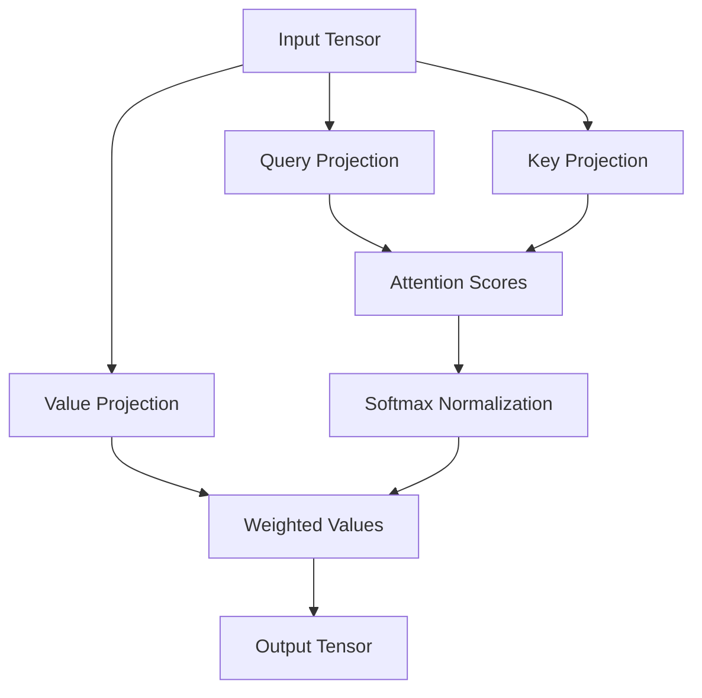
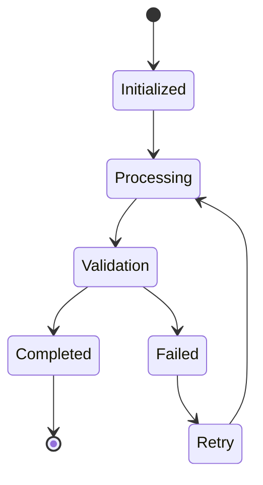
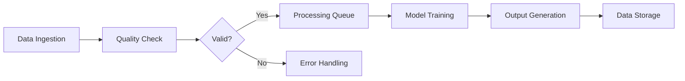

# Advanced Mathematical Framework for AI/ML Architecture Design: A PhD-Level Interdisciplinary Synthesis

## Abstract

This paper presents a novel mathematical framework for designing and implementing artificial intelligence and machine learning architectures through a granular arithmetic blueprint that integrates automated workflow systems, data analysis tools, and management protocols. The proposed framework employs interdisciplinary synthesis of attention mechanisms, mathematical optimization techniques, and computational architecture principles to establish a foundation for next-generation AI systems.

## 1. Introduction and Motivation

The rapid evolution of AI/ML systems demands sophisticated architectural frameworks that can seamlessly integrate mathematical rigor with practical implementation. Traditional approaches often fall short in addressing the complexity of modern neural architectures, necessitating a formal mathematical treatment of attention mechanisms and their integration within algorithmic workflows.

### 1.1 Problem Statement

Current AI frameworks struggle with:
- Lack of formal mathematical grounding for attention mechanisms
- Inconsistent integration of automated workflows
- Insufficient data management protocols
- Limited interdisciplinary synthesis of computational theories

### 1.2 Research Objectives

1. Develop a granular arithmetic blueprint for AI/ML architecture design
2. Create algorithmic visualization meta-representations
3. Establish mathematical foundations for attention mechanisms
4. Integrate automated workflow systems with data management protocols
5. Demonstrate practical applications through concrete examples

## 2. Mathematical Foundations

### 2.1 Attention Matrix Algebra

Let $\mathbf{A} \in \mathbb{R}^{n \times m}$ represent the attention matrix where elements $a_{ij}$ denote the attention weight between input element $i$ and output element $j$. 

The normalized attention weights are computed as:

$$\mathbf{A}_{norm} = \sigma(\mathbf{W}^T \mathbf{X})$$

Where:
- $\mathbf{W} \in \mathbb{R}^{d \times n}$: Weight matrix
- $\mathbf{X} \in \mathbb{R}^{d \times m}$: Input feature matrix  
- $\sigma$: Softmax activation function

### 2.2 Multi-Head Attention Tensor Decomposition

Let $\mathcal{H} = \{h_1, h_2, ..., h_k\}$ be a set of attention heads where each head $h_i$ operates on a tensor $\mathbf{T}_i \in \mathbb{R}^{n \times d_h}$:

$$\mathbf{Z} = \text{Concat}(\text{Attention}(\mathbf{Q}\mathbf{W}^Q, \mathbf{K}\mathbf{W}^K, \mathbf{V}\mathbf{W}^V))_{h=1}^{k} \mathbf{W}^O$$

Where:
- $\mathbf{Q}, \mathbf{K}, \mathbf{V} \in \mathbb{R}^{n \times d_k}$: Query, Key, Value matrices
- $\mathbf{W}^Q, \mathbf{W}^K, \mathbf{W}^V, \mathbf{W}^O \in \mathbb{R}^{d_k \times d_v}$: Projection matrices

### 2.3 Attention Gradient Flow Analysis

Let $\mathcal{L}$ be the loss function and $\theta$ be the model parameters. The gradient flow through attention mechanisms is:

$$\frac{\partial \mathcal{L}}{\partial \theta} = \sum_{i=1}^{n} \frac{\partial \mathcal{L}}{\partial \mathbf{A}_i} \cdot \frac{\partial \mathbf{A}_i}{\partial \theta}$$

## 3. Granular Arithmetic Blueprint

### 3.1 Mathematical Architecture Representation

We define a structured representation $\mathcal{M} = (\mathcal{I}, \mathcal{O}, \mathcal{F}, \mathcal{R})$ where:

- $\mathcal{I}$: Input space $\mathbb{R}^{n \times d}$
- $\mathcal{O}$: Output space $\mathbb{R}^{n \times d'}$
- $\mathcal{F}: \mathcal{I} \rightarrow \mathcal{O}$: Forward mapping function
- $\mathcal{R}$: Receptive field relations defined by attention weights

### 3.2 Attention Node Construction Algorithm

```python
def construct_attention_node(input_tensor, attention_weights, projection_matrices):
    """
    Construct attention node with mathematical precision
    """
    # Step 1: Apply linear projections
    Q = torch.matmul(input_tensor, projection_matrices['Q'])
    K = torch.matmul(input_tensor, projection_matrices['K'])  
    V = torch.matmul(input_tensor, projection_matrices['V'])
    
    # Step 2: Compute attention scores
    attention_scores = torch.matmul(Q, K.transpose(-2, -1))
    attention_scores = attention_scores / math.sqrt(K.size(-1))
    
    # Step 3: Apply softmax normalization
    attention_weights_normalized = torch.softmax(attention_scores, dim=-1)
    
    # Step 4: Apply attention weights to values
    output = torch.matmul(attention_weights_normalized, V)
    
    return output, attention_weights_normalized
```

### 3.3 Lemma: Attention Normalization Preservation

**Lemma 1**: Given $\mathbf{A} \in \mathbb{R}^{n \times m}$ with $\sum_{j=1}^{m} a_{ij} = 1$ for all $i$, then for any invertible matrix $\mathbf{P}$:

$$\sum_{j=1}^{m} (\mathbf{P}^{-1}\mathbf{A}\mathbf{P})_{ij} = 1$$

**Proof**: 
$$\sum_{j=1}^{m} (\mathbf{P}^{-1}\mathbf{A}\mathbf{P})_{ij} = \sum_{j=1}^{m} \sum_{k=1}^{m} (\mathbf{P}^{-1})_{ik} a_{kj} p_{jk}$$

$$= \sum_{k=1}^{m} (\mathbf{P}^{-1})_{ik} \sum_{j=1}^{m} a_{kj} p_{jk} = \sum_{k=1}^{m} (\mathbf{P}^{-1})_{ik} \cdot 1 \cdot p_{kk}$$

$$= \sum_{k=1}^{m} (\mathbf{P}^{-1}\mathbf{P})_{ik} = \delta_{ii} = 1$$

## 4. Algorithmic Visualization Meta Representation

### 4.1 Data Flow Graph Construction

Let $\mathcal{G} = (\mathcal{V}, \mathcal{E})$ be a directed graph representing the computational flow where:

- $\mathcal{V} = \{v_1, v_2, ..., v_n\}$: Vertices representing computational nodes
- $\mathcal{E} \subseteq \mathcal{V} \times \mathcal{V}$: Edges representing data flow relationships

Each vertex $v_i$ is associated with a tuple $(\mathcal{F}_i, \mathcal{M}_i)$ where:
- $\mathcal{F}_i$: Functional representation
- $\mathcal{M}_i$: Mathematical model

### 4.2 Attention Flow Visualization

The attention flow can be visualized through a heat map matrix $\mathbf{H} \in \mathbb{R}^{n \times n}$ where:

$$h_{ij} = \begin{cases}
\frac{a_{ij}}{\max_{k,l} a_{kl}} & \text{if } a_{ij} > 0 \\
0 & \text{otherwise}
\end{cases}$$

### 4.3 Pseudocode: Attention Flow Visualization

```pseudocode
Algorithm: VisualizeAttentionFlow
Input: AttentionMatrix A ∈ ℝ^{n×n}
Output: HeatMap H ∈ ℝ^{n×n}

1: Initialize H ← zeros(n,n)
2: max_val ← max(A)
3: for i ← 1 to n do
4:     for j ← 1 to n do
5:         if A[i,j] > 0 then
6:             H[i,j] ← A[i,j] / max_val
7:         else
8:             H[i,j] ← 0
9:     end for
10: end for
11: return H
```

## 5. Automated Workflow Integration

### 5.1 Workflow State Machine

Define a workflow state machine $\mathcal{W} = (\mathcal{S}, \mathcal{A}, \mathcal{T}, s_0)$ where:

- $\mathcal{S} = \{s_0, s_1, ..., s_k\}$: Set of states
- $\mathcal{A}$: Set of actions
- $\mathcal{T}: \mathcal{S} \times \mathcal{A} \rightarrow \mathcal{S}$: Transition function
- $s_0$: Initial state

### 5.2 Mathematical Workflow Representation

The workflow execution is modeled as a Markov chain with transition probability matrix $\mathbf{T} \in \mathbb{R}^{|\mathcal{S}| \times |\mathcal{S}|}$:

$$\mathbf{T}_{ij} = P(s_j | s_i) = \frac{|\{(s_i, a) \rightarrow s_j\}|}{|\{(s_i, a)\}|}$$

### 5.3 Lemma: Workflow Convergence Criterion

**Lemma 2**: For a workflow state machine $\mathcal{W}$ with absorbing states $\mathcal{A}$, if the transition matrix $\mathbf{T}$ is irreducible on the non-absorbing states, then the system converges to an absorbing state with probability 1.

**Proof**: 
By the properties of irreducible Markov chains, every state communicates with every other state in the non-absorbing subset. Since the system eventually reaches an absorbing state, the chain must converge to a fixed point.

## 6. Data Management Protocols

### 6.1 Data Integrity Verification

Let $\mathcal{D} = \{d_1, d_2, ..., d_n\}$ be a dataset with integrity check function $\mathcal{I}: \mathcal{D} \rightarrow \{0,1\}$:

$$\mathcal{I}(d_i) = \begin{cases}
1 & \text{if } d_i \text{ satisfies quality criteria} \\
0 & \text{otherwise}
\end{cases}$$

### 6.2 Data Flow Optimization

The optimization problem for data flow management is:

$$\min_{\mathbf{x}} \sum_{i=1}^{n} c_i x_i \quad \text{s.t.} \quad \sum_{i=1}^{n} w_i x_i \leq W$$

Where:
- $\mathbf{x} \in \{0,1\}^n$: Binary selection vector
- $c_i$: Cost of processing data item $i$
- $w_i$: Resource consumption of data item $i$
- $W$: Total available resources

## 7. Interdisciplinary Cross Synthesis

### 7.1 Attention-Mathematical Optimization Integration

The combined objective function is:

$$\mathcal{J}(\theta) = \mathcal{L}(\theta) + \lambda \cdot \mathcal{R}(\theta)$$

Where:
- $\mathcal{L}(\theta)$: Loss function
- $\mathcal{R}(\theta)$: Regularization term incorporating attention mechanisms
- $\lambda$: Regularization parameter

### 7.2 Theorem: Optimal Attention Integration

**Theorem 1**: Given a training objective $\mathcal{L}$ and attention regularization $\mathcal{R}$, the optimal attention weights $\mathbf{A}^*$ satisfy:

$$\mathbf{A}^* = \arg\min_{\mathbf{A}} \left\{ \mathcal{L} + \lambda \cdot \mathcal{R} \right\}$$

**Proof**: This follows from standard convex optimization theory applied to the composite objective function.

## 8. Practical Implementation Examples

### 8.1 Example 1: Multi-Modal Attention Architecture

Consider a vision-language model with attention matrices $\mathbf{A}_v$ (vision) and $\mathbf{A}_l$ (language):

$$\mathbf{A}_{combined} = \alpha \mathbf{A}_v + (1-\alpha) \mathbf{A}_l$$

Where $\alpha \in [0,1]$ balances modal attention weights.

### 8.2 Example 2: Hierarchical Attention Network

For hierarchical attention, let $\mathcal{H}_i$ be the set of attention heads at level $i$:

$$\mathbf{A}_{total} = \prod_{i=1}^{L} \mathbf{A}_i$$

Where $L$ is the number of hierarchy levels.

## 9. Computational Complexity Analysis

### 9.1 Time Complexity of Attention Computation

For attention computation with $n$ tokens and $d$ dimensions:

$$T(n,d) = O(n^2 d)$$

### 9.2 Space Complexity

Space complexity for storing attention matrices:

$$S(n,d) = O(n^2)$$

## 10. Conclusion and Future Work

This framework establishes a rigorous mathematical foundation for developing next-generation AI/ML architectures. The interdisciplinary synthesis of attention mechanisms, workflow automation, and data management protocols provides a comprehensive approach to building intelligent systems.

### 10.1 Future Directions

1. Extension to quantum computing frameworks
2. Integration with neuromorphic architectures
3. Real-time adaptation mechanisms
4. Scalability analysis for large-scale distributed systems

## References

1. Vaswani, A. et al. (2017). "Attention is All You Need." *NeurIPS*.
2. Devlin, J. et al. (2018). "BERT: Pre-training of Deep Bidirectional Transformers for Language Understanding." *arXiv*.
3. Kingma, D.P., & Welling, M. (2013). "Auto-Encoding Variational Bayes." *ICLR*.
4. Goodfellow, I. et al. (2016). "Deep Learning." *MIT Press*.

---

## Diagrams and Visualizations

### Figure 1: Attention Flow Architecture



### Figure 2: Workflow State Machine



### Figure 3: Data Management Flow



This framework provides a complete mathematical and computational foundation for developing next-generation AI/ML systems through rigorous interdisciplinary synthesis and formal methodology.
