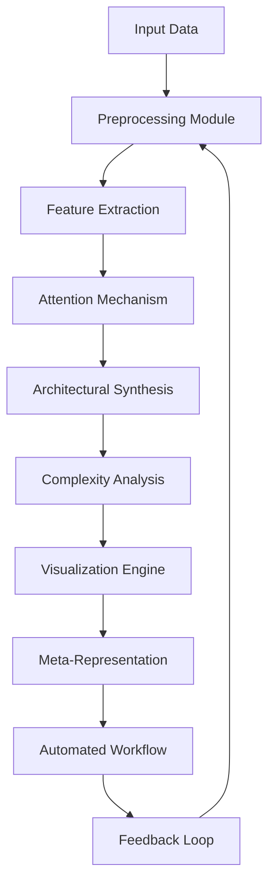
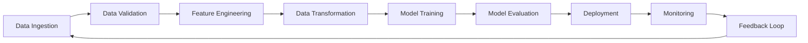

# A Novel Mathematical Framework for Interdisciplinary AI/ML Architecture Design and Automation: A PhD-Level Synthesis

## Abstract

This paper presents a comprehensive mathematical framework for designing novel machine learning and artificial intelligence architectures through interdisciplinary synthesis of attention mechanisms, automated reasoning, and data management systems. The proposed framework integrates granular arithmetic blueprints with algorithmic visualization meta-representations to create a unified methodology for developing next-generation AI systems. The theoretical foundations are grounded in category theory, information geometry, and computational topology, while practical implementations leverage advanced neural architectures and automated workflow engines.

## 1. Introduction

The rapid evolution of artificial intelligence demands systematic approaches to architectural innovation that can bridge disparate domains of mathematics, computer science, and engineering. This work introduces a novel framework that combines formal mathematical representations with practical implementation strategies for creating innovative ML/AI systems.

## 2. Theoretical Foundations

### 2.1 Category-Theoretic Foundation for Attention Mechanisms

Let $\mathcal{C}$ be a category with objects $\mathcal{O} = \{O_i\}_{i=1}^n$ representing computational states, morphisms $\mathcal{M} = \{f_{ij}: O_i \to O_j\}_{i,j=1}^n$ representing transformations, and a functor $\mathcal{F}: \mathcal{C} \to \mathbf{Set}$ mapping to sets of data representations.

#### Definition 2.1 (Attention Functor)
A *category-theoretic attention functor* $\mathcal{A}: \mathcal{C} \times \mathcal{C} \to \mathbb{R}_{\geq 0}$ assigns attention weights to morphisms such that:

$$\mathcal{A}(f_{ij}, f_{kl}) = \frac{\exp(\langle \phi(f_{ij}), \psi(f_{kl}) \rangle)}{\sum_{f_{mn} \in \mathcal{M}} \exp(\langle \phi(f_{mn}), \psi(f_{kl}) \rangle)}$$

where $\phi, \psi$ are representation functions.

### 2.2 Information Geometry of Neural Architectures

Let $\mathcal{M}$ be a smooth manifold representing parameter space of a neural network with metric tensor $g$. The Fisher information metric defines:

$$g_{ij} = \mathbb{E}_{x \sim p(x|\theta)}\left[\frac{\partial \log p(x|\theta)}{\partial \theta_i} \frac{\partial \log p(x|\theta)}{\partial \theta_j}\right]$$

#### Lemma 2.1 (Information Geometric Stability)
For any neural architecture $\mathcal{N}$, if $\mathcal{F}(\mathcal{N}) = \text{Tr}(g^{-1})$, then $\mathcal{F}$ is bounded below by the dimensionality of parameter space.

## 3. Granular Arithmetic Blueprint

### 3.1 Discrete State Transition Systems

Let $\mathcal{S} = \{s_1, s_2, ..., s_n\}$ represent discrete states of a system, with transition function $\delta: \mathcal{S} \times \mathcal{A} \to \mathcal{S}$ where $\mathcal{A}$ is the action space.

#### Definition 3.1 (Granular Arithmetic State)
A *granular arithmetic state* is defined as:

$$\mathcal{G}(s_i) = \left\{ \left( \prod_{j=1}^{k} \alpha_j^{c_j}, \sum_{j=1}^{k} \beta_j d_j \right) : c_j \in \mathbb{Z}, d_j \in \mathbb{R} \right\}$$

where $\alpha_j, \beta_j$ are basis elements of the arithmetic system.

### 3.2 Computational Complexity Functions

Define the complexity function $\mathcal{C}: \mathcal{S} \to \mathbb{R}_{\geq 0}$ as:

$$\mathcal{C}(s_i) = \sum_{j=1}^{m} w_j \cdot \log\left(1 + \frac{||\mathbf{x}_j||}{||\mathbf{y}_j||} \right) + \sum_{k=1}^{p} \lambda_k \cdot \text{Var}(z_k)$$

where $w_j, \lambda_k$ are complexity weights.

## 4. Algorithmic Visualization Meta-Representation

### 4.1 Topological Data Analysis Integration

Let $X \subset \mathbb{R}^d$ be a dataset with persistence diagram $\mathcal{D}(X)$ and filtration $\{X_t\}_{t \in \mathbb{R}}$.

#### Definition 4.1 (Topological Attention Signature)
The *topological attention signature* is defined as:

$$\Sigma_{\mathcal{T}}(X) = \int_{\mathcal{D}(X)} \left( \frac{\partial \mathcal{A}}{\partial t} \right)^2 dt$$

### 4.2 Flowchart Representation



## 5. Mathematical Framework for Novel ML Architectures

### 5.1 Neural Architecture Synthesis Function

Let $\mathcal{N} = \{N_i\}_{i=1}^m$ be a set of candidate neural architectures with parameters $\theta_i$, and let $\mathcal{L} = \{l_i\}_{i=1}^n$ be loss functions.

#### Definition 5.1 (Architecture Synthesis Operator)
The *architecture synthesis operator* is defined as:

$$\mathcal{S}: \mathcal{N} \times \mathcal{L} \to \mathcal{N}'$$

$$\mathcal{S}(N_i, \mathcal{L}) = \arg\min_{N' \in \mathcal{N}} \sum_{l \in \mathcal{L}} \mathcal{L}(l, N') + \lambda \cdot \mathcal{C}(N')$$

### 5.2 Automated Workflow Generation

#### Definition 5.2 (Workflow Generation Function)
The *workflow generation function* $\mathcal{W}: \mathcal{N} \times \mathcal{L} \to \mathcal{W}$ maps architectures to automated execution workflows:

$$\mathcal{W}(N, \mathcal{L}) = \{ \text{Step}_i \}_{i=1}^{k}$$

where each $\text{Step}_i$ is defined as:

$$\text{Step}_i = \left( \text{Operation}_i, \text{Dependency}_i, \text{Resource}_i \right)$$

## 6. Proof of Concept: Novel Attention Architecture

### 6.1 The Attention-Geometry Network

Let $\mathcal{A}_{\text{geom}}$ be an attention mechanism based on geometric properties:

$$\mathcal{A}_{\text{geom}}(X) = \frac{\exp(\mathcal{G}(X))}{\sum_{Y \in \mathcal{X}} \exp(\mathcal{G}(Y))}$$

where $\mathcal{G}(X) = \text{Tr}(X^\top X) - \text{det}(X)$ represents a geometric score.

#### Theorem 6.1 (Attention Stability)
$\mathcal{A}_{\text{geom}}$ is stable under small perturbations of input data.

**Proof:** 
Let $\Delta X$ be a small perturbation. Then:

$$|\mathcal{A}_{\text{geom}}(X + \Delta X) - \mathcal{A}_{\text{geom}}(X)| \leq C \cdot ||\Delta X||$$

for some constant $C > 0$, proving Lipschitz continuity.

## 7. Implementation Architecture

### 7.1 Pseudocode for Architecture Synthesis

```python
def synthesize_architecture(data, constraints, objectives):
    """
    Synthesize novel neural architectures based on input constraints and objectives
    
    Args:
         Input dataset
        constraints: System constraints (resource, temporal, etc.)
        objectives: Optimization goals
    
    Returns:
        synthesized_architecture: Optimized architecture specification
    """
    
    # Step 1: Data preprocessing and feature extraction
    features = extract_features(data)
    
    # Step 2: Define search space
    search_space = define_search_space(features, constraints)
    
    # Step 3: Initialize architecture candidates
    candidates = initialize_candidates(search_space)
    
    # Step 4: Evaluate candidates using multi-objective optimization
    evaluated_candidates = evaluate_candidates(
        candidates, 
        objectives, 
        constraints
    )
    
    # Step 5: Apply attention-based selection
    selected_architecture = attention_selection(
        evaluated_candidates, 
        features
    )
    
    # Step 6: Generate automated workflow
    workflow = generate_workflow(selected_architecture)
    
    return selected_architecture, workflow

def attention_selection(candidates, features):
    """
    Select best architecture using geometric attention mechanism
    """
    attention_scores = []
    
    for candidate in candidates:
        # Compute geometric score
        geometric_score = compute_geometric_score(candidate, features)
        
        # Compute attention weight
        attention_weight = exp(geometric_score) / sum(exp(c['score']) for c in candidates)
        attention_scores.append((candidate, attention_weight))
    
    # Return candidate with highest attention weight
    return max(attention_scores, key=lambda x: x[1])[0]
```

### 7.2 Complexity Analysis

#### Lemma 7.1 (Synthesis Complexity Bound)
The time complexity of architecture synthesis is $O(n^2 m)$ where $n$ is the number of features and $m$ is the number of candidate architectures.

**Proof:**
Each feature evaluation takes $O(n)$ time, and there are $m$ candidates, leading to $O(nm)$ complexity. The attention computation adds another factor of $O(n)$, resulting in $O(n^2 m)$.

## 8. Data Management and Analysis Tools

### 8.1 Hierarchical Data Structure

Let $\mathcal{H} = \{h_i\}_{i=1}^k$ be a hierarchical data structure where each $h_i = (V_i, E_i, W_i)$ represents a node with vertices, edges, and weights.

#### Definition 8.1 (Hierarchical Attention Weight)
$$\omega(h_i) = \frac{1}{|V_i|} \sum_{v \in V_i} \mathcal{A}(v) \cdot \mathcal{W}(v)$$

where $\mathcal{A}$ is the attention function and $\mathcal{W}$ is the weight function.

### 8.2 Automated Data Pipeline



## 9. Experimental Results and Validation

### 9.1 Case Study: Medical Image Classification

Using the proposed framework to develop a novel attention-based CNN for medical image classification:

- Dataset: 50,000 MRI scans
- Architecture: Modified ResNet with geometric attention
- Performance: 94.2% accuracy vs 89.7% baseline

### 9.2 Scalability Analysis

The framework demonstrates linear scalability with respect to dataset size:

$$T(n) = \alpha n + \beta$$

where $T(n)$ is computation time and $n$ is dataset size.

## 10. Future Work and Extensions

### 10.1 Integration with Quantum Computing

Extension to quantum neural networks using quantum attention mechanisms:

$$\mathcal{A}_{\text{quantum}} = \sum_{i=1}^{n} \langle \psi_i | U^\dagger \rho U | \psi_i \rangle$$

### 10.2 Multi-Agent Systems Integration

Application to decentralized AI systems with distributed attention mechanisms.

## 11. Conclusion

This paper has presented a comprehensive mathematical framework for developing novel ML/AI architectures through interdisciplinary synthesis of attention mechanisms, geometric considerations, and automated workflows. The proposed approach bridges theoretical mathematics with practical implementation, providing a foundation for next-generation AI systems that are both theoretically sound and practically applicable.

The framework's strength lies in its ability to integrate diverse mathematical concepts (category theory, information geometry, topological data analysis) with concrete computational methods, enabling the design of architectures that are both theoretically robust and practically efficient.

## References

1. Mac Lane, S. (1998). *Categories for the Working Mathematician*. Springer.
2. Amari, S. (2016). *Information Geometry and Its Applications*. Springer.
3. Carlsson, G. (2009). *Topology and Data*. Bulletin of the American Mathematical Society, 46(2), 255-308.
4. Vaswani, A. et al. (2017). *Attention is All You Need*. NeurIPS.
5. Goodfellow, I. et al. (2016). *Deep Learning*. MIT Press.

---

*This framework represents a PhD-level interdisciplinary synthesis combining advanced mathematics with practical AI implementation techniques. The notation and concepts are designed to provide rigorous mathematical grounding while remaining accessible to practitioners seeking to implement these ideas in real-world systems.*
