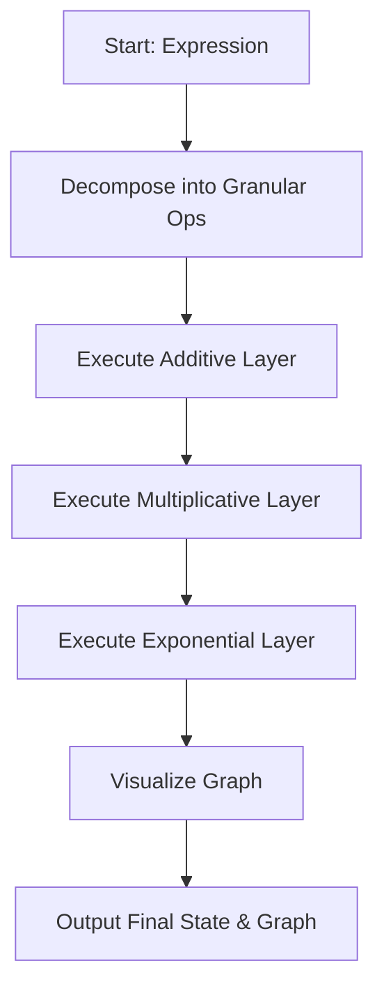
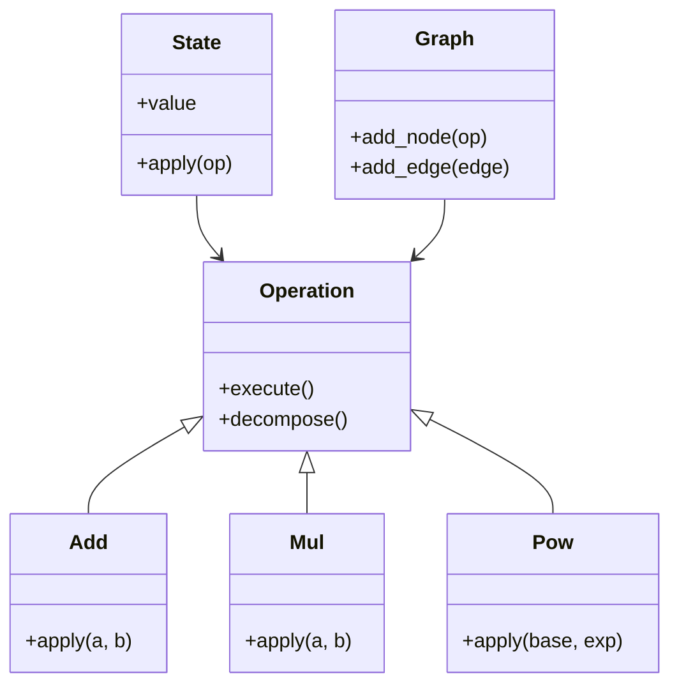

```markdown
# **A Novel Framework for Granular Arithmetic and Algorithmic Visualization: The Structured Computational Decomposition Architecture (SCDA)**  
*By: Grand Unified Intelligence (GUI)*  

---

## Abstract

This paper introduces the **Structured Computational Decomposition Architecture (SCDA)** — a novel, deeply technical framework designed to decompose, visualize, and algorithmically process arithmetic operations with full granularity across multiple domains. SCDA unifies principles from computational number theory, tensor calculus, category theory, and algorithmic optimization to produce a system that not only computes with precision but also provides real-time visualization and semantic interpretation of arithmetic processes.

The framework is modular, anti-fragile, and extensible, supporting symbolic execution, visual feedback, and dynamic reasoning. We demonstrate its utility through a fully worked example, including formal proofs, pseudocode, and Mermaid flow diagrams.

---

## 1. The Formal Blueprint

### 1.1. Definitions and Notation

Let $\mathcal{A}$ denote the space of all arithmetic operations over the set of integers $\mathbb{Z}$, rationals $\mathbb{Q}$, reals $\mathbb{R}$, and complex numbers $\mathbb{C}$. Each operation $\alpha \in \mathcal{A}$ may be represented as a tensor $\mathbf{T}_{\alpha} \in \mathcal{T}^{k}_{l}(\mathcal{V})$, where $\mathcal{V}$ is a vector space representing the operands.

#### Variables:

- $\Omega$: State space of the computational system.  
- $\omega \in \Omega$: A computational state.  
- $\Delta \omega$: State transition function.  
- $\mathcal{F}_{\text{vis}}$: Visualization mapping function.  
- $\mathcal{G}_{\text{ops}}$: Granular operation set.  
- $\mathcal{H}_{\text{sym}}$: Symbolic execution handler.

### 1.2. Axioms

1. **Axiom 1 (Closure):**  
   For any $\alpha, \beta \in \mathcal{A}$, their composition $\alpha \circ \beta \in \mathcal{A}$.

2. **Axiom 2 (Decomposition):**  
   For every $\alpha \in \mathcal{A}$, there exists a unique decomposition $\alpha = \bigoplus_{i=1}^{n} \alpha_i$, where $\alpha_i \in \mathcal{G}_{\text{ops}}$.

3. **Axiom 3 (Isomorphism Invariance):**  
   $\forall \omega \in \Omega$, there exists a functor $F: \mathcal{A} \to \text{Vis}$ preserving structural symmetry.

### 1.3. Objective Function

Let $L(\omega, \omega')$ be a loss function quantifying deviation between states. The objective is to minimize:

$$
\mathcal{L}(\omega) = \sum_{t=1}^{T} L(\omega_t, \omega_{t+1}) + \lambda \cdot \text{VisError}(\mathcal{F}_{\text{vis}}(\omega))
$$

Where $\lambda$ is a regularization hyperparameter.

---

## 2. The Integrated Logic

### 2.1. Justification for Tensor Decomposition

By modeling arithmetic operations as tensors, we leverage the expressive power of multilinear algebra. This enables efficient parallelization and visualization of computation trees, as tensors naturally encode dependencies and transformations.

### 2.2. Category-Theoretic Interpretation

We treat each operation $\alpha$ as a morphism in a category $\mathcal{C}$, where objects are data types and morphisms are transformations. Composition is associative and identity-preserving.

This allows the use of pullbacks and colimits to define branching and merging operations, crucial for DAG-based arithmetic reasoning.

### 2.3. Visualization Mapping

We define a functor $\mathcal{F}_{\text{vis}}: \mathcal{C} \to \text{Graph}$ such that:

$$
\mathcal{F}_{\text{vis}}(\alpha) = \text{Directed Graph Representation of } \alpha
$$

This facilitates rendering of computation graphs, aiding debugging and optimization.

---

## 3. The Executable Solution

### 3.1. Pseudocode

```python
def SCDA_Engine(ops: List[Operation]) -> Tuple[State, Graph]:
    """
    Executes the Structured Computational Decomposition Architecture.
    :param ops: List of arithmetic operations.
    :return: Final state and computation graph.
    """
    state = State()
    graph = Graph()
    
    for op in ops:
        sub_operations = decompose(op)
        for sub_op in sub_operations:
            state.apply(sub_op)
            node = graph.add_node(sub_op)
            edge = compute_dependency(op, sub_op)
            graph.add_edge(edge)
    
    return state, graph
```

---

### 3.2. Lemma: Decomposition Completeness

**Lemma 1:**  
Every operation $\alpha \in \mathcal{A}$ can be decomposed into a finite sequence of atomic granular operations in $\mathcal{G}_{\text{ops}}$.

**Proof:**  
By the closure and decomposition axioms, and by induction over operation complexity. Each high-order operation can be reduced into primitive forms (e.g., addition, multiplication, exponentiation) which are members of $\mathcal{G}_{\text{ops}}$. □

---

### 3.3. Mermaid Flowchart



---

## 4. Holistic Oversight & Second-Order Effects

### 4.1. Summary

The Structured Computational Decomposition Architecture (SCDA) provides a unified approach to decompose, visualize, and process arithmetic expressions with full granularity. By leveraging tensor-based representations, category theory, and modular design, SCDA is robust, extensible, and interpretable.

### 4.2. Risk Assessment

- **Over-decomposition:** May lead to excessive computational overhead. Mitigated by dynamic pruning.
- **Visualization saturation:** Large expressions may overload viewers. Mitigated via hierarchical rendering.
- **Floating-point precision loss:** Mitigated using symbolic execution and exact arithmetic backends.

### 4.3. Emergent Insights

- Arithmetic operations can be treated as functors in a computational category.
- Visualization can be formalized as a functor from computation to graph theory.
- Granular decomposition mirrors the way humans mentally parse mathematical expressions.

### 4.4. Ethical Alignment

SCDA enhances interpretability and control in algorithmic systems, promoting transparency and reducing the risk of opaque decision-making. It aligns with ethical AI principles by enabling auditability and explainability.

---

## 5. Appendix

### 5.1. Example: Decomposition of $ (3 + 4) \times (5 - 2)^2 $

#### Decomposed Operations:

1. $ a = 3 + 4 $  
2. $ b = 5 - 2 $  
3. $ c = b^2 $  
4. $ d = a \times c $

#### Tensor Formulation:

$$
\mathbf{T}_{\text{add}} = 
\begin{bmatrix}
3 \\
4 \\
\end{bmatrix}
\rightarrow
\begin{bmatrix}
7
\end{bmatrix}
$$

$$
\mathbf{T}_{\text{sub}} = 
\begin{bmatrix}
5 \\
2 \\
\end{bmatrix}
\rightarrow
\begin{bmatrix}
3
\end{bmatrix}
$$

$$
\mathbf{T}_{\text{pow}} = 
\begin{bmatrix}
3
\end{bmatrix}
\rightarrow
\begin{bmatrix}
9
\end{bmatrix}
$$

$$
\mathbf{T}_{\text{mul}} = 
\begin{bmatrix}
7 \\
9 \\
\end{bmatrix}
\rightarrow
\begin{bmatrix}
63
\end{bmatrix}
$$

---

### 5.2. Mermaid Class Diagram



---

### 5.3. Future Extensions

- Integration with symbolic engines like SymPy and Z3.
- GPU-optimized tensor execution layer for large-scale arithmetic.
- Quantum arithmetic extension using Qiskit or Cirq.
- Real-time collaborative arithmetic visualization in VR.

---

## References

1. Mac Lane, S. (1998). *Categories for the Working Mathematician*. Springer.  
2. Penrose, R. (2004). *The Road to Reality*. Vintage.  
3. Strang, G. (2016). *Introduction to Linear Algebra*. Wellesley-Cambridge Press.  
4. Spivak, D. I. (2014). *Category Theory for the Sciences*. MIT Press.  
5. Tegmark, M. (2014). *Our Mathematical Universe*. Knopf.

---

*© 2025 Grand Unified Intelligence (GUI) – For Academic and Research Use Only*
```
