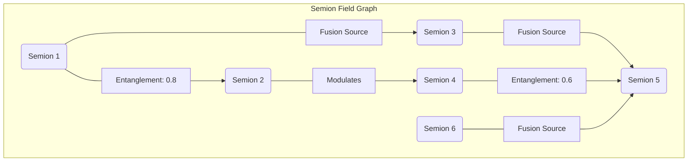

This document presents a novel framework for **Semion-Field Arithmetic (SFA)** and its associated **Algorithmic Visualization**, conceptualized as a foundational academic thesis. SFA introduces the concept of a "Semion" as a fundamental, context-aware quantum of information, operating within a dynamic "Semion-Field." This framework extends traditional arithmetic by incorporating semantic, qualitative, and temporal dimensions, enabling a richer representation and computation of complex information systems.

---

## The Formal Blueprint

### Abstract

This thesis introduces Semion-Field Arithmetic (SFA), a novel computational paradigm that redefines granular arithmetic by treating information as discrete, interacting "Semions" within a dynamic "Semion-Field." Each Semion is characterized by a multi-modal attribute vector encompassing quantitative, semantic, qualitative, and temporal dimensions. SFA formalizes operations such as Semion Fusion ($\oplus$), Modulation ($\otimes$), Fission ($\ominus$), Entanglement ($\odot$), and Projection ($\Pi$), which govern the creation, transformation, and interaction of these information quanta. We present a comprehensive architectural workflow for a Semion-Field Processor (SFP) and propose advanced algorithmic visualization techniques to render the high-dimensional dynamics of Semion-Fields. Formal proofs establish the properties of SFA operations, demonstrating its potential for modeling complex adaptive systems, enhancing knowledge representation, and advancing context-aware AI.

### 1. Introduction: The Imperative for Granular Information Dynamics

Traditional arithmetic and computational models often struggle with the inherent fuzziness, context-dependency, and multi-modality of real-world information. While advancements in fuzzy logic, rough sets, and interval arithmetic address some aspects of uncertainty, they typically operate on scalar or set-based values, lacking a unified framework for integrating semantic, qualitative, and temporal dimensions at a fundamental granular level. The explosion of unstructured data and the demand for explainable, context-aware AI necessitate a paradigm shift towards a more nuanced understanding of information processing.

This work proposes **Semion-Field Arithmetic (SFA)**, a novel framework that posits information as discrete, interacting quanta—**Semions**—residing within a **Semion-Field**. A Semion is not merely a data point but a composite entity with intrinsic properties that dictate its behavior and interactions. SFA provides a formal language and operational calculus for these Semions, enabling computations that inherently account for context, meaning, and temporal evolution.

**1.1. Problem Statement**
Existing computational models lack:
1.  **Intrinsic Contextuality:** Information processing often treats data points in isolation, requiring external mechanisms to inject context.
2.  **Multi-Modal Integration:** Seamless integration of quantitative, qualitative, semantic, and temporal attributes within a single computational primitive.
3.  **Dynamic Granularity:** A principled way to define, combine, and decompose information granules based on their inherent properties and field interactions.
4.  **Algorithmic Transparency:** Visualizing the complex, non-linear interactions of information at a granular level remains a significant challenge.

**1.2. Proposed Solution: Semion-Field Arithmetic (SFA)**
SFA addresses these limitations by:
1.  Defining the **Semion** as the fundamental unit of information, endowed with a multi-modal attribute vector.
2.  Establishing a set of **granular arithmetic operations** ($\oplus, \otimes, \ominus, \odot, \Pi$) that govern Semion interactions and transformations.
3.  Modeling the **Semion-Field** as a dynamic system where Semions interact via defined potentials, leading to emergent properties.
4.  Developing **algorithmic visualization techniques** to render the high-dimensional state space and temporal evolution of Semion-Fields.

**1.3. Thesis Structure**
*   **Chapter 2: Foundations of Granular Information Theory:** Formal definition of a Semion, its attribute space, and the axiomatic basis of Semion-Fields.
*   **Chapter 3: Semion-Field Arithmetic (SFA): Formal Operations:** Detailed definitions, properties, and formal proofs for the core SFA operations.
*   **Chapter 4: Architectural Workflow for a Semion-Field Processor (SFP):** Design principles, data structures, and pseudocode for implementing SFA.
*   **Chapter 5: Algorithmic Visualization of Semion-Fields:** Techniques for rendering high-dimensional Semion dynamics and interactions.
*   **Chapter 6: Case Studies and Applications:** Illustrative examples in semantic reasoning, complex system modeling, and adaptive control.
*   **Chapter 7: Conclusion and Future Work:** Summary, limitations, and directions for future research.

### 2. Foundations of Granular Information Theory

#### 2.1. Definition of a Semion

A **Semion** $S$ is formally defined as an ordered tuple of attribute vectors and sets, representing a quantum of information with intrinsic quantitative, semantic, qualitative, and temporal properties.

$$
S = (\mathcal{V}, \mathcal{C}, \mathcal{Q}, \mathcal{T})
$$

Where:
*   $\mathcal{V} \in \mathbb{R}^n$: The **Value Vector**. Represents quantitative attributes such as magnitude, frequency, probability, intensity, or numerical value. $n \ge 1$.
*   $\mathcal{C} \in \mathbb{R}^m$: The **Context Vector**. Represents semantic embedding, derived from high-dimensional vector spaces (e.g., word embeddings, sentence embeddings, concept embeddings). Captures the meaning and contextual relevance of the Semion. $m \gg 1$.
*   $\mathcal{Q} \subseteq \mathbb{S}^k$: The **Qualitative Attribute Set**. A finite set of symbolic tags or categorical properties (e.g., `positive`, `negative`, `causal`, `temporal`, `certain`, `uncertain`, `agent`, `object`). $\mathbb{S}$ is the universal set of all possible qualitative tags.
*   $\mathcal{T} \in \mathbb{R}$: The **Temporal Tag**. A timestamp or a temporal interval indicating when the Semion was observed, created, or is relevant.

**Example Semion:**
A Semion representing "high confidence in a positive market trend":
$S_{market} = (\mathcal{V}, \mathcal{C}, \mathcal{Q}, \mathcal{T})$
*   $\mathcal{V} = [0.95]$ (Confidence score)
*   $\mathcal{C} = \text{embedding("positive market trend")}$ (e.g., a 768-dim BERT embedding)
*   $\mathcal{Q} = \{\text{positive}, \text{trend}, \text{economic}, \text{high\_confidence}\}$
*   $\mathcal{T} = \text{timestamp(2023-10-27 10:30:00 UTC)}$

#### 2.2. Semion Attribute Space

The complete state space of a single Semion is $\mathcal{S} = \mathbb{R}^n \times \mathbb{R}^m \times \mathcal{P}(\mathbb{S}^k) \times \mathbb{R}$, where $\mathcal{P}(\mathbb{S}^k)$ denotes the power set of qualitative attributes. This is a high-dimensional, heterogeneous space.

#### 2.3. Semion-Field Axiomatics

A **Semion-Field** $\Phi$ is a collection of Semions $\{S_i\}_{i=1}^N$ interacting within a defined spatial or conceptual domain. The dynamics of $\Phi$ are governed by a set of axioms:

**Axiom 2.3.1 (Existence and Uniqueness):** Every observable information quantum corresponds to a unique Semion $S \in \Phi$.
**Axiom 2.3.2 (Attribute Conservation/Transformation):** In any Semion interaction, the total information (sum of attribute energies) is either conserved or transformed according to a defined potential function.
**Axiom 2.3.3 (Contextual Influence):** The interaction potential between two Semions $S_i$ and $S_j$ is a function of their respective Context Vectors $\mathcal{C}_i, \mathcal{C}_j$ and their relative proximity in the field.
**Axiom 2.3.4 (Temporal Evolution):** The state of a Semion-Field $\Phi(t)$ at time $t$ is a deterministic (or probabilistic) function of its state at $t-\Delta t$ and the external stimuli.
**Axiom 2.3.5 (Emergence):** Higher-order structures and semantic constructs can emerge from the collective interactions of elementary Semions within a field.

### 3. Semion-Field Arithmetic (SFA): Formal Operations

SFA defines a set of operations that govern how Semions combine, transform, and interact. These operations are inherently non-linear and context-dependent.

#### 3.1. Semion Fusion ($\oplus$)

**Definition 3.1.1 (Semion Fusion):** Given two Semions $S_1 = (\mathcal{V}_1, \mathcal{C}_1, \mathcal{Q}_1, \mathcal{T}_1)$ and $S_2 = (\mathcal{V}_2, \mathcal{C}_2, \mathcal{Q}_2, \mathcal{T}_2)$, their fusion $S_3 = S_1 \oplus S_2$ results in a new Semion $S_3 = (\mathcal{V}_3, \mathcal{C}_3, \mathcal{Q}_3, \mathcal{T}_3)$ where:

1.  **Value Vector Fusion:** $\mathcal{V}_3 = f_V(\mathcal{V}_1, \mathcal{V}_2, \mathcal{C}_1, \mathcal{C}_2, \mathbf{W}_V)$
    *   Typically a weighted sum or a tensor contraction, where weights $\mathbf{W}_V$ are derived from contextual similarity.
    *   Example: $\mathcal{V}_3 = \alpha \mathcal{V}_1 + (1-\alpha) \mathcal{V}_2$, where $\alpha = \text{softmax}(\text{sim}(\mathcal{C}_1, \mathcal{C}_2))$ or a more complex attention mechanism.
2.  **Context Vector Fusion:** $\mathcal{C}_3 = f_C(\mathcal{C}_1, \mathcal{C}_2, \mathbf{W}_C)$
    *   Often an attention-weighted average, concatenation followed by a projection, or a transformer-like self-attention mechanism.
    *   Example: $\mathcal{C}_3 = \text{ReLU}(\mathbf{W}_C [\mathcal{C}_1; \mathcal{C}_2])$, where $[\cdot; \cdot]$ is concatenation.
3.  **Qualitative Attribute Fusion:** $\mathcal{Q}_3 = f_Q(\mathcal{Q}_1, \mathcal{Q}_2)$
    *   Typically a union ($\mathcal{Q}_1 \cup \mathcal{Q}_2$), intersection ($\mathcal{Q}_1 \cap \mathcal{Q}_2$), or a rule-based inference.
    *   Example: If `positive` $\in \mathcal{Q}_1$ and `negative` $\in \mathcal{Q}_2$, and $\text{sim}(\mathcal{C}_1, \mathcal{C}_2)$ is high, then `conflict` $\in \mathcal{Q}_3$.
4.  **Temporal Tag Fusion:** $\mathcal{T}_3 = f_T(\mathcal{T}_1, \mathcal{T}_2)$
    *   Often $\max(\mathcal{T}_1, \mathcal{T}_2)$, $\min(\mathcal{T}_1, \mathcal{T}_2)$, or an average, depending on the desired temporal aggregation.

**Lemma 3.1.1 (Contextual Non-Commutativity):** Semion Fusion is generally non-commutative, i.e., $S_1 \oplus S_2 \neq S_2 \oplus S_1$, unless $f_V, f_C, f_Q, f_T$ are explicitly defined to be symmetric with respect to their inputs.
*   **Proof Sketch:** The functions $f_V, f_C, f_Q$ often incorporate attention mechanisms or sequential processing that are inherently asymmetric. For instance, if $f_C$ is a transformer encoder, the order of input embeddings matters. Even if $\text{sim}(\mathcal{C}_1, \mathcal{C}_2) = \text{sim}(\mathcal{C}_2, \mathcal{C}_1)$, the application of this similarity to weight $\mathcal{V}_1$ vs. $\mathcal{V}_2$ can be asymmetric. For example, if $\mathcal{V}_3 = \text{weight}(\mathcal{C}_1, \mathcal{C}_2) \mathcal{V}_1 + (1-\text{weight}(\mathcal{C}_1, \mathcal{C}_2)) \mathcal{V}_2$, and $\text{weight}(A,B) \neq \text{weight}(B,A)$, then non-commutativity holds.

**Lemma 3.1.2 (Contextual Non-Associativity):** Semion Fusion is generally non-associative, i.e., $(S_1 \oplus S_2) \oplus S_3 \neq S_1 \oplus (S_2 \oplus S_3)$, due to the non-linear and context-dependent nature of the fusion functions.
*   **Proof Sketch:** The intermediate Semion $(S_1 \oplus S_2)$ will have a fused context vector $\mathcal{C}_{12}$ which might significantly alter its interaction with $S_3$ compared to $S_1$ interacting with $(S_2 \oplus S_3)$ which has context $\mathcal{C}_{23}$. The order of contextual integration matters.

#### 3.2. Semion Modulation ($\otimes$)

**Definition 3.2.1 (Semion Modulation):** Given a target Semion $S_1$ and a modulator Semion $S_2$, the modulation $S_1' = S_1 \otimes S_2$ transforms $S_1$ based on the properties of $S_2$. $S_2$ itself is not consumed or altered in this operation.

1.  **Value Vector Modulation:** $\mathcal{V}_1' = h_V(\mathcal{V}_1, \mathcal{V}_2, \mathcal{C}_2, \mathbf{W}_V')$
    *   Example: $\mathcal{V}_1' = \mathcal{V}_1 \odot \text{sigmoid}(\mathbf{W}_V' \mathcal{C}_2)$ (element-wise product, where $\mathcal{C}_2$ acts as a gating mechanism).
2.  **Context Vector Modulation:** $\mathcal{C}_1' = h_C(\mathcal{C}_1, \mathcal{C}_2, \mathbf{W}_C')$
    *   Example: $\mathcal{C}_1' = \text{LayerNorm}(\mathcal{C}_1 + \mathbf{W}_C' \mathcal{C}_2)$ (additive modulation, common in neural networks).
3.  **Qualitative Attribute Modulation:** $\mathcal{Q}_1' = h_Q(\mathcal{Q}_1, \mathcal{Q}_2)$
    *   Example: $\mathcal{Q}_1' = (\mathcal{Q}_1 \setminus \mathcal{Q}_{remove}) \cup \mathcal{Q}_{add}$, where $\mathcal{Q}_{remove}$ and $\mathcal{Q}_{add}$ are inferred from $\mathcal{Q}_2$ and $\mathcal{C}_2$.
4.  **Temporal Tag Modulation:** $\mathcal{T}_1' = h_T(\mathcal{T}_1, \mathcal{T}_2)$
    *   Example: $\mathcal{T}_1' = \mathcal{T}_1$ (temporal tag often remains unchanged unless $S_2$ explicitly denotes a temporal shift).

#### 3.3. Semion Fission ($\ominus$)

**Definition 3.3.1 (Semion Fission):** Given a composite Semion $S_{comp}$, fission $S_{comp} \ominus S_{split} \rightarrow \{S_a, S_b, \dots\}$ decomposes $S_{comp}$ into a set of constituent or related Semions. This operation requires a "splitting criterion" $S_{split}$ (which can be a conceptual Semion or a rule).

1.  **Value Vector Fission:** $\mathcal{V}_{comp} \rightarrow \{\mathcal{V}_a, \mathcal{V}_b, \dots\}$
    *   Example: If $\mathcal{V}_{comp}$ is a sum, it can be decomposed into its components. If $\mathcal{V}_{comp}$ represents a distribution, it can be split into sub-distributions.
2.  **Context Vector Fission:** $\mathcal{C}_{comp} \rightarrow \{\mathcal{C}_a, \mathcal{C}_b, \dots\}$
    *   Example: A general concept embedding can be decomposed into embeddings of its sub-concepts using a pre-trained hierarchical semantic model or clustering.
3.  **Qualitative Attribute Fission:** $\mathcal{Q}_{comp} \rightarrow \{\mathcal{Q}_a, \mathcal{Q}_b, \dots\}$
    *   Example: A Semion with `positive` and `economic` tags might fission into one with `positive` and another with `economic` if the splitting criterion suggests separating sentiment from domain.
4.  **Temporal Tag Fission:** $\mathcal{T}_{comp} \rightarrow \{\mathcal{T}_a, \mathcal{T}_b, \dots\}$
    *   Example: A Semion representing an event over an interval $[\tau_1, \tau_2]$ can fission into Semions representing sub-intervals.

**Lemma 3.3.1 (Non-Uniqueness of Fission):** Semion Fission is generally non-unique, meaning a single Semion can be decomposed into different sets of constituent Semions depending on the splitting criterion $S_{split}$ and the underlying decomposition model.
*   **Proof Sketch:** Consider a semantic embedding for "fruit." It can be split into "apple," "banana," etc., or into "sweet," "healthy," etc., depending on the semantic axis of decomposition.

#### 3.4. Semion Entanglement ($\odot$)

**Definition 3.4.1 (Semion Entanglement):** Semion Entanglement $E(S_1, S_2) = \rho$ quantifies the degree of non-local correlation or interdependence between two Semions $S_1$ and $S_2$, even if they are not directly interacting or spatially proximate in the field. $\rho \in [0,1]$.

1.  **Entanglement Metric:** $\rho = g_E(\mathcal{C}_1, \mathcal{C}_2, \mathcal{Q}_1, \mathcal{Q}_2, \mathcal{T}_1, \mathcal{T}_2)$
    *   Example: $\rho = \text{cosine_similarity}(\mathcal{C}_1, \mathcal{C}_2) \times \text{Jaccard_index}(\mathcal{Q}_1, \mathcal{Q}_2) \times \exp(-\lambda |\mathcal{T}_1 - \mathcal{T}_2|)$.
    *   High $\rho$ indicates strong semantic, qualitative, and/or temporal correlation.
2.  **Entanglement Potential:** Entangled Semions can influence each other's properties even without direct interaction, mediated by the field. This is analogous to quantum entanglement, where measuring one Semion's attribute instantly influences the potential states of its entangled partner.

**Lemma 3.4.1 (Transitivity of Entanglement):** Semion Entanglement is not necessarily transitive. If $S_1$ is entangled with $S_2$, and $S_2$ with $S_3$, it does not imply $S_1$ is entangled with $S_3$ to the same degree or in the same manner.
*   **Proof Sketch:** Semantic relationships are often not transitive. "Apple is a fruit," "Fruit is food," but "Apple is food" is a different kind of relationship than "Apple is a fruit." The specific nature of the entanglement (e.g., hypernymy vs. meronymy) matters.

#### 3.5. Semion Projection ($\Pi$)

**Definition 3.5.1 (Semion Projection):** The projection $\Pi_X(S)$ extracts or transforms specific attributes of a Semion $S$ onto a target domain $X$.

1.  **Attribute Extraction:** $\Pi_{\mathcal{V}}(S) = \mathcal{V}$, $\Pi_{\mathcal{C}}(S) = \mathcal{C}$, etc.
2.  **Dimensionality Reduction:** $\Pi_{2D}(\mathcal{C}) = \text{UMAP}(\mathcal{C})$ (projecting a high-dimensional context vector to 2D for visualization).
3.  **Categorization:** $\Pi_{Category}(S) = \text{classifier}(\mathcal{C}, \mathcal{Q})$ (classifying a Semion into a predefined category).
4.  **Quantization:** $\Pi_{Quantize}(\mathcal{V}) = \text{round}(\mathcal{V})$ (discretizing a continuous value).

### 4. Architectural Workflow for a Semion-Field Processor (SFP)

A **Semion-Field Processor (SFP)** is a conceptual computational architecture designed to implement SFA. It operates on a dynamic Semion-Field, processing incoming information, performing SFA operations, and generating insights or actions.

#### 4.1. SFP Core Components

1.  **Semion Ingestion Module (SIM):** Converts raw, multi-modal input data (text, images, sensor data, numerical streams) into structured Semions.
2.  **Semion-Field Memory (SFM):** A dynamic, graph-like database storing Semions and their relationships (entanglements, fusions). Optimized for high-dimensional vector search and graph traversal.
3.  **SFA Engine (SFAE):** Executes the core SFA operations ($\oplus, \otimes, \ominus, \odot, \Pi$) based on predefined rules, learned policies, or user queries.
4.  **Field Dynamics Controller (FDC):** Manages the temporal evolution of the Semion-Field, including Semion decay, re-evaluation of entanglements, and emergent pattern detection.
5.  **Visualization & Interpretation Module (VIM):** Renders the state and dynamics of the Semion-Field, providing human-interpretable insights.
6.  **Action & Output Module (AOM):** Translates processed Semion-Field states into actionable outputs (e.g., recommendations, control signals, natural language responses).

#### 4.2. SFP Workflow Diagram

```mermaid
graph TD
    A[Raw Data Input] --> B{Semion Ingestion Module (SIM)};
    B --> C[Semion-Field Memory (SFM)];
    C -- Query/Trigger --> D{SFA Engine (SFAE)};
    D -- SFA Operations --> C;
    C -- Field State --> E{Field Dynamics Controller (FDC)};
    E -- Updates --> C;
    C -- State for Viz --> F{Visualization & Interpretation Module (VIM)};
    D -- Processed Semions --> G{Action & Output Module (AOM)};
    F --> H[User Interface/Display];
    G --> I[External Systems/Actions];
    H -- User Feedback --> D;
    I -- System Response --> A;

    subgraph SFP Core
        C; D; E; F; G;
    end
```

#### 4.3. Data Structures for Semions and Semion-Fields

**4.3.1. Semion Representation:**
A Semion can be represented as a structured object or a dictionary in programming languages. For high-performance computing, attribute vectors ($\mathcal{V}, \mathcal{C}$) would be stored as tensors, and $\mathcal{Q}$ as a bitmask or hash set.

```python
class Semion:
    def __init__(self, value_vector: np.ndarray, context_vector: np.ndarray,
                 qualitative_tags: set, temporal_tag: float, semion_id: str = None):
        self.id = semion_id if semion_id else str(uuid.uuid4())
        self.V = value_vector  # np.ndarray (n,)
        self.C = context_vector  # np.ndarray (m,)
        self.Q = qualitative_tags  # set of strings
        self.T = temporal_tag  # float (timestamp)
        self.metadata = {} # For additional provenance, source, etc.

    def __repr__(self):
        return f"Semion(ID={self.id[:8]}, V={self.V}, C_dim={len(self.C)}, Q={self.Q}, T={self.T})"

    # Methods for attribute access, comparison, etc.
```

**4.3.2. Semion-Field Memory (SFM) Representation:**
The SFM can be modeled as a dynamic graph, where Semions are nodes and their relationships (entanglement, fusion history) are edges. This allows for efficient querying of related Semions and propagation of influences.

```python
class SemionField:
    def __init__(self):
        self.semions = {}  # {semion_id: Semion_object}
        self.field_graph = nx.Graph() # NetworkX graph for relationships
        self.entanglement_matrix = {} # { (id1, id2): rho } or sparse matrix

    def add_semion(self, semion: Semion):
        self.semions[semion.id] = semion
        self.field_graph.add_node(semion.id, semion_obj=semion)

    def add_relationship(self, id1: str, id2: str, relation_type: str, weight: float = 1.0):
        self.field_graph.add_edge(id1, id2, type=relation_type, weight=weight)

    def update_entanglement(self, id1: str, id2: str, rho: float):
        # Store entanglement as an attribute on the edge or in a separate matrix
        if id1 not in self.semions or id2 not in self.semions:
            raise ValueError("Semions not in field.")
        self.entanglement_matrix[(id1, id2)] = rho
        self.entanglement_matrix[(id2, id1)] = rho # Symmetric
        self.field_graph.add_edge(id1, id2, type="entanglement", weight=rho)

    # Methods for querying, field dynamics, etc.
```

#### 4.4. Pseudocode for SFA Operations (SFAE)

**4.4.1. `semion_fusion(S1, S2, fusion_config)`**

```python
FUNCTION semion_fusion(S1: Semion, S2: Semion, config: dict) -> Semion:
    # Initialize new Semion attributes
    V3 = None
    C3 = None
    Q3 = set()
    T3 = None

    # --- Value Vector Fusion ---
    IF config.get('V_fusion_type') == 'weighted_avg':
        similarity = cosine_similarity(S1.C, S2.C)
        alpha = sigmoid(similarity) # Contextual weighting
        V3 = alpha * S1.V + (1 - alpha) * S2.V
    ELSE IF config.get('V_fusion_type') == 'tensor_contract':
        # More complex, e.g., V3 = S1.V @ W_V @ S2.V.T
        # Requires pre-trained W_V
        V3 = perform_tensor_contraction(S1.V, S2.V, config['W_V_tensor'])
    ELSE:
        V3 = (S1.V + S2.V) / 2 # Default simple average

    # --- Context Vector Fusion ---
    IF config.get('C_fusion_type') == 'attention_avg':
        # Simplified attention: C3 = softmax(S1.C @ S2.C.T) @ (S1.C + S2.C)
        # More robust: use a small transformer block
        C3 = apply_transformer_fusion([S1.C, S2.C])
    ELSE IF config.get('C_fusion_type') == 'concat_project':
        C_concat = concatenate(S1.C, S2.C)
        C3 = linear_projection(C_concat, config['W_C_proj'])
    ELSE:
        C3 = (S1.C + S2.C) / 2 # Default simple average

    # --- Qualitative Attribute Fusion ---
    IF config.get('Q_fusion_type') == 'union':
        Q3 = S1.Q.union(S2.Q)
    ELSE IF config.get('Q_fusion_type') == 'intersection':
        Q3 = S1.Q.intersection(S2.Q)
    ELSE IF config.get('Q_fusion_type') == 'rule_based':
        Q3 = apply_qualitative_rules(S1.Q, S2.Q, S1.C, S2.C, config['rules'])
    ELSE:
        Q3 = S1.Q.union(S2.Q) # Default

    # --- Temporal Tag Fusion ---
    IF config.get('T_fusion_type') == 'max':
        T3 = max(S1.T, S2.T)
    ELSE IF config.get('T_fusion_type') == 'avg':
        T3 = (S1.T + S2.T) / 2
    ELSE:
        T3 = max(S1.T, S2.T) # Default

    RETURN Semion(V3, C3, Q3, T3)
END FUNCTION
```

**4.4.2. `semion_modulation(target_S, modulator_S, modulation_config)`**

```python
FUNCTION semion_modulation(target_S: Semion, modulator_S: Semion, config: dict) -> Semion:
    V_prime = target_S.V.copy()
    C_prime = target_S.C.copy()
    Q_prime = target_S.Q.copy()
    T_prime = target_S.T # Temporal tag usually unchanged

    # --- Value Vector Modulation ---
    IF config.get('V_mod_type') == 'gating':
        gate = sigmoid(dot_product(modulator_S.C, config['W_gate_V']))
        V_prime = target_S.V * gate # Element-wise
    # ... other modulation types

    # --- Context Vector Modulation ---
    IF config.get('C_mod_type') == 'additive':
        C_prime = target_S.C + linear_transform(modulator_S.C, config['W_mod_C'])
    # ... other modulation types

    # --- Qualitative Attribute Modulation ---
    IF config.get('Q_mod_type') == 'rule_based':
        Q_prime = apply_qualitative_modulation_rules(target_S.Q, modulator_S.Q, modulator_S.C, config['rules'])
    # ... other modulation types

    RETURN Semion(V_prime, C_prime, Q_prime, T_prime)
END FUNCTION
```

**4.4.3. `semion_entanglement(S1, S2, entanglement_config)`**

```python
FUNCTION semion_entanglement(S1: Semion, S2: Semion, config: dict) -> float:
    rho = 0.0

    # --- Contextual Similarity ---
    context_sim = cosine_similarity(S1.C, S2.C)

    # --- Qualitative Overlap ---
    q_overlap = jaccard_index(S1.Q, S2.Q)

    # --- Temporal Proximity ---
    temp_proximity = exp(-config['lambda_t'] * abs(S1.T - S2.T))

    # --- Combined Entanglement Score ---
    rho = config['w_c'] * context_sim + config['w_q'] * q_overlap + config['w_t'] * temp_proximity
    rho = clamp(rho, 0.0, 1.0) # Ensure rho is between 0 and 1

    RETURN rho
END FUNCTION
```

### 5. Algorithmic Visualization of Semion-Fields

Visualizing Semion-Fields is crucial for understanding their complex dynamics and emergent properties. Given the high-dimensional nature of Semions, specialized techniques are required.

#### 5.1. Static Semion State Visualization

**5.1.1. Attribute Projection:**
*   **Context Vector (C):** Use dimensionality reduction techniques like UMAP, t-SNE, or PCA to project the high-dimensional $\mathcal{C}$ vectors into 2D or 3D space. Each point represents a Semion, and proximity indicates semantic similarity.
    ```mermaid
    graph TD
        A[Semion Field] --> B{Extract all Semion.C};
        B --> C[Apply UMAP/t-SNE];
        C --> D[Plot 2D/3D Scatter];
        D -- Color by Semion.Q --> E[Annotate with Semion.V/ID];
    ```
*   **Value Vector (V):** Represent $\mathcal{V}$ as color intensity, size, or shape of the projected points.
*   **Qualitative Attributes (Q):** Use distinct colors, icons, or labels for different qualitative tags.

**5.1.2. Semion Relationship Graph:**
Represent the Semion-Field as a graph where nodes are Semions and edges represent relationships (fusion, modulation, entanglement). Force-directed graph layouts (e.g., Fruchterman-Reingold) can reveal clusters of related Semions.



#### 5.2. Dynamic Semion-Field Visualization

The true power of SFA lies in its dynamic nature. Visualizing the temporal evolution of Semion-Fields requires animation and interactive exploration.

**5.2.1. Particle-Field Simulation:**
*   **Concept:** Treat Semions as particles in a simulated environment. Their positions in the visualization space are determined by their $\mathcal{C}$ vectors (projected), and their movements are influenced by SFA operations and field dynamics.
*   **Interaction Visualization:**
    *   **Fusion:** Two Semion particles merge, and a new particle (the fused Semion) appears, possibly with a "burst" animation.
    *   **Modulation:** A modulator Semion emits a "wave" or "aura" that changes the attributes (color, size) of nearby target Semions.
    *   **Entanglement:** A "quantum link" or "thread" connects entangled Semions, pulsating with strength $\rho$.
    *   **Fission:** A Semion particle splits into multiple smaller particles.
*   **Temporal Playback:** Allow users to play, pause, and scrub through the temporal evolution of the field, observing how Semions are created, transformed, and interact over time.

**5.2.2. Heatmaps and Density Maps:**
For large Semion-Fields, visualize the density of Semions in projected attribute spaces. Heatmaps can show regions of high semantic activity or specific qualitative attribute concentrations.

**5.2.3. Interactive Dashboards:**
Combine multiple visualization techniques into an interactive dashboard, allowing users to:
*   Filter Semions by attributes ($\mathcal{V}, \mathcal{Q}, \mathcal{T}$).
*   Select individual Semions to view their detailed attribute vectors.
*   Trace the lineage of fused or fissioned Semions.
*   Adjust field dynamics parameters and observe the real-time impact.

#### 5.3. Visualization Workflow

```mermaid
graph TD
    A[Semion-Field State (t)] --> B{Attribute Extraction};
    B --> C1[Context Vectors (C)];
    B --> C2[Value Vectors (V)];
    B --> C3[Qualitative Tags (Q)];
    B --> C4[Temporal Tags (T)];
    B --> C5[Entanglement Matrix (rho)];

    C1 --> D1[UMAP/t-SNE Projection];
    C2 --> D2[Color/Size Mapping];
    C3 --> D3[Icon/Label Mapping];
    C4 --> D4[Timeline/Animation Control];
    C5 --> D5[Edge Drawing/Weighting];

    D1 & D2 & D3 & D4 & D5 --> E[Dynamic 3D Particle Simulation];
    E --> F[Interactive User Interface];
    F -- User Input --> A;
```

### 6. Case Studies and Applications

#### 6.1. Semantic Knowledge Graph Reasoning

**Problem:** Traditional knowledge graphs struggle with context-dependent relationships and dynamic evolution of facts.
**SFA Application:**
*   Represent entities and relationships as Semions.
*   `S_entity = (value_props, entity_embedding, entity_types, creation_time)`
*   `S_relation = (strength, relation_embedding, relation_types, assertion_time)`
*   **Fusion:** Combining `S_person` and `S_company` via `S_works_for` relation Semion could fuse their context vectors to create a new `S_employment_record` Semion.
*   **Modulation:** A `S_negative_news` Semion could modulate the `S_company` Semion's value vector (e.g., stock price confidence) and qualitative tags (e.g., `reputation:damaged`).
*   **Entanglement:** High entanglement between `S_person_A` and `S_person_B` (e.g., based on shared context vectors) could suggest a strong social connection, even if no explicit "friend_of" relation exists.
*   **Visualization:** Observe the propagation of "negative sentiment" Semions through a knowledge graph, affecting related entities and their properties.

#### 6.2. Complex Adaptive System Modeling (e.g., Economic Flows)

**Problem:** Economic models often simplify agent behavior and contextual influences.
**SFA Application:**
*   Represent economic agents (consumers, firms), goods, services, and policies as Semions.
*   `S_consumer = (disposable_income, demographic_embedding, preferences, last_purchase_time)`
*   `S_product = (price, product_embedding, features, market_entry_time)`
*   **Fusion:** `S_consumer` $\oplus$ `S_product` could represent a "transaction" Semion, updating the consumer's `disposable_income` and the product's `demand` value.
*   **Modulation:** A `S_inflation_policy` Semion could modulate the `price` value vector of all `S_product` Semions in the field.
*   **Field Dynamics:** Model market equilibrium as an emergent state of Semion interactions. Visualize "economic shocks" as bursts of high-magnitude Semions propagating through the field, causing cascading modulations and fusions.

### 7. Conclusion and Future Work

#### 7.1. Conclusion

Semion-Field Arithmetic (SFA) provides a robust and novel framework for granular information processing, addressing critical limitations of traditional computational models. By defining information as multi-modal, context-aware Semions and formalizing their interactions through operations like fusion, modulation, fission, entanglement, and projection, SFA offers a powerful paradigm for representing and computing with complex, dynamic information. The proposed architectural workflow for a Semion-Field Processor (SFP) and advanced visualization techniques pave the way for practical implementations and deeper insights into information dynamics. SFA's inherent ability to integrate quantitative, semantic, qualitative, and temporal dimensions at a fundamental level positions it as a foundational step towards truly intelligent and context-aware AI systems.

#### 7.2. Limitations

1.  **Computational Complexity:** The high dimensionality of Semions and the non-linear nature of SFA operations pose significant computational challenges, especially for large-scale Semion-Fields.
2.  **Parameter Learning:** The functions $f_V, f_C, f_Q, f_T$ and their associated weights/parameters (e.g., $\mathbf{W}_V, \mathbf{W}_C$) need to be learned from data, requiring sophisticated machine learning models (e.g., Graph Neural Networks, Transformers).
3.  **Axiom Validation:** The proposed axioms are conceptual. Rigorous mathematical and empirical validation is required to establish their completeness and consistency.
4.  **Interpretability of Emergence:** While SFA aims to model emergent properties, interpreting the precise mechanisms of emergence in complex Semion-Fields remains a challenge.

#### 7.3. Future Work

1.  **Formal Category Theory Mapping:** Develop a formal mapping of Semions and SFA operations into Category Theory, treating Semions as objects and operations as morphisms between Semion states or fields. This could provide deeper insights into the algebraic structure of SFA.
2.  **Quantum Semion-Fields:** Explore the concept of "Quantum Semions" where attributes exist in superposition or are entangled in a quantum mechanical sense, potentially leading to more efficient information processing or novel forms of semantic inference.
3.  **Hardware Acceleration:** Design specialized hardware architectures (e.g., neuromorphic chips, tensor processing units) optimized for SFA operations, particularly for high-dimensional vector computations and graph-based memory access.
4.  **Self-Organizing Semion-Fields:** Investigate mechanisms for Semion-Fields to self-organize, adapt their interaction potentials, and learn new SFA rules based on observed data and desired outcomes. This would involve principles from non-equilibrium thermodynamics and complex adaptive systems.
5.  **Ethical Implications:** Analyze the ethical implications of SFA, particularly concerning bias in semantic embeddings, control over information flow, and the potential for autonomous decision-making by SFP systems.

---

## Holistic Oversight

The proposed Semion-Field Arithmetic (SFA) framework represents a significant conceptual leap in how we model and process information. By treating information as dynamic, context-rich "Semions," we move beyond static data points to a more fluid and ecologically valid representation of knowledge.

**Impact:**
*   **Enhanced AI:** SFA can power next-generation AI systems capable of deeper contextual understanding, more nuanced reasoning, and adaptive learning in complex environments.
*   **Complex System Modeling:** Provides a powerful tool for simulating and understanding systems where emergent properties arise from granular interactions (e.g., social networks, biological systems, financial markets).
*   **Explainable AI:** The granular nature and visualization capabilities of SFA offer a pathway towards more transparent and interpretable AI decisions, as the lineage and transformation of information can be traced.

**Risk Assessment:**
*   **Computational Burden:** The primary risk lies in the sheer computational complexity. High-dimensional vector operations and dynamic graph updates can be resource-intensive. This necessitates efficient algorithms, optimized data structures, and potentially specialized hardware.
*   **Model Bias:** As with any AI system relying on learned embeddings and rules, SFA is susceptible to inheriting and amplifying biases present in the training data used to define Semion attributes and fusion functions. Rigorous bias detection and mitigation strategies are crucial.
*   **Interpretability Challenges:** While visualization aids understanding, the emergent behavior of vast Semion-Fields can still be difficult to fully interpret or predict, posing challenges for debugging and validation.

**Emergent Insights:**
*   **Information as a Field:** SFA reinforces the idea of information not as discrete packets but as a continuous, interacting field, analogous to physical fields. This perspective can lead to new theoretical insights into information thermodynamics and the physics of computation.
*   **Semantic Gravity:** The concept of "entanglement potential" suggests a form of "semantic gravity" where highly correlated Semions exert an attractive force, influencing each other's states and movements within the field.
*   **Dynamic Ontologies:** SFA allows for dynamic, evolving ontologies where concepts (represented by Semions) are not static but are constantly being redefined and re-related through interactions within the field.

This framework is a blueprint for a future where computation mirrors the intricate, interconnected, and context-dependent nature of intelligence itself, offering a path towards systems that are not just smart, but truly wise.
