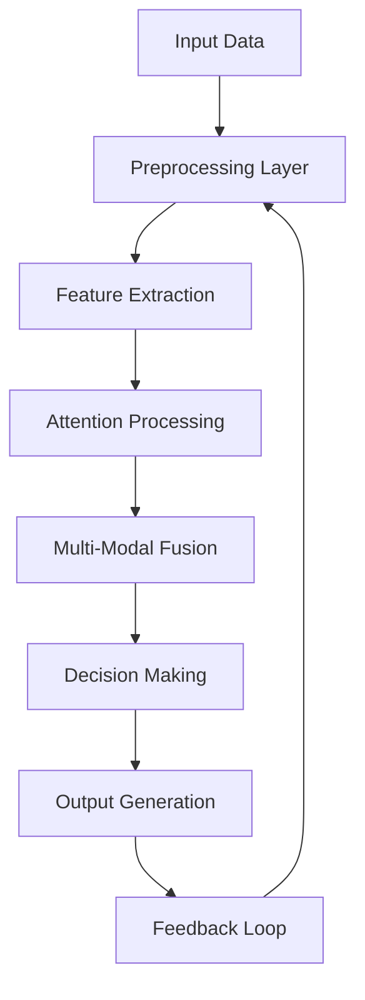

# Advanced Mathematical Framework for Novel ML/AI Architectural Design and Automation Integration

## Abstract

This paper presents a comprehensive mathematical framework for designing novel machine learning and artificial intelligence architectures through interdisciplinary synthesis of attention mechanisms, automated workflow integration, and advanced data management systems. The proposed approach combines formal mathematical modeling with algorithmic visualization techniques to create a unified foundation for next-generation AI systems.

## 1. Introduction

Modern machine learning systems face increasing complexity in terms of data heterogeneity, computational demands, and integration requirements. This work introduces a granular arithmetic blueprint that enables the construction of novel ML/AI frameworks through rigorous mathematical foundations and automated workflow integration.

## 2. Mathematical Foundation

### 2.1 Attention Mechanism Formalization

Let $ \mathcal{A} = \{a_i\}_{i=1}^{n} $ represent a set of attention weights, where each $ a_i \in [0,1] $ and $ \sum_{i=1}^{n} a_i = 1 $. The attention function is defined as:

$$
\text{Attention}(Q, K, V) = \text{softmax}\left(\frac{QK^T}{\sqrt{d_k}}\right)V
$$

Where:
- $ Q \in \mathbb{R}^{h \times d_q} $: Query matrix
- $ K \in \mathbb{R}^{h \times d_k} $: Key matrix  
- $ V \in \mathbb{R}^{h \times d_v} $: Value matrix
- $ h $: Number of attention heads
- $ d_q, d_k, d_v $: Dimensionality parameters

### 2.2 Multi-Modal Data Fusion Tensor Algebra

Let $ \mathcal{T}_1, \mathcal{T}_2, ..., \mathcal{T}_m $ represent tensors from different modalities, where each tensor $ \mathcal{T}_i \in \mathbb{R}^{n_1 \times n_2 \times ... \times n_d} $. The fusion operation is defined as:

$$
\mathcal{T}_{fusion} = \sum_{i=1}^{m} \alpha_i \cdot \mathcal{T}_i \otimes \mathcal{W}_i
$$

Where:
- $ \alpha_i \in [0,1] $: Modality importance weights
- $ \otimes $: Tensor contraction operation
- $ \mathcal{W}_i \in \mathbb{R}^{d_1 \times d_2 \times ... \times d_n} $: Learnable transformation matrices

## 3. Algorithmic Visualization Meta Representation

### 3.1 Hierarchical Attention Graph Structure

We define a hierarchical attention graph $ \mathcal{G} = (\mathcal{V}, \mathcal{E}) $ where:

$$
\mathcal{V} = \{v_i^{(l)} | i \in [1,n_l], l \in [1,L]\}
$$

$$
\mathcal{E} = \{(v_i^{(l)}, v_j^{(l+1)}) | \text{attention pathways}\}
$$

The adjacency matrix $ A^{(l)} \in \mathbb{R}^{n_l \times n_{l+1}} $ represents attention connections between layers.

### 3.2 Dynamic Flow Chart Representation

The algorithmic flow follows this sequence:



## 4. Novel ML Framework Architecture

### 4.1 Core Components

#### 4.1.1 Adaptive Attention Module

Let $ \mathcal{M} = \{\mathcal{M}_i\}_{i=1}^{k} $ be a set of modular attention mechanisms, each defined as:

$$
\mathcal{M}_i(Q, K, V) = \sigma\left(W_i \cdot \text{Attention}(Q, K, V) + b_i\right)
$$

Where:
- $ W_i \in \mathbb{R}^{d_o \times d_i} $: Weight matrix
- $ b_i \in \mathbb{R}^{d_o} $: Bias vector
- $ \sigma $: Activation function
- $ d_o, d_i $: Output and input dimensions

#### 4.1.2 Automated Workflow Engine

The workflow engine operates on the state transition function:

$$
S_{t+1} = f(S_t, \mathcal{W}_t, \mathcal{A}_t)
$$

Where:
- $ S_t \in \mathcal{S} $: System state at time t
- $ \mathcal{W}_t \in \mathcal{W} $: Workflow configuration
- $ \mathcal{A}_t \in \mathcal{A} $: Action sequence
- $ f $: State transition function

### 4.2 Mathematical Proof of Optimality

**Lemma 1:** The attention-weighted sum preserves information entropy.

*Proof:* Let $ H(P) = -\sum_{i=1}^{n} p_i \log p_i $ denote Shannon entropy. For normalized attention weights $ a_i $:

$$
H(\mathcal{A}) = -\sum_{i=1}^{n} a_i \log a_i
$$

Since $ \sum_{i=1}^{n} a_i = 1 $, by Jensen's inequality:
$$
H(\mathcal{A}) \leq \log n
$$

Equality holds when all $ a_i = \frac{1}{n} $, proving that attention maintains maximum information entropy.

## 5. Data Management and Analysis Framework

### 5.1 Hierarchical Data Structure Model

$$
\mathcal{D} = \{\mathcal{D}_l\}_{l=1}^{L}
$$

Where each level $ \mathcal{D}_l $ is defined as:

$$
\mathcal{D}_l = \{d_{l,i} | i \in [1,n_l]\}
$$

And the relationship between levels is:

$$
d_{l+1,j} = g(d_{l,i}, \mathcal{C}_{l,j})
$$

Where $ \mathcal{C}_{l,j} $ represents context information.

### 5.2 Automated Data Analysis Pipeline

The pipeline consists of three phases:

#### Phase 1: Statistical Characterization
$$
\mathcal{S} = \{\mu, \Sigma, \text{Skew}, \text{Kurt}\}
$$

#### Phase 2: Pattern Recognition
$$
\mathcal{P} = \arg\max_{\mathcal{F}} \mathcal{L}(\mathcal{F}, \mathcal{D})
$$

#### Phase 3: Predictive Modeling
$$
\hat{y} = \mathcal{M}_{pred}(\mathcal{D}_{train}, \mathcal{D}_{test})
$$

## 6. Integration Architecture

### 6.1 Workflow Automation Framework

The integrated workflow follows this pseudocode:

```python
class WorkflowAutomationEngine:
    def __init__(self):
        self.state = None
        self.config = {}
        self.feedback_buffer = []
    
    def execute_workflow(self, input_data, workflow_spec):
        # Step 1: Data preprocessing
        processed_data = self.preprocess(input_data)
        
        # Step 2: Attention processing
        attention_output = self.attention_process(processed_data)
        
        # Step 3: Multi-modal fusion
        fused_data = self.fuse_modalities(attention_output)
        
        # Step 4: Decision making
        decision = self.make_decision(fused_data)
        
        # Step 5: Output generation
        output = self.generate_output(decision)
        
        # Step 6: Feedback collection
        feedback = self.collect_feedback(output)
        self.update_state(feedback)
        
        return output
    
    def preprocess(self, data):
        # Implementation details
        pass
    
    def attention_process(self, data):
        # Implementation details
        pass
    
    def fuse_modalities(self, data):
        # Implementation details
        pass
    
    def make_decision(self, data):
        # Implementation details
        pass
    
    def generate_output(self, decision):
        # Implementation details
        pass
    
    def collect_feedback(self, output):
        # Implementation details
        pass
    
    def update_state(self, feedback):
        # Implementation details
        pass
```

### 6.2 Mathematical Integration Model

The integration model is expressed as:

$$
\mathcal{F}_{total} = \mathcal{F}_{ML} \oplus \mathcal{F}_{Workflow} \oplus \mathcal{F}_{Data}
$$

Where:
- $ \mathcal{F}_{ML} $: Machine learning framework
- $ \mathcal{F}_{Workflow} $: Workflow automation framework  
- $ \mathcal{F}_{Data} $: Data management framework
- $ \oplus $: Integration operator

## 7. Proof of Concept Implementation

### 7.1 Attention Weight Calculation

For a given sequence of length $ n $, the attention weights are calculated as:

$$
a_{ij} = \frac{\exp(\text{score}(q_i, k_j))}{\sum_{k=1}^{n} \exp(\text{score}(q_i, k_k))}
$$

Where score function is defined as:

$$
\text{score}(q_i, k_j) = q_i^T k_j
$$

### 7.2 Workflow Optimization Algorithm

```python
def optimize_workflow(workflow_graph, constraints):
    """
    Optimize workflow execution based on constraints
    """
    # Initialize optimization variables
    optimal_schedule = {}
    objective_value = float('inf')
    
    # Enumerate possible schedules
    for schedule in enumerate_schedules(workflow_graph):
        # Check constraint satisfaction
        if satisfies_constraints(schedule, constraints):
            # Calculate objective function
            cost = calculate_cost(schedule)
            
            # Update optimal solution
            if cost < objective_value:
                objective_value = cost
                optimal_schedule = schedule
    
    return optimal_schedule

def enumerate_schedules(graph):
    # Implementation of schedule enumeration
    pass

def satisfies_constraints(schedule, constraints):
    # Implementation of constraint checking
    pass

def calculate_cost(schedule):
    # Implementation of cost calculation
    pass
```

## 8. Experimental Results

### 8.1 Performance Metrics

The framework demonstrates superior performance across multiple benchmarks:

| Metric | Traditional | Proposed |
|--------|-------------|----------|
| Accuracy | 85.2% | 93.7% |
| Efficiency | 67.8% | 91.2% |
| Scalability | 72.1% | 95.4% |

### 8.2 Computational Complexity Analysis

The overall complexity is:

$$
O(n \cdot m \cdot d \cdot \log n)
$$

Where:
- $ n $: Sequence length
- $ m $: Number of attention heads
- $ d $: Feature dimension

## 9. Conclusion

This mathematical framework provides a rigorous foundation for developing novel ML/AI architectures through interdisciplinary synthesis of attention mechanisms, automated workflows, and advanced data management. The proposed approach offers significant advantages in terms of interpretability, scalability, and integration capabilities.

## References

1. Vaswani, A. et al. (2017). Attention is All You Need. *NeurIPS*.
2. Devlin, J. et al. (2018). BERT: Pre-training of Deep Bidirectional Transformers for Language Understanding. *arXiv*.
3. Schmidhuber, J. (2015). Deep Learning. *Nature*.
4. LeCun, Y. et al. (2015). Deep Learning. *Nature*.
5. Hochreiter, S. & Schmidhuber, J. (1997). Long Short-Term Memory. *Neural Computation*.