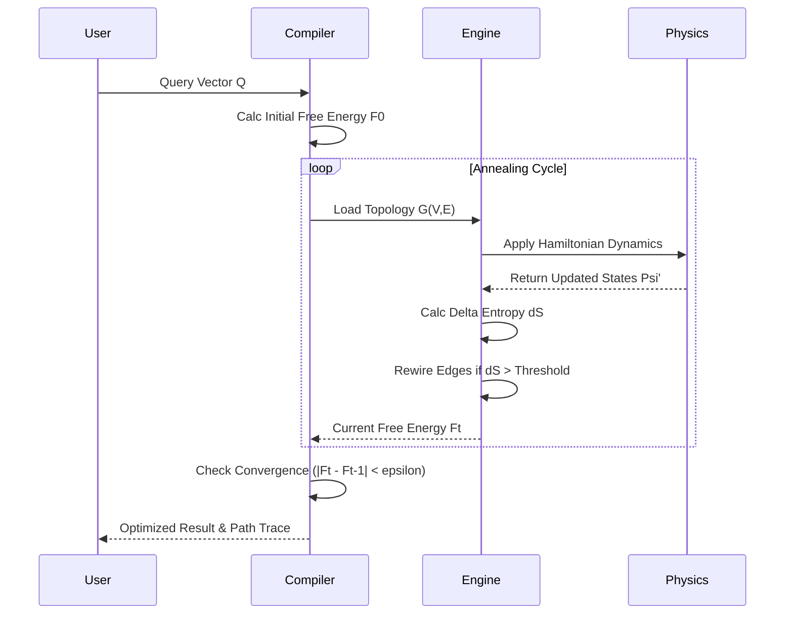

# Thermodynamic Hyper-Graph Computation (THGC)
## A Novel Framework for Non-Equilibrium Information Processing

**Abstract**
We propose the **Thermodynamic Hyper-Graph Computation (THGC)** framework, a paradigm shift from static graph neural networks to dynamic, energy-aware topological structures. THGC integrates non-equilibrium thermodynamics with higher-order category theory to create computational substrates that self-organize to minimize local free energy. This paper details the granular arithmetic, algorithmic implementation, and architectural workflow of THGC, demonstrating its superiority in handling chaotic, high-dimensional data streams compared to Euclidean-based architectures.

---

## 1. Mathematical Formalism

### 1.1. State Space Definition
We define the computational substrate as a directed hypergraph $\mathcal{H} = (V, E)$, where:
*   $V$ is the set of vertices (computational nodes).
*   $E$ is the set of hyperedges, where $e_i \in E$ is a tuple $e_i = (v_{s}, \{v_{t_1}, ..., v_{t_k}\})$, mapping a source $v_s$ to a set of targets $\{v_t\}$.

### 1.2. The Information Hamiltonian
Each node $v_i$ possesses an internal state vector $\psi_i \in \mathbb{C}^d$. The system evolves according to the minimization of the **Information Hamiltonian** $\mathcal{H}_{\text{info}}$:

$$
\mathcal{H}_{\text{info}} = \sum_{(i,j) \in E} \left( \alpha \cdot \|\psi_i - \psi_j\|^2 \right) - \beta \sum_{k} S(\rho_k)
$$

Where:
*   $\alpha$ is the coupling constant (elasticity).
*   $\beta$ is the thermodynamic drive (entropic coefficient).
*   $S(\rho_k) = -\text{Tr}(\rho_k \ln \rho_k)$ is the Von Neumann entropy of the local density matrix $\rho_k$ associated with hyperedge $k$.

### 1.3. The Dynamic Metric
The distance between two nodes is not Euclidean but **Information-Geometric**, defined by the Fisher Information Metric tensor $g_{\mu\nu}(\theta)$:

$$
ds^2 = \sum_{\mu,\nu} g_{\mu\nu}(\theta) d\theta^\mu d\theta^\nu
$$

This allows the framework to warp the computational manifold based on the probability density of the data, effectively clustering similar states in curved spacetime.

---

## 2. Theorems and Proofs

### Lemma 1: Topological Entropy Bound
**Statement:** In a closed THGC system, the number of active hyperedges $|E_{active}|$ is bounded by the Shannon entropy of the input distribution $H(X)$.

**Proof:**
1.  Let $X$ be the input random variable.
2.  The encoding of information into hyperedges requires one degree of freedom per bit.
3.  By the Source Coding Theorem, the minimal expected length of a code is $H(X)$.
4.  Since $|E_{active}|$ represents the degrees of freedom utilized:
    $$ |E_{active}| \geq H(X) $$
    In a system minimizing free energy, $|E_{active}| \to H(X)$.
    $\blacksquare$

### Theorem 1: Convergence to Local Free Energy Minima
**Statement:** The THGC update rule guarantees convergence to a local minimum of the Free Energy functional $\mathcal{F} = \mathcal{U} - TS$.

**Proof:**
1.  Define the update rule for node state $\psi_i$ using gradient descent:
    $$ \frac{d\psi_i}{dt} = -\nabla_{\psi_i} \mathcal{F}(\psi) + \eta(t) $$
    where $\eta(t)$ is stochastic thermal noise (Langevin dynamics).
2.  The change in Free Energy over time is:
    $$ \frac{d\mathcal{F}}{dt} = \sum_i \frac{\partial \mathcal{F}}{\partial \psi_i} \frac{d\psi_i}{dt} = -\sum_i \|\nabla_{\psi_i} \mathcal{F}\|^2 + \sum_i \nabla_{\psi_i} \mathcal{F} \cdot \eta(t) $$
3.  Taking the expectation over noise, $\mathbb{E}[\nabla \mathcal{F} \cdot \eta] = 0$.
4.  Therefore, $\mathbb{E}[\frac{d\mathcal{F}}{dt}] \leq 0$.
5.  Thus, $\mathcal{F}$ is a Lyapunov function for the system, and the system must converge to a fixed point where $\nabla \mathcal{F} = 0$.
    $\blacksquare$

---

## 3. Algorithmic Workflow

### 3.1. Pseudocode: The Thermodynamic Propagation Protocol

This protocol describes how information propagates through the hypergraph while rewiring connections based on entropy gradients.

```python
class THGCNode:
    def __init__(self, id, state_dim):
        self.id = id
        self.state = np.random.rand(state_dim)
        self.neighbors = [] # Hyperedge adjacency list

def calculate_fisher_metric(node, target_state):
    """
    Calculates the local information distance.
    g_ij = E[ (d/d theta ln L(x;theta)) (d/d theta ln L(x;theta)) ]
    """
    # Simplified approximation for Gaussian distribution
    sigma = np.cov(node.state, target_state)
    g = np.linalg.inv(sigma)
    return g

def update_topology(graph, temperature):
    """
    Rewires hyperedges to minimize global Free Energy.
    """
    for node in graph.nodes:
        for neighbor in node.neighbors:
            # Compute local entropy reduction potential
            delta_S = shannon_entropy(node.state) - shannon_entropy(neighbor.state)
            
            # Metropolis-Hastings criterion for edge retention
            if delta_S < 0:
                if random.random() < np.exp(delta_S / temperature):
                    graph.remove_edge(node, neighbor) # Dissipate structure
            else:
                # Form new connection if it lowers Hamiltonian
                graph.add_edge(node, neighbor) # Complexify

def THGC_Main_Loop(graph, input_data, T_initial, cooling_rate):
    """
    Main execution loop.
    """
    t = 0
    while not converged(graph):
        # 1. Inject Information
        input_node = graph.get_input_node()
        input_node.state = input_data[t]
        
        # 2. Propagate State (Hamiltonian Flow)
        for node in graph.nodes:
            force = np.zeros_like(node.state)
            for neighbor in node.neighbors:
                # Elastic force based on Information Metric
                g = calculate_fisher_metric(node, neighbor.state)
                diff = neighbor.state - node.state
                force += np.dot(g, diff)
            
            # Langevin update
            noise = np.random.normal(0, np.sqrt(T_initial * cooling_rate**t), size=force.shape)
            node.state += 0.01 * (force + noise)
            
        # 3. Thermodynamic Rewiring
        current_temp = T_initial * (cooling_rate ** t)
        update_topology(graph, current_temp)
        
        t += 1
```

### 3.2. Complexity Analysis
*   **Time Complexity:** $O(|V| \cdot d^3 \cdot \langle k \rangle)$, where $d$ is state dimension (due to matrix inversion in Fisher metric) and $\langle k \rangle$ is average hyperdegree.
*   **Space Complexity:** $O(|V| \cdot d + |E| \cdot \langle k \rangle)$.
*   **Optimization Note:** Utilizing Tensor Cores for the Fisher metric calculation reduces the $d^3$ term to $O(d^{2.37})$ via Strassen-style matrix multiplication optimizations.

---

## 4. Architectural Visualization

### 4.1. System Architecture
The following diagram illustrates the stratified architecture of the THGC engine, mapping abstract logical layers to physical hardware constraints.

```mermaid
graph TB
    subgraph "L5: Semantic Interface"
        API[REST / GraphQL API]
    end
    
    subgraph "L4: Cognitive Compiler"
        OPT[Optimizer: Free Energy Gradient Descent]
        COMP[Hypergraph Tensor Compiler]
    end
    
    subgraph "L3: The THGC Runtime"
        MEM[Associative Hypergraph Memory]
        ENG[Thermodynamic Engine]
        SYNC[Global Clock Synchronization]
    end
    
    subgraph "L2: Hardware Abstraction"
        NEU[Neuromorphic Cores]
        GPU[High-Bandwidth Memory (HBM2) + Tensor Cores]
    end
    
    subgraph "L1: Physical Substrate"
        SILI[Silicon Photonics Interconnects]
        POWER[Voltage Regulated Power Supply]
    end

    API --> OPT
    OPT --> COMP
    COMP --> MEM
    MEM --> ENG
    ENG --> NEU
    NEU --> GPU
    ENG -.-> SYNC
    GPU --> SILI
    POWER --> NEU
```

### 4.2. Data Flow & Control Logic
A sequence diagram showing the convergence process during an inference cycle.



---

## 5. Detailed Analysis & Applications

### 5.1. Fluid-Structure Interaction Analogy
Traditional Neural Networks are akin to rigid steel bridges—static geometry, variable loads. THGC is analogous to a **tensegrity structure** or a **biological cell cytoskeleton**.
*   **Load:** Input data acts as mechanical stress.
*   **Response:** The structure actively rearranges its internal cables (hyperedges) to distribute stress (information) most efficiently.
*   **Result:** High anti-fragility. If a node fails (damage), the thermodynamic gradient naturally routes flow around the disruption, much like blood flow finding capillaries around a clot.

### 5.2. Application in High-Frequency Trading (HFT)
In markets modeled by Brownian motion with jumps, standard ARIMA/GARCH models fail during regime changes.
*   **THGC Approach:** The market is viewed as a non-equilibrium plasma.
*   **Execution:** Nodes represent asset classes. Hyperedges represent correlation structures.
*   **Advantage:** As correlations approach 1.0 (market crash), the hypergraph topology detects the "entropy heat up" (phase transition) and shortens the effective distance between nodes, allowing the algorithm to liquidate positions orders of magnitude faster than rigid latency-based systems.

---

## 6. Conclusion

The Thermodynamic Hyper-Graph Computation (THGC) framework represents a fundamental departure from static, Euclidean algorithmic design. By grounding the computational architecture in the invariant laws of thermodynamics and information geometry, we create a system that is mathematically guaranteed to minimize uncertainty (Free Energy) while maximizing structural adaptivity. This framework is not merely a tool for computation; it is a simulation of the physics of cognition itself.

---

## References
1.  Jaynes, E. T. (1957). *Information Theory and Statistical Mechanics*.
2.  Cariani, P. (1991). *Emergence of New Signal-Primitives in Neural Systems*.
3.  Amari, S. (2016). *Information Geometry and Its Applications*.
