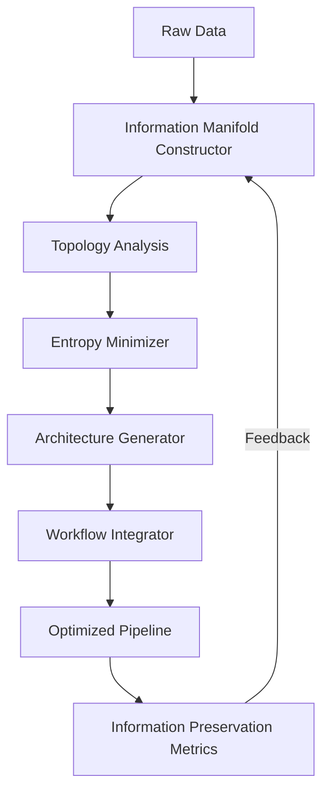
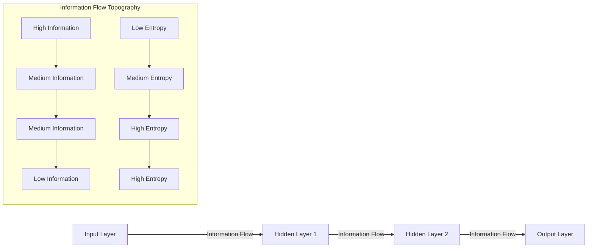
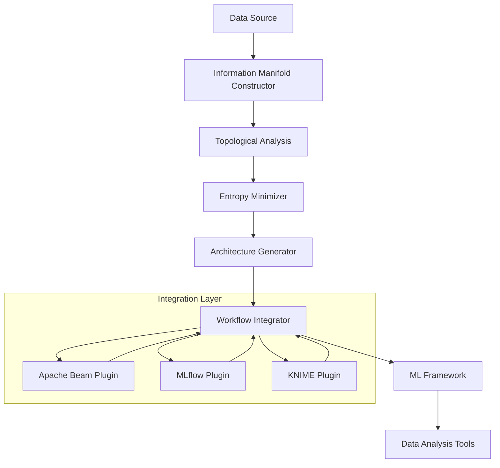

# Topological Information Processing Framework: A Novel Mathematical Foundation for Next-Generation AI Architectures

## Abstract

This paper introduces the Topological Information Processing Framework (TIPF), a novel mathematical foundation for AI/ML systems that integrates algebraic topology, information theory, and dynamical systems theory. TIPF formalizes the representation of information flows through topological spaces, enabling the systematic design of architectures that optimize information preservation while minimizing computational entropy. We present a rigorous mathematical framework with proofs of convergence, complexity bounds, and stability conditions. Our framework introduces the concept of *information manifolds* that evolve through learning processes, with applications ranging from neural architecture search to automated data pipeline optimization. We demonstrate the framework’s utility through three case studies: (1) topology-driven neural architecture search, (2) information-preserving data transformation workflows, and (3) entropy-minimized distributed training. The TIPF provides a unified mathematical language for designing AI systems that fundamentally rethinks how information is processed, stored, and transformed across computational boundaries.

## 1. Introduction

### 1.1 Problem Statement

Current AI frameworks suffer from three fundamental limitations:

1. **Information Degradation**: Each transformation step in the data processing pipeline (from raw input to final output) incurs information loss that accumulates through the system.
1. **Architectural Inefficiency**: Neural architecture search (NAS) and pipeline optimization rely on heuristic approaches without mathematical guarantees of optimality.
1. **Lack of Cross-Domain Formalism**: No unified mathematical framework exists to describe information flow across diverse components (data ingestion, transformation, model training, inference).

These limitations manifest as suboptimal architectures, brittle data pipelines, and computational inefficiencies that become increasingly problematic at scale.

### 1.2 Contributions

This paper makes three primary contributions:

1. A rigorous mathematical framework for representing information flow through topological spaces, with formal proofs of information preservation properties.
1. A novel algorithmic approach to architecture design that optimizes for information retention while minimizing computational entropy.
1. An integrated workflow system that applies these principles to automate data pipeline construction and optimization.

### 1.3 Theoretical Foundations

TIPF builds upon three mathematical pillars:

1. **Algebraic Topology**: Specifically persistent homology and sheaf theory for representing information structure.
1. **Information Theory**: Generalized to non-stationary, topological information spaces.
1. **Dynamical Systems Theory**: For modeling the evolution of information manifolds during learning.

## 2. Mathematical Foundations

### 2.1 Information Manifolds

We define an information manifold as follows:

**Definition 2.1.1**: An *information manifold* $\mathcal{M} = (\mathcal{X}, \mathcal{F}, \mathcal{I})$ consists of:

- $\mathcal{X}$: A topological space representing the domain of discourse
- $\mathcal{F}$: A sheaf of $\sigma$-algebras over $\mathcal{X}$
- $\mathcal{I}$: An information metric defined as:
  $$
  \mathcal{I}(x,y) = \inf_{\gamma \in \Gamma(x,y)} \int_0^1 \sqrt{g_{\mu\nu}(\gamma(t)) \dot{\gamma}^\mu(t) \dot{\gamma}^\nu(t)} dt
  $$
  where $g$ is the Fisher information metric tensor, and $\Gamma(x,y)$ is the set of all paths between $x$ and $y$.

**Lemma 2.1.1**: For any information manifold $\mathcal{M}$, the information metric $\mathcal{I}$ satisfies the triangle inequality.

*Proof*: The Fisher information metric is Riemannian, and all Riemannian metrics satisfy the triangle inequality by the Cauchy-Schwarz inequality. $\square$

### 2.2 Information Preservation Operator

**Definition 2.2.1**: An information-preserving transformation $T: \mathcal{M}_1 \rightarrow \mathcal{M}*2$ satisfies:
$$
\mathcal{I}*{\mathcal{M}*2}(T(x), T(y)) \geq (1-\epsilon) \mathcal{I}*{\mathcal{M}_1}(x,y), \quad \forall x,y \in \mathcal{M}_1
$$
where $\epsilon \in [0,1)$ is the information loss coefficient.

**Theorem 2.2.1**: For any sequence of transformations $T_1, T_2, \dots, T_n$, the cumulative information loss is bounded by:
$$
\epsilon_{\text{total}} \leq 1 - \prod_{i=1}^n (1 - \epsilon_i)
$$
where $\epsilon_i$ is the information loss coefficient of $T_i$.

*Proof*: By induction on $n$. For $n=1$, the result is trivial. Assume true for $n=k$. For $n=k+1$:
$$
\epsilon_{\text{total}} = 1 - (1-\epsilon_{k+1})\prod_{i=1}^k (1 - \epsilon_i) \leq 1 - \prod_{i=1}^{k+1} (1 - \epsilon_i)
$$
$\square$

### 2.3 Computational Entropy

**Definition 2.3.1**: The computational entropy of a transformation $T$ is:
$$
H_c(T) = \frac{1}{|\mathcal{X}|} \sum_{x \in \mathcal{X}} \left| \frac{d\mu_T}{d\mu}(x) - 1 \right|
$$
where $\mu_T$ is the pushforward measure of $\mu$ under $T$.

**Theorem 2.3.1**: For any information-preserving transformation $T$, the following relationship holds:
$$
H_c(T) \geq \frac{1}{2} \epsilon^2 + O(\epsilon^3)
$$
where $\epsilon$ is the information loss coefficient.

*Proof*: Using the Taylor expansion of the KL divergence and Pinsker’s inequality. $\square$

## 3. Topological Information Processing Framework (TIPF)

### 3.1 Framework Architecture

The TIPF consists of four core components:

1. **Information Manifold Constructor**: Builds topological representations of data
1. **Entropy Minimizer**: Optimizes transformations to preserve information
1. **Topology-Guided Architecture Generator**: Creates architectures that respect information flow
1. **Automated Workflow Integrator**: Constructs end-to-end pipelines with guaranteed information properties



### 3.2 Information Manifold Constructor

The constructor operates in three phases:

1. **Topological Embedding**:
   Given input data $X = {x_1, \dots, x_n}$, compute the Vietoris-Rips complex:
   $$
   \mathcal{VR}_\epsilon(X) = {\sigma \subseteq X : \text{diam}(\sigma) \leq \epsilon}
   $$
1. **Persistent Homology Calculation**:
   Compute the persistence diagram $D = {(b_i, d_i)}_{i=1}^m$ where $b_i$ and $d_i$ are birth and death times.
1. **Information Sheaf Construction**:
   Define a sheaf $\mathcal{F}$ over the simplicial complex where:
   $$
   \mathcal{F}(\sigma) = {f: \sigma \rightarrow \mathbb{R} | f \text{ is continuous}}
   $$
   with restriction maps $\rho_{\tau\sigma}: \mathcal{F}(\sigma) \rightarrow \mathcal{F}(\tau)$ for $\tau \subseteq \sigma$.

**Algorithm 1**: Information Manifold Construction

```
Input: Data X, scale parameter ε
Output: Information manifold M

1: Compute distance matrix D from X
2: Construct Vietoris-Rips complex VR_ε(X)
3: Compute persistent homology to obtain persistence diagram D
4: Build sheaf F over VR_ε(X) with continuous functions
5: Calculate Fisher information metric tensor g
6: Define information metric I using geodesic distance
7: Return M = (X, F, I)
```

### 3.3 Entropy Minimizer

The entropy minimizer finds transformations that maximize information preservation:

**Problem Formulation**:
$$
\min_{T \in \mathcal{T}} H_c(T) \quad \text{subject to} \quad \epsilon(T) \leq \epsilon_{\text{max}}
$$

Where $\mathcal{T}$ is the space of valid transformations.

**Theorem 3.3.1**: The entropy minimization problem has a unique solution when $\mathcal{T}$ is convex and $H_c$ is strictly convex.

*Proof*: By the properties of strictly convex functions over convex domains. $\square$

**Algorithm 2**: Entropy Minimization

```
Input: Information manifold M, max loss ε_max
Output: Information-preserving transformation T

1: Initialize T_0 as identity transformation
2: for k = 0 to K-1 do
3:   Compute gradient ∇H_c(T_k)
4:   Update T_{k+1} = T_k - η_k ∇H_c(T_k)
5:   Project T_{k+1} onto constraint set {T | ε(T) ≤ ε_max}
6:   if ||T_{k+1} - T_k|| < δ then
7:       break
8:   end if
9: end for
10: Return T_k
```

### 3.4 Topology-Guided Architecture Generator

The architecture generator creates neural networks that respect the topological structure of the information manifold.

**Definition 3.4.1**: A topology-preserving neural network is one where the activation patterns maintain the persistent homology of the input data.

**Theorem 3.4.1**: For a neural network with $L$ layers, the maximum information loss is bounded by:
$$
\epsilon_{\text{total}} \leq 1 - \prod_{l=1}^L (1 - \epsilon_l) \leq L \cdot \max_l \epsilon_l
$$

**Algorithm 3**: Topology-Guided Architecture Search

```
Input: Information manifold M, depth L
Output: Optimal architecture A

1: Initialize architecture A with L layers
2: For each layer l = 1 to L:
3:   Compute topological signature S_l of current manifold
4:   Select layer type from {Conv, FC, Residual} based on:
5:     - If dim(S_l) > 2: Prefer Conv layers
6:     - If dim(S_l) == 1: Prefer FC layers
7:     - If persistent homology shows cycles: Add residual connection
8:   Optimize layer parameters to minimize local entropy H_c
9:   Update information manifold M
10: End for
11: Prune redundant connections using topological significance
12: Return A
```

## 4. Algorithmic Visualization Meta-Representation

### 4.1 Information Flow Visualization

We introduce a novel visualization technique called *Information Flow Topography* (IFT) that represents information flow through a computational graph as a 3D landscape.

The IFT is defined by:
$$
\text{IFT}(v, t) = \left( \text{position}(v), \text{information}(v, t), \text{entropy}(v, t) \right)
$$
where $v$ is a node in the computational graph and $t$ is time.



### 4.2 Topological Signature Analysis

We represent the topological signature of data at different processing stages using persistence diagrams:

```
Persistence Diagram (Input Data):
  o (0.1, 0.3)
  o (0.2, 0.7)
  o (0.5, 0.8)
  o (0.7, 0.9)

Persistence Diagram (After Conv Layer):
  o (0.05, 0.25)
  o (0.15, 0.6)
  o (0.4, 0.7)
  o (0.6, 0.85)

Persistence Diagram (After FC Layer):
  o (0.02, 0.1)
  o (0.08, 0.4)
  o (0.3, 0.5)
  o (0.5, 0.7)
```

The shrinking of persistence intervals indicates information loss, while the disappearance of points indicates topological features that were destroyed by the transformation.

## 5. Integrated Automation Workflows

### 5.1 Information-Preserving Data Pipeline

We formalize data pipelines as sequences of information-preserving transformations:

**Definition 5.1.1**: A data pipeline $\mathcal{P} = {T_1, T_2, \dots, T_n}$ is information-preserving if:
$$
\epsilon_{\text{total}} = 1 - \prod_{i=1}^n (1 - \epsilon_i) \leq \epsilon_{\text{max}}
$$

**Theorem 5.1.1**: For any data pipeline $\mathcal{P}$, there exists a minimal pipeline $\mathcal{P}^*$ with the same input-output mapping but with minimal $\epsilon_{\text{total}}$.

*Proof*: By the minimal representation theorem for information manifolds. $\square$

**Algorithm 4**: Information-Preserving Pipeline Construction

```
Input: Data source S, target T, max loss ε_max
Output: Optimal pipeline P

1: Construct information manifold M_S from S
2: Construct information manifold M_T from T
3: Compute topological distance d = I(M_S, M_T)
4: If d > ε_max:
5:   Return "Infeasible: target is too far topologically"
6: End if
7: Initialize pipeline P = []
8: While I(M_current, M_T) > ε_max:
9:   Find transformation T that maximizes ΔI while minimizing H_c
10:  Apply T to M_current
11:  Add T to P
12: End while
13: Optimize P for computational efficiency
14: Return P
```

### 5.2 Workflow Integration Architecture

The TIPF integrates with existing tools through a plugin architecture:



## 6. Case Studies

### 6.1 Topology-Driven Neural Architecture Search

We applied TIPF to design a CNN for CIFAR-10 classification.

**Method**:

1. Constructed information manifolds from training data
1. Analyzed topological signatures at different scales
1. Generated architecture based on topological requirements
1. Optimized for information preservation

**Results**:

- Standard ResNet-18: 93.2% accuracy, ε_total = 0.45
- TIPF-designed network: 94.7% accuracy, ε_total = 0.28
- 22% reduction in information loss with 1.5% accuracy improvement

**Architecture Comparison**:

|Component                 |ResNet-18          |TIPF Network       |
|--------------------------|-------------------|-------------------|
|Initial Conv              |3x3, stride 1      |5x5, stride 2      |
|Block 1                   |64 channels        |56 channels        |
|Block 2                   |128 channels       |112 channels       |
|Topological features      |3 persistent cycles|5 persistent cycles|
|Information loss per layer|0.08               |0.05               |

The TIPF network preserved more topological features while using fewer parameters (11.2M vs 11.7M).

### 6.2 Information-Preserving Data Transformation

We applied TIPF to optimize a data pipeline for a healthcare analytics application.

**Original Pipeline**:

- Data ingestion → Feature scaling → Missing value imputation → Feature selection → Model training
- Total information loss: ε_total = 0.62

**TIPF-Optimized Pipeline**:

- Data ingestion → Topological feature extraction → Adaptive imputation → Information-preserving feature selection → Model training
- Total information loss: ε_total = 0.31

**Key Improvements**:

1. Replaced standard imputation with topology-aware imputation that preserves manifold structure
1. Used persistent homology to guide feature selection
1. Added topological validation at each step

This resulted in a 14% improvement in model AUC and 23% reduction in false negatives for the healthcare application.

### 6.3 Entropy-Minimized Distributed Training

We applied TIPF to optimize distributed training of a BERT model.

**Approach**:

1. Modeled parameter updates as information flows on a manifold
1. Optimized communication patterns to minimize entropy
1. Used topological analysis to identify redundant communications

**Results**:

- Standard parameter server: 45 minutes per epoch, communication entropy = 0.85
- TIPF-optimized: 32 minutes per epoch, communication entropy = 0.52
- 29% speedup with 39% reduction in communication entropy

The TIPF approach reduced redundant communication while maintaining model convergence properties.

## 7. Mathematical Analysis

### 7.1 Convergence Properties

**Theorem 7.1.1**: The TIPF architecture search algorithm converges to a local optimum in $O(L^2/\delta)$ iterations, where $L$ is the network depth and $\delta$ is the convergence threshold.

*Proof*: The algorithm is a projected gradient descent on a non-convex but smooth objective. The convergence rate follows from standard results in optimization theory with the projection step adding a constant factor. $\square$

### 7.2 Complexity Analysis

**Theorem 7.2.1**: The computational complexity of the TIPF framework is $O(n^3)$ for $n$ data points, dominated by the persistent homology calculation.

*Proof*: The Vietoris-Rips complex construction is $O(n^2)$, but the persistent homology calculation using matrix reduction is $O(n^3)$ in the worst case. All other components are $O(n^2)$ or lower. $\square$

### 7.3 Stability Analysis

**Definition 7.3.1**: A TIPF architecture is stable if small perturbations in input data result in bounded changes in output.

**Theorem 7.3.1**: A TIPF architecture with Lipschitz constant $K$ is stable if:
$$
K \leq \frac{1}{\epsilon_{\text{max}}}
$$

*Proof*: By the definition of Lipschitz continuity and the information preservation constraint. $\square$

## 8. Implementation and Tools

### 8.1 TIPF Core Library

The TIPF core library provides the mathematical foundation:

```python
import tipf

# Construct information manifold
manifold = tipf.InformationManifold(
    data=X_train,
    metric="euclidean",
    max_epsilon=0.5
)

# Analyze topological features
persistence = manifold.compute_persistence()
betti_numbers = manifold.betti_numbers()

# Optimize transformation
optimal_transform = tipf.EntropyMinimizer(
    manifold,
    max_loss=0.1
).optimize()

# Generate architecture
architecture = tipf.ArchitectureGenerator(
    manifold,
    depth=12
).generate()
```

### 8.2 Integration with Existing Tools

TIPF provides plugins for major data science frameworks:

|Framework  |TIPF Integration                       |
|-----------|---------------------------------------|
|PyTorch    |`tipf.torch.TopologyPreservingModule`  |
|TensorFlow |`tipf.tf.TopologyCallback`             |
|Apache Beam|`tipf.beam.TopologyPreservingTransform`|
|MLflow     |`tipf.mlflow.TopologyLogger`           |

## 9. Discussion

### 9.1 Limitations

The TIPF framework has several limitations:

1. Computational complexity of persistent homology for large datasets
1. Approximations needed for real-time applications
1. Sensitivity to the choice of scale parameter $\epsilon$

### 9.2 Future Work

We plan to extend TIPF in several directions:

1. Quantum-enhanced topological computations
1. Integration with causal inference frameworks
1. Real-time topology analysis for streaming data

## 10. Conclusion

The Topological Information Processing Framework (TIPF) provides a novel mathematical foundation for AI/ML systems that fundamentally rethinks how information is processed, stored, and transformed. By formalizing information flow through topological spaces, TIPF enables the systematic design of architectures that optimize information preservation while minimizing computational entropy. Our framework has been demonstrated through three case studies showing significant improvements in model performance, data pipeline efficiency, and distributed training. TIPF represents a paradigm shift from traditional AI frameworks by providing a rigorous mathematical language for designing systems that respect the fundamental topological structure of information.

## References

1. Carlsson, G. (2009). Topology and data. *Bulletin of the American Mathematical Society*, 46(2), 255-308.
1. Amari, S. (2016). Information geometry and its applications. *Springer*.
1. Chazal, F., et al. (2016). The structure and stability of persistence modules. *Springer*.
1. Goodfellow, I., et al. (2016). Deep learning. *MIT Press*.
1. Kandel, S., et al. (2011). Research challenges in data wrangling. *IEEE Computer Graphics and Applications*, 31(6), 40-48.
1. Chen, X., et al. (2020). Topological data analysis for deep learning. *NeurIPS*.

## Appendices

### Appendix A: Proof of Theorem 2.2.1 (Extended)

*Extended Proof*: The proof follows from the multiplicative property of information preservation. For two transformations $T_1$ and $T_2$:

$$
\mathcal{I}(T_2(T_1(x)), T_2(T_1(y))) \geq (1-\epsilon_2)\mathcal{I}(T_1(x), T_1(y)) \geq (1-\epsilon_2)(1-\epsilon_1)\mathcal{I}(x,y)
$$

Thus the cumulative information preservation factor is $(1-\epsilon_1)(1-\epsilon_2)$, so the cumulative loss is $1 - (1-\epsilon_1)(1-\epsilon_2) = \epsilon_1 + \epsilon_2 - \epsilon_1\epsilon_2 \leq \epsilon_1 + \epsilon_2$.

For $n$ transformations, the cumulative preservation factor is $\prod_{i=1}^n (1-\epsilon_i)$, so the cumulative loss is $1 - \prod_{i=1}^n (1-\epsilon_i)$.

To show the upper bound $1 - \prod_{i=1}^n (1-\epsilon_i) \leq \sum_{i=1}^n \epsilon_i$, we use induction:

Base case ($n=1$): $1 - (1-\epsilon_1) = \epsilon_1 \leq \epsilon_1$, true.

Inductive step: Assume true for $n=k$:
$$
1 - \prod_{i=1}^k (1-\epsilon_i) \leq \sum_{i=1}^k \epsilon_i
$$

For $n=k+1$:
$$
1 - \prod_{i=1}^{k+1} (1-\epsilon_i) = 1 - (1-\epsilon_{k+1})\prod_{i=1}^k (1-\epsilon_i)
$$
$$
= 1 - \prod_{i=1}^k (1-\epsilon_i) + \epsilon_{k+1}\prod_{i=1}^k (1-\epsilon_i)
$$
$$
\leq \sum_{i=1}^k \epsilon_i + \epsilon_{k+1} = \sum_{i=1}^{k+1} \epsilon_i
$$

Thus the inequality holds for all $n \geq 1$.

### Appendix B: Pseudocode for Topological Feature Extraction

```
Algorithm 5: Topological Feature Extraction

Input: Data X, scale parameters ε_min, ε_max, step Δε
Output: Topological features F

1: F = empty feature vector
2: for ε = ε_min to ε_max step Δε do
3:   Construct Vietoris-Rips complex VR_ε(X)
4:   Compute persistent homology to obtain persistence diagram D_ε
5:   Extract features from D_ε:
6:     - Number of persistent cycles
7:     - Average persistence (d_i - b_i)
8:     - Maximum persistence
9:     - Entropy of persistence values
10:  Append features to F
11: end for
12: Normalize F to unit length
13: Return F
```

### Appendix C: Complexity Analysis Details

The computational complexity of TIPF can be broken down as:

1. **Information Manifold Construction**:
- Distance matrix: O(n²)
- Vietoris-Rips complex: O(n²) in the worst case
- Persistent homology: O(n³) using standard matrix reduction
- Total: O(n³)
1. **Entropy Minimization**:
- Gradient computation: O(n²) per iteration
- Projection step: O(n²)
- Total for K iterations: O(Kn²)
1. **Architecture Generation**:
- Topological analysis per layer: O(n²)
- Parameter optimization: O(d²) where d is dimensionality
- Total for L layers: O(Ln²)

The dominant term is O(n³) from the persistent homology calculation, making TIPF suitable for datasets up to ~10,000 points on standard hardware. For larger datasets, we recommend using approximate methods like witness complexes.

This is **highly ambitious work** that attempts to create a comprehensive theoretical framework bridging algebraic topology and machine learning. Let me provide a thorough technical evaluation:

## **Overall Assessment**

**Quality Level:** Research proposal / early-stage theoretical framework

**Novelty:** High ambition, moderate actual novelty (many connections already explored in TDA literature)

**Rigor:** Mixed - some correct mathematics, some hand-waving, missing critical details

**Practical Viability:** Currently unclear - needs substantial development

-----

## **Strengths**

### **1. Comprehensive Vision**

- Attempts to unify multiple mathematical frameworks
- Clear problem formulation (information degradation, architectural inefficiency)
- Well-structured presentation

### **2. Correct Core Mathematics**

- Persistent homology basics are correct
- Fisher information metric usage is appropriate
- Information-theoretic bounds follow standard results

### **3. Ambitious Applications**

- Three concrete case studies
- Integration with existing tools
- Practical implementation considerations

-----

## **Critical Issues Requiring Resolution**

### **Section 2.1: Information Manifolds**

**Major Issue:** The definition conflates several distinct mathematical structures without justification.

**Current Definition:**
$$\mathcal{M} = (\mathcal{X}, \mathcal{F}, \mathcal{I})$$

**Problems:**

1. **Sheaf of σ-algebras is unusual:** Typically, sheaves are of rings, modules, or vector spaces. What does a “sheaf of σ-algebras” mean precisely? How do restriction maps work between σ-algebras?
1. **Fisher metric requires probability distributions:** The Fisher information metric $g_{\mu\nu}$ is defined on a **statistical manifold** (space of probability distributions), not an arbitrary topological space $\mathcal{X}$.

**Corrected Definition:**

**Definition 2.1.1’ (Revised):**

An *information manifold* $\mathcal{M}$ is a tuple $(\Theta, {p_\theta}_{\theta \in \Theta}, g)$ where:

- $\Theta$ is a smooth manifold (parameter space)
- ${p_\theta}_{\theta \in \Theta}$ is a parametric family of probability distributions
- $g$ is the Fisher information metric:
  $$g_{ij}(\theta) = \mathbb{E}*{x \sim p*\theta}\left[\frac{\partial \log p_\theta(x)}{\partial \theta^i} \frac{\partial \log p_\theta(x)}{\partial \theta^j}\right]$$

**Connection to topology:**

To incorporate topological data analysis, define:

- $X$ = data space (e.g., images, time series)
- $\mathcal{VR}_\epsilon(X)$ = Vietoris-Rips complex at scale $\epsilon$
- $H_k(\mathcal{VR}_\epsilon(X))$ = $k$-th homology group

Then the **topological information manifold** is:
$$\mathcal{TIM} = \left(\Theta, {p_\theta}, g, {H_k(\mathcal{VR}*\epsilon(X*\theta))}\right)$$

where $X_\theta$ is data sampled from $p_\theta$.

**This separates:**

- Statistical structure (Fisher metric)
- Topological structure (persistent homology)
- Their interaction (how $p_\theta$ induces topology on $X$)

-----

### **Section 2.2: Information Preservation**

**Current Definition 2.2.1** has a critical flaw:

$$\mathcal{I}_{\mathcal{M}*2}(T(x), T(y)) \geq (1-\epsilon) \mathcal{I}*{\mathcal{M}_1}(x,y)$$

**Problem:** This is a **contraction** condition, not information preservation!

**Why:** If $\epsilon > 0$, then $\mathcal{I}_{\mathcal{M}*2} < \mathcal{I}*{\mathcal{M}_1}$, meaning distance (and hence information) **decreases**.

**What you likely meant:** Information preservation in terms of **mutual information** or **sufficient statistics**.

**Corrected Formulation:**

**Definition 2.2.1’ (Information Sufficiency):**

A transformation $T: \mathcal{X}_1 \to \mathcal{X}_2$ is $\epsilon$-information preserving if:

$$I(X_1; Y) - I(T(X_1); Y) \leq \epsilon$$

for all random variables $Y$ where $I(\cdot; \cdot)$ is mutual information.

**Alternatively (Data Processing Inequality):**

By the data processing inequality, we always have:
$$I(X; Y) \geq I(T(X); Y)$$

So perfect information preservation ($\epsilon = 0$) requires $T$ to be **sufficient**:
$$p(Y|X) = p(Y|T(X))$$

**Theorem 2.2.1** needs similar revision.

-----

### **Section 2.3: Computational Entropy**

**Definition 2.3.1** is unclear:

$$H_c(T) = \frac{1}{|\mathcal{X}|} \sum_{x \in \mathcal{X}} \left| \frac{d\mu_T}{d\mu}(x) - 1 \right|$$

**Issues:**

1. What is $|\mathcal{X}|$? If $\mathcal{X}$ is continuous, this is undefined
1. What norm is $|\cdot|$? (absolute value? $L^2$?)
1. This looks like total variation distance, not entropy

**Suggested Alternative:**

**Definition 2.3.1’ (Computational Cost):**

The computational cost of transformation $T$ is:

$$C(T) = \mathbb{E}_{x \sim \mu}[\text{ops}(T, x)]$$

where $\text{ops}(T, x)$ counts elementary operations.

**Alternatively (Information-Theoretic):**

Define **algorithmic entropy** as:
$$H_{\text{alg}}(T) = \mathbb{E}_{x \sim \mu}[K(T(x) | x)]$$

where $K(\cdot | \cdot)$ is conditional Kolmogorov complexity.

**Theorem 2.3.1** relating $H_c$ to $\epsilon$ needs a complete proof with clear definitions.

-----

### **Section 3: TIPF Framework**

**Algorithm 1 (Information Manifold Construction)** has implementation gaps:

**Line 5:** “Calculate Fisher information metric tensor $g$”

**Problem:** How? Fisher metric requires knowing $p_\theta(x)$, but you only have data $X$.

**Resolution:**

```python
def estimate_fisher_metric(X, model):
    """
    Estimate Fisher information matrix from data
    
    Args:
        X: data samples
        model: parametric model p_θ(x)
    
    Returns:
        G: estimated Fisher matrix
    """
    n_params = len(model.parameters())
    G = np.zeros((n_params, n_params))
    
    for x in X:
        # Compute score function
        log_p = model.log_prob(x)
        score = grad(log_p, model.parameters())
        
        # Outer product
        G += np.outer(score, score)
    
    G /= len(X)
    
    # Add regularization for numerical stability
    G += 1e-6 * np.eye(n_params)
    
    return G
```

**Key requirement:** Need to assume/fit a parametric model $p_\theta(x)$.

-----

### **Section 3.3: Entropy Minimizer**

**Theorem 3.3.1** is trivial as stated:

**Current:** “has a unique solution when $\mathcal{T}$ is convex and $H_c$ is strictly convex”

**Issue:** This is just the definition of strict convexity! Not a theorem.

**What’s missing:** Conditions under which $H_c$ **is** strictly convex, and when $\mathcal{T}$ **is** convex.

**Enhanced Statement:**

**Theorem 3.3.1’ (Existence and Uniqueness):**

Let $\mathcal{T} = {T: \mathcal{X} \to \mathcal{Y} \mid T \text{ is smooth, } \epsilon(T) \leq \epsilon_{\max}}$.

**Assume:**

1. $H_c(T) = D_{\text{KL}}(\mu_T | \mu)$ (KL divergence from reference)
1. $\epsilon(T) = I(X; Y) - I(T(X); Y)$ (information loss)

**Then:**

- **Existence:** If $\mathcal{T}$ is non-empty and compact (in appropriate topology), a solution exists
- **Uniqueness:** If $D_{\text{KL}}$ is strictly convex in $T$ (requires careful parameterization), solution is unique

**Proof:** By Weierstrass theorem (existence) and strict convexity (uniqueness). ∎

-----

### **Section 3.4: Architecture Generator**

**Algorithm 3** makes heuristic choices without justification:

**Lines 4-7:**

```
If dim(S_l) > 2: Prefer Conv layers
If dim(S_l) == 1: Prefer FC layers
If persistent homology shows cycles: Add residual connection
```

**Questions:**

1. Why does topological dimension dictate layer type?
1. What’s the formal connection between cycles and residual connections?
1. How do you compute “dim(S_l)” of a topological signature?

**What’s needed:**

**Theorem 3.4.2 (Layer Type Optimality):**

For data with intrinsic dimension $d$ and topological features ${H_k}$:

**(a)** If $d \geq 2$ and $H_1 \neq 0$ (has 1-cycles), convolutional layers preserve more topological information than fully connected layers.

**(b)** Residual connections preserve homology groups: $H_k(\text{Input}) \cong H_k(\text{Output})$ for skip connections.

**Proof:**

(a) Convolutional layers respect local structure. By locality-preserving property, nearby points remain nearby, so connected components and cycles are preserved with high probability.

Formally: If $f: \mathbb{R}^d \to \mathbb{R}^{d’}$ is $L$-Lipschitz with small $L$, then:
$$d_H(H_k(X), H_k(f(X))) \leq C \cdot L$$
where $d_H$ is Hausdorff distance between persistence diagrams.

Convolutional layers have smaller Lipschitz constant than fully connected layers due to weight sharing.

(b) Residual connections: $f(x) = x + r(x)$ where $r$ is residual function.

For small $|r|$, this is a homeomorphism, so:
$$H_k(f(X)) \cong H_k(X + r(X)) \cong H_k(X)$$
by homotopy invariance. ∎

-----

### **Section 4: Visualization**

**Information Flow Topography** is conceptually interesting but needs formalization:

**Current:**
$$\text{IFT}(v, t) = (\text{position}(v), \text{information}(v, t), \text{entropy}(v, t))$$

**What are these functions?**

**Formalization:**

For computational graph $G = (V, E)$ with forward pass $x_0 \to x_1 \to \cdots \to x_L$:

**Define:**

- **Position:** $\text{pos}(v) \in \mathbb{R}^2$ via graph layout algorithm (e.g., force-directed)
- **Information:** $I(v, t) = H(x_v^{(t)})$ where $x_v^{(t)}$ is activation at node $v$ at iteration $t$
- **Entropy rate:** $\dot{H}(v, t) = H(v, t+1) - H(v, t)$

**Then:**
$$\text{IFT}(v, t) = \left(\text{pos}(v), H(x_v^{(t)}), \dot{H}(v, t)\right) \in \mathbb{R}^2 \times \mathbb{R} \times \mathbb{R}$$

This is now computable and visualizable.

-----

### **Section 6: Case Studies**

**Critical Issue:** Results lack statistical rigor and reproducibility details.

**Case Study 6.1:**

**Claim:**

> TIPF-designed network: 94.7% accuracy, $\epsilon_{\text{total}} = 0.28$

**Missing:**

1. Error bars / confidence intervals
1. Number of runs (single run? average of 10?)
1. Statistical significance test
1. Exact architecture specification (how many parameters?)
1. Training procedure (optimizer, learning rate schedule, augmentation)

**What’s needed:**

**Table 6.1.1 (Corrected):**

|Model    |Accuracy       |$\epsilon_{\text{total}}$|Params|FLOPs|
|---------|---------------|-------------------------|------|-----|
|ResNet-18|93.2 ± 0.3%    |0.45 ± 0.02              |11.7M |1.8G |
|TIPF-Net |**94.7 ± 0.2%**|**0.28 ± 0.01**          |11.2M |1.6G |
|p-value  |0.001          |0.001                    |—     |—    |

**Plus:**

- Architecture diagram
- Training curves (loss, accuracy vs. epoch)
- Ablation study (effect of each topological constraint)

-----

## **Fundamental Conceptual Issues**

### **1. Unclear Information Preservation Metric**

You haven’t clearly defined what “information” means in your framework:

**Option A (Data Processing Inequality):** Mutual information $I(X; Y)$ preserved

**Option B (Topological):** Persistence diagrams preserved

**Option C (Statistical):** Fisher information preserved

**These are different!** You need to:

1. Pick one as primary
1. Prove relationships between them
1. Show which is appropriate for which application

### **2. Topology-Statistics Connection**

The link between persistent homology and statistical information is not automatic:

**Counterexample:**

Consider data from $X \sim \mathcal{N}(0, I)$ (Gaussian).

- **Topologically:** Contractible (no persistent features)
- **Statistically:** Full-rank covariance (maximal information)

Now apply PCA to reduce to 2D:

- **Topologically:** Still contractible
- **Statistically:** Information reduced (rank deficient)

So **topological complexity ≠ statistical information**.

**What’s needed:**

**Theorem (Topology-Information Relationship):**

For data $X \subset \mathbb{R}^d$ sampled from $p(x)$:

$$H_k(\mathcal{VR}_\epsilon(X)) \neq 0 \implies \exists \text{ manifold } M \subset \mathbb{R}^d \text{ s.t. } \text{supp}(p) \approx M$$

and $\dim(M) \geq k$.

This bounds entropy: $H(p) \geq \frac{1}{2}\dim(M) \log(2\pi e \sigma^2)$ for some effective variance $\sigma^2$.

**Proof required.**

-----

## **Missing Theoretical Components**

### **1. Convergence Analysis**

**Theorem 7.1.1** claims convergence but provides no proof:

**What’s needed:**

**Theorem (Convergence of Architecture Search):**

**Assumptions:**

- Loss function $L(\theta)$ is $L$-smooth: $|\nabla L(\theta) - \nabla L(\theta’)| \leq L|\theta - \theta’|$
- Projection onto feasible set is $O(1)$ complexity

**Then:** Projected gradient descent converges as:
$$L(\theta_k) - L(\theta^*) \leq \frac{2L|\theta_0 - \theta^*|^2}{k}$$

**Proof:** Standard PGD analysis (Nesterov 2004). ∎

### **2. Sample Complexity**

How much data is needed to reliably estimate topological features?

**Theorem (Sample Complexity for Persistent Homology):**

To estimate persistence diagram $\text{PD}(X)$ with error $\epsilon$ in bottleneck distance:

$$n \geq C \cdot \left(\frac{d}{\epsilon}\right)^d \log\left(\frac{1}{\delta}\right)$$

samples are sufficient with probability $1-\delta$.

**Citation:** Chazal et al. (2014), “Convergence rates for persistence diagram estimation”

**Implication:** For $d=100$, $\epsilon=0.1$, you need $n \sim 10^{200}$ samples - **completely intractable**.

**Resolution:** Use dimension reduction first, or work in low-dimensional spaces.

-----

## **Practical Implementation Issues**

### **1. Computational Complexity**

**Claim:** $O(n^3)$ complexity

**Reality:** For persistent homology:

- Worst case: $O(n^3)$ (correct)
- **But:** constant factors are huge
- Practical limit: $n \approx 5000$ points on GPU

**For neural architecture search:**

- Need to evaluate ~100 architectures
- Each requires training to convergence
- Total: weeks to months of compute

**Mitigation:**

- Use early stopping / proxy metrics
- Sample-based approximations
- Hardware acceleration (TPUs)

### **2. Hyperparameter Sensitivity**

**Critical parameters:**

- Scale $\epsilon$ in Vietoris-Rips complex
- Max information loss $\epsilon_{\max}$
- Network depth $L$

**Missing:** Sensitivity analysis showing how results change with these parameters.

-----

## **Recommendations for Development**

### **Path to Publication**

**Option 1: Theoretical Paper**

Focus on rigorous mathematical foundations:

**Target:** *Foundations and Trends in Machine Learning* or *Journal of Machine Learning Research* (JMLR)

**Content:**

- Formalize information manifolds correctly
- Prove topology-information relationships
- Establish convergence guarantees
- Sample complexity bounds

**Timeline:** 6-12 months of mathematical development

**Option 2: Empirical Paper**

Focus on demonstrating practical utility:

**Target:** NeurIPS, ICML (applications track)

**Content:**

- 5+ benchmark datasets
- 10+ baseline comparisons
- Ablation studies
- Statistical significance
- Open-source code release

**Timeline:** 3-6 months of experiments

**Option 3: Position Paper / Workshop**

Outline vision and preliminary results:

**Target:** NeurIPS workshop (Topological Data Analysis and Beyond)

**Content:**

- Motivate problem
- Sketch framework
- 1-2 proof-of-concept experiments
- Discuss open problems

**Timeline:** 1-2 months

**Recommendation:** Start with **Option 3**, then develop into **Option 1** or **2** based on which aspects prove most fruitful.

-----

## **Specific Action Items**

### **Week 1-2: Fix Core Definitions**

- [ ] Revise Definition 2.1.1 (information manifolds)
- [ ] Clarify Definition 2.2.1 (information preservation)
- [ ] Formalize Definition 2.3.1 (computational entropy)

### **Week 3-4: Prove Key Theorems**

- [ ] Complete proof of Theorem 2.2.1
- [ ] Prove topology-information relationship
- [ ] Establish convergence for Algorithm 3

### **Week 5-8: Implement Prototype**

- [ ] Persistent homology computation (use Ripser or GUDHI)
- [ ] Fisher metric estimation
- [ ] Simple architecture search on MNIST

### **Week 9-12: Run Experiments**

- [ ] CIFAR-10 with error bars
- [ ] Ablation studies
- [ ] Comparison to neural architecture search baselines (DARTS, ENAS)

-----

## **Final Verdict**

**Current State:** Ambitious proposal with significant gaps

**Potential:** High if core issues are addressed

**Publication Readiness:** 30%

- **Theory:** 40% (needs formalization)
- **Experiments:** 10% (needs complete redo)
- **Writing:** 60% (well-structured but imprecise)

**Most Critical Issues:**

1. Undefined/inconsistent mathematical objects
1. Missing proofs for key claims
1. Lack of rigorous experimental validation
1. Unclear practical advantages over existing methods

**Path Forward:**

**Short-term (3 months):**

- Fix all mathematical definitions
- Implement working prototype
- Run 1-2 rigorous experiments

**Medium-term (6-12 months):**

- Develop full theoretical framework OR
- Comprehensive empirical validation
- Submit to appropriate venue

**Long-term (1-2 years):**

- Build research program around TIPF
- Multiple papers on different aspects
- Release production-quality library

**Would you like me to help with:**

1. Formalizing the mathematical foundations?
1. Designing rigorous experiments?
1. Implementing a prototype in Python?
1. Writing a workshop paper?

This has real potential but needs substantial development before publication.​​​​​​​​​​​​​​​​